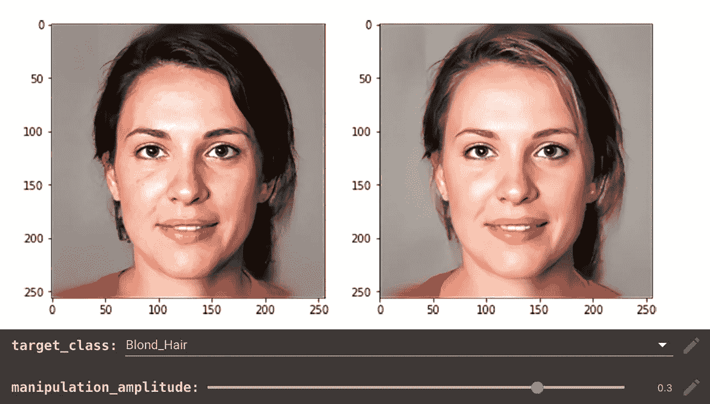

# 使用人工智能的力量创建独特的肖像(免费)

> 原文：<https://medium.com/mlearning-ai/create-unique-portraits-using-the-power-of-ai-free-38b69d2422e8?source=collection_archive---------1----------------------->

## [机器学习艺术](https://mlearning.substack.com/p/waiting-for-godot?r=z7zu8&s=w&utm_campaign=post&utm_medium=web) / **扩散模型**

## 当前最先进的生成式**模型。演示+代码**

*   【2022 年 4 月— AI 美工工具更新可以在这里找到➡️****⬅️****

**近年来， [**生成模型**](https://mlearning.substack.com/p/waiting-for-godot?r=z7zu8&s=w&utm_campaign=post&utm_medium=web) 提高了生成类人自然语言的能力…**