# 创建您的第一个 Looker Studio(谷歌数据工作室)仪表板

> 原文：<https://medium.com/mlearning-ai/create-your-first-looker-studio-google-data-studio-dashboard-d634551d6dab?source=collection_archive---------0----------------------->

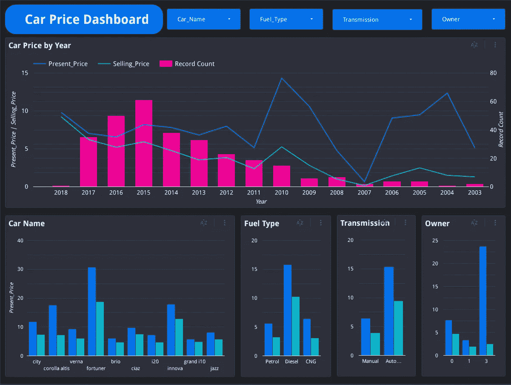

[Looker Studio](https://cloud.google.com/looker-studio?utm_source=google&utm_medium=cpc&utm_campaign=japac-TH-all-en-dr-bkws-all-all-trial-e-dr-1009882&utm_content=text-ad-none-none-DEV_c-CRE_308495415728-ADGP_Hybrid%20%7C%20BKWS%20-%20EXA%20%7C%20Txt%20~%20Data%20Analytics%20~%20Google%20Data%20Studio_Data%20Studio-KWID_43700029827974468-aud-1644542956068%3Akwd-296750504760&userloc_1012728-network_g&utm_term=KW_google%20data%20studio&gclid=Cj0KCQiA-oqdBhDfARIsAO0TrGEvBvBvr45-MXuAiIR_8ZvrvxxTxSdHePkQTmmIupW0xD0GUmJs1A4aAqDhEALw_wcB&gclsrc=aw.ds) ，前身为谷歌数据工作室，是谷歌于 2016 年推出的一款将数据转换成可定制的信息报告和仪表盘的在线工具(来源:[维基百科](https://en.wikipedia.org/wiki/Looker_Studio))。

这是一款免费的 BI 工具，可以在线创建交互式仪表盘。Looker Studio 的优点是简单易用，只需要 Gmail 就能上手。虽然 Looker Studio 在复杂计算或可视化方面有一些限制，但它足以快速创建一个有用的仪表板。

在本文中，我将一步一步地向您展示如何使用 Looker Studio 创建仪表板。您可以按照本教程，将创建的仪表板放入您的投资组合中。厉害！！

如果你熟悉 Power BI 或 Tableau 等其他 BI 工具，你会很容易理解这个概念。无论如何，如果您以前从未尝试过该工具，请不要担心，这要简单得多。

> 说够了，我们开始吧！

# 步骤摘要

1.  创建数据源
2.  创建图表
3.  创建下拉列表
4.  让仪表板变得漂亮
5.  共享仪表板

# 创建数据源

我将在本教程中使用的数据源是二手车价格的数据集，可以从[https://www . ka ggle . com/code/vijayaadithyanvg/car-price-prediction-used-cars/data](https://www.kaggle.com/code/vijayaadithyanvg/car-price-prediction-used-cars/data)下载

转到[https://datastudio.google.com/](https://datastudio.google.com/)

然后点击创建->数据源

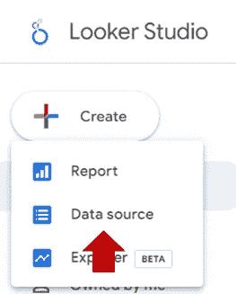

Create data source

搜索 csv(逗号分隔值),然后单击文件上传

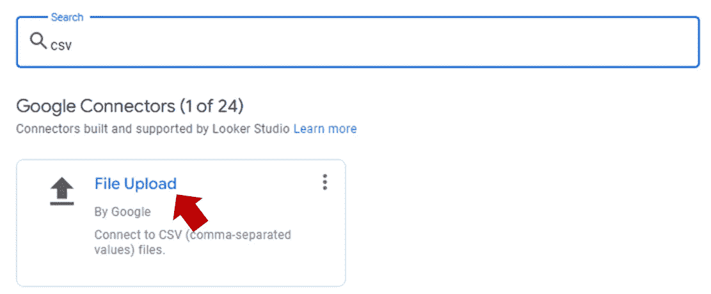

Search for csv

你会看到一个上传文件区。点击“点击上传文件”并在目录中找到下载的文件或将文件拖动到此区域。

等到文件状态变为**上传**。然后，单击连接按钮。

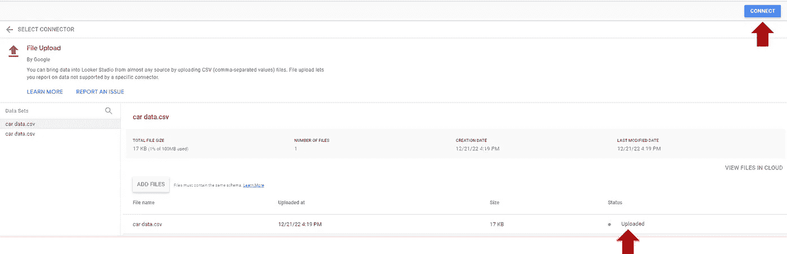

Connect uploaded file

您将看到表的详细信息，如列名和类型。将每列的数据类型更改为适当的类型。数据类型将影响您在报表中创建的图表。在此页面上，您可以通过单击添加字段来创建新的计算参数。

接下来，单击创建报告。

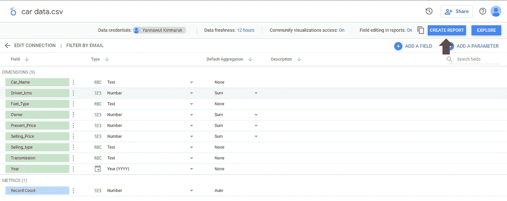

Car data

# 创建图表

单击创建报告后，您将转到报告/仪表板页面。

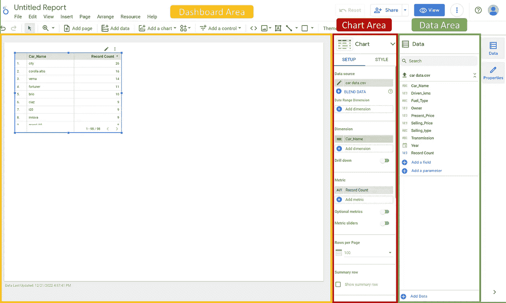

Report

通过单击表格/图表并按删除按钮来删除表格(或任何图表)。

Looker Studio 的概念是将右侧数据区域中的字段拖到仪表板区域，图表将自动创建。然后，您可以在包含两个选项卡的图表区域中调整图表:设置和样式。

> 让我们从组合图开始。

我想显示每年汽车的平均价格趋势，包括现价和售价，以及数据集中的记录数，以检查数据的可靠性。

将“Year”从数据区域拖到仪表板区域。然后将“当前价格”和“销售价格”拖动到拖动“年份”后创建的图表中。“记录计数”可以自动添加。如果“记录计数”不在指标中，请将其从数据区拖到图表中。图表区中的维度和度量应该如下所示。

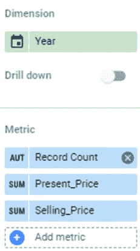

但是，我们想要每年的平均价格，而不是价格的总和。单击总和，然后更改为平均值。

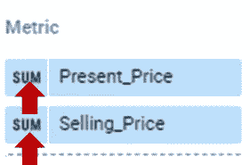

目前，它是折线图，而不是组合图。这个图表没有区分价格和记录数，所以可能会误导用户。

要更改图表类型，请单击仪表板上的图表，单击图表区域中的图表，然后选择图表类型。在这种情况下，选择组合图。

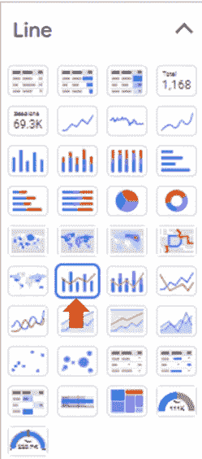

Change chart type

你会看到一个组合图，如下图所示。

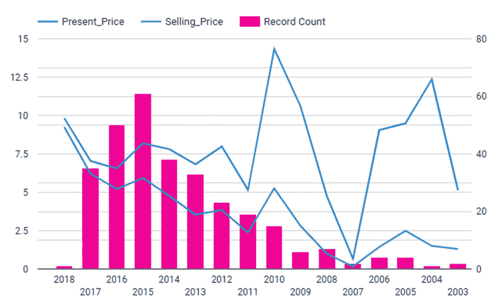

Combo chart

> 接下来，创建柱形图

我想比较现价和按汽车名称、燃料类型、变速器和车主数量等类别分组的售价。

要为汽车名称创建柱形图，请将“汽车名称”从数据区域拖到仪表板区域。然后，将“当前价格”和“销售价格”拖到图表中。

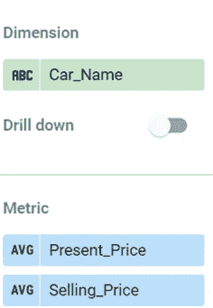

将图表类型更改为柱形图。

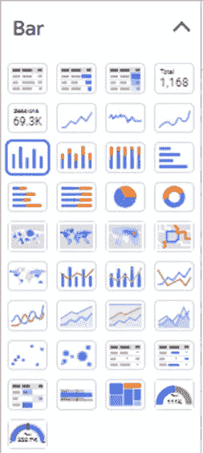

Change chart type

您将看到如下图所示的柱形图。

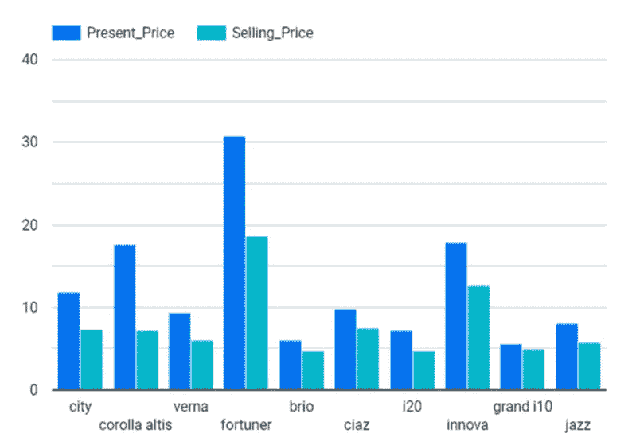

Column chart

对燃料类型、变速器和车主数量进行同样的操作。

# 创建下拉列表

下拉列表是为用户输入而设计的。他们将根据下拉值过滤图表。

要向仪表板添加下拉列表，请单击插入选项卡并选择下拉列表。然后，将您想要创建下拉列表的字段拖动到控件字段。

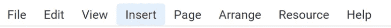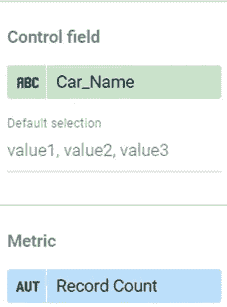

您将看到一个下拉列表，可以展开该列表来过滤字段。

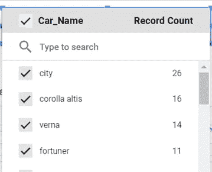

对 Car_Name、Fuel-Type、Transmission 和 Owner 重复此步骤。

# 让仪表板变得漂亮

仪表板设计中有很多细节。我将只涉及一些简单但能产生巨大影响的部分。

*   更改主题

点击主题和布局按钮，并选择主题。

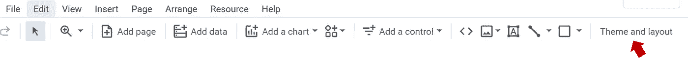

Change theme

*   约定

尽量把图表排在同一行。选择图表，在排列选项卡中，单击垂直对齐并选择居中。

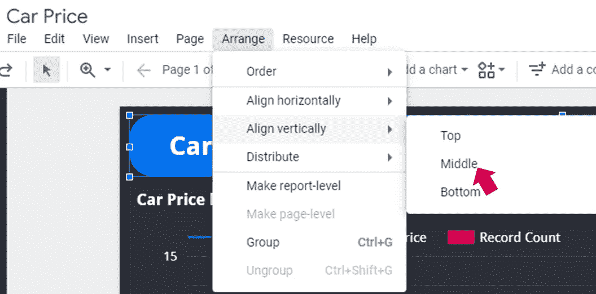

How to arrange the charts

*   文本/图表大小

选择图表后，单击图表区域下的 SYYLE 选项卡。浏览此选项卡以调整图表颜色和文本样式。

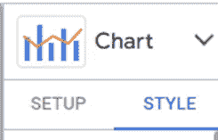

> 这是我调整后的最终仪表板。

Car price dashboard

欢迎在评论中分享你的想法。

# 共享仪表板

最后一步来了。是时候公开共享您的仪表板了。

在右上角，单击“共享”按钮并选择“获取报告”链接。

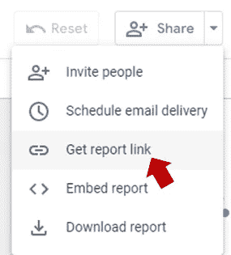

Get report link

点击查看共享设置，将共享选项调整为公开。然后，点击复制链接。然后，你可以把这个链接分享给别人。

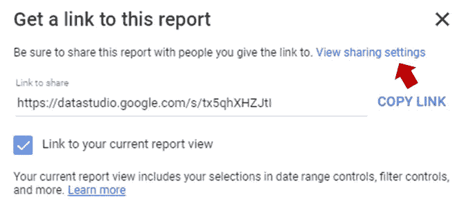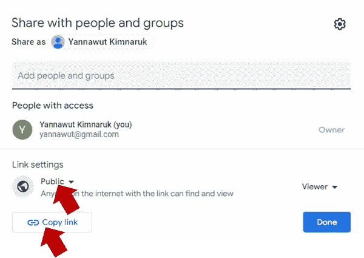

您可以在下面的链接中查看我的仪表板。[https://data studio . Google . com/reporting/481 bb 883-f03f-4e7a-97da-3d 44c 19800 a7](https://datastudio.google.com/reporting/481bb883-f03f-4e7a-97da-3d44c19800a7)

恭喜你！！您完成创建您的第一个 Looker studio 仪表板。欢迎在评论区分享您的仪表板。

如果您想阅读更多数据分析内容，请鼓掌并关注我。

 [## Mlearning.ai 提交建议

### 如何成为 Mlearning.ai 上的作家

medium.com](/mlearning-ai/mlearning-ai-submission-suggestions-b51e2b130bfb)