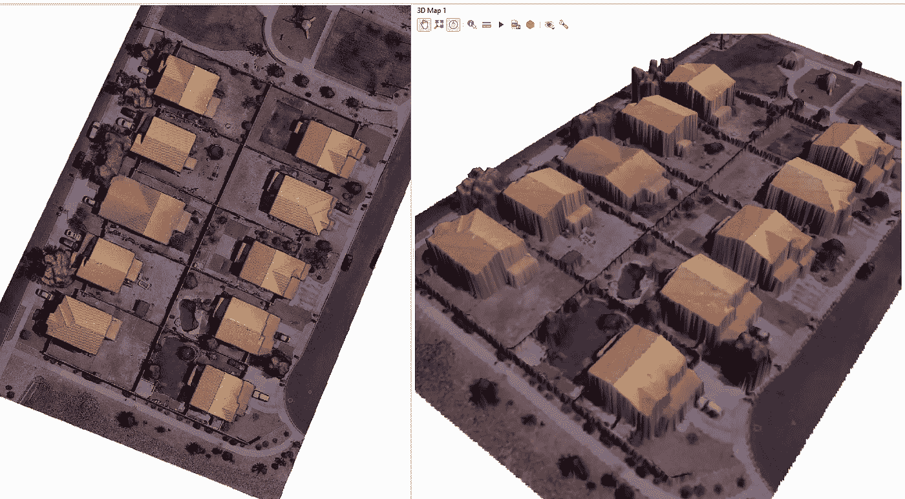
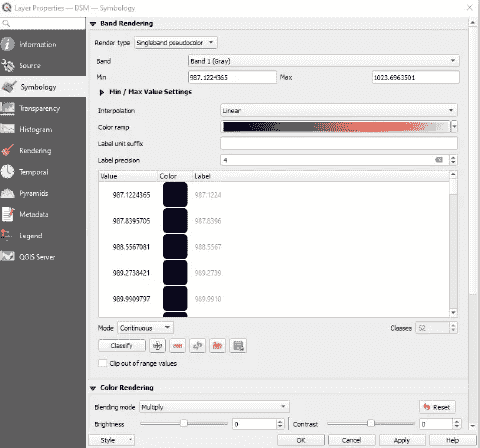
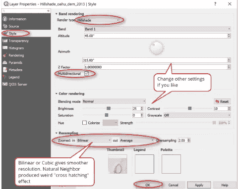

# 使用 Nearmap 影像和 DSM 创建 3D 网格

> 原文：<https://medium.com/mlearning-ai/creating-a-3d-mesh-with-nearmap-imagery-and-dsm-e86a37b256b2?source=collection_archive---------1----------------------->

如何可视化建筑物进行阴影分析等等！

Nearmap 3D data inside of QGIS

我们生活在一个复杂的三维世界。虽然很多次我们不得不把那个世界缩小到二维来做我们的工作。在我们的现代，这种情况已不复存在。我们正在迅速接近一个时代，数字双胞胎将成为新的常态。捕捉我们世界的 3D 本质的最简单方法之一是从包含高程或“z”数据的数据集中导出网格。这种数据的两种最常见的类型是激光雷达和摄影测量 DSM 和 DEM。数字表面模型(DSM)代表地球表面的每个点，包括结构和植被。另一方面，数字高程模型(DEM)代表“裸地”模型，并移除地面上的任何结构。我们可以使用这两个数据集来创建一个 3D 网格，这在许多不同的应用中都是有用的。在这篇文章中，我将重点关注使用摄影测量创建的数据，这将与使用激光雷达略有不同。

我喜欢用 QGIS 来处理这类数据。这是一个开源的 GIS 平台，非常容易使用，拥有庞大的用户群，并且是最好的部分..免费的！如果你想看看，你可以点击这里的链接下载它: [QGIS](https://www.qgis.org/en/site/) 。您可以使用类似的工作流程在大多数 ESRI 产品或其他 GIS 套件中做我正在做的事情，尽管使用的工具略有不同。

## 加载数据并更改符号系统

你需要为这个项目收集一些不同的数据。首先，你需要引入 DSM。除此之外，你还可以带来一些真正的正射影像和数字高程模型，但这不是必需的。

将想要处理的数据加载到中后，应编辑符号系统，以便数据更易于理解。这种类型的数据转换有用的主要原因之一是因为人类是视觉动物，我们很好地理解三维数据。选择与您正在处理的数据相匹配的值非常重要。对于我的例子，我选择了单波段假彩色渲染类型。该程序自动检测数据，并在大多数情况下选择适当的值，但可以随意编辑它们以适应您试图说明的内容。如果您使用的是真正交，这也很重要，因为您将在模型上覆盖图像。

Symbology inside of QGIS

## 创建网格

这是所有奇迹发生的一步。这也是您会发现程序之间最大差异的地方，但基本步骤如下:

1.  复制 DSM
2.  使副本成为“山体阴影”
3.  将 3D 视图中的高程参数设置为山体阴影

这稍微简化了一些事情，但是这里所发生的是你正在打开一个允许 3D 视图的新窗口。在该窗口中，您正在设置高程参数并利用 DSM 数据中的 z 参数。这实质上是将 DSM 从 2D 延伸到 3D，这也有导致倾斜视图看起来融化的副作用。

Configure the 3D view

当处理邻居的房子时，我发现将平铺分辨率设置为 700 左右很有用。你可以随意使用这些设置，找到适合你情况的设置。完成此工作流程后，您将看到在 2D 和 3D 模式下并排显示的数据。

## 现在怎么办？

就是这样，你做到了，你可以自由地以尽可能多的独特和创造性的方式使用这些知识。我看到这被用作运行遮阳分析的基础，用于在非平坦表面上进行面积计算、流域分析、高程剖面和场地线分析。

这种工作流程的优势在于，与更传统的 3D 数据集相比，数据的重量非常轻。这种数据易于流式传输，渲染速度快，占用空间小。如果你不关心这些因素中的任何一个，那么使用传统的 3D 网格或点云数据集可能会更有用，但如果你想扩展项目或快速运行快速平滑的分析，我建议你尝试使用一些 DSM 数据。

感谢您阅读我的文章！我喜欢处理数据和图像，并将开始上传更多有用的技巧、有趣的花絮和我对新技术的想法。如果你有任何问题，请给我发信息，我很乐意和你聊天。