# 我们不再需要担心肺炎了

> 原文：<https://medium.com/mlearning-ai/creating-a-convolutional-neural-network-to-detect-pneumonia-6db01afa643a?source=collection_archive---------4----------------------->

我清楚地记得那一天，但同时又模糊地记得那一天。我无法呼吸**。**连路过的陌生人都问我还好吗。我靠在中国地铁站的栏杆上，几乎无法保持平衡，直到最后不省人事。

3 小时后，我在医院醒来，胳膊上插着静脉注射管，我没事。我已经有肺炎病史了(谢谢，哮喘，我很感激)。然而，许多人没有我这么幸运，离一家能够快速诊断问题的高质量医院这么近。

2020 年，世界卫生组织报告称，**肺炎是 5 岁以下儿童的单一最大死因，**占所有儿童死亡的 18%。从影响的角度来量化这个百分比，这意味着每年大约有 140 万儿童死于肺炎。更糟糕的是，许多医生没有诊断肺炎的必要工具，或者即使他们有，他们的诊断也不够准确。

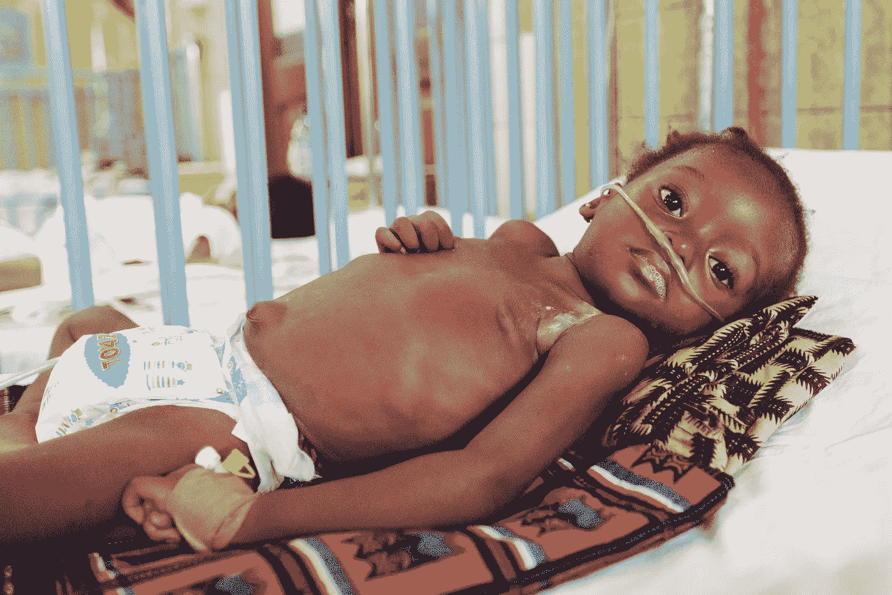

虽然有各种各样的测试，从验血到脉搏血氧饱和度到痰测试，但最可靠的是胸部 x 光扫描。然而，地球上多达三分之二的人无法获得基本的放射服务。

这在发展中国家尤其不公平——相比之下，拥有 68 万人口的波士顿市拥有 126 名放射学家。拥有 4300 万人口的肯尼亚只有 200 名放射科医生。这个比率似乎有点偏离 T21…

对于一种在所有年龄段都很常见的疾病，世界上很多地方似乎都没有准备好，这是很疯狂的。是我们结束这一切的时候了。

# 工具和技术

1.  **Google Colab —** Colab 是一款基于云的免费在线 Jupyter 笔记本，允许你在浏览器中键入 Python 代码并训练机器学习和深度学习模型。
2.  **TensorFlow —** TensorFlow 是一个用于机器学习的开源软件库。它预装在 Google Colab 中。
3.  **Keras —** Keras 是一个开源的神经网络库。
4.  **卷积神经网络—**CNN 是一种特殊类型的神经网络，专门用于处理图像数据，归根结底，这只是一个巨大的数字矩阵。

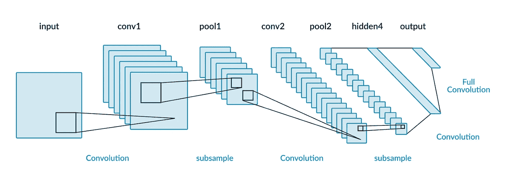

Basic CNN framework consisting of **Convolution, Pooling, and Flattening** layers — stay tuned to learn more about how these layers actually work 😦

5.**你的好奇心—** 学习创建机器学习模型是很循环的。你会不断遇到新的障碍，但是你的好奇心会帮助你度过难关👀。

# 行动（或活动、袭击）计划

通常最好有某种计划，这是我们的—

1.  收集数据集
2.  导入库
3.  拆分数据
4.  建设我们的 CNN
5.  培训和测试
6.  预测

# 步骤 1 —收集数据

在我们开始构建我们的网络之前，我们需要找到一个我们的网络能够训练和测试的数据集。我在 Kaggle 上发现了这样一个[数据集](https://www.kaggle.com/paultimothymooney/chest-xray-pneumonia)。它包含**5863 张胸部 x 光图像**，分为 **3 类:训练、测试和验证。**这里有一个胸部 x 光扫描的例子:

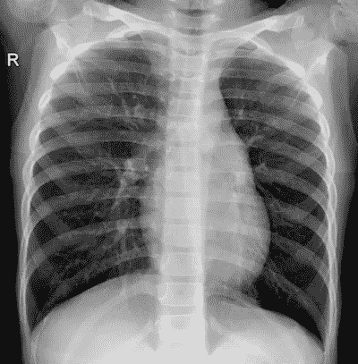

NORMAL2-IM-0776–0001.jpeg

这些类别中的每一个都有 **2 个子文件夹**，它们将正常 X 射线图像和不透明(肺炎)X 射线图像分开。

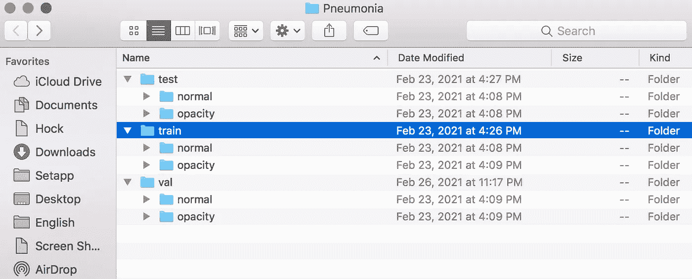

由于图像对我们来说都是独立的，我们可以在代码中利用这一点，根据文件夹名称自动生成适当的标签，有了 segway，我们就可以进入代码了。

# 步骤 2 —导入库

为了充分利用这些 Python 库的能力，我们首先需要将它们导入到我们的代码中。请注意，我用 GPU 导入了 TensorFlow 您会希望这样可以使过程更快。

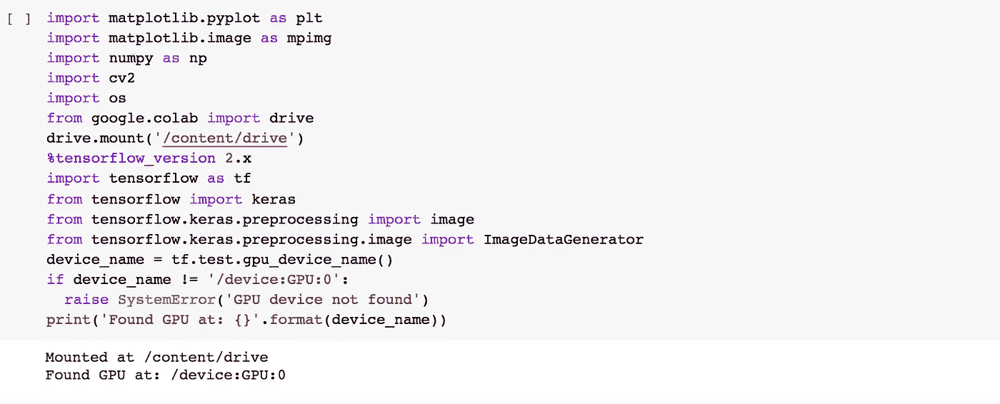

# 步骤 3 —拆分数据

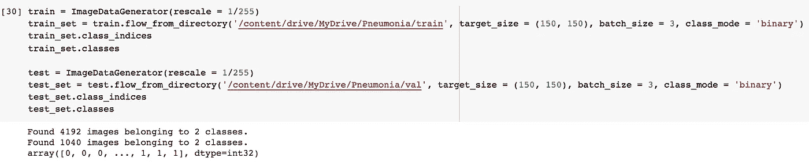

**图像预处理是创建任何 CNN 的基本部分，**所以第一步是将图像的 RGB 系数转换成我们的计算机可以计算处理的东西。通过将所有系数除以 255，我们实际上是将范围从 0–255 变为 0–1；这使得我们的计算机不仅更容易处理，而且更容易根据某个阈值做出预测。

幸运的是，我们的数据集已经分为正常文件夹和肺炎文件夹。这意味着我们所要做的就是调用它们的目录，并将它们放入各自的列表中。

train.flow_from_directory 使事情变得更好，它根据图像所在的文件夹的名称自动生成标签。如您所见，我们的计算机在训练集中的 2 个类别中找到了 **4192 张图像，在测试集中的 2 个类别中找到了 1040 张图像。**

ps。我实际上选择使用验证集作为我的测试集，因为它有更多的数据样本可以使用，但这实际上并没有改变 CNN 的任何事情。

# 第四步——建立我们的 CNN

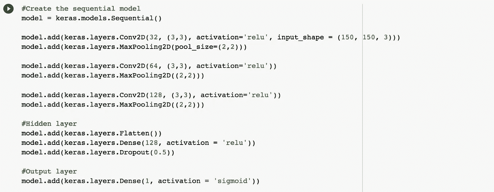

有几个重要的概念允许卷积神经网络充分简化和理解图像数据。

1.  **卷积**是在输入图像上应用过滤器，并在整个输入中缓慢映射它们的想法，从而改变图像并允许我们的网络辨别某些特征。

让我们以这个图像为例来观察一下。请注意左边的输入数据、中间的加权核(过滤器)和右边的复杂特征。在不脱离输入数据边缘的情况下，加权核可以将其自身准确定位在 9 个不同的位置，因此右侧简化的复杂特征有 9 个点。

内核的左上值与输入数据的白色部分的左上值相乘，然后将该值加到中上乘以中上，再加上右上乘以右上，依此类推。数学显示在图像的右边，所以 4 被放在返回的矩阵中适当的位置。

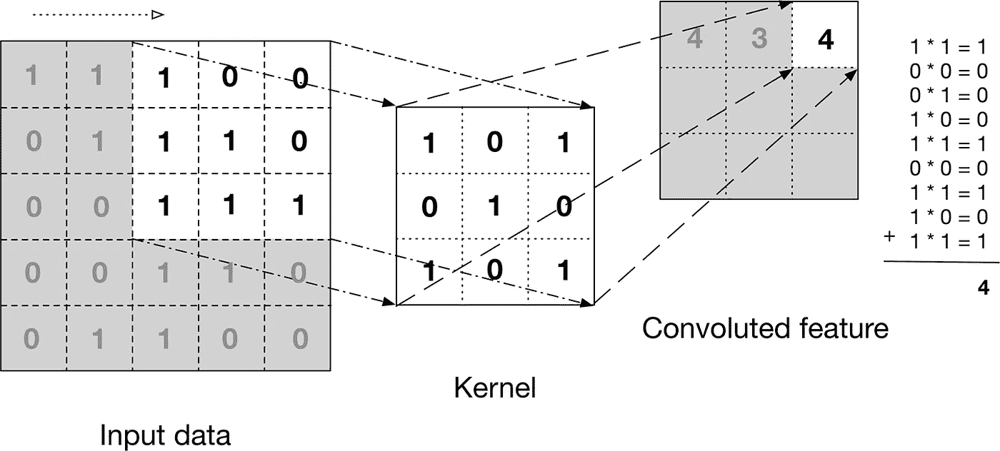

Example of how a filter is applied to input data

那么加权核实际上是如何返回一个特征的呢？它通过将权重应用于像素并从本质上确定其重要性级别来做到这一点。

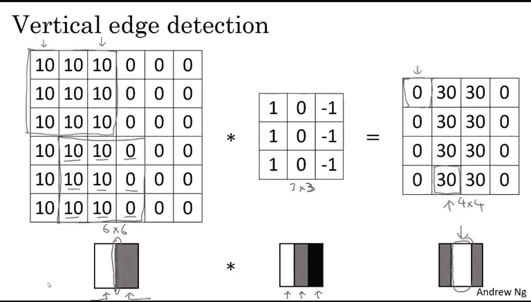

当查看左侧的输入矩阵时，人类可以非常清楚地认识到，值为 0 的像素旁边的值为 10 的所有像素将创建一条垂直线，但这是因为我们可以一次性观察到它们。对于我们的计算机来说，这将是**计算昂贵且低效的，**因此我们将这个加权核应用于我们的矩阵。

其背后的思想是，如果所有的像素都是相同的，内核将简单地返回 0，因为值乘以 1 加上值乘以-1 将会相互抵消。然而，当这些值没有被抵消时，内核返回一个复杂的特性，有点像我们右边矩阵的程度，这相当**清晰地以一种简单的方式描绘了一个垂直边缘，我们的计算机将更容易理解。**

2.**汇集**建立在卷积的最终想法之上，并试图使我们的输入数据变得愚笨。本质上，池化是像素区域的简化——这允许我们显著减少输入的大小。

这么想吧。像素很小，相邻的像素很可能非常相似。因此，我们可以牺牲一点点网络的精度，通过将像素区域归纳为一个值来获得更高的效率，这个值实质上代表了整个区域。

一种方法是使用 **Max-Pooling** ，其中所选像素是同一区域中所有其他像素中具有最高值的像素。

3.**拉平**实际上是将我们简化、提取的特征输入传统神经网络的过程。在下面的例子中，我们可以看到展平过程发生的确切位置。

注意:在这个 CNN 的例子中，用户想要将一个输入图像分类为多个类别(汽车、卡车、货车、自行车等)，因此他们适当地使用了 **Softmax 激活函数**，该函数*为输出值的每个*分配一个概率，因此网络可以选择具有最高概率的对象。在我们确定 X 射线扫描是正常还是肺炎的情况下，我们将使用**乙状窦激活功能。**

4.最后一个概念是 **Dropout，**简单地随机删除某些数据样本，这样我们的网络就不会变得*过于*熟悉我们的数据集，以至于失去对一般数据的准确性。这可以防止**过度配合。**

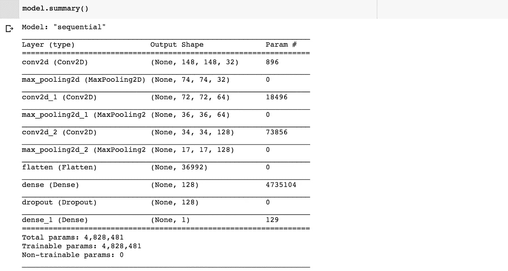

Using model.summary() to get an overview of all of the layers in the model

# 步骤 5 —培训和测试

既然大部分繁重的工作已经完成，我们的模型就可以进行自我训练和测试了。正如我们所看到的，它在每个时期之后变得越来越准确，在训练*和*测试中逐渐减少到大约 96%的准确性！

现在，我们正处于不过度适应和不过度适应之间的正确平衡中，所以最好把我们的网络留在这里。毕竟，96%是非常壮观的！

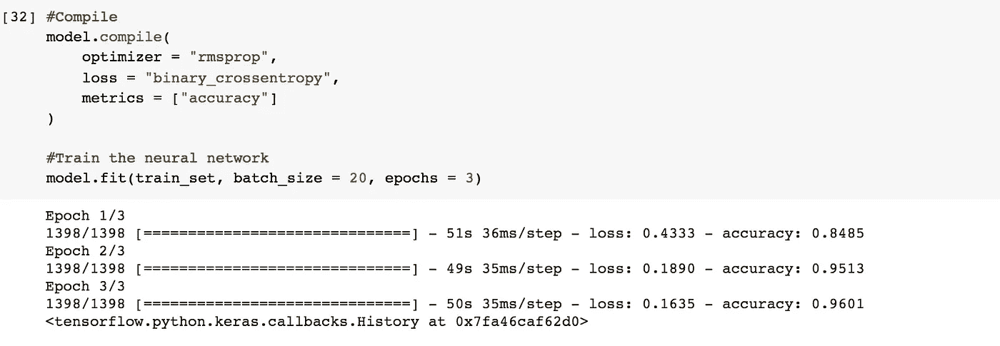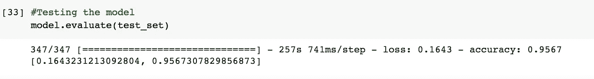

# 第六步——预测

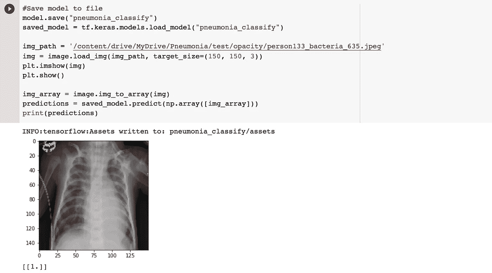

作为额外的一步，我很好奇我们的网络将如何处理单个输入，以及它是否会确定其正确的状态。果然如此。我拍了一张从未见过的图像，设置了正确的尺寸，输入进去，果然，我们的网络返回了 1，这意味着它预测病人患有肺炎。 *Correctamundo！*

# 机器学习的光明前景

然而，像这样的项目并不是概念性的。它们实际上可以应用于拯救生命。

在英国， [GE Healthcare](https://www.ge.com/news/press-releases/ge-healthcare-launches-new-ai-suite-detect-chest-x-ray-abnormalities-including) 最近开发并推出了新的 AI，它可以快速分析胸部 X 射线扫描，并能够确定多达 8 种异常情况**并向放射科医生发出警报**，包括新冠肺炎肺炎、肺结核、纤维化等。

此外，它显示每个案例的读取时间减少了 34%,同时保持了 97-99%的准确率。*不可思议！*

> 我很乐观，因为这仅仅是一个开始——一个临床医生可以帮助病人而不管地点、费用、地位或任何其他预防因素的世界的开始。

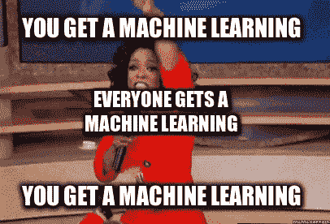

**感谢阅读！❤️**

**如果你觉得这篇文章有趣，那么请关注我的** [**LinkedIn**](https://www.linkedin.com/in/james-zhang-a45406190/) **和**[**Medium**](/@james-yi-zhang)**了解更多！此外，请随时给我发消息，并建立一个关于人工智能、自动驾驶汽车或任何其他让你高兴的事情的聊天！**