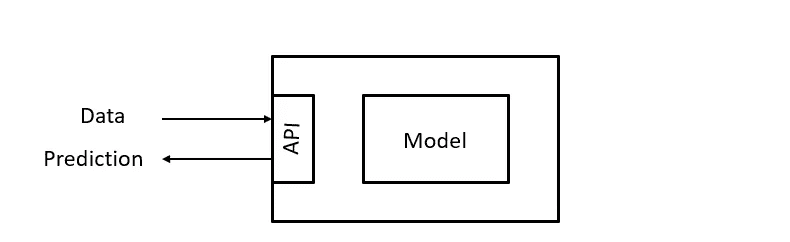
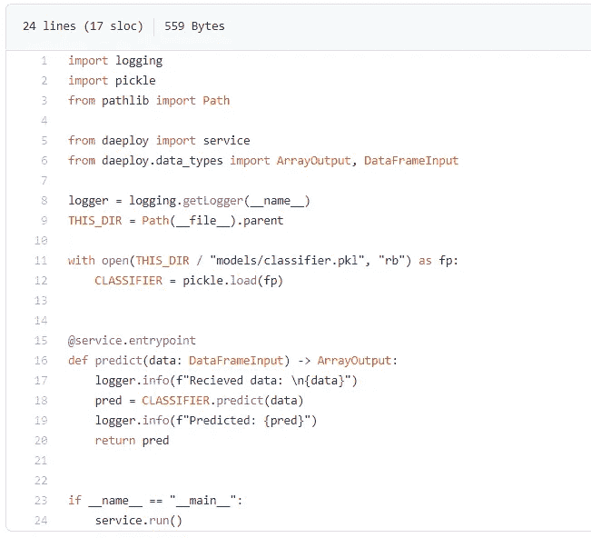
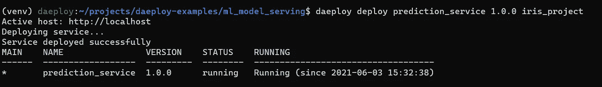
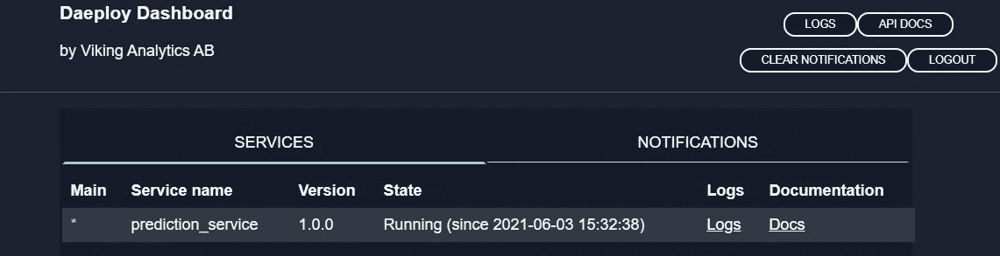
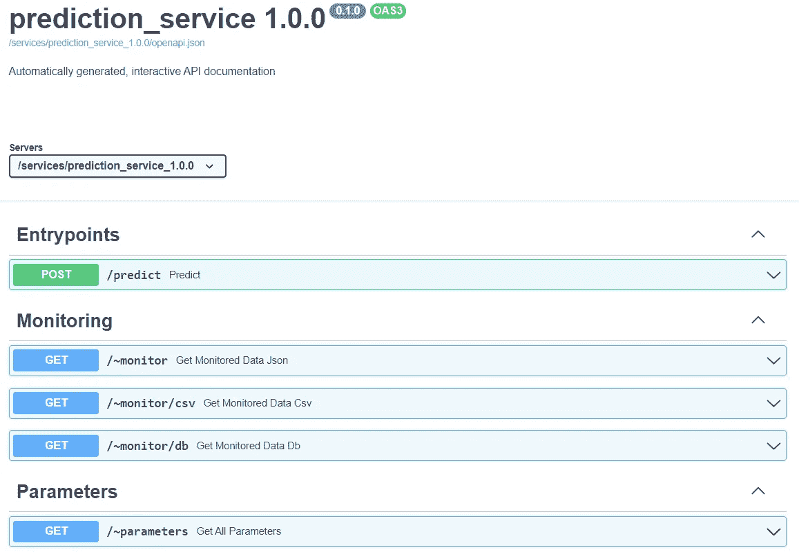
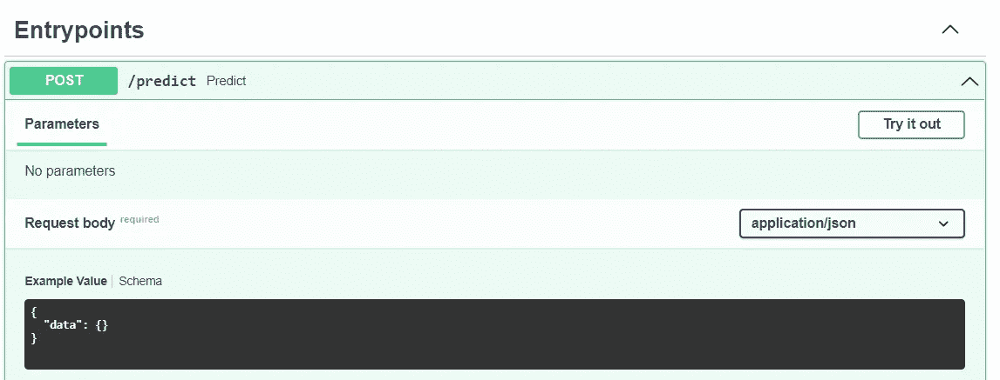

# 在不到 5 分钟的时间内用 Python 创建预测服务

> 原文：<https://medium.com/mlearning-ai/creating-a-prediction-service-in-python-in-less-than-5-min-59bb02c49c40?source=collection_archive---------0----------------------->

任何机器学习应用程序的核心，无论是生产优化、异常检测还是简单的信息仪表板，都有一个预测服务。预测服务的作用是接收(原始或处理后的)数据并提供预测，其他服务使用预测来解决手头的问题。



A simple prediction service

不管最终的用例是什么，将一个训练好的模型转换成一个稳定的服务，并提供一个允许外界访问该服务的接口，这可能是每个机器学习项目中最频繁重复出现的任务之一。在这篇文章中，我将向您展示如何在不到 5 分钟的时间内使用 Daeploy 创建一个预测服务！

注意:这个示例和其他几个示例的源代码可以在我们的公共[示例库](https://github.com/vikinganalytics/daeploy-examples)中找到。

# 剖析使用 Daeploy 的预测服务

让我们从著名的 iris flowers 数据集的预测服务的示例代码开始。关于如何为鸢尾花数据集训练分类器，有大量的例子。在我们的示例存储库中的“ml_model_serving”文件夹中也有一个 [train_model.py](https://github.com/vikinganalytics/daeploy-examples/blob/master/ml_model_serving/train_model.py) 。在这里，我想重点介绍一下预测服务及其部署。

让我们先来看看 [service.py](https://github.com/vikinganalytics/daeploy-examples/blob/master/ml_model_serving/iris_project/service.py) 。如您所见，它只有 24 行代码。



Anatomy of predictoin service by Daeploy

## 准系统服务(1 分钟)

服务总是从导入所需的库开始。第 1–3 行导入所需的标准 Python 库。第 5 行和第 6 行从 Daeploy SDK 导入服务和数据类型。

第 8 行使用 Python 标准日志库设置了一个日志记录器。最后，第 23 行和第 24 行将我们的脚本转换为服务。当我们使用 Daeploy 命令行界面(CLI)部署脚本时，service.run()告诉 Daeploy manager 这个脚本是一个服务。然后，Daeploy manager 自动构建 docker 映像，安装 requirements.txt 中定义的所有依赖项，并运行脚本(稍后将详细介绍)。

## 加载模型(1 分钟)

训练后导出模型有不同的方法。在这个例子中，我们使用 scikit 学习库，并且使用 pickle 库导出模型。在项目中创建一个名为“models”的文件夹，并将 classifier.pkl 文件复制到该文件夹中。

第 9 行到第 12 行共同为分类器的位置设置了正确的路径，并从 pickle 文件中加载它。

## 创建 API(1 分钟)

Daeploy SDK 的一个强大特性是，它通过修饰将任何 Python 函数转换成 API。第 16–20 行定义了一个简单的预测函数，它接收 dataframe 作为输入数据类型，并返回一个数组作为输出。第 15 行的 service.entrypoint 装饰器将这个函数转换成一个 API。

我们花了大约 3 分钟和 24 行代码来编写一个功能完整的预测服务的代码。接下来，我们将部署和测试我们的服务。

# 部署服务

为了部署我们的服务，我们需要在目标机器上运行 Daeploy manager，目标机器可以是工厂中的服务器、云中的虚拟机或者本地的您自己的计算机。管理器将您的代码打包成服务，这些服务可以使用基于 HTTP 的 REST API 进行通信。

## 运行部署管理器(1 分钟)

我将在本地计算机上部署我的预测服务。但是，无论目标主机位于何处，都适用相同的过程。Daeploy manager 是一个 docker 映像，可在 [docker hub](https://hub.docker.com/r/daeploy/manager) 上免费获得。要启动在本地主机上运行的免费试用管理器，请运行以下命令:

```
$ docker run -v /var/run/docker.sock:/var/run/docker.sock -p 80:80 -p 443:443 -d daeploy/manager:latest
```

您可以通过在浏览器中打开 [http://localhost/](http://localhost/) 来检查它是否正确启动。试用版管理器可以不受限制地使用 12 个小时，然后必须重新启动。

**注意:**使用环境变量管理器是高度可配置的。要了解生产环境的管理器设置，请参见此处的。

## 部署预测服务(1 分钟)

Daeploy SDK 附带了一个命令行界面(CLI ),可用于与 Daeploy manager 进行通信。如果您还没有这样做，请安装 daeploy 库:

```
$ pip install daeploy
```

Daeploy manager 带有内置的身份验证。因此，为了能够与管理器通信，我们需要首先登录。默认用户名和密码是“admin”和“admin”。

```
$ daeploy login
Enter daeploy host: [http://localhost](http://localhost)
```

成功登录后，我们将连接到指定的主机，并能够与 Daeploy Manager 通信。我们现在准备部署我们的预测服务。使用 Daeploy CLI，我们可以使用 deploy 命令部署我们的服务。三个输入是必需的:服务名、服务版本和服务文件夹的路径。在这个例子中，我们用版本 1.0.0 调用我们的服务 prediction_service。

```
$ daeploy deploy prediction_service 1.0.0 <path to the project>
```

管理器将花费几秒钟时间从我们的 service.py 构建 docker 映像，安装 requirements.txt 中定义的依赖项，并将其作为服务运行。



# 测试我们的预测服务

有几种方法可以测试我们新运行的预测服务。我们将研究两种方法:交互式 API 和 Python 请求库

## 交互式 API

Daeploy manager 带有一个仪表板。访问 localhost，使用默认用户名(admin)和密码(admin)登录。您应该能够看到您的预测服务正在运行:



Daeploy dashboard — prediction_service is running.

每个服务都有两个链接:日志和文档。单击服务文档打开交互式 API 文档。



The interactive API for prediction_service

正如您所看到的，Daeploy 管理器已经将我们的 predict 方法添加到了一个 API 中。通过打开 predict 入口点，您将有可能使用“尝试”按钮与 API 进行交互。提供测试数据，并从我们的服务中获得预测。



Use the interactive API to try out your endpoint

## Python 请求库

我们还可以使用任何软件发送 POST 请求，与我们的服务进行交互。在 Python 中，我们可以使用请求库与我们的服务进行通信。如果还没有，请安装请求库:

```
$ pip install requests
```

如果您的服务运行在启用了身份验证的管理器上(对于生产设置来说应该如此)，那么对该服务的任何请求都必须通过包含有效的身份验证令牌来进行身份验证。令牌由部署管理器生成。要生成新令牌，请使用 Daeploy CLI:

```
$ daeploy token
```

这将生成一个长期的身份验证令牌。要从我们的预测服务获得预测，我们需要运行以下命令:

```
TOKEN = "your_token"
response = requests.post(
    "services/prediction_service/predict",
    json={"data": <test data>},
    headers={"Authorization": f"Bearer **{**TOKEN**}**"})print(f"Response: {response.status_code} - {response.reason}")
```

将模型转换为运行预测服务是大多数机器学习解决方案的主要构件之一。使用 Daeploy 创建这样一个服务会产生一个不到 30 行代码的 python 脚本。Daeploy manager 解决了部署的困难，并将我们的脚本转换成一个正在运行的服务。整个过程不到 5 分钟。你应该试试！快乐[d 就业](http://www.daeploy.com)！