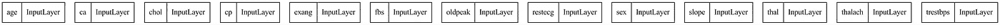
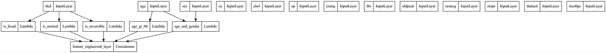
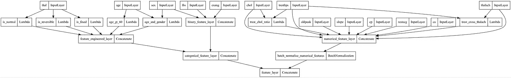
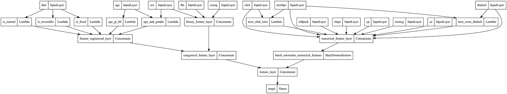

# 在 Keras 中创建特征工程流程图

> 原文：<https://medium.com/mlearning-ai/creating-feature-engineering-flow-graphs-in-keras-87bb38f0b5cf?source=collection_archive---------5----------------------->

在这篇博客中，我们将探讨如何在使用 Keras 层构建我们的特征工程流程图时创建图。在每一步，我们将绘制我们的特征图的状态。最后，我们将有一个信息丰富的图表，显示我们的特征是如何创建的，以及它们是如何相互融合的。我们还将看到特性或步骤的相互依赖性。为了说明的目的，我们将利用 Lambda 层太容易创建新的功能层。这里的代码类似于[这篇博文](/mlearning-ai/feature-engineering-using-keras-lambda-layers-ae0c6d3c904f)。对于本文，我们只关注创建信息丰富的特性图。

***(点击图表可放大)***

我们将使用上述文章中使用的相同数据集。

接下来，我们定义一个函数来创建输入层:

为了创建我们的特征图，我们需要一个带有输入和输出的 Keras 模型对象。到目前为止，我们只有输入图层，因此我们的输入和输出都将是要素图层输入:

## 使用 Keras Lambda 图层的特征工程

让我们定义特征工程功能:(工程特征仅用于说明目的)

## 创建自定义特征工程图层

## 可视化特征工程层

到目前为止，我们有我们的输入层，其中输入馈入不同的 Lambda 层。下面是我们到目前为止的特征图。请注意，输入图层的某些要素不会馈入任何其他图层。我们将在下一节中添加这一点。我们对网络的输入仍然是我们的特征层输入，但是我们对网络的输出是我们用λ层计算的特征层:

## 组合所有要素以创建完整的要素图层:

让我们合并层

## 可视化要素图层图表

这是我们完整的特征工程流程图。这是查看是否将某些预处理图层(例如批处理规范)应用于正确特征的好方法。最初，我对分类特征进行了批量标准化，这是我在查看特征图时注意到的。在下图中，只有数字是标准化的。并且只有在它们被标准化之后，分类和数字特征才作为我们的完整特征层被加入。

为了完整起见，我们将训练该模型，以显示一切按预期运行:

完整的网络图:

 [## Mlearning.ai 提交建议

### 如何成为 Mlearning.ai 上的作家

medium.com](/mlearning-ai/mlearning-ai-submission-suggestions-b51e2b130bfb)