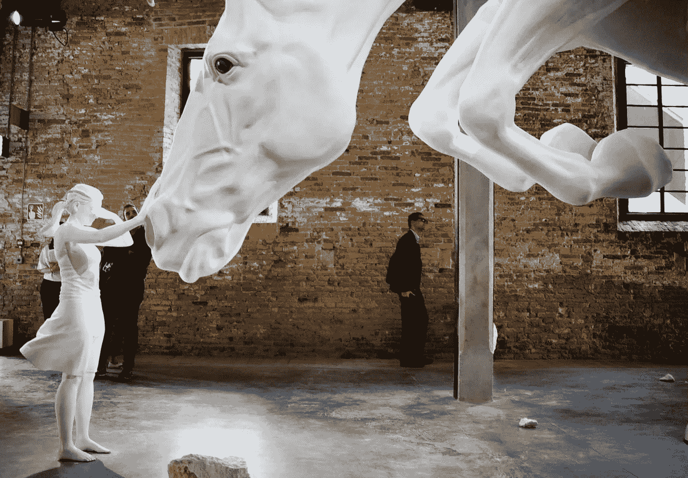

# 创造机器学习艺术

> 原文：<https://medium.com/mlearning-ai/creating-machine-learning-art-5752715dff9b?source=collection_archive---------4----------------------->

## 艾艺术

## 当今的创意产业

[https://www.instagram.com/evartology/](https://www.instagram.com/evartology/)

机器学习已经成为艺术领域的一股重要力量。无论是由艺术家建造的人工智能雕塑，机器学习算法与博物馆合作创建动态展览，还是连接物理和数字世界的庞大艺术装置，机器学习都已被证明是一种无价的资源…