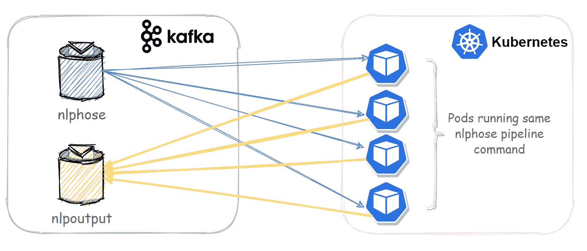
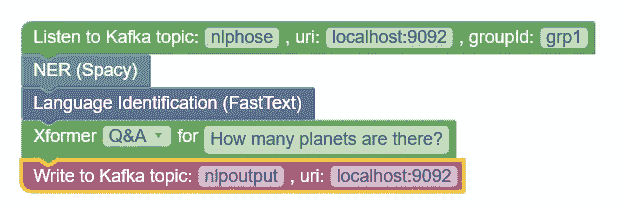
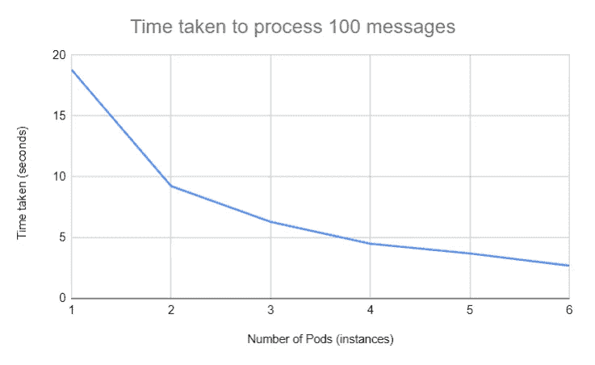

# 使用 Nlphose、Kafka 和 Kubernetes 创建可扩展的 NLP 管道

> 原文：<https://medium.com/mlearning-ai/creating-scalable-nlp-pipelines-with-nlphose-kafka-and-kubernetes-256feeca8935?source=collection_archive---------1----------------------->



一个典型的自然语言处理(NLP)流水线通过使用在不同编程语言和框架中创建的模型包含许多推理任务。今天，有许多基于单一 ML 模型部署和扩展推理方法的既定方法。但是，扩展管道并不那么简单。在本文中，我们将看到如何使用我的开源项目 Nlphose、Kafka 和 Kubernetes 创建一个可伸缩的 NLP 管道，理论上可以并行处理数千条文本消息。

# Nlphose 简介

使用一组简单的命令行工具，可以在几秒钟内创建复杂的 NLP 管道，用于处理静态文件或流文本。不需要编程！您可以在终端中执行单个命令，对文本执行多种操作，如 NER、情感分析、分块、语言识别、Q & A、0-shot 分类等。你可以在这里【https://github.com/code2k13/nlphose[阅读更多关于这个项目的信息。Nlphose 还有一个 GUI 查询生成器工具，允许您通过拖放在浏览器中创建复杂的 NLP 管道。你可以在这里查看工具:【https://ashishware.com/static/nlphose.html】T4](https://github.com/code2k13/nlphose)

# 创建一个管道

最近，我在我的项目中添加了两个组件:

*   [Kafka2json.py](https://github.com/code2k13/nlphose/wiki/Kafka-Source) —该工具类似于 [kafkacat](https://docs.confluent.io/platform/current/app-development/kafkacat-usage.html) 。它可以监听 Kafka 主题，并将文本数据传输到管道的其余部分。
*   [Kafkasink.py](https://github.com/code2k13/nlphose/wiki/Kafka-Sink) —该工具在 NLP 管道中充当“接收器”，并将管道的输出写入 Kafka 主题。

在本文中，我们将使用图形查询生成器工具来创建一个复杂的 NLP 管道，如下所示:



管道做以下事情:

*   听一个关于卡夫卡的话题，叫做“nlphose”
*   命名实体识别(位置的自动地理标记)
*   语言识别
*   寻找“有多少颗行星？”这个问题的答案，采用抽取式问答技术。
*   将管道的输出写入 Kafka 主题“nlpoutput”

以上管道的 Nlphose 命令如下所示:

```
./kafka2json.py -topic nlphose -endpoint localhost:9092 -groupId grp1 |\
./entity.py |\
./lang.py |\
./xformer.py --pipeline question-answering --param 'How many planets are there?' |\
./kafkasink.py -topic nlpoutput -endpoint localhost:9092
```

# 配置 Kafka

本文假设您已经有了一个 Kafka 实例，并在其上创建了两个主题“nlphose”和“nlpoutput”。如果您无法访问 Kafka 实例，请参考本[快速入门指南](https://kafka.apache.org/quickstart)在您的开发机器上安装 Kafka。Kafka 实例应该可以被所有运行 Nlphose 管道的机器或 Kubernetes 集群访问。在本例中,“nlphose”主题有 16 个分区。我们将在一个组中使用多个消费者来订阅这个主题并并发地处理消息。

# 在 Kubernetes 部署 Nlphose 管道

Nlphose 的[带有一个 docker 镜像](https://hub.docker.com/r/code2k13/nlphose)，包含了它运行所需的所有代码和模型。您只需在 Kubernetes 中创建一个部署来运行这个管道。下面给出了一个示例部署文件:

```
apiVersion: apps/v1
kind: Deployment
metadata:
  name: nlphose
  labels:
    app: nlphose
spec:
  replicas: 6
  selector:
    matchLabels:
      app: nlphose
  template:
    metadata:
      labels:
        app: nlphose
    spec:
      containers:
      - name: nlphose
        image: code2k13/nlphose:latest
        command: ["/bin/sh"]
        #args: ["-c", "while true; do echo Done Deploying sv-premier; sleep 3600;done"]
        #command: [" "]
        #args: ["pwd "]
        args: ["-c","cd /usr/src/app/nlphose/scripts && ./kafka2json.py -topic nlphose -endpoint 127.0.0.1:9092 -groupId grp1 | ./entity.py | ./lang.py | ./xformer.py --pipeline question-answering --param 'How many planets are there ?' | ./kafkasink.py -topic nlpoutput -endpoint 127.0.0.1:9092"]
```

> 请确保将“127.0.0.1:9092”更改为 Kafka 实例的正确 IP 和端口。

# 在没有 Kubernetes 的情况下部署 Nlphose 管道

Kubernetes 并不强制使用 Nlphose 创建可伸缩的管道。由于 Nlphose 管道只是一组 shell 命令，因此您可以在多台裸机或虚拟机或 PaaS 解决方案上运行这些命令。当与 Kafka 插件一起使用时，Nlphose 能够并发处理 Kafka 消息，只要在运行管道的所有计算机上使用相同的 groupId。只需从 GUI 查询生成器复制粘贴输出，并将其粘贴到目标机器的终端中。您有一个并行执行管道的计算机集群！

# 基准和结果

我创建了一个小程序，在 Kafka 主题“nlphose”上持续发布以下消息:

```
message = {
 "id": "uuid",
 "text": "The solar system has nine planet. Earth is the only plant with life.Jupiter is the largest planet. Pluto is the smallest planet."
}
```

管道生成的相应已处理消息如下所示:

```
{
  "id": "79bde3c1-3e43-46c0-be00-d730cd240d5a",
  "text": "The solar system has nine planets. Earth is the only plant with life.Jupiter is the largest planet. Pluto is the smallest planet.",
  "entities": [
    {
      "label": "CARDINAL",
      "entity": "nine"
    },
    {
      "label": "LOC",
      "entity": "Earth"
    },
    {
      "label": "LOC",
      "entity": "Jupiter"
    }
  ],
  "lang": "en",
  "xfrmr_question_answering": {
    "score": 0.89333176612854,
    "start": 21,
    "end": 25,
    "answer": "nine"
  }
}
```

下图显示了我在 GKE 和一个自主运行的 Kafka 实例上进行的实验结果。从下面的图表可以清楚地看出，处理请求所需的时间随着实例的增加而减少。



# 结论

随着新 Kafka 插件的加入，Nlphose 已经成为一个真正的大数据工具。我一直在努力让它对最终用户更有用，更容易操作。Nlphose 可以与 Kubernetes、Docker 或裸机配合使用。此外，如果你坚持项目的[指导原则](https://github.com/code2k13/nlphose/wiki/Architecture-of-nlphose)，你可以很容易地为这些管道定制或添加新工具。希望这篇文章对你有用。随时欢迎建议和评论！

[](/mlearning-ai/mlearning-ai-submission-suggestions-b51e2b130bfb) [## Mlearning.ai 提交建议

### 如何成为 Mlearning.ai 上的作家

medium.com](/mlearning-ai/mlearning-ai-submission-suggestions-b51e2b130bfb)