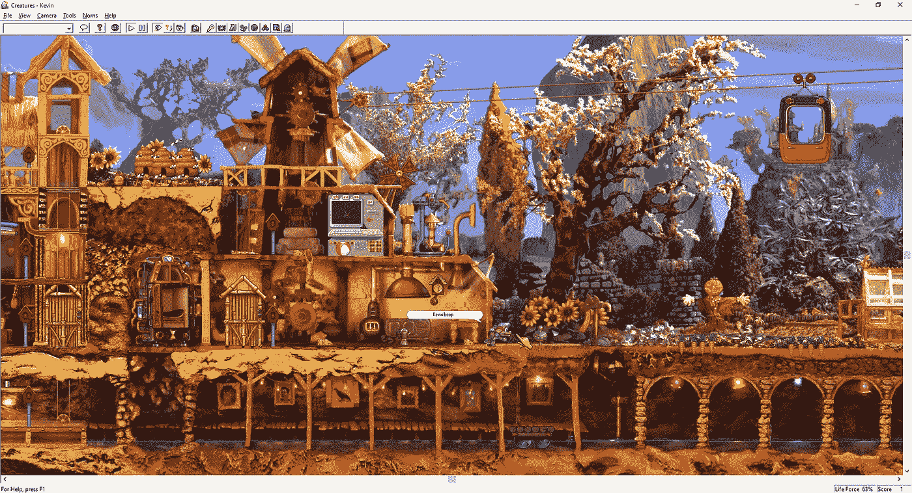
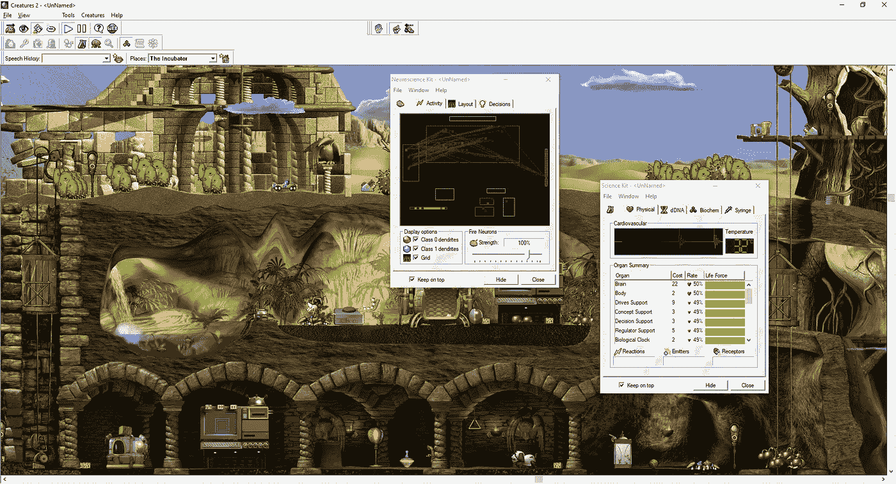
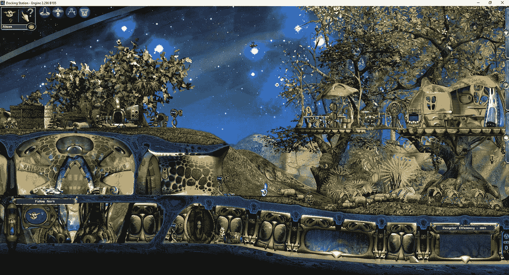

# 生物:九十年代的神经网络

> 原文：<https://medium.com/mlearning-ai/creatures-neural-networks-in-the-nineties-42e839841bf4?source=collection_archive---------4----------------------->

像*生物*这样的游戏并不经常出现。

1996 年，Steve Grand 和 Cyberlife 发布了他们的虚拟生活模拟游戏*生物*。Cyberlife 没有使用基于规则的系统来管理游戏中虚拟生物的行为，而是做出了一个不同寻常的决定，采取了一种自下而上的方法，以一种 [**反映现实生活中生物过程**](https://link.springer.com/article/10.1023/A:1010042522104) 的方式模拟遗传学、大脑活动和生物化学，并从此定义了该系列中所有主要的游戏。

在 1998 年大张旗鼓之后,《生物 2 号》问世了，它预示着更聪明的生物、更复杂的生物学和一个全功能的生态系统。这款游戏一发布就售出了 20 万份，尽管有一些非常明显的错误很快被修补，但即使在 1999 年 11 月*生物 3* 发布后，它仍然保留了一个由育种者、开发者和虚拟遗传学家组成的专门社区。

虽然*生物 3* 有一个更大、更复杂的游戏世界，更富表现力的*生物*，甚至在它的后期有了*扩展坞*，集成了在线功能(这在当时是一件大事)，但与它的前辈相比，它卖得很差。这很大程度上是因为游戏本身非常优秀，在很多方面都比 2 有了巨大的进步，但在发布时却完全没有宣传。尤其是网络元素，在将社区聚集在游戏周围方面做得非常出色，让玩家可以轻松分享他们的创作。

## 阿尔比亚作为世界建设的一个练习。

在*生物*标题的前几个小时里最突出的是游戏世界。当你滚动经过机器时，它们会发出水泡声、鸟儿啁啾声、机器嗡嗡声。前两个游戏的设定是后启示录但仍然丰富多彩，充满生活气息。最初的*生物*世界是通过构建一个 [**实际物理模型并拍摄它**](https://creatures.fandom.com/wiki/Background_model) 而创建的，给第一个游戏一种迷人的手工制作的感觉。《生物 2》在 3D 建模软件中进行了精心渲染，由于艺术家的风格方法，即使在今天也保持得很好，而《生物 3》则采用了更具未来感的科幻风格，远离了自然环境。

随着玩家(或者更确切地说，玩家的生物)进一步进入世界，更多的世界变得可访问。虽然现在有游戏修改，现在允许玩家视图立即移动到任何地方并做任何事情，但在发布时，玩家必须鼓励他们的生物探索并与分散在世界各地的各种工具互动，以解锁一些更复杂的界面，并更详细地查看游戏的工作方式。生物 3 放弃了这种方式，让玩家从一开始就可以不受限制地进入整个游戏世界。虽然这对于第一次玩游戏的人来说可能不那么令人沮丧，但它对使可玩区域感觉更小更浅有很大帮助。

世界的生态和结构是复杂而广泛的。每个区域都有光照、养分(有机和无机)、辐射、温度甚至风速的动态值。几乎所有这些价值观都会对游戏生态以及生物本身产生影响。昆虫授粉，动物吃水果，真菌，偶尔彼此，有天气，甚至季节。所有这些加在一起创造了一个世界，即使名义上的生物不存在，它也感觉很有活力。第二个游戏在这一点上做得特别好，它的动态生态和自然环境共同创造了一个真实的世界。

地图上还散落着废墟和隐藏的实验室，给人一种持续的感觉，就是有更多的东西在看不见的地方。你遇到的每件事都暗示着之前可能会发生什么。谁建造了实验室？这些机器最初的目的是什么？他们为什么离开？所有这些问题的答案都被暗示过，但从来没有真正回答过，留给玩家一种神秘感和继续探索世界的理由。

*The background image for Creatures was a digitally altered photograph of a hand-made physical model that was just under two meters wide!*

## 1996 年的神经网络

当最初的游戏在 1996 年发布时，生物本身背后的技术是开创性的。生物大脑使用的是一个缩小版的四层神经网络，由 952 个神经元组成，约有 5000 个连接排列成一系列“叶”。YouTube 上有一篇艾伦·祖科尼的 [**优秀视频文章**](https://www.alanzucconi.com/2020/07/27/the-ai-of-creatures/) ，深入探讨了生物大脑如何工作的细节，我强烈建议观看一下。

使用自下而上的方法处理网络生活中的行为的问题是，当一件事情被集体推出时，几乎不可能预测到每一个可能发生的紧急问题。推出的*生物 2* 基因组存在许多令人震惊的问题，最值得注意的是“一小时愚蠢综合征”或“OHSS ”,生物大脑在大约一个小时的游戏后会迅速恶化，导致诺恩三女神经常撞到墙上，忘记如何吃饭，最终死亡。

虽然 Cyberlife 确实相对快速地发布了补丁来修复一些更突出的问题，但社区团结起来，投入了大量时间来修复有缺陷的生物基因组。 [**论文写的是 OHSS**](http://double.nz/creatures/papers.htm) 的修复，结果出现了许多具有新的或新颖的大脑布局的工程生物“品种”，它们以各种方式解决了这个问题。很难想出还有什么能以这种方式促成“社区神经科学”的实例。

*Creatures 2 exposed many of the inner workings of the creatures to the player. Shown in the applets in this screenshot are the real-time brain activity and physical attributes of a newly hatched Norn.*

## 今日生物:数字考古与存档

尽管《生物 3》在推出在线服务、新的基因组和物品后，在相当长的一段时间内仍然受到支持，但不幸的是，出版商 Mindscape 在 2011 年解散，并在关闭时停用了该系列的许多在线功能和资源。虽然这个社区一直存在，但许多资源，尤其是遗传学和目标文件下载已经随着时间的流逝而消失，或者纯粹存在于像 archive.org 这样的服务上。一些最大的损失是论坛内容和包含生物大脑结构和生物化学知识的指南。今天，试图找到一些补丁和基因组可能是数字考古学中的一项练习，信息和下载被塞进了地理城市风格的页面，这些页面有块状彩色背景和闪烁的横幅。

让游戏在现代操作系统上运行也不完全简单，不幸的是，尽管发布了优秀的旧游戏，但最糟糕的是,*creations 2*几乎完全不兼容 Windows 10。尽管有像这样的优秀工具，但在我的世界遭到不可挽回的破坏，我根本无法启动游戏之前，我只设法稳定地玩了几个小时。

然而，仍然有一个小而繁荣的社区继续回归这个系列，并定期为游戏开发。绝大多数都是以 [**生物洞穴论坛**](https://www.creaturescaves.com) 和各种不和谐服务器为中心。目前正在努力可靠地存档该系列的旧资源，开发新的工具和程序，以便在现代计算机上运行游戏，以及取代此前由 Mindscape 提供的服务，这些服务后来已经离线。甚至有一个完整的引擎重新实现正在开发的所有三个游戏，这应该使他们更容易为休闲玩家一旦完成。

*The artistic style and setting of Creatures 3 differs pretty significantly from that of 1 and 2, and is set aboard an abandoned ‘ark ship’ in space.*

## 未来？

目前，似乎对一个新的官方游戏没有太大的希望。生物 IP 已经被一个移动开发者搁置了大约 5 年，而*生物在线*(该开发者计划的一款游戏)的演示并没有显示出太多的前景。在*生物 3* 发布时的商业失败和 Mindscape 的崩溃之后，似乎没有任何工作室特别热衷于接受复杂人工生命游戏的挑战。

现在这个系列最大的希望是粉丝项目。虽然许多更雄心勃勃的项目似乎已经停滞不前(在编写史蒂夫·格兰德的生物启发游戏的最后一次公开更新是在 2017 年)，但像 and [**Albian Warp**](https://github.com/AlbianWarp) 这样的项目显示了让该系列在现代计算机上继续存在和可玩的真正希望。

这是一个真正的耻辱，在市场上留下的差距，生物系列一直没有得到填补。这些游戏发布后，激发了整整一代人对遗传学、生物学和编程的兴趣。自从最终游戏发布以来，这个社区已经存在了 20 年，这是有充分理由的。对于许多人来说，生物新闻组是他们参与的第一个在线社区，或者是他们可以接触到的第一个有规模的创意渠道。

幸运的话，我们将在未来几年看到一些有希望的东西。人工生命游戏正慢慢开始重新流行起来，像 [**Wobbledogs**](https://wobbledogs.com) 这样的游戏显示出很大的前景。然而，在那之前，生物社区似乎还在举着火炬，让这一非凡的流派继续存在。

*最初发布于*[*https://temmuzdesign . ovh*](https://temmuzdesign.ovh/creatures-neural-networks-in-the-nineties/)*。*