# 信用卡违约者—探索性数据分析和频繁模式挖掘

> 原文：<https://medium.com/mlearning-ai/credit-card-defaulters-exploratory-data-analysis-and-frequent-pattern-mining-a7964b0f6def?source=collection_archive---------3----------------------->

[违约者/非违约者数据集](https://drive.google.com/file/d/1rxaNmoJmjzuaDODMxgYFqlnstZfS8mFL/view?usp=sharing)
信用卡持有者的数据集，被标记为违约者/非违约者(贷款是否已付)。

Crushing loans for defaulters

> 数据中是否有某些模式或特征可以帮助银行审查他们向谁提供贷款？

# 数据集

在我们正式开始处理数据之前，有必要了解我们的数据由什么组成，以及数据中的属性代表什么。如果我们不知道属性意味着什么，数据代表什么，我们可能会做出错误的假设，并最终做出错误的分析。数据集中的属性包括:

*   **目标**
    标记为 1 的人—违约者
    标记为 0 的人—非违约者
*   **CONTRACT_TYPE**
    标识贷款是现金还是循环贷款
*   **性别
    男**女

*   **FLAG_OWN_CAR**
    客户是否拥有汽车的标志
*   **FLAG_OWN_REALTY** 
*   **CNT_CHILDREN** 
*   **收入 _ 总计** 客户收入
*   客户所达到的最高教育水平
*   **家庭 _ 状态** 客户端的家庭状态
*   **房屋 _ 类型** (当事人住房情况如何)
    房租
    与父母同住
*   客户的职业是什么
*   **FAM _ 成员** 客户有几个家庭成员
*   **REGION _ RATING _ CLIENT** 客户所在地区的评级
*   **ORGANIZATION_TYPE** 客户工作的组织类型

# 探索性数据分析

在我们对数据有了一个很好的了解和理解之后，下一步就是动手做一些事情，更深入地研究数据本身。探索性数据分析是任何数据挖掘或数据科学相关任务的关键任务。EDA 包括预处理、可视化和相关性分析，本质上是探索数据，从原始数据本身中寻找有意义的信息。

# 预处理

预处理阶段是数据增强阶段。其中为后面的阶段准备数据，后面的阶段是数据的所需处理，例如，可以在数据中运行各种算法，并且可以从数据中得出结果。

# 识别和删除重复数据

数据中的重复值可能是由于导入或导出数据时的错误，甚至是在输入数据时的错误。

我们通过删除所有重复值并在数据集中保留 1 个实例(原始数据值)来处理重复值。

使用。duplicated()函数，我们得到一个布尔数据帧，它指示原始数据库中存在的重复值。

我们创建了一个布尔数据框，对于重复值返回 true，对于非重复值返回 false。

bool _ series = df . duplicated()
PD。data frame(bool _ series . value _ counts())。重命名(columns={0:"Count"})

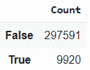

然后使用下面的函数删除重复的值。

df.drop_duplicates(keep = False，inplace = True)

# 处理缺失值

原始数据经常会丢失值。需要处理缺失值，因为它们会降低分析的统计能力，丢失重要信息，甚至可能带来偏差。

缺失值可能通常包含重要的信息，比我们一些人所想的要多。缺失值可以进一步分为不同的类别:

*   完全随机失踪——MCAR
*   随机失踪——三月
*   不是随机失踪— MNAR

出于项目目的，我们假设数据中的所有值都是 MCAR。

丢失的值可以被完全丢弃，但是这进一步导致了信息的丢失。例如，因为 15 个属性中有 1 个缺少值而删除整行意味着我们也丢失了包含数据的其余 14 个属性的数据。

我们首先使用数据的布尔框架来识别整个数据框架中存在的缺失值。

missingValues = df.notnull()

从布尔框架中，我们提取了包含缺失值的属性的名称。

发现以下属性包含缺失值。

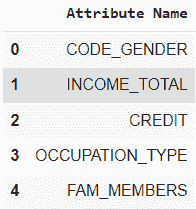

使用 modefill 方法替换了缺少的值。

因为我们有大量的数据，而缺失值的数量明显更少，所以用模式值填充它们是有意义的，因为这将带来更少的方差。

# 处理腐败的价值观

在检查每一列的唯一值时，我们发现性别列有空值，但表示方式不同，所以我们必须单独处理这种情况。通常由 NA 表示的空值在 CODE_GENDER 列中显示为 XNA。

df['代码 _ 性别'] = df['代码 _ 性别']。替换(['XNA']，df['CODE_GENDER']。mode()[0])

# 数据可视化

# 数字变量汇总统计

df.describe()

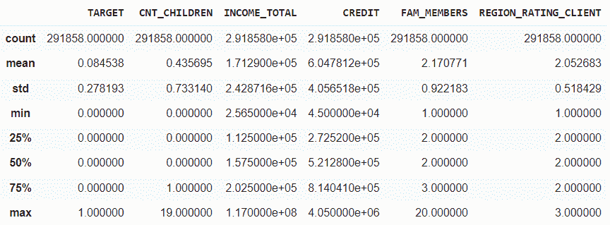

# 违约者的统计摘要

df _ defaulter = df[df[' TARGET ']= = 1]
df _ defaulter[[' CNT _ CHILDREN '，' INCOME_TOTAL '，' CREDIT '，' FAM _ 成员'，' REGION_RATING_CLIENT']]。描述()

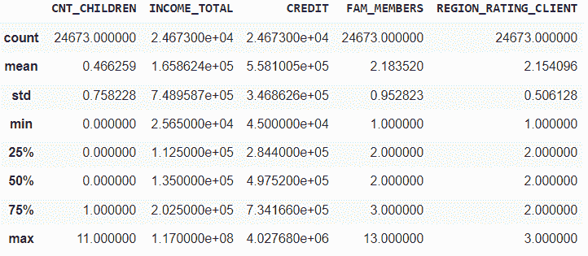

# 非违约者的汇总统计数据

df _ non default er = df[df[' TARGET ']= = 0]
df _ non default er[[' CNT _ CHILDREN '，' INCOME_TOTAL '，' CREDIT '，' FAM _ 成员'，' REGION_RATING_CLIENT']]。形容

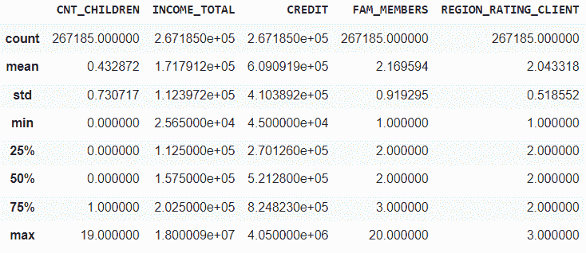

# 预处理

预处理阶段是数据增强阶段。其中为后面的阶段准备数据，后面的阶段是数据的所需处理，例如，可以在数据中运行各种算法，并且可以从数据中得出结果。

# 识别和删除重复数据

数据中的重复值可能是由于导入或导出数据时的错误，甚至是在输入数据时的错误。

我们通过删除所有重复值并在数据集中保留 1 个实例(原始数据值)来处理重复值。

使用。duplicated()函数，我们得到一个布尔数据帧，它指示原始数据库中存在的重复值。

我们创建了一个布尔数据框，对于重复值返回 true，对于非重复值返回 false。

bool _ series = df . duplicated()
PD。data frame(bool _ series . value _ counts())。重命名(columns={0:"Count"})

然后使用下面的函数删除重复的值。

df.drop_duplicates(keep = False，inplace = True)

# 处理缺失值

原始数据经常会丢失值。需要处理缺失值，因为它们会降低分析的统计能力，丢失重要信息，甚至可能带来偏差。

缺失值可能通常包含重要的信息，比我们一些人所想的要多。缺失值可以进一步分为不同的类别:

*   完全随机失踪——MCAR
*   随机失踪——三月
*   不是随机失踪— MNAR

出于项目目的，我们假设数据中的所有值都是 MCAR。

丢失的值可以被完全丢弃，但是这进一步导致了信息的丢失。例如，因为 15 个属性中有 1 个缺少值而删除整行意味着我们也丢失了包含数据的其余 14 个属性的数据。

我们首先使用数据的布尔框架来识别整个数据框架中存在的缺失值。

missingValues = df.notnull()

从布尔框架中，我们提取了包含缺失值的属性的名称。

发现以下属性包含缺失值。

使用 modefill 方法替换了缺少的值。

因为我们有大量的数据，而缺失值的数量明显更少，所以用模式值填充它们是有意义的，因为这将带来更少的方差。

# 处理腐败的价值观

在检查每一列的唯一值时，我们发现性别列有空值，但表示方式不同，所以我们必须单独处理这种情况。通常由 NA 表示的空值在 CODE_GENDER 列中显示为 XNA。

df['代码 _ 性别'] = df['代码 _ 性别']。替换(['XNA']，df['CODE_GENDER']。mode()[0])

# 数据可视化

# 数字变量汇总统计

df.describe()

# 违约者的统计摘要

df _ defaulter = df[df[' TARGET ']= = 1]
df _ defaulter[[' CNT _ CHILDREN '，' INCOME_TOTAL '，' CREDIT '，' FAM _ 成员'，' REGION_RATING_CLIENT']]。描述()

# 非违约者的汇总统计数据

# 预处理

预处理阶段是数据增强阶段。其中为后面的阶段准备数据，后面的阶段是数据的所需处理，例如，可以在数据中运行各种算法，并且可以从数据中得出结果。

# 识别和删除重复数据

数据中的重复值可能是由于导入或导出数据时的错误，甚至是在输入数据时的错误。

我们通过删除所有重复值并在数据集中保留 1 个实例(原始数据值)来处理重复值。

使用。duplicated()函数，我们得到一个布尔数据帧，它指示原始数据库中存在的重复值。

我们创建了一个布尔数据框，对于重复值返回 true，对于非重复值返回 false。

bool _ series = df . duplicated()
PD。data frame(bool _ series . value _ counts())。重命名(columns={0:"Count"})

然后使用下面的函数删除重复的值。

df.drop_duplicates(keep = False，inplace = True)

# 处理缺失值

原始数据经常会丢失值。需要处理缺失值，因为它们会降低分析的统计能力，丢失重要信息，甚至可能带来偏差。

缺失值可能通常包含重要的信息，比我们一些人所想的要多。缺失值可以进一步分为不同的类别:

*   完全随机失踪——MCAR
*   随机失踪——三月
*   不是随机失踪— MNAR

出于项目目的，我们假设数据中的所有值都是 MCAR。

丢失的值可以被完全丢弃，但是这进一步导致了信息的丢失。例如，因为 15 个属性中有 1 个缺少值而删除整行意味着我们也丢失了包含数据的其余 14 个属性的数据。

我们首先使用数据的布尔框架来识别整个数据框架中存在的缺失值。

missingValues = df.notnull()

从布尔框架中，我们提取了包含缺失值的属性的名称。

发现以下属性包含缺失值。

使用 modefill 方法替换了缺少的值。

因为我们有大量的数据，而缺失值的数量明显更少，所以用模式值填充它们是有意义的，因为这将带来更少的方差。

# 处理腐败的价值观

在检查每一列的唯一值时，我们发现性别列有空值，但表示方式不同，所以我们必须单独处理这种情况。通常由 NA 表示的空值在 CODE_GENDER 列中显示为 XNA。

df['代码 _ 性别'] = df['代码 _ 性别']。替换(['XNA']，df['CODE_GENDER']。mode()[0])

# 数据可视化

# 数字变量汇总统计

df.describe()

# 违约者的统计摘要

df _ defaulter = df[df[' TARGET ']= = 1]
df _ defaulter[[' CNT _ CHILDREN '，' INCOME_TOTAL '，' CREDIT '，' FAM _ 成员'，' REGION_RATING_CLIENT']]。描述()

# 非违约者的汇总统计数据

df _ non default er = df[df[' TARGET ']= = 0]
df _ non default er[[' CNT _ CHILDREN '，' INCOME_TOTAL '，' CREDIT '，' FAM _ 成员'，' REGION_RATING_CLIENT']]。形容

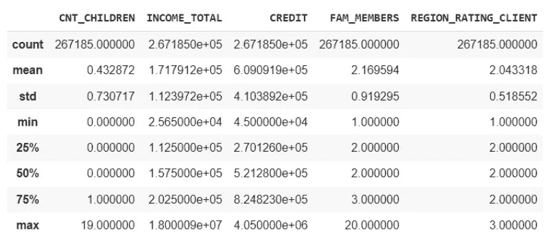

# 基本可视化

大多数数据可视化包括查看数据中的经验分布，我们通过使用条形图来表示各种类别的计数，并确定不同的因素，以确保数据集中的哪个类别具有相似的趋势。

**目标变量—违约者/非违约者**

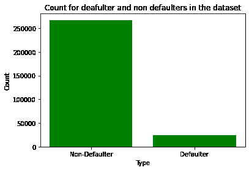

**性别**

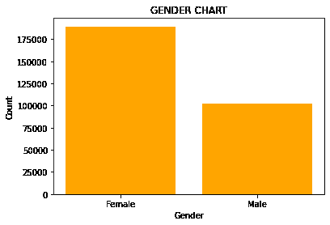

如结果所示，我们看到数据中存在性别不平衡，数据集中女性的数量大约是数据集中男性数量的两倍。

**家庭状况**

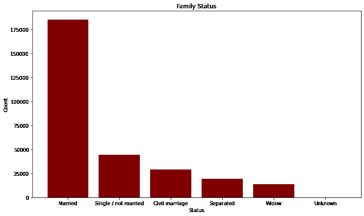

**合同类型**

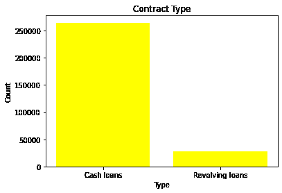

如上图所示，我们看到有两种贷款方式，现金贷款和循环贷款。

*   循环贷款可以定义为:允许借款人借入(在一定限额内)、偿还和再借入贷款的承诺贷款工具。
*   收付实现制贷款是一种在收款时将利息记录为已赚利息的贷款。

我们看到，贷款类型的数量之间存在显著差异。

**汽车**

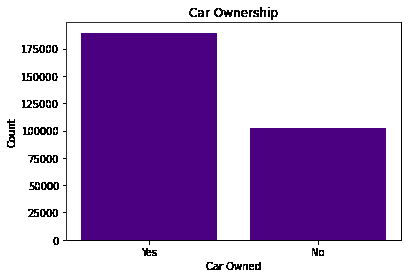

**房地产**

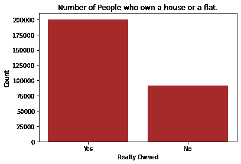

**汽车 Vs 房地产**

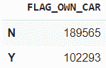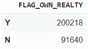

使用上面显示的自有房地产和自有汽车的数据框，我们看到大约 200，000 人拥有房子或公寓，但在这 200，000 人中，只有大约 100，000 人拥有汽车，即只有 50%拥有房子的人也拥有汽车。

**贷款类型**

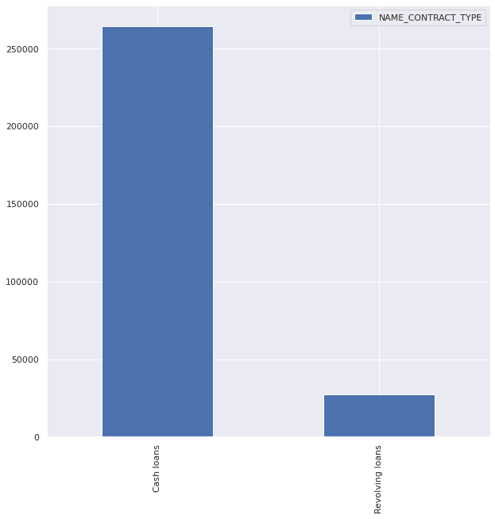

**一个简单的方框图**

上述汇总统计数据可以用两个类别及其特定性别的箱线图更好地显示出来。箱线图还将帮助我们识别数据中可能的异常值。

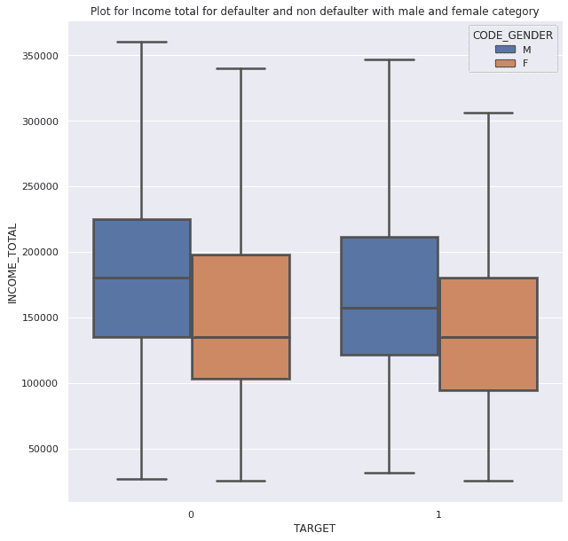

图中未显示违约类别的极端异常值

上图显示 Target=1(违约者)的平均收入较低，为

与非违约者相比，这意味着她们无法偿还贷款，除此之外，还可以看出，女性违约者的两类平均收入都较低。

对于其他类别，我们看到非违约者:

1.  具有较低的地区评级，这意味着违约者生活在评级较高的地区，这意味着那里的生活成本也会较高。
2.  根据汇总统计，子女数的平均值较低，意味着花在其他成员身上的钱较少。

# 高级可视化

在 EDA 的初始部分，我们使用一组简单的图表来查看数据的结构和组成，在下面的部分，我们使用可视化来展示数据集中更有意义的分析和关系。

**按性别分组的目标**

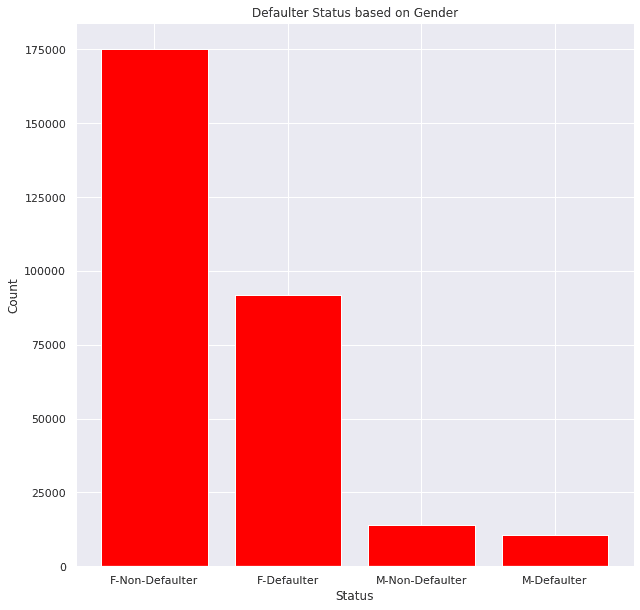

从上图我们可以看出，与男性违规者相比，女性违规者的数量非常大。一个主要原因是原始数据集中女性的数量是男性的两倍，数据集中存在性别不平衡。处理这个问题的一种方法是从数据集中随机选择相同数量的男性和女性，然后对这些数据进行分析。

**基于信用贷款额度的目标**

信用贷款额属性是一个连续的数值变量-为了直观显示计数，我们决定根据属性的平均值拆分数据，现在我们有两个类

1.  贷方金额小于平均贷方金额的数据
2.  贷方金额大于平均贷方金额的数据

分割数据后，我们现在可以绘制两个图。

1.  信用额低于平均信用额的违约者/非违约者
2.  信用额超过平均信用额的违约者/非违约者

less = target CREDIT[target CREDIT[' CREDIT ']< meanAmountCreditLoan]

more = targetCredit[targetCredit[‘CREDIT’] >= meanaumntcreditloan]

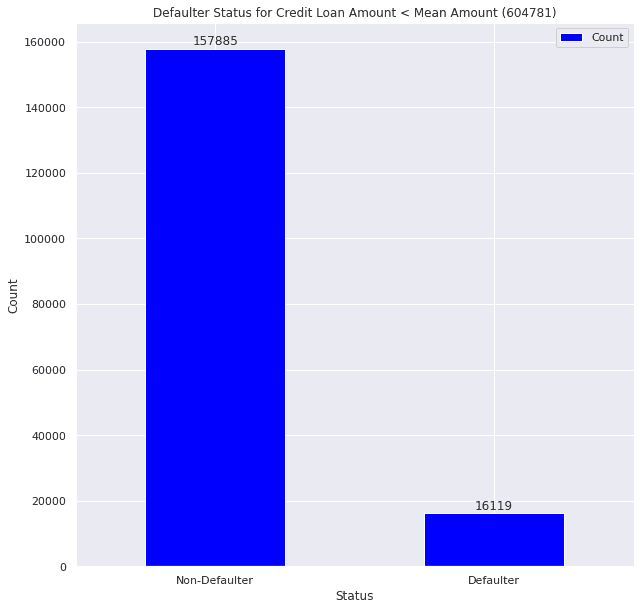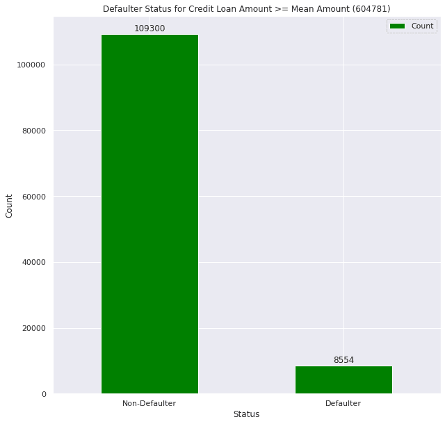

根据信用贷款金额少于或多于平均信用金额，将数据分为两部分。均值只是可以用作执行拆分的支点的指标之一。数据也可以根据模式金额绘制，但是由于信用变量是连续的，而不是离散的，使用模式意味着大量的柱状图。

从以上结果来看:

*   **信用贷款< 604781，违约人数= 16119**
*   **信用贷款> = 604781，#违约者= 8554**

令人惊讶的是，对于较大金额的信用贷款，违约者的数量下降到了小额贷款者的大约一半。然而，仍然不能得出结论，信用贷款越高的人越不容易成为违约者。

**基于职业类型的目标**

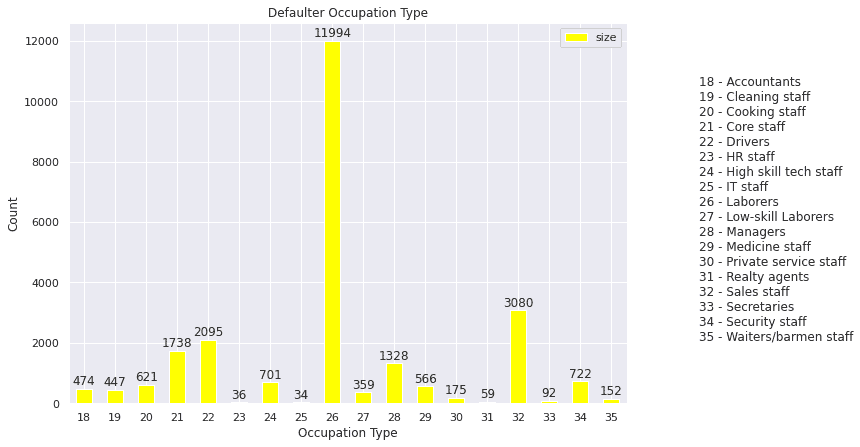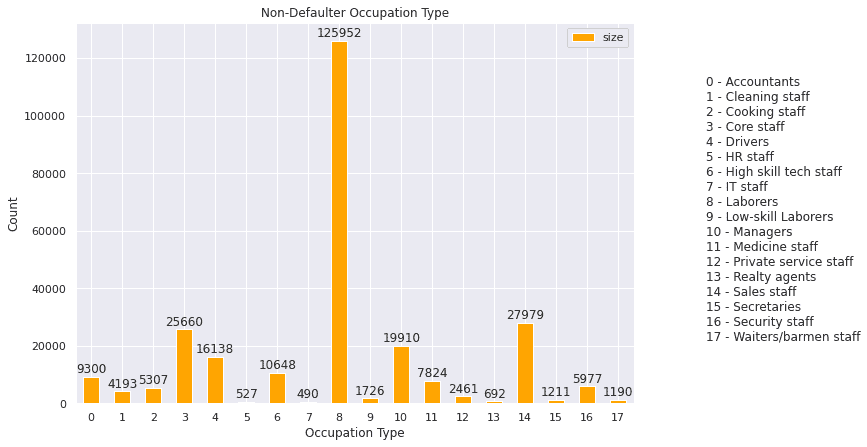

从上图中我们可以看到，劳动者是数据集中最常见的职业类型，IT 人员是最不常见的。因此，在整个数据集中，劳动者的违约与非违约比率最高。劳动者违约率较高的一个原因是，与其他职业相比，他们的收入普遍较低。下面的代码比较了劳动者收入的平均值，然后比较了不包括劳动者的整个数据集的平均值。需要注意的是，整个数据集中没有一个职业是不存在于 defaulters 列表中的。

**按贷款类型分组的目标**

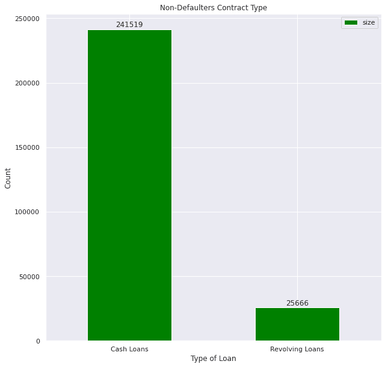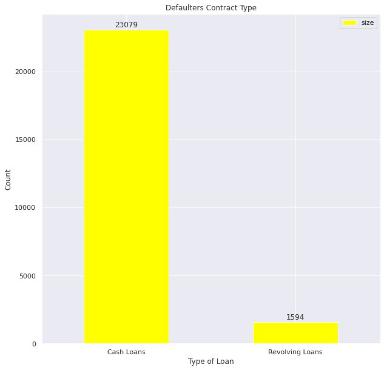

**来自数据:**

*   现金贷款的百分比=**0.9061142973638**
*   循环贷款的百分比=**0.09341585702613621**
*   现金贷款中违约者的百分比=**0.022288150326155**
*   循环贷款违约率=**0.05473954512105**

从上面的数据中我们可以看出，与接受循环贷款的人相比，使用现金贷款的违约者人数更多。值得注意的是，很大一部分用户选择了现金贷款，而不是循环贷款。

# 对分类数据进行编码

# 创建映射

我们创建了映射，将分类字符串变量转换为指定的数字标签。下面显示了其中的一些映射。

map_contract = { '现金贷':0，'循环贷款':1}
map_gender = {'F':0，' M':1}
map_car = {'N': 0，' Y': 1}
map_realty = {'N': 0，' Y': 1}

# 将标签映射到数据上

试试:
复制。名称 _ 合同 _ 类型=副本。NAME _ CONTRACT _ type . map(map _ CONTRACT)
副本。CODE_GENDER = copy。CODE _ gender . map(map _ gender)
复制。FLAG_OWN_CAR = copy。FLAG_OWN_CAR.map(map_car)
复制。FLAG_OWN_REALTY = copy。FLAG _ OWN _ realty . map(map _ realty)
复制。姓名收入类型=副本。NAME _ INCOME _ type . map(map _ INCOME)
副本。EDUCATION_TYPE = copy。【T21 教育地图】复制。FAMILY_STATUS = copy。FAMILY _ status . map(map _ FAMILY _ status)
复制。HOUSING_TYPE = copy。HOUSING _ type . map(map _ HOUSING _ type)
复制。OCCUPATION_TYPE = copy。职业 _ 类型.地图(地图 _ 职业 _ 类型)
副本。组织类型=副本。ORGANIZATION _ type . map(map _ ORGANIZATION _ type)
除:
通过

# 属性依赖性

我们使用卡方检验来评估属性依赖性。其结果如下所示。

对于类别中的类别:
grp 1 = list(copy[category])
grp 2 = list(copy[' CREDIT '])

#假设(H0)是变量之间没有关系
s=[grp1，grp2]
stat，p，dof，expected = chi2 _ contingency(s)

#解释 p 值
alpha = 0.05
print("p 值为"+ str(p))
如果 p<= alpha:
print(' CREDIT 和{}是依赖的(拒绝 H0)'。format(category))
else:
print(' CREDIT 和{}是独立的(H0 成立)'。
格式(类别))【打印(’)

对于类别中的类别:
grp 1 = list(copy[category])
grp 2 = list(copy[' INCOME _ TOTAL '])

#假设(H0)是变量之间没有关系
s=[grp1，grp2]
stat，p，dof，expected = chi2 _ contingency(s)

#解释 p 值
alpha = 0.05
print("p 值为"，p)
if p<= alpha:
print(' INCOME _ TOTAL 和{}是相依的(拒绝 H0)'。format(category))
else:
print(' INCOME _ TOTAL 和{}是独立的(H0 成立)'。
格式(类别))【打印(’)

**卡方检验结果**

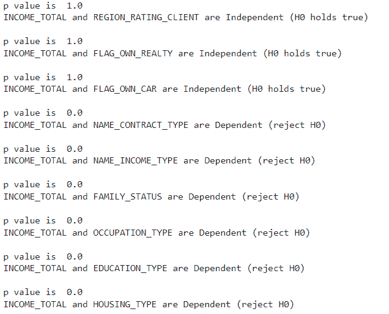

使用卡方检验，我们可以看到属性之间的依赖关系。上述结果表明，如果有一个分类变量和数字变量(总收入，信贷)之间的依赖关系。因为我们得到的大多数属性的 p 值非常小，甚至小于 0.05，这表明这些属性是相关的(拒绝零假设，因为零假设是属性之间没有关系)。

# 相关和协方差矩阵

corr = df.corr()

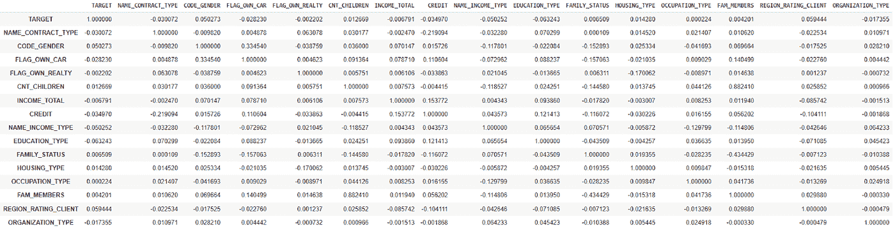

ax = sns.heatmap(corr，annot=True，cmap="YlGnBu "，linewidths=1)

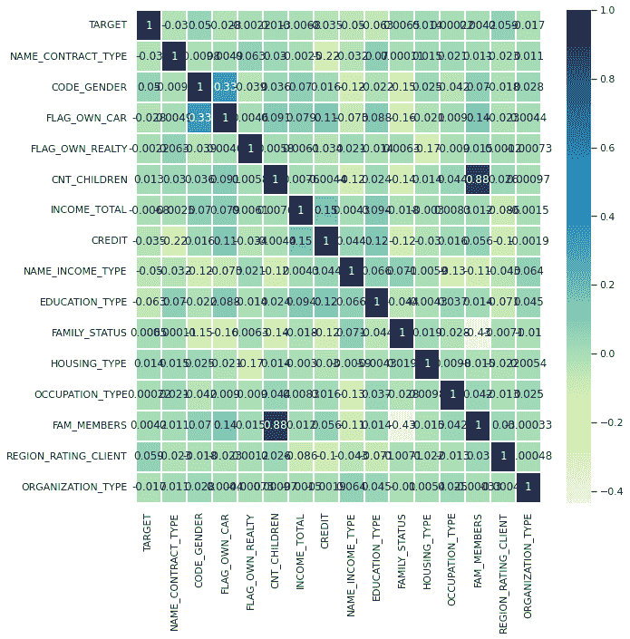

相关矩阵表示受目标变量变化影响的变量，这表明存在相关性，对于变量，

1.  与区域客户评级呈正相关，但相关性较弱，其中，生活在评级较高地区的人违约率较高，这可能是因为费用较高
2.  与孩子数量呈正相关，但相关性较弱，更多的孩子会建议花更多的钱，而不是还贷
3.  与收入总额和信贷负相关，这也表明收入越低，目标变量越低，意味着倾向于违约者。
4.  与教育程度负相关，这意味着受过高等教育的人不会成为违约者。

cov = copy.cov()

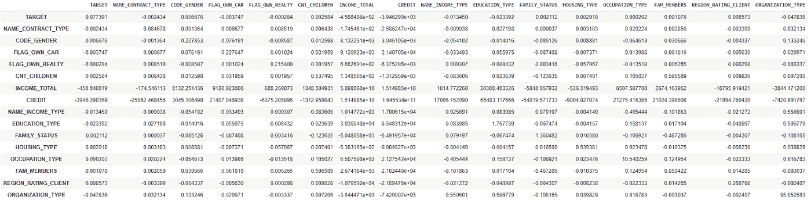

协方差矩阵可用于确定两个变量/属性之间的关系(线性)方向。

1.  如果变量之间有直接关系，它们要么一起减少，要么一起增加。它们的系数也将是正的。
2.  如果它们之间的关系是相反的，即一个变量减少，另一个变量增加，那么系数将是负的。

从上面的协方差矩阵可以看出，表中的每个点都是其中两个属性(xi，xj)之间关系的系数。如果该值为正，则存在正相关。如果两个属性都趋向于一起减少，则系数为负。

# 频繁模式挖掘

“Mining” patterns from the data

# 特征选择和工程

从第一阶段的结果中，我们看到并非所有的变量都与目标变量有很强的相关性。关系的强度可以被定义为强、弱或不存在。为了处理与目标变量相关性很弱或没有相关性的变量，我们可以删除一些我们认为对目标变量没有任何影响的列，这是基于我们对数据集的探索性数据分析的结果。

然而，由于我们在数据集中寻找频繁模式，我们最终可能会丢失有意义的数据，因为虽然属性可能明显与目标变量无关，但其中一些属性可能会一起工作，与目标变量有某种关系。

# 编码数字数据

为了运行频繁模式分析算法，如 FP Growth 和 Apriori，我们需要删除连续的数值变量，因为它们不能构成频繁项目集的一部分。

从我们的数据集中，数值连续的属性是**收入 _ 总额**和**信用**。我们可以使用下面的代码选择删除数字列:

copy.drop(['INCOME_TOTAL '，' CREDIT']，axis=1，inplace=True)

另一种方法是对它们进行编码。我们的数据中有两列是数值型连续变量。为了将这些列输入到数据中，我们需要对它们进行编码。对连续变量的所有值进行编码几乎是不可能的。这个难题的解决方案可以是使用集中趋势值，例如属性的平均值，即将低于平均值的值指定为 0，将高于平均值的值指定为 1。

meanIncomeTotal = copy[' INCOME _ TOTAL ']。mean()
copy['收入 _ 总计'] = copy['收入 _ 总计']。apply(lambda x:0 if x<meanIncomeTotal else 1)
mean CREDIT = copy[' CREDIT ']。mean()
copy[' CREDIT ']= copy[' CREDIT ']。应用(λx:0，如果 x <表示信用，否则为 1)

# 一个热编码

对于要通过 FPA 算法运行的数据集，我们需要对数据进行编码。

对于编码，我们使用一次性编码。[https://sci kit-learn . org/stable/modules/generated/sk learn . preprocessing . onehotencoder . html](https://scikit-learn.org/stable/modules/generated/sklearn.preprocessing.OneHotEncoder.html)

encoder = OneHotEncoder(handle _ unknown = ' ignore ')
encode = PD。data frame(encoder . fit _ transform(copy))。toarray())
encode . columns = encoder . get _ feature _ names _ out()

# FP 增长算法实现

**算法的选择**

为了进行频繁模式分析，我们选择运行 FP 增长算法，因为与其他算法相比，它更快、更有效，它不需要像 Apriori 算法那样生成候选项，并且由于数据量很大，它会在运行时使笔记本崩溃，因此使算法变得无用。

分离违约者和非违约者数据

defaulters _ df = encode[encode[' TARGET _ 1 ']= = 1]
非 defaulters _ df = encode[encode[' TARGET _ 0 ']= = 1]

运行 FP 增长算法

FP growth _ defaulters = FP growth(defaulters _ df，min_support = 0.2，use_colnames=True)

FP growth _ non defaulter = FP growth(non defaulters _ df，min_support = 0.2，use_colnames=True)

将项集列的长度追加到结果中

FP growth _ defaulters[' Length ']= FP growth _ defaulters[' items ets ']。apply(lambda x:len(x))
FP growth _ non defaulters[' Length ']= FP growth _ non defaulters[' items ets ']。应用(λx:len(x))

# 频繁模式挖掘的结果

Fp Growth 算法给出的结果进一步证实了我们之前阶段的发现，支持计数为 0.2，可以为我们的目标获得有意义的频繁项集对，Target_0 表示此人不是违约者，而 Targer_1 表示此人是违约者。

**违约者:**

为我们的违约者挖掘的频繁项目使我们获得洞察力，这有助于在某些人要求贷款时对他们进行分类，银行可以使用的指针可以从挖掘的频繁项目中获得。

' CNT_CHILDREN_0 '，' FAMILY_STATUS_0 '，' NAME_CONTRACT_TYPE_0 '，' TARGET_1 '，' EDUCATION_TYPE_1 '，' FAM_MEMBERS_2.0 '，' HOUSING_TYPE_0'}

我们对最长项目集的研究结果表明，受教育水平低、租赁住房条件差、家庭成员少的人，会选择现金贷款，而不是循环贷款。

关联规则进一步确认了我们与违约者' NAME_CONTRACT_TYPE_0': **现金贷**' TARGET _ 1]:**违约者，**的关联。该规则暗示了这样一个事实，即一个人接受现金贷将最有可能导致其成为违约者，这是一个强规则，置信度值为 1。

**非违约方:**

挖掘出的非默认项的频繁模式向我们展示了项目集中存在的一些不同的项目

{'CNT_CHILDREN_0 '，' FAMILY_STATUS_0 '，' REGION_RATING_CLIENT_2 '，' NAME_CONTRACT_TYPE_0 '，' TARGET_0 '，' FAM_MEMBERS_2.0 '，' HOUSING_TYPE_0'}

我们看到，对于高支持度、最长长度的项目，教育水平更高，更好的地区评级意味着人们生活在更好的地区以及一个体面的家庭。

非违约者关联规则显示，有现金贷，靠租金生活的人都是非违约者。

两种挖掘模式都表明，银行可以询问一些独特的特征，包括他们的住房类型、他们的地区评级、教育水平和他们希望寻求的合同，某些选择一起可以指出该人是否可能是潜在的违约者，并且可以进行更多的审查以确保违约者在满足特定标准之前不会获得贷款。

# 关联规则

association _ rules(FP growth _ defaulters，metric="confidence "，min_threshold=0.7)

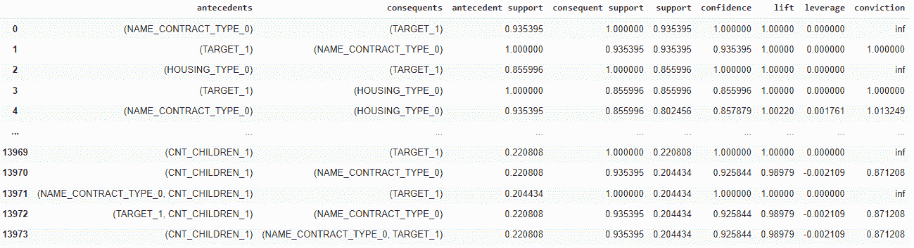

association _ rules(FP growth _ non defaulters，metric="confidence "，min_threshold=0.7)

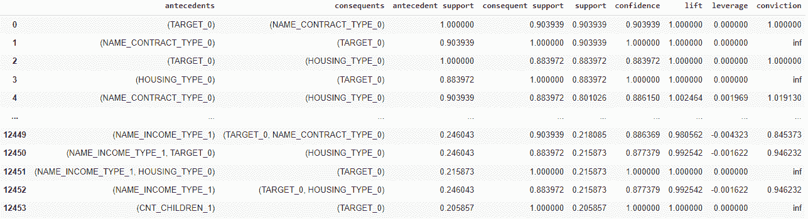

# 前因后果

关联规则有两个部分:

1.  **先行词(if)**
2.  **一个顺向(then)**

前提是在数据中找到的项目。

结果项是与先行项结合在一起的项。

1.  **支持**告诉我们项目彼此同时出现的次数
2.  **置信度**表示规则出现的次数
3.  **电梯**告诉我们这种联系的力量

基于上述指标，我们可以选择保留哪些规则，丢弃哪些规则。然后，可以使用规则来分析哪些特征在被发现为违约者的人中更普遍，并且基于该数据，我们可以将数据分类为违约者/非违约者。支持度和置信度等其他指标也可用于测试这些关联的强度。

使用这些关联规则集，我们可以确定，例如，如果一个人被发现对于 attribute_x 是阳性的，那么他们被发现被识别为违约者。

# 使聚集

Clusters in Data

# 肘法

肘方法是一种启发式方法，用于确定数据集中的聚类数。我们使用这种技术来确定聚类分析的最佳聚类数

**绘制针对 WCSS 的集群数量**

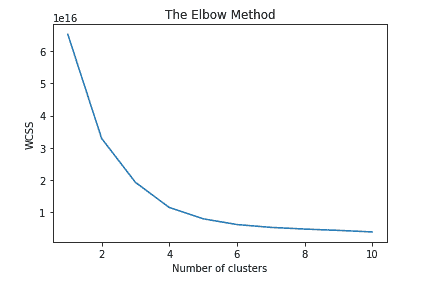

最佳聚类数为 4。

# k 均值聚类

**归一化和拟合数据值**

设置 n_clusters=4，此时聚类的最优值为 4。

kmeans = KMeans(n_clusters=4，init = ' k-means++ ')
#使用规格化器规格化数据值
规格化器=规格化器()
pipeline = make_pipeline(规格化器，k means)
pipeline . fit(X)
#为每个数据值分配的聚类
clusters = pipeline.predict(X)

**获取属于特定聚类的数据值:**

points 1 = NP . array([X[j]for j in range(len(X))if clusters[j]= = 1])
df1 = PD。DataFrame(points1，columns=my_df.columns)
pd。DataFrame(df1['TARGET']。value_counts())

**属于聚类 0 的数据值:**

**属于聚类 1 的数据值:**

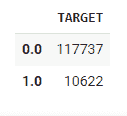

**属于聚类 2 的数据值:**

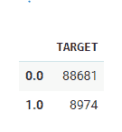

**属于聚类 3 的数据值:**

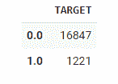

# 聚类的结果:

正如我们所知，使用 k 均值聚类，我们试图聚类相似类型的观察。因此，从上面的观察中，我们可以看到数据值是如何分布在不同的 4 个集群上的。此外，我们可以观察到，在我们的例子中，大多数值属于第 1 类。属于聚类 1 的人大多是非违约者(0)。

我们使用 k-均值聚类，正如我们所知，在 k-均值聚类中，我们对与质心距离最小的值进行聚类(在每次迭代后更新)。所以我们实际上计算了所有簇的质心的距离，并把它放在最近的簇中。在我们的数据集中，数字变量 INCOME_TOTAL 和 CREDIT 在聚类中起着重要作用。所以，这就是为什么，在每个集群中都有几乎相同的模式。

**第 1 类违约者教育类型和住房类型:**

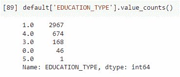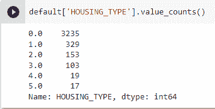

**第二类违约者教育类型和住房类型:**

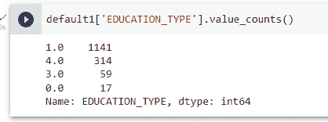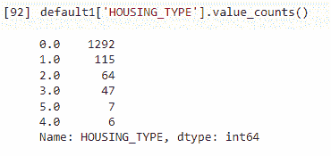

从上述集群中，我们可以看到一个模式，即违约者集群大多教育水平低，住房设施差，如前所述。

# 异常值检测图

# 箱线图

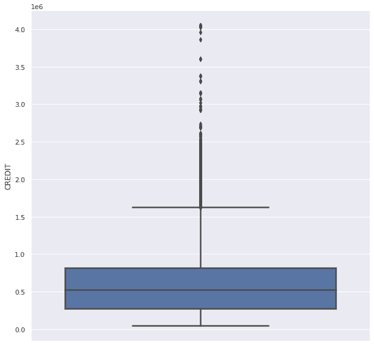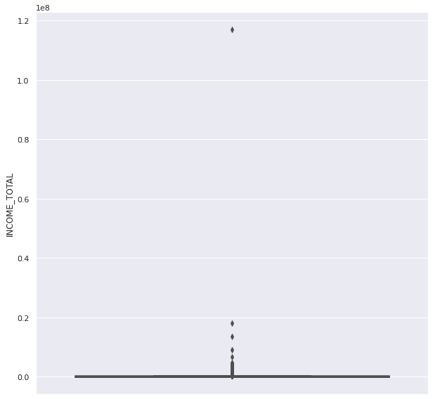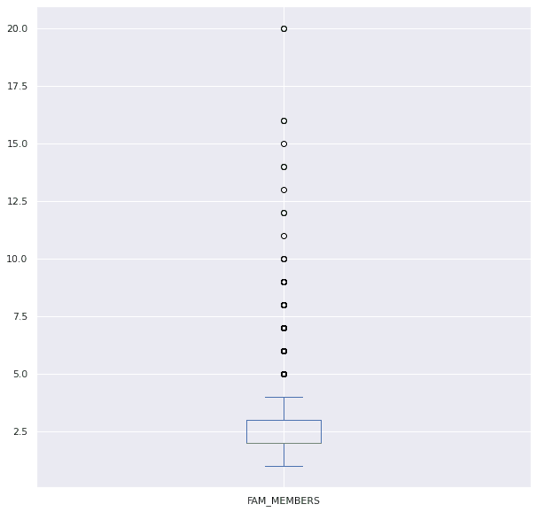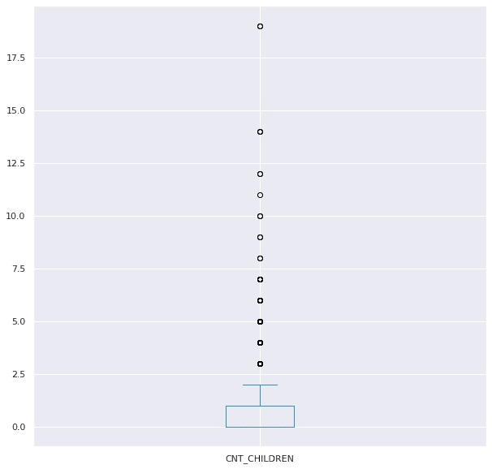

# 散点图

**收入对信贷总额**

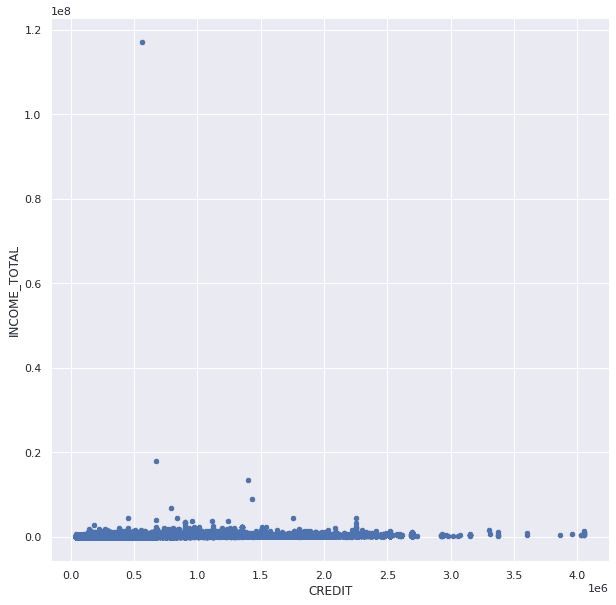

# 丢弃异常值

drop = drop[(NP . ABS(stats . zscore(drop[' INCOME _ TOTAL '])< 3)]
drop = drop[(NP . ABS(stats . zscore(drop[' CREDIT '])<3)]
drop[(NP . ABS(stats . zscore(drop[' FAM _ 成员'])<3)】
drop = drop[(NP . ABS(stats . zscore(drop[' CNT _ CHILDREN ']))<3)]

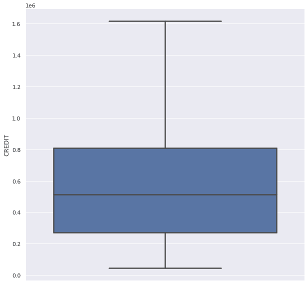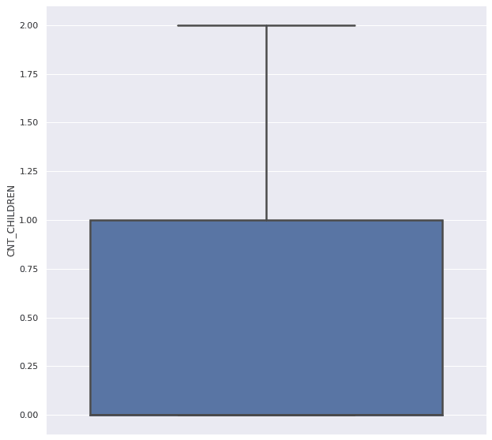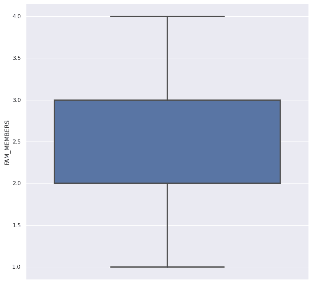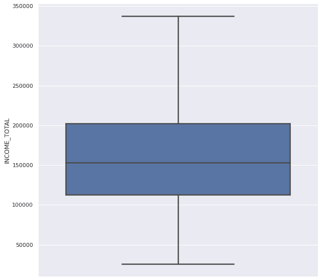

Z 分值超过+/- 3 的任何点都被视为异常值。根据与正态分布曲线相关的经验法则，99.7%的数据位于(平均值+3s.d)和(平均值+3s.d)范围内。由于这个原因，作为一般的经验法则，使用值 3。

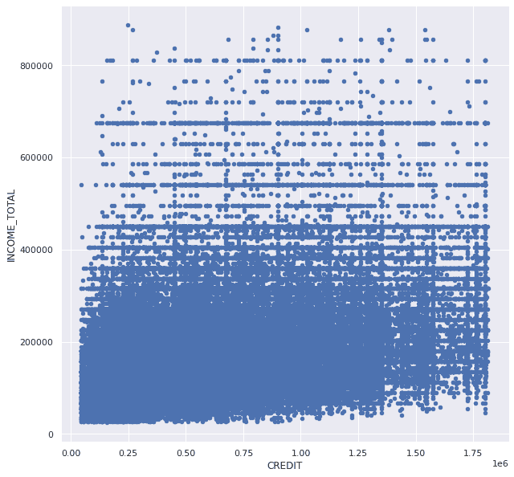

丢弃异常值导致数据集中在一个区域，远离的数据点已被删除。

# 分析

异常值可能会导致数据的正态性降低，因为它们是**而不是**正态分布。它们还会导致估计偏差，并降低算法的统计测试能力和分类/预测能力。它们可能导致在频繁模式分析阶段出现强关联。

异常值可能来自错误的数据输入。它们也可能自然地出现在数据集中，例如，一笔非常非常大的收入基本上存在，因为客户可能正在做多份工作以赚取额外的钱，或者可能正在经营高回报的业务，而不是因为错误的数据输入。在这种情况下，异常值不应该被丢弃，因为它提供了关于数据集的相关信息。这在结果分析过程中可能很重要。

从上面的图表中我们可以看出，与数据的整体规模相比，数据中出现的异常值数量非常低，即 **2，91，858** 。对于如此大的规模，离群值可能对数据的统计几乎没有影响，但是它们仍然会破坏数据的正态性。

从上面的可视化结果来看:在 FAM 成员和 CNT 子变量中存在异常值。同样重要的是要注意，这两个变量是正相关的，正如我们的相关性分析所表明的。大量的孩子意味着更大的家庭规模，因此家庭成员也更多。

*   **属性总数** = 16
*   **分类属性的数量** = 4
*   **数字属性的数量** = 12

75 %的属性本质上是离散的分类属性。对于分类变量，不可能进行异常值分析，也没有任何意义。例如，让我们看一下性别属性，它的值[男性，女性]后来被映射到[0，1]。一个数据点可以作为一个男性或女性的实例存在，在这个集合中不能有任何值的实例被认为是不同于其余的数据集合。绘制分类变量图会给我们不同的区域，并且所有数据点都将位于这个区域内的 T2。因此，异常值分析阶段不适用于这些属性。

# 银行如何利用这些信息保护自己免受违约者的伤害？

Helping banks on cracking down defaulters

银行可以使用上面提供的分析和 FP 增长算法的结果以及关联规则来确定具有哪些普遍属性的人更有可能被视为潜在的违约者。同样，在证明之前，银行不能肯定地认为他们的任何客户是违约者。然而，这些数据可以提供关于哪些特征在违约者中更常见的信息，对于这些人，银行可以启动(更严格的)筛选过程。

银行可以将参数更改为他们想要的严格程度，然后再次运行频繁模式挖掘算法，并设置他们自己的截止值。之后，客户被分配到一个集群，这将有助于银行识别相关客户是潜在违约者还是非违约者。

银行需要有所保留地使用上述方法。

更好的方法是收集尽可能多的可以处理的数据，并在此基础上运行我们的模型，然后评估模型的准确性。

即使以上数据中的异常值也不意味着这个人可能是一个违约者，例如，拥有一个大家庭或六位数的年收入等是完全正常的。

根据我们掌握的信息，最大限度地减少银行损失的一种方法是，为那些更有可能违约的人设定贷款金额的最高限额。

在发放贷款之前，银行应该明确考虑各种属性，如教育、地区评级、房地产等。基于此，他们可以采取预防措施，然后发放贷款。比如说。如果有人拥有房子，银行可以根据他们的马所有权文件发放贷款。

现在，银行绝对不能将每个人视为一个个体，然后决定是否应该给这个人贷款，以节省时间。我们可以进一步检查 FPA 返回的数据，看看哪些特征在违约者中普遍存在。当一个具有违约者特定特征的人来到银行时，银行可以进行更彻底的筛选。

除此之外，随着银行数据的持续增长，我们建议的方法返回的结果将变得越来越准确，但带有轻微的不确定性。我们也许永远无法说我们的模型或预测是 100%准确的，但是这些建议肯定会帮助银行通过识别一些可能的违约者来减少损失。

# 参考

1.  [https://blog . eduonix . com/bigdata-and-Hadoop/importance-explorative-data-analysis-ml-modeling/#:~:text = explorative % 20 data % 20 analysis % 20(EDA)% 20 is，test % 20 hypothesis % 2C % 20 and % 20 verify % 20 assumptions](https://blog.eduonix.com/bigdata-and-hadoop/importance-exploratory-data-analysis-ml-modelling/#:~:text=Exploratory%20Data%20Analysis%20(EDA)%20is,test%20hypotheses%2C%20and%20verify%20assumptions)。
2.  【https://en.wikipedia.org/wiki/Data_pre-processing 
3.  [https://www . analyticsvidhya . com/blog/2021/10/handling-Missing-value/#:~:text = Types % 20 of % 20 Missing % 20 values，Missing % 20 not % 20 at % 20 random % 20(MNAR)](https://www.analyticsvidhya.com/blog/2021/10/handling-missing-value/#:~:text=Types%20Of%20Missing%20Values,Missing%20Not%20At%20Random%20(MNAR))

 [## Mlearning.ai 提交建议

### 如何成为 Mlearning.ai 上的作家

medium.com](/mlearning-ai/mlearning-ai-submission-suggestions-b51e2b130bfb)