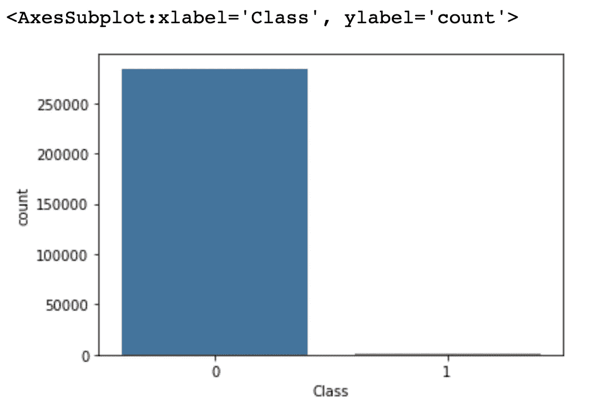
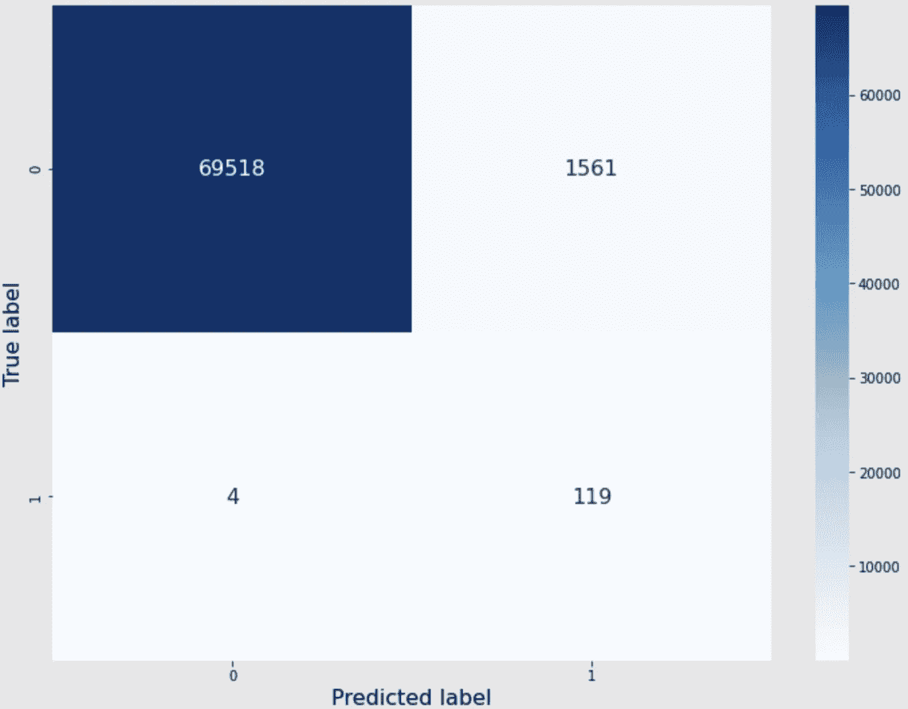
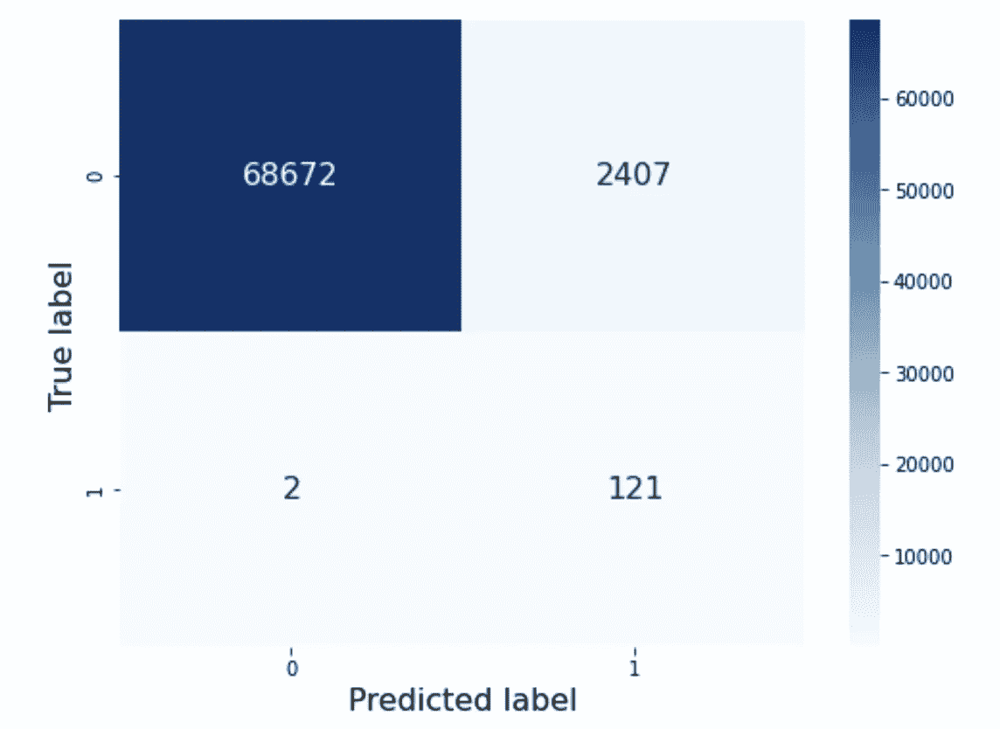

# 信用卡欺诈检测

> 原文：<https://medium.com/mlearning-ai/credit-card-fraud-detection-d7bf2818ec0c?source=collection_archive---------4----------------------->

这篇文章是关于我在 Kaggle 不平衡数据集上的实践——信用卡欺诈检测。

## 导入包

```
import pandas as pd
import seaborn as sns
import matplotlib.pyplot as pltfrom sklearn.preprocessing import RobustScalerfrom sklearn.model_selection import StratifiedKFold
from sklearn.model_selection import GridSearchCVfrom sklearn.linear_model import LogisticRegressionfrom imblearn.under_sampling import NearMiss
from imblearn.under_sampling import RandomUnderSamplerfrom imblearn.over_sampling import SMOTEfrom sklearn.metrics import confusion_matrix, classification_report, roc_auc_score
```

# 简单 EDA

## 输入数据

```
all_data = pd.read_csv(‘creditcard.csv’)
all_data.shape
```

*输出*

```
(284807, 31)
```

## 检查柱子

```
all_data.columns
```

*输出*

```
Index(['Time', 'V1', 'V2', 'V3', 'V4', 'V5', 'V6', 'V7', 'V8', 'V9', 'V10','V11', 'V12', 'V13', 'V14', 'V15', 'V16', 'V17', 'V18', 'V19', 'V20','V21', 'V22', 'V23', 'V24', 'V25', 'V26', 'V27', 'V28', 'Amount','Class'], dtype='object')
```

总共有 31 个特征。

*   时间:该事务与数据集中第一个事务之间经过的秒数
*   V1～v 28:主成分分析降维的结果
*   金额:交易金额
*   类别:交易的标签。1 表示欺诈交易，否则为 0

并且该数据集中没有缺失数据。

## 检查每个标签的数据编号

```
sns.countplot(x=’Class’, data=all_data)
```

*输出*



非欺诈交易 284315 笔，欺诈交易 492 笔。显然，这个数据集真的很不平衡。

```
non_fraud_num, fraud_num = all_data[‘Class’].value_counts()print(‘Non-fraud ratio: {} %’.format(round(non_fraud_num/all_data.shape[0]*100, 2)))
print(‘Fraud ratio: {} %’.format(round(fraud_num/all_data.shape[0]*100, 2)))
```

*输出*

```
Non-fraud ratio: 99.83 %
Fraud ratio: 0.17 %
```

# 拆分数据集(培训和测试)

我将数据分成训练集和测试集，它们的标签分布与原始数据集相同。训练集的规模是测试集的三倍。

```
X, y = all_data.iloc[:, 0:-1], all_data.iloc[:, -1]orig_x_train, orig_y_train, orig_x_test, orig_y_test = pd.DataFrame(), pd.DataFrame(), pd.DataFrame(), pd.DataFrame()
orig_train_idx, orig_test_idx = [], []skf = StratifiedKFold(n_splits=4)
for train_idx, test_idx in skf.split(X, y): 
   orig_x_train, orig_y_train = X.iloc[train_idx], y.iloc[train_idx]
   orig_x_test, orig_y_test = X.iloc[test_idx], y.iloc[test_idx]
   orig_train_idx, orig_test_idx = train_idx, test_idx
   break

train_non_fraud_num, train_fraud_num = orig_y_train.value_counts()
test_non_fraud_num, test_fraud_num = orig_y_test.value_counts()print('Training set non-fraud ratio: {:.2f} %'.format(train_non_fraud_num/len(train_idx)*100))
print('Training set fraud ratio: {:.2f} %'.format(train_fraud_num/len(train_idx)*100))
print('Testing set non-fraud ratio: {:.2f} %'.format(test_non_fraud_num/len(test_idx)*100))
print('Testing set fraud ratio: {:.2f} %'.format(test_fraud_num/len(test_idx)*100))
```

*输出*

```
Training set non-fraud ratio: 99.83 %
Training set fraud ratio: 0.17 %
Testing set non-fraud ratio: 99.83 %
Testing set fraud ratio: 0.17 %
```

# 特征缩放

这里我缩放了`Time`和`Account`的特征。我首先在训练集上安装了定标器，并用它来转换测试集，以防止**数据泄露**。

```
orig_x_train_deep = orig_x_train.copy(deep=True)
orig_x_test_deep = orig_x_test.copy(deep=True)time_transformer = RobustScaler()
orig_x_train_deep =         orig_x_train_deep.assign(Scaled_time=time_transformer.fit_transform(orig_x_train_deep[‘Time’].values.reshape(-1,1)))
orig_x_test_deep = orig_x_test_deep.assign(Scaled_time=time_transformer.transform(orig_x_test_deep[‘Time’].values.reshape(-1,1)))amount_transformer = RobustScaler()
orig_x_train_deep = orig_x_train_deep.assign(Scaled_amount=amount_transformer.fit_transform(orig_x_train_deep[‘Amount’].values.reshape(-1,1)))
orig_x_test_deep = orig_x_test_deep.assign(Scaled_amount=amount_transformer.transform(orig_x_test_deep[‘Amount’].values.reshape(-1,1)))orig_x_train_deep.drop(['Time', 'Amount'], axis=1, inplace=True)
orig_x_test_deep.drop(['Time', 'Amount'], axis=1, inplace=True)
```

# 逻辑回归

```
# Logistic Regression 
orig_log_reg = LogisticRegression(max_iter=1000)
orig_log_reg.fit(orig_x_train_deep.values, orig_y_train.values.ravel())# Prediction
orig_y_pred = orig_log_reg.predict(orig_x_test_deep)
print('Classification report: \n\n', classification_report(orig_y_test, orig_y_pred))# Calculate AUROC
print('AUROC: ', roc_auc_score(orig_y_test, orig_y_pred))
```

*输出*

```
Classification report: 

               precision    recall  f1-score   support

           0       1.00      1.00      1.00     71079
           1       0.74      0.85      0.79       123

    accuracy                           1.00     71202
   macro avg       0.87      0.93      0.90     71202
weighted avg       1.00      1.00      1.00     71202

AUROC:  0.9265689945128041
```

这里我选择欺诈类的**召回**和 **AUROC** 作为好模型的指标。

*   回忆:检测类的能力。(TP/(TP+FN))
*   AUROC:ROC 曲线下的面积，表示模型区分类别的程度。理想值是 1。

> 在这种情况下，使用准确性作为好模型的指标并不是一个好的选择，因为存在大量的非欺诈案例和少量的欺诈案例。比方说，如果一个模型预测数据集中的所有案例都是非欺诈性的，它将获得很高的准确性分数，但实际上它什么也没学到。

logistic 回归模型有 0.85 的召回率和 0.92 的 AUROC，不错。但是我们可以做得更好。

# 带类别权重的逻辑回归

默认的逻辑回归对每个类使用相同的惩罚权重。然而，对于不平衡数据集，欺诈类的错误分类比非欺诈类的错误分类代价更大。

因此，让我们调整两个职业的惩罚。

```
# Logistic Regression 
w = {0:1, 1:99}
weighted_log_reg = LogisticRegression(max_iter=1000, class_weight=w)
weighted_log_reg.fit(orig_x_train_deep.values, orig_y_train.values.ravel())# Prediction
weighted_y_pred = weighted_log_reg.predict(orig_x_test_deep)
print('Classification report: \n\n', classification_report(orig_y_test, weighted_y_pred))# Calculate AUROC
print('AUROC: ', roc_auc_score(orig_y_test, weighted_y_pred))
```

*输出*

```
Classification report: 

               precision    recall  f1-score   support

           0       1.00      0.99      0.99     71079
           1       0.10      0.88      0.18       123

    accuracy                           0.99     71202
   macro avg       0.55      0.93      0.58     71202
weighted avg       1.00      0.99      0.99     71202

AUROC:  0.9320251358931095
```

我们得到了更好的召回率和 AUROC，分别是 0.88 和 0.932。

不够，上面的重量是我的猜测。让我们试试其他重量组合。

```
w = [{0:25, 1:9975}, {0:2.5, 1:997.5}, {0:0.25, 1:99.75}, {0:0.025, 1:9.975}, {0:0.0025, 1:0.9975}, {0:0.00025, 1:0.09975},
 {0:20, 1:9980}, {0:2.0, 1:999.0}, {0:0.2, 1:99.8}, {0:0.02, 1:9.98}, {0:0.002, 1:0.998}, {0:0.0002, 1:0.0998},
 {0:17, 1:9983}, {0:1.7, 1:998.3}, {0:0.17, 1:99.83}, {0:0.017, 1:9.983}, {0:0.0017, 1:0.9983}, {0:0.00017, 1:0.09983},
 {0:10, 1:9990}, {0:1, 1:999}, {0:0.1, 1:99.9}, {0:0.01, 1:9.99}, {0:0.001, 1:0.999}, {0:0.0001, 1:0.0999},
 {0:100, 1:9900}, {0:10, 1:990}, {0:1, 1:99}, {0:0.1, 1:9.9}, {0:0.01, 1:0.99}]log_reg_params = {‘class_weight’: w}# Logistic Regression with grid search 
grid_weighted_log_reg = GridSearchCV(LogisticRegression(max_iter=1000), log_reg_params, scoring=’roc_auc’)
grid_weighted_log_reg.fit(orig_x_train_deep.values, orig_y_train.values.ravel())# Best hyperparameters
best_hyperparams = grid_weighted_log_reg.best_params_
print(‘Best hyperparameters: ‘, best_hyperparams)
best_weighted_log_reg = grid_weighted_log_reg.best_estimator_# Prediction
best_weighted_y_pred = best_weighted_log_reg.predict(orig_x_test_deep)
print(‘Classification report: \n\n’, classification_report(orig_y_test, best_weighted_y_pred))# Calculate AUROC
print(‘AUROC: ‘, roc_auc_score(orig_y_test, best_weighted_y_pred))
```

*输出*

```
Best hyperparameters:  {'class_weight': {0: 0.00025, 1: 0.09975}}
Classification report: 

               precision    recall  f1-score   support

           0       1.00      0.98      0.99     71079
           1       0.07      0.97      0.13       123

    accuracy                           0.98     71202
   macro avg       0.54      0.97      0.56     71202
weighted avg       1.00      0.98      0.99     71202

AUROC:  0.9727590976580851
```

现在召回和 AUROC 看起来很棒。我们来参考一下混淆矩阵的可视化。

```
cfs_mat = confusion_matrix(orig_y_test, best_weighted_y_pred)
fig, ax = plt.subplots(figsize=(12,9)) 
sns.heatmap(pd.DataFrame(cfs_mat), cmap=”Blues”, annot=True, fmt=’d’, ax=ax, annot_kws={“fontsize”:16})
ax.set_xlabel(‘Predicted label’, fontsize = 16)
ax.set_ylabel(‘True label’, fontsize = 16)
```

*输出*



我们的模型识别出 125 个欺诈案例中的 119 个！太棒了。

在这里我也尝试了一些常用的数据抽样方法，如逻辑回归中的`RandomUnderSampler`、`NearMiss`、`SMOTE`。

## 随机欠采样器

```
rus = RandomUnderSampler(random_state=42)
rus_X, rus_y = rus.fit_sample(orig_x_train, orig_y_train)rus_y.value_counts()
```

*输出*

```
0    369
1    369
Name: Class, dtype: int64
```

为了使数据集更加平衡，`RandomUnderSampler`随机选择非欺诈案例，其数量与欺诈案例相同。

```
# Feature scaling
time_transformer = RobustScaler()
rus_X = rus_X.assign(Scaled_time=time_transformer.fit_transform(rus_X[‘Time’].values.reshape(-1,1)))
rus_X_test = orig_x_test.assign(Scaled_time=time_transformer.transform(orig_x_test[‘Time’].values.reshape(-1,1)))amount_transformer = RobustScaler()
rus_X = rus_X.assign(Scaled_amount=amount_transformer.fit_transform(rus_X[‘Amount’].values.reshape(-1,1)))
rus_X_test = rus_X_test.assign(Scaled_amount=amount_transformer.transform(rus_X_test[‘Amount’].values.reshape(-1,1)))rus_X.drop([‘Time’, ‘Amount’], axis=1, inplace=True)
rus_X_test.drop([‘Time’, ‘Amount’], axis=1, inplace=True)# Logistic Regression
rus_log_reg = LogisticRegression(max_iter=1000)
rus_log_reg.fit(rus_X.values, rus_y.values)# Prediction
rus_y_pred = rus_log_reg.predict(rus_X_test)
print(‘Classification report: \n\n’, classification_report(orig_y_test, rus_y_pred))# Calculate AUROC
print(‘AUROC: ‘,roc_auc_score(orig_y_test, rus_y_pred))
```

*输出*

```
Classification report: 

               precision    recall  f1-score   support

           0       1.00      0.92      0.96     71079
           1       0.02      0.90      0.04       123

    accuracy                           0.92     71202
   macro avg       0.51      0.91      0.50     71202
weighted avg       1.00      0.92      0.96     71202

AUROC:  0.9107363877842551
```

## `NearMiss (undersampling)`

```
nm_X, nm_y = NearMiss().fit_sample(orig_x_train, orig_y_train)nm_y.value_counts()
```

*输出*

```
0    369
1    369
Name: Class, dtype: int64
```

这两个类的大小与`RandomUnderSampler`相同，但是 NearMiss 使用不同的策略来选择非欺诈案例。

```
# Feature scaling
time_transformer = RobustScaler()
nm_X = nm_X.assign(Scaled_time=time_transformer.fit_transform(nm_X[‘Time’].values.reshape(-1,1)))
nm_x_test = orig_x_test.assign(Scaled_time=time_transformer.transform(orig_x_test[‘Time’].values.reshape(-1,1)))amount_transformer = RobustScaler()
nm_X = nm_X.assign(Scaled_amount=amount_transformer.fit_transform(nm_X[‘Amount’].values.reshape(-1,1)))
nm_x_test = nm_x_test.assign(Scaled_amount=amount_transformer.transform(nm_x_test[‘Amount’].values.reshape(-1,1)))nm_X.drop([‘Time’, ‘Amount’], axis=1, inplace=True)
nm_x_test.drop([‘Time’, ‘Amount’], axis=1, inplace=True)# Logistic Regression
nm_log_reg = LogisticRegression(max_iter=1000)
nm_log_reg.fit(nm_X.values, nm_y.values)# Prediction
nm_y_pred = nm_log_reg.predict(nm_x_test)
print(‘Classification report: \n\n’, classification_report(orig_y_test, nm_y_pred))# Calculate AUROC
print(‘AUROC: ‘,roc_auc_score(orig_y_test, nm_y_pred))
```

*输出*

```
Classification report: 

               precision    recall  f1-score   support

           0       1.00      0.49      0.66     71079
           1       0.00      0.94      0.01       123

    accuracy                           0.49     71202
   macro avg       0.50      0.72      0.33     71202
weighted avg       1.00      0.49      0.66     71202

AUROC:  0.7177637112124298
```

## SMOTE(过采样)

```
smt_X, smt_y = SMOTE().fit_sample(orig_x_train, orig_y_train)smt_y.value_counts()
```

*输出*

```
0    213236
1    213236
Name: Class, dtype: int64
```

SMOTE 不是从非欺诈案例中选择数据，而是自己创建新的欺诈案例。现在两个类的数据数量仍然相同。但是总数据数量变成超过 400，000。

```
# Feature scaling
time_transformer = RobustScaler()
smt_X = smt_X.assign(Scaled_time=time_transformer.fit_transform(smt_X[‘Time’].values.reshape(-1,1)))
smt_x_test = orig_x_test.assign(Scaled_time=time_transformer.transform(orig_x_test[‘Time’].values.reshape(-1,1)))amount_transformer = RobustScaler()
smt_X = smt_X.assign(Scaled_amount=amount_transformer.fit_transform(smt_X[‘Amount’].values.reshape(-1,1)))
smt_x_test = smt_x_test.assign(Scaled_amount=amount_transformer.transform(smt_x_test[‘Amount’].values.reshape(-1,1)))smt_X.drop([‘Time’, ‘Amount’], axis=1, inplace=True)
smt_x_test.drop([‘Time’, ‘Amount’], axis=1, inplace=True)# Logistic Regression
smt_log_reg = LogisticRegression(max_iter=1000)
smt_log_reg.fit(smt_X.values, smt_y.values)# Prediction
smt_y_pred = smt_log_reg.predict(smt_x_test)
print(‘Classification report: \n\n’, classification_report(orig_y_test, smt_y_pred))# Calculate AUROC
print(‘AUROC: ‘, roc_auc_score(orig_y_test, smt_y_pred))
```

*输出*

```
Classification report: 

               precision    recall  f1-score   support

           0       1.00      0.97      0.98     71079
           1       0.05      0.98      0.09       123

    accuracy                           0.97     71202
   macro avg       0.52      0.97      0.54     71202
weighted avg       1.00      0.97      0.98     71202

AUROC:  0.9749380541541034
```

混淆矩阵可视化:

```
cfs_mat = confusion_matrix(orig_y_test, smt_y_pred)
fig, ax = plt.subplots(figsize=(8,6)) 
sns.heatmap(pd.DataFrame(cfs_mat), cmap=”Blues”, annot=True, fmt=’d’, ax=ax, annot_kws={“fontsize”:16})
ax.set_xlabel(‘Predicted label’, fontsize = 16)
ax.set_ylabel(‘True label’, fontsize = 16)
```

*输出*



在三种抽样方法中，SMOTE 的结果最好，略好于带权重调整的 logistic 回归。

## 结论

在本文中，我使用了两种方法来处理不平衡数据集。一个是权重调整，另一个是数据欠采样/过采样。这两种方法都适用于这种情况。

欢迎任何反馈/讨论！