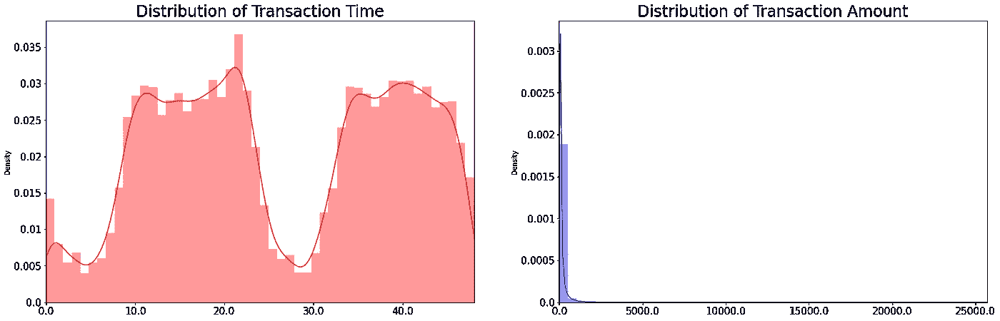
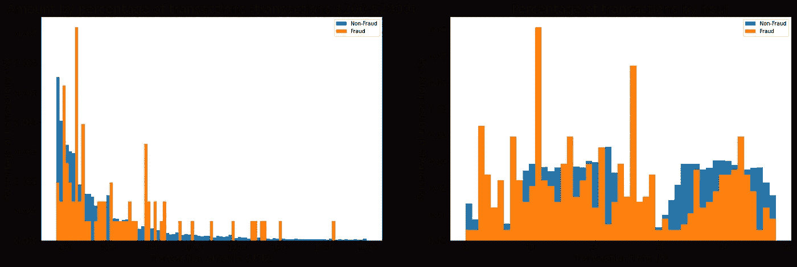
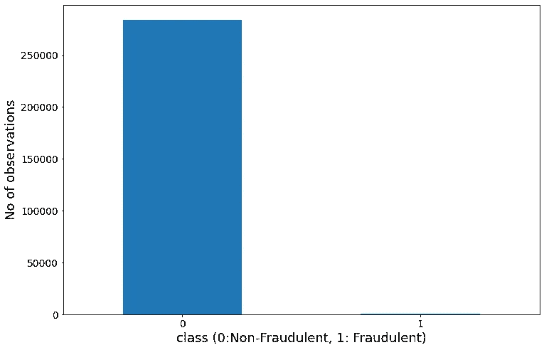
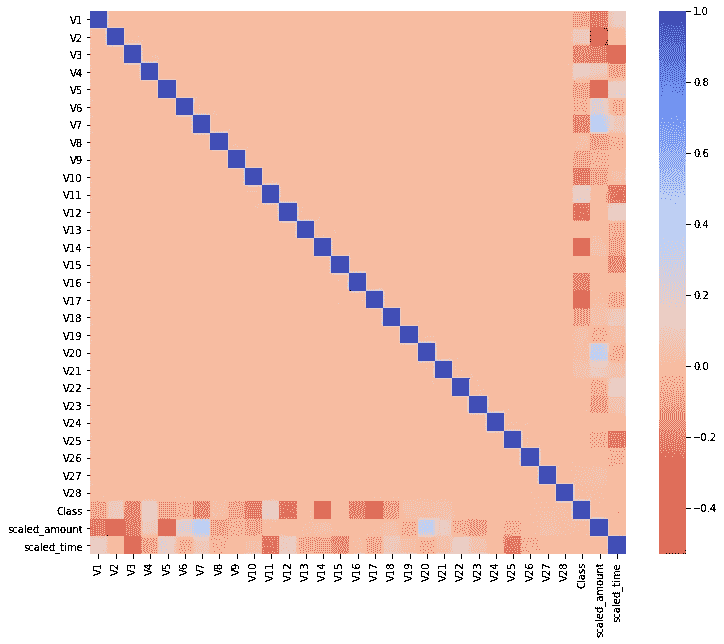
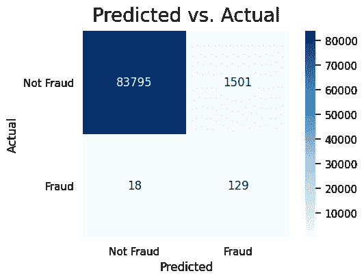
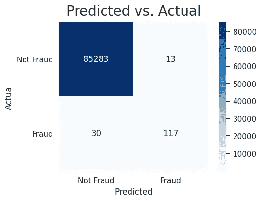
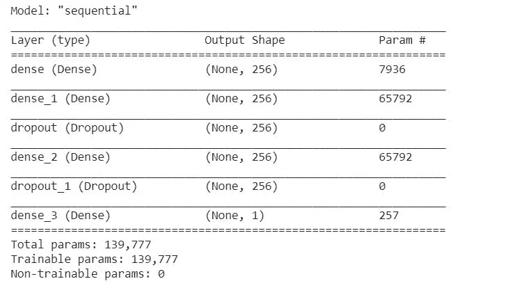
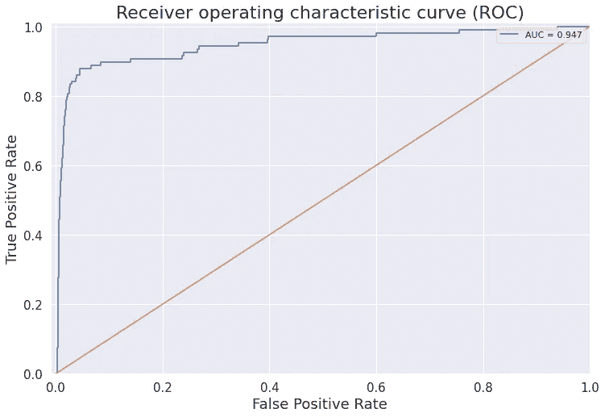

# 使用机器学习的信用卡欺诈检测

> 原文：<https://medium.com/mlearning-ai/credit-card-fraud-detection-using-machine-learning-399e400f0600?source=collection_archive---------3----------------------->

你可以在这里找到完整的代码

Source: [https://giphy.com/gifs/glitch-money-shopping-d3mmdNnW5hkoUxTG](https://www.paymentsjournal.com/credit-card-fraud-stories-cant-make-stuff-up/)

在这个快节奏的数字世界里，我们融入了数字交易社会。预计在未来几年，非现金交易将稳步增长。随着这种数字交易每年不断增加，信用卡欺诈的数量也在不断增加。根据最近的一项研究，仅在 2016 年，美国就有 1540 万人遭遇信用欺诈。

有几种方法可以阻止这些欺诈活动，但我将在这里向您介绍我的机器学习方法。

# **收集数据**

我使用了包含 284807 个事务的 Kaggle 数据集。该数据集显示了两天内发生的交易，其中 284，807 笔交易中有 492 笔欺诈。数据集高度不平衡，正类(欺诈)占所有交易的 0.172%。

# 探索性数据分析

最初，我想探索时间、数量和类数据列

时间以秒为单位记录，数据集包括两天内记录的所有交易。大多数交易发生在白天。绝大多数交易相对较小，只有极小一部分来自甚至接近最大值的交易。大多数日常事务并不是非常昂贵(大多数是

In the long tail, fraud transactions happened more frequently. It seems It would be hard to differentiate fraud from normal transactions by transaction amount alone. Hour “zero” corresponds to the hour the first transaction happened and not necessarily 12–1 am. Given the heavy decrease in normal transactions from hours 1 to 8 and again roughly at hours 24 to 32, it seems fraud tends to occur at higher rates during the night. Statistical tests could be used to give evidence for this fact.

Looking at the class distribution we can see there are only 492 fraudulent transactions. That’s only 0.173% of all of the transactions in this dataset!

# **功能扩展**

正如我们从数据集中了解到的，V1-V28 的特征已经通过 PCA 进行了转换，并且已经进行了缩放。而特征“时间”和“数量”没有。考虑到我们将与其他 V1 v 28 一起分析这两个特征，在我们使用各种算法训练我们的模型之前，它们应该被更好地缩放。我们应该使用哪种缩放方法？不推荐使用**标准定标器**，因为“时间”和“数量”特征不是正态分布的。不推荐使用**最小-最大缩放器**，因为在特征“数量”中有明显的异常值。**稳健定标器**对异常值稳健:**(Xi-Q1(x))/(Q3(x)-Q1(x))**(Q1 和 Q3 分别代表 25%和 75%的四分位数)。所以我们选择**鲁棒缩放器**来缩放这两个特征。

# 相关矩阵

相关矩阵是理解我们数据的本质。我们想知道是否有特征对特定交易是否是欺诈有重大影响。我使用热图来了解数据中是否存在强烈的共线性

# **建筑模型**

在创建任何模型之前，我将数据集分成 70%-30%用于训练和测试。另一个需要解决的问题是高度不平衡的数据集。评价和解决不平衡问题的方法有很多种。合成少数过采样技术(SMOTE)是解决这一问题的过采样方法之一。在 SMOTE 方法的基础上，我使用了 borderline-SMOTE 方法来处理数据集的不平衡。有了这个设置，我现在可以在一些模型中运行数据了。在使用逻辑回归、DecisionTreeClassifier 和 RandomForestClassifier 这三个模型之前，我使用了[管道](/vickdata/a-simple-guide-to-scikit-learn-pipelines-4ac0d974bdcf)方法来简化我的工作流程。

# 三个模型的总结结果:

使用逻辑回归模型，我们在测试数据集中捕获了 147 个欺诈案例中的 129 个，1501 个交易被错误地标记为欺诈。当你在没有确认你的旅行的情况下在州外旅行，并且你在你买东西之后得到一个通知的时候，想想这个假阳性的场景。

Confusion Matrix: Logistic Regression

使用决策树分类器，测试数据集中的 147 个欺诈案例中有 104 个被检测到，但它表现非常好，显示出大约 81 个交易的假阳性较少。

Confusion Matrix: DecisionTreeClassifier

RandomForestClassifier 捕获了 147 个欺诈案例中的 117 个，只有 13 个错误地将正常交易检测为欺诈交易

Confusion Matrix: RandomForestClassifier

# **张量流 Keras 模型**

我用深度学习模型对诈骗案例进行了分类，并与我之前的三个模型进行了对比。

我使用 Relu 激活函数对所有层进行编码，使用 sigmoid 激活函数对输出进行解码。然后用 Adam optimizer 训练 Keras 模型。使用 binary_crossenttropy 作为损失函数，并且在 100 个时期上训练模型，批量大小等于 256。

# **模型评估**

我使用受试者操作特征(ROC)和混淆矩阵来评估模型。ROC 是在各种阈值下对分类问题的性能测量。它本质上是一条概率曲线，曲线下面积(AUC)得分越高，该模型预测欺诈性/非欺诈性交易的能力就越强。

在 85334 个验证交易的训练结束时，我们能够正确识别 82 个欺诈交易，并错过其中的 26 个。我们错误地标记了 1552 个合法交易。

在现实世界中，人们会给第 1 类赋予更高的权重，以反映出假阴性比假阳性的代价更大。下次你的信用卡在网上购物时被拒绝，这就是原因。

# **结论**

信用卡欺诈检测一直是机器学习中的一个重要领域。这主要是由于欺诈模式的不断变化。

有很多方法可以检测你信用卡上的欺诈行为，看到公司如何在日常生活中处理这种情况真的很酷。我们的机器学习模型显示，即使基于高度匿名化数据训练的简单逻辑回归模型也能够预测非欺诈交易。