# Python 中的信用风险建模

> 原文：<https://medium.com/mlearning-ai/credit-risk-modelling-in-python-7b21a0b794b1?source=collection_archive---------0----------------------->


The Source of the image is [here](https://cascadebusnews.com/understanding-credit-risk-management-matters/)

# 什么是信用风险？

信用风险是借款人无法及时还款并拖欠债务的可能性。它是指贷款人可能无法按时获得到期的利息或本金。

金融组织关心的是降低违约风险。因此，商业和投资银行、风险资本基金、资产管理组织和保险公司等越来越依赖技术来预测哪些客户最有可能违约。

# 什么是信用风险建模？

一个人的信用风险受多种因素影响。因此，确定借款人的信用风险是一项艰巨的任务。信用风险建模已经进入场景，因为有这么多的钱依赖于我们的能力，以适当预测借款人的信用风险。

信用风险建模是应用数据模型来确定两个关键因素的实践。首先是借款人拖欠贷款的可能性。第二个因素是如果发生违约，贷款人的财务影响。

金融机构使用信用风险模型来评估潜在借款人的信用风险。

> 对于参与金融系统的公司来说，保持客户的财务健康至关重要。然而，你可能想知道如何保护每个客户的财务健康。要应对这一挑战，需要根据一套标准评估每个客户的支付可能性，并设计策略来预测客户的需求。
> 
> 因此，这项研究的目标是预测特定债务违约的可能性，在本例中是信用卡。这将有助于创建降低客户财务健康恶化风险的解决方案。此外，建议采用聚类技术来定位群体中的同类部分，从而为每个客户提供区别对待，以帮助创建收集策略。

> 将使用以下程序构建模型。

1.数据准备和预处理

2.特征工程和选择

3.模型开发和模型评估


(Source: [https://www.omnisci.com/technical-glossary/feature-engineering)](https://www.omnisci.com/technical-glossary/feature-engineering))

# 关于数据

数据集取自卡格尔[这里](https://www.kaggle.com/uciml/default-of-credit-card-clients-dataset)

本研究以台湾消费者违约付款为例，分析六种资料探勘方法对违约机率的预测准确度。从风险管理的角度来看，预测违约概率的预测准确性结果将比分类的二元结果(可信或不可信客户)更有益。因为违约的真实可能性是未知的，本研究使用了一种新的排序平滑方法来逼近它。反应变量(Y)是真实的违约概率，而自变量是违约的预测机会(X)。

**变量:**

*LIMIT_BAL* :授信额度(新台币):包括个人消费信贷和家庭(补充)信贷。性别:性别(1 =男性；2 =女性)。

*教育*:教育(1 =读研；2 =大学；3 =高中；4 =其他)。

*婚姻*:婚姻状况(1 =已婚；2 =单身；3 = divorse，0=其他)。

*年龄*:年龄(年)。

*PAY0 — PAY6* :过去的支付历史。我们跟踪了过去每月的还款记录(2005 年 4 月至 9 月)如下:pay 0 = 2005 年 9 月的还款情况；pay 1 = 2005 年 8 月的还款状态；。。。；pay 6 = 2005 年 4 月的还款状态。还款状态的衡量尺度为:-2:无消费；-1:全额支付；0:使用循环信贷；1 =延迟一个月付款；2 =付款延迟两个月；。。。；8 =付款延迟八个月；9 =付款延迟 9 个月及以上。

*BILL_AMT1- BILL_AMT6* :账单金额(新台币)。BILL _ AMT1 =年 9 月账单对账单金额；BILL _ AMT2 =年 8 月账单金额；。。。；BILL _ AMT6 =年 4 月账单金额。

*PAY_AMT1-PAY_AMT2* :上次付款金额(新台币)。PAY _ AMT1 =年 9 月支付的金额；PAY _ AMT2 =年 8 月支付的金额；。。。；PAY _ AMNT6 =年 4 月支付的金额。

```
*# Reading the data* 
credit_risk**=** pd**.**read_csv("UCI_credit_card.csv")
credit_risk**.**head()
```

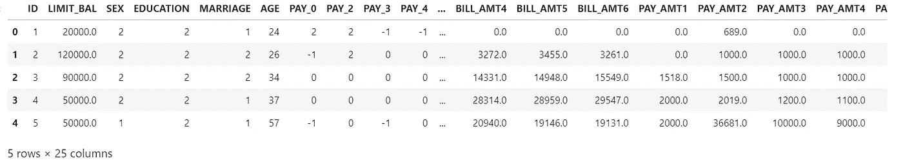

Data

# 数据准备和预处理

这就是信用风险建模的数据来源。最初，数据揭示了总共 25 个属性。在开发任何机器学习模型之前，以合适的格式清理数据是至关重要的。

## “教育”栏目分析

教育程度:(1 =研究生院，2 =大学，3 =高中，4 =其他，5 =未知，6 =未知)

> *从给出的数据描述中，我们知道在 df。教育，5 和 6 代表“未知”*
> *改变 0、5 和 6，使其保持在 1 类之下。*

```
df['EDUCATION']**.**replace({0:1,1:1,2:2,3:3,4:4,5:1,6:1}, inplace**=True**)
df**.**EDUCATION**.**value_counts()
```

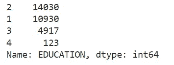

Education column in data

## “婚姻”栏目分析

婚姻状况(1 =已婚，2 =单身，3 =其他)

```
*# lets see the values count in column marriage*
df['MARRIAGE']**.**value_counts()
```


Marriage column in data

在这里，我将把 0 映射到 1。

```
df['MARRIAGE']**.**replace({0:1,1:1,2:2,3:3}, inplace**=True**)
df['MARRIAGE']**.**value_counts()
```

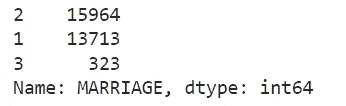

marriage column after mapping

## “PAY_0 到 PAY_6”列的分析

PAY _ 0:2005 年 9 月还款状态(-1 =按时还款，1 =延迟还款一个月，2 =延迟还款两个月，…8 =延迟还款八个月，9 =延迟还款九个月及以上)

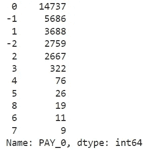

pay_0 column in data

# 数据可视化

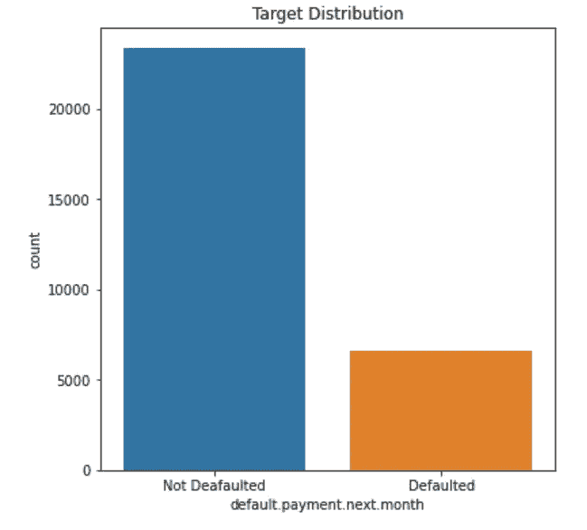

Target variable (Author image)

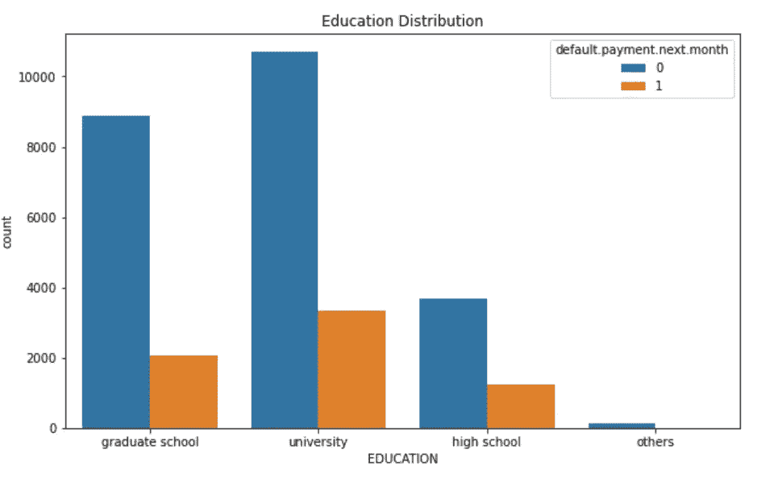

Education column (Author image)

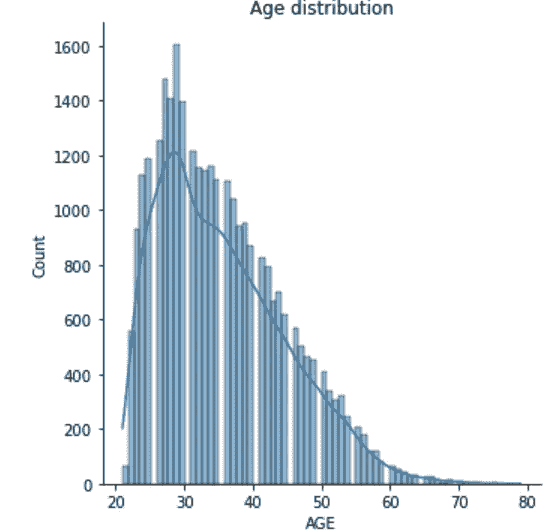

Age column distribution (Author image)

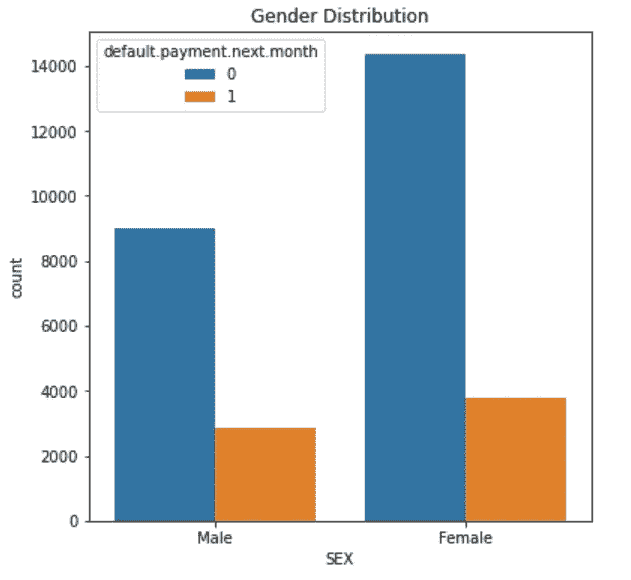

Sex column ( Author image)

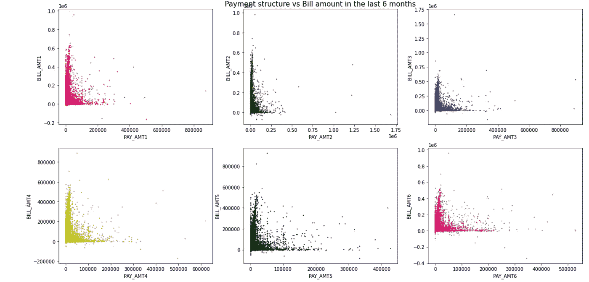

Scatter plot ( Author image)

## 创建独立特征和从属特征

*   独立变量(也称为特征)是被分析过程的输入。因变量是流程的输出。

```
*# Independnet features*
X **=** df**.**drop(['default.payment.next.month'], axis**=**1)
*# Dependent feature*
y **=** df['default.payment.next.month']
X**.**head()
```

## 缩放要素

*   将数据集中的所有变量缩放或转换到给定比例的过程称为要素缩放。梯度下降优化用于一些机器学习方法，如线性回归、逻辑回归等。为了使这些算法正常工作，必须对数据进行缩放。
*   标准化是以获得标准正态分布属性的方式缩放数据值的过程。这意味着数据以这样的方式被重新调整，即平均值变为零，并且数据具有单位标准偏差。

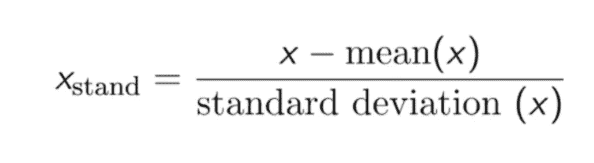

Formula for standardization

```
**from** sklearn.preprocessing **import** StandardScaler
scaler**=** StandardScaler()
X**=** scaler**.**fit_transform(X)
```

## 列车测试分离

*   整个数据集(群体)被分成两组:训练集和测试集。根据使用情形，数据可以分为 70–30 或 60–40、75–25 或 80–20，甚至 50–50。一般来说，训练数据的比例必须大于测试数据的比例。

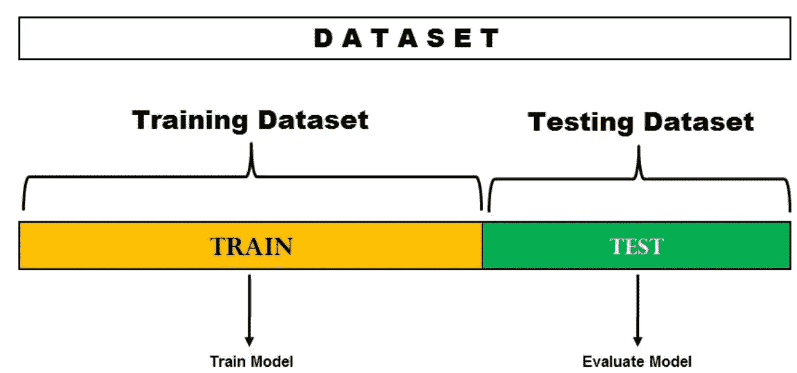

Splitting the data (Image Source: DataVedas)

```
**from** sklearn.model_selection **import** train_test_split
X_train,X_test,y_train,y_test**=** train_test_split(X,y,test_size**=**0.20,random_state**=**42)
```

## **阶层失衡**

*   对于过采样技术，SMOTE(合成少数过采样技术)被认为是 ML 和数据挖掘中最流行和最有影响力的数据采样算法之一。使用 SMOTE，少数类通过创建“合成”示例进行过采样，而不是通过替换进行过采样[2]。这些引入的合成示例是基于沿着连接定义数量的 k 个少数类最近邻居的线段，在学习包中默认设置为 5 个。

```
**from** imblearn.over_sampling **import** SMOTE
**from** collections **import** Counter

*# summarize class distribution*
print("Before oversampling: ",Counter(y_train))

*# define oversampling strategy*
SMOTE**=** SMOTE()

*# fit and apply the transform* 
X_train,y_train**=** SMOTE**.**fit_resample(X_train,y_train)

*# summarize class distribution*
print("After oversampling: ",Counter(y_train))
```

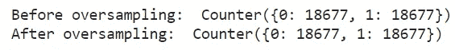

# 建筑模型

*   逻辑回归
*   随机森林分类器
*   XGBoost 分类器
*   交叉验证

## 逻辑回归模型

*   逻辑回归的主要目的是确定特征和特定结果的概率之间的关系。
*   它使用 Sigmoid 函数来绘制数据。

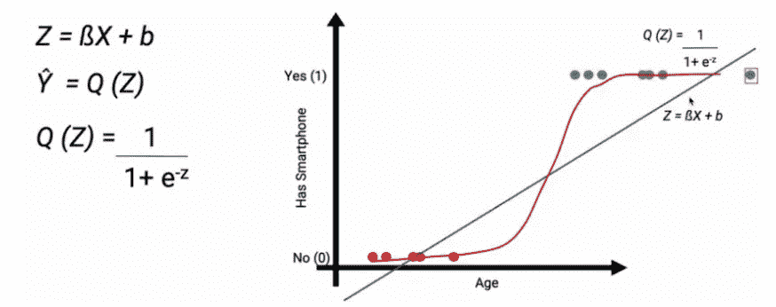

Image source [here](https://www.analyticsvidhya.com/blog/2021/03/logistic-regression/)

```
**from** sklearn.linear_model **import** LogisticRegression
logit**=** LogisticRegression()logit**.**fit(X_train, y_train)*# Predicting the model*
pred_logit**=** logit**.**predict(X_test)
```

## 评估 logit 模型

*   **准确率**:正确预测总数的比例。
*   **阳性预测值或精确度**:被正确识别的阳性病例的比例。
*   **阴性预测值**:被正确识别的阴性病例的比例。
*   **灵敏度或召回率**:被正确识别的实际阳性病例的比例。
*   **特异性**:被正确识别的实际阴性病例的比例。


Confusion metrics (Image source [here](https://manisha-sirsat.blogspot.com/2019/04/confusion-matrix.html))

```
**from** sklearn.metrics **import** classification_report, accuracy_score, confusion_matrix, roc_auc_score, plot_confusion_matrix, plot_precision_recall_curve

print("The accuracy of logit model is:", accuracy_score(y_test, pred_logit))
print(classification_report(y_test, pred_logit))
```

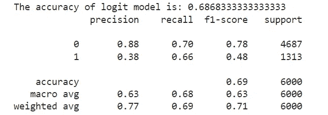

Classification report of Logit model

## 随机森林分类器

> 步骤 1:在随机森林中，从具有 k 个记录的数据集中取出 n 个随机记录。
> 
> 步骤 2:为每个样本构建单独的决策树。
> 
> 步骤 3:每个决策树都会生成一个输出。
> 
> 第四步:根据 ***多数表决或平均*** 分别考虑分类和回归的最终输出。

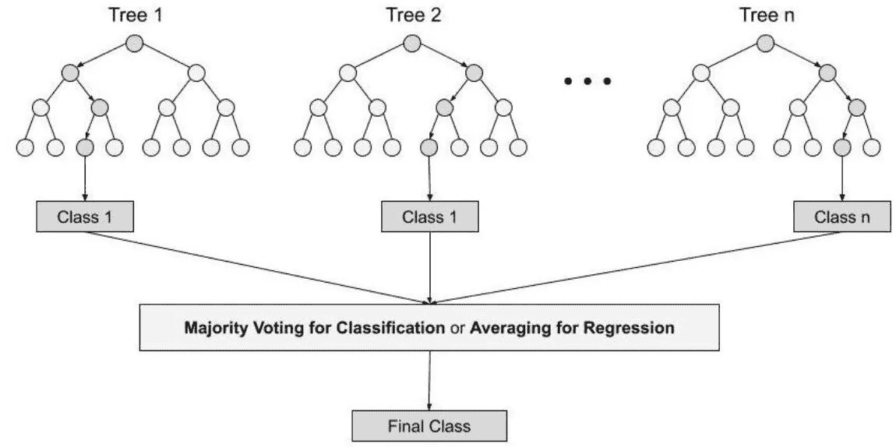

Random forest(Image source [here](https://www.analyticsvidhya.com/blog/2021/06/understanding-random-forest/))

```
**from** sklearn.ensemble **import** RandomForestClassifier
rf**=** RandomForestClassifier()
*# Fitting the model*
rf**.**fit(X_train,y_train)*# Predicting the model*
pred_rf**=** rf**.**predict(X_test)
```

## 评估随机森林模型

```
print("The accuracy of logit model is:", accuracy_score(y_test, pred_rf))
print(classification_report(y_test,pred_rf ))
```

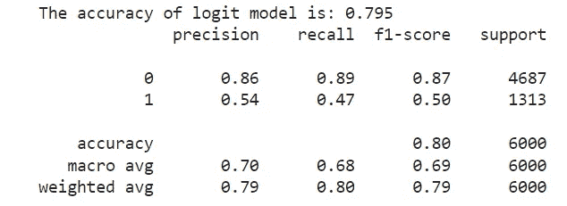

classification report of the Random Forest model

## XGBoost 分类器

*   另一种突出的增强方法是极端梯度增强或 XGBoost。实际上，XGBoost 只是 GBM 算法的一个改进版本！XGBoost 的操作与 GBM 的操作相同。在 XGBoost 中，树是按顺序生成的，每棵树都试图修复前一棵树的错误。


Image source [here](https://www.analyticsvidhya.com/blog/2020/02/4-boosting-algorithms-machine-learning/)

```
**import** xgboost **as** xgb

xgb_clf**=** xgb**.**XGBClassifier()
*#fitting the model*
xgb_clf**.**fit(X_train,y_train)*## Predicting the model*
xgb_predict**=** xgb_clf**.**predict(X_test)
```

## 评估 Xgboost 模型

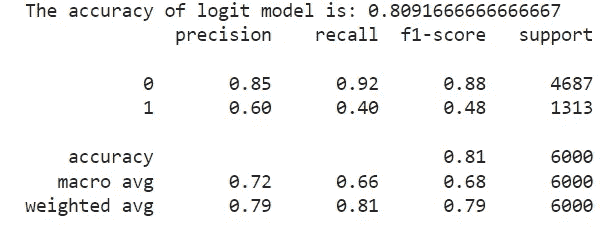

classification report of xgboost model

## 超参数调整 xgboost 模型

```
*## Hyper Parameter Optimization*

params**=**{
 "learning_rate"    : [0.05, 0.10, 0.15, 0.20, 0.25, 0.30 ] ,
 "max_depth"        : [ 3, 4, 5, 6, 8, 10, 12, 15],
 "min_child_weight" : [ 1, 3, 5, 7 ],
 "gamma"            : [ 0.0, 0.1, 0.2 , 0.3, 0.4 ],
 "colsample_bytree" : [ 0.3, 0.4, 0.5 , 0.7 ]

}*## Hyperparameter optimization using RandomizedSearchCV*
**from** sklearn.model_selection **import** RandomizedSearchCV, GridSearchCVrandom_search**=**RandomizedSearchCV(xgb_clf,param_distributions**=**params,n_iter**=**5,scoring**=**'roc_auc',n_jobs**=-**1,cv**=**5,verbose**=**3)

*# fitting the RandomizedSearchCV*
random_search**.**fit(X_train,y_train)
```

然后我们会找到最好的估计和参数。

```
*# Finding the best estimators*
random_search**.**best_estimator_*# Finding the best param*
random_search**.**best_params_
```

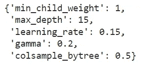

Optimal parameters

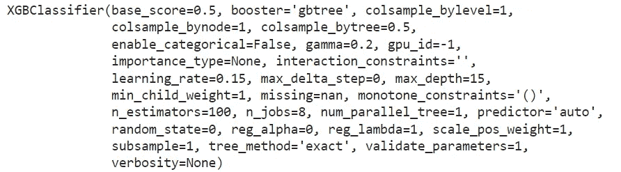

Best estimators

```
*# Predicting model*
y_pred**=** classifier**.**predict(X_test)
```

## k 倍交叉验证

让我们将最后一个例子从 2 重交叉验证外推至 k 重。现在，我们将尝试可视化 k 倍验证是如何工作的。

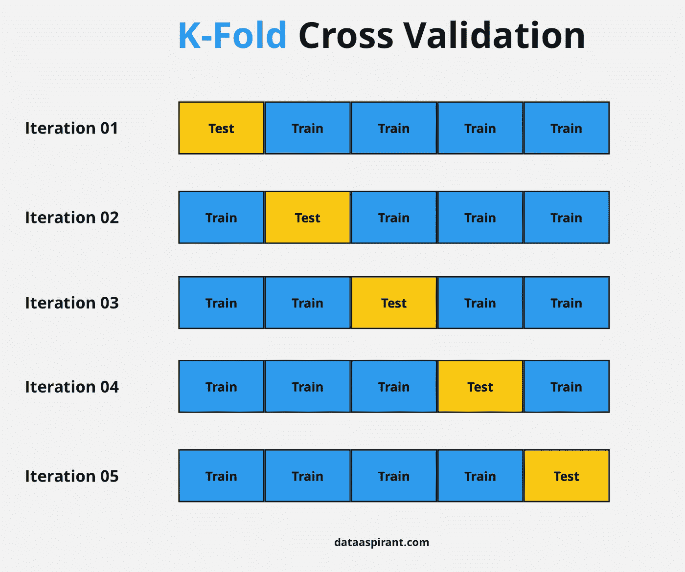

(Image source [here](https://dataaspirant.com/10-k-fold-cross-validation/))

这是一个七重交叉验证程序。

它是这样工作的:我们将总人口分成 5 个相等的样本。模型现在在四个样本(蓝框)上训练，在一个样本(黄框)上验证。然后，在第二次迭代中，使用作为验证的新样本对模型进行训练。我们在 5 次迭代中对每个样本开发了一个模型，并将它们作为验证。这是一种降低选择偏差和预测能力方差的方法。一旦我们有了所有五个模型，我们平均误差项，以确定哪一个是最好的。

```
**from** sklearn.model_selection **import** cross_val_score
score**=**cross_val_score(classifier,X,y,cv**=**10)score**.**mean()
```

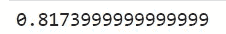

Final accuracy

# 结论:

我们用 python 建立了信用风险模型。我们已经尝试了不同的机器学习算法。逻辑回归、随机森林和 Xgboost 分类器。我们还进行了超参数调整和交叉验证。我们实现的模型的最终准确率为 82%。

## 完整代码请参考[笔记本。](https://github.com/rahkum96/Credit-Risk-Modelling-in-Python/blob/main/Credit%20Risk%20Modelling%20in%20Python.ipynb)

# 来源:

*   [信号源 1](/analytics-vidhya/credit-risk-modelling-in-python-3ab4b00f6505)
*   [信号源 2](https://www.analyticsvidhya.com/blog/2016/03/complete-guide-parameter-tuning-xgboost-with-codes-python/)
*   [信号源 3](https://towardsdatascience.com/credit-risk-analysis-with-machine-learning-736e87e95996)

# 跟我来

[领英](https://www.linkedin.com/in/rahulsisodia06/)

[GitHub](https://github.com/rahkum96)

[](/mlearning-ai/mlearning-ai-submission-suggestions-b51e2b130bfb) [## Mlearning.ai 提交建议

### 如何成为 Mlearning.ai 上的作家

medium.com](/mlearning-ai/mlearning-ai-submission-suggestions-b51e2b130bfb)