# CRM 分析:客户细分和客户终身价值预测

> 原文：<https://medium.com/mlearning-ai/crm-analytics-customer-segmentation-customer-lifetime-value-prediction-1163fa6e4ae9?source=collection_archive---------2----------------------->

大家好，时隔很久，我们在一个新的案例中再次与大家相聚。在数据时代的今天，对企业和客户的客户关系管理进行了研究，这对企业的持续性和盈利性有很大的作用。

获得顾客的忠诚对于一个企业保持盈利能力是一个非常重要的问题。从该领域的研究中我们可以了解到，留住一个客户比获得一个新客户更经济、更有利可图。事实上，在这方面添加一个有趣的统计数据，获得一个新客户的成本揭示了一个额外的成本，它可能是保留一个现有客户的成本的 5 到 10 倍。即使我们从不同的角度来看这个场景，我们可以说，失去现有客户可能会导致现有客户为公司增加的附加值被消除，以及公司在寻找新客户取代旧客户时的费用增加。

那么，为了最好地管理对我们的业务有如此影响的客户因素，我们应该从哪里开始保留我们的现有客户呢？需要采取什么步骤才能让那些购买你的产品和服务的人对你的公司更加忠诚？你如何识别顾客当前的需求、要求和抱怨？从这些问题开始，我们可以看看科学界不同的性能指标和计算。

让我们回顾一下客户终身价值，这是我们在这里遇到的最重要的指标，也是您在本次研究中会遇到的指标。那么什么是客户终身价值呢？

简单地说，客户终身价值也可以定义为在一定时期内对客户投资的预期回报。或者，说得更具体一点，作为另一种描述，“从顾客第一次购买你的商品到他们停止购物的这段时间所获得的利润”给出了顾客的终生指标。

我们从这两个简短的解释中获得的结果是一个在客户终身价值、赢得新客户、通过直接或交叉销售方法增加购买倾向、跟踪客户行为和制定战略决策等过程中使用的指标。

客户终身价值是重要的绩效标准之一，但目前许多企业无法准确计算这一价值。通过正确计算客户终身价值指标，您可以决定获得客户所需的成本。你甚至可以预测是否获得新客户或增加现有客户的收入会给你的企业带来更大的利润。

在解释了什么是客户终身价值之后，我们将使用一个电子购物网站的数据进行一个样本客户细分研究，然后计算这些客户的客户终身价值。所以我们开始吧！

首先，让我们导入我们将在研究中使用的库和包。

然后，让我们导入要在研究中使用的样本数据集。

这行代码的输出:

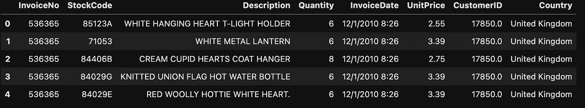

Overview of the dataset

在很好地了解了我们的数据集之后，让我们来看看我们对数据集进行探索性数据分析的描述性统计。

该图像的输出如下:

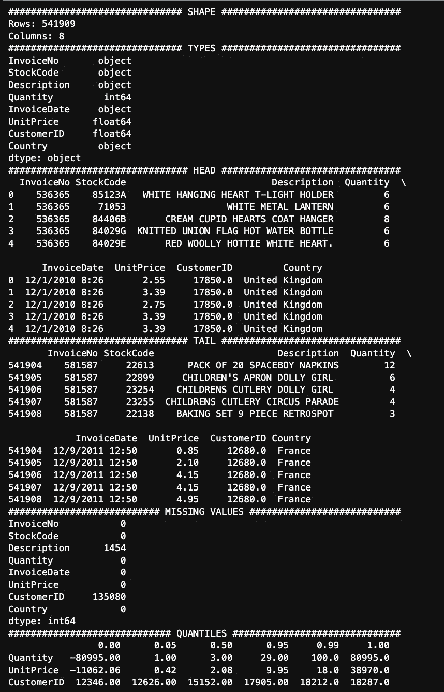

Descriptive statistics of the data set

我们查看了数据集的描述性统计数据。现在让我们来看看购物网站上的购物按地区的分布情况。

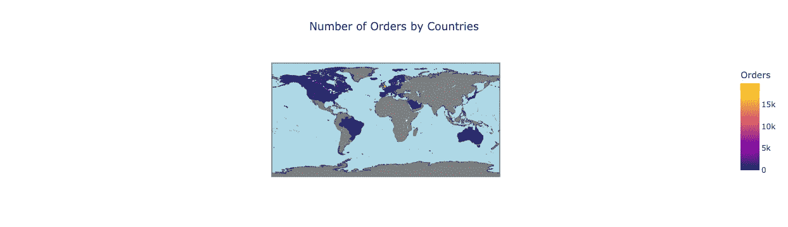

Sales according to regions

在看到我们的总销售额按地区划分后，让我们更详细地看看数字变量，看看异常值和缺失值。

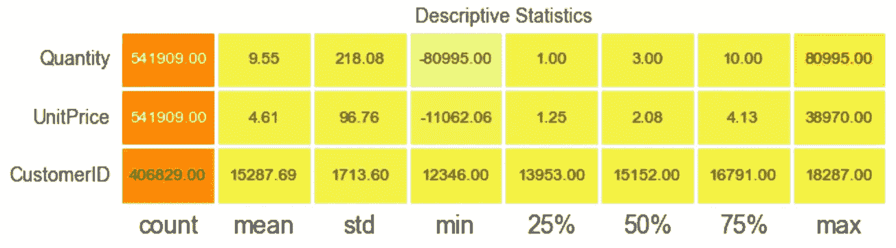

Descriptive Statistics

我们在查看这些统计数据时获得的信息如下:

*   正如我们所看到的，一些变量有缺失值。需要清除数量和单价变量的缺失值。
*   单价和数量中存在负值。那意味着订单被取消了。
*   数量和单价应相乘以得出总价。
*   客户 ID 和描述中缺少值。
*   InvoiceDate 应该是日期时间，而不是对象。

在基于描述性统计做出这些推论之后，我们可以继续进行数据预处理。

## 数据预处理:

首先，让我们清理数据集中缺失的值。

我们在这个代码博客中得到的输出如下:

我们讨论了数据集中取消的订单。这些数据是以“发票号”列中的“c”字符开始的数据行。我们需要从数据集中删除取消的订单。

在从我们的数据集中删除取消的订单数据集之后，我们还从我们的数据集中删除了离群值。

我们创建总价格变量，并根据新版本的数据集再次查看描述性统计数据。

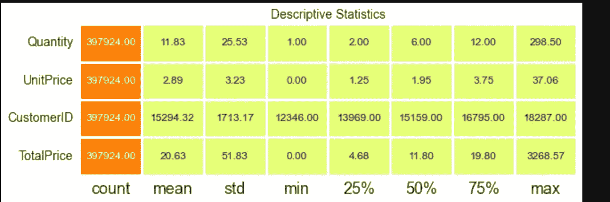

New Descriptive Statistics

我们已经完成了数据集的预处理。在数据预处理之后，我们将详细讨论 RFM 分析。首先，我们解释 RFM，然后是我们数据集的 RFM 分析工作。

## RFM 分析:

什么是 RFM 分析？这是我们必须首先澄清的问题。RFM 代表新近性、频率和货币价值，每一个都对应于一些关键的客户特征。换句话说，就是一些总结客户行为的数值分析。我们这样总结的原因简单来说就是:频率和货币价值影响一个客户的终身价值，创新影响留存，留存是衡量参与度的指标。

RFM 分析的结果是:

*   根据购买日期与当前日期的接近程度，我们可以衡量客户对促销的敏感度。
*   同时，我们可以得出结论，顾客购买的次数越多，他们就越感兴趣和满意。
*   货币价值将高消费人群与低消费人群区分开来

既然我们已经解释了 RFM 分析，我们可以在执行 RFM 分析时使用度量标准。

现在，我们将对数据集执行一些操作。我们将首先创建一个数据集，并根据 **CustomerID** s 对该数据进行分组。我们将通过使用**聚合**函数对 **CustomerID** 中分组的记录进行聚合，来找出最近的购物记录与今天的购物记录之间的接近程度。在我们的新数据集中，这将被表示为“ **Recency** ”。同样，变量“ **InvoiceNo** ”中的每个唯一值将代表我们各自客户的频率，并将由新数据集中的列名“ **Frequency** 表示。最后，我们将根据我们在上述部分中创建的“ **TotalPrice** ”变量进行汇总，从而得出相关客户发生的费用金额。该值与“**货币**列的名称相关联。

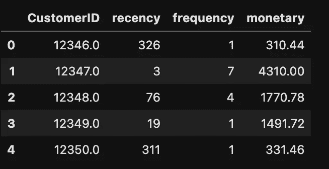

New Dataset Looking

我们创建了新的数据集，并查看了它的新外观。现在，我们将顾客分为不同的层次或细分市场，作为另一种视觉效果。为此，我们利用刚刚创建的新数据集中的“**最近度**”、“**频率**”、“**货币**”变量，创建一个 ***RFMScore*** 变量。我们还将检查我们用视觉细分到这个细分市场的客户量。

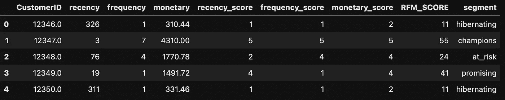

RFM Dataset

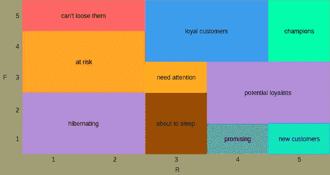

Segmentation

我们将分析我们的数据集，这些数据集是通过分段来分离的，通过对分段本身进行分组。

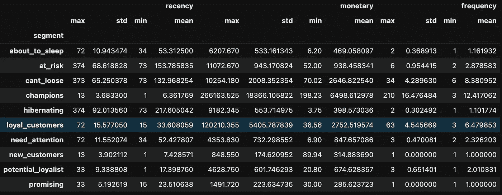

Segment Analysis -1–

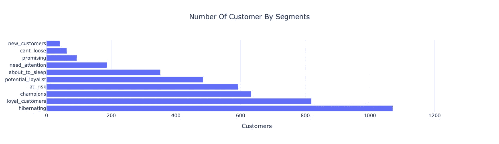

Segment Analysis

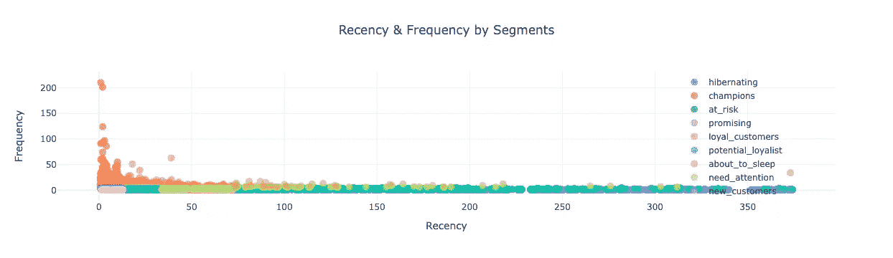

Relationship Recency&Frequency by Segments

在分割研究中，我们使用 K-Means 算法和 Elbow 方法来确定最佳聚类数。因此，具有最多突破的 X 值就是我们的最佳聚类数。

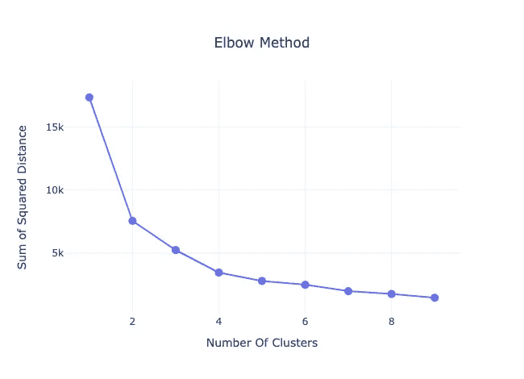

Elbow Method

> “轮廓分数”是我们在没有基本现实的情况下最常用的度量标准之一。数据点的轮廓系数为(bi ai)/max(bi，ai)。一个数据点和聚类中所有其他数据点之间的平均距离(ai)是聚类中所有其他数据点与该数据点最近的平均距离(bi)。“Davies Bouldin Score”也用于测量聚类之间的平均相似性。此比率首选低值，最小分值为 0。

## 细分分析

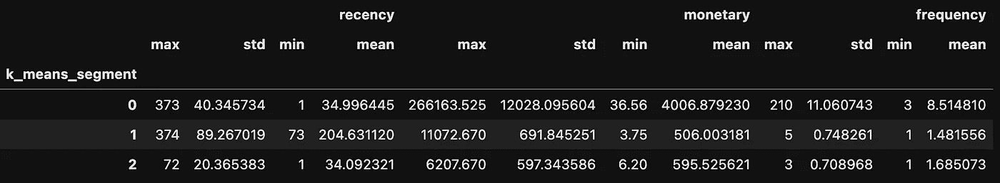

Segment Analysis

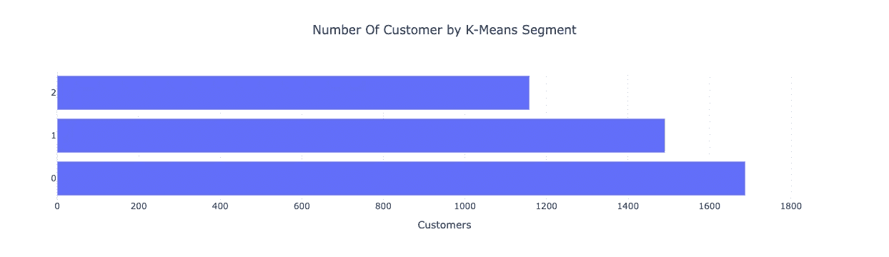

Segment Analysis

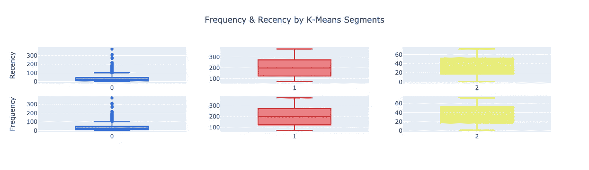

K-Means Segment

## 客户生命周期价值(CLTV):

在本文的最后一部分，我们将重点关注我们在开头提到的客户终身价值问题。之后，我们将计算客户的客户终身价值，这是我们在 RFM 分析中划分的。

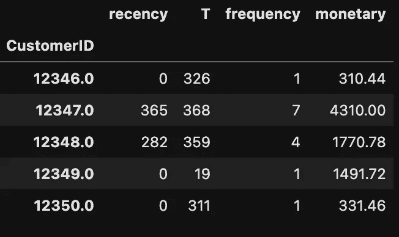

Customer Life Time Value

现在，我们将创建一些新的指标。例如平均订单值等。

## BG / NBD:

> BG/NBD 模型假设每个客户的交易数量遵循泊松过程，客户间交易率的异质性遵循伽玛分布。这些假设为我们提供了一个负二项分布(NBD ),用于对客户在世时的交易数量进行建模。

## 前 10 个预期交易数(1 周)->

## 前 10 个预期交易数(1 个月)->

## 预期交易总数(1 个月)->

## 重复交易的频率-->

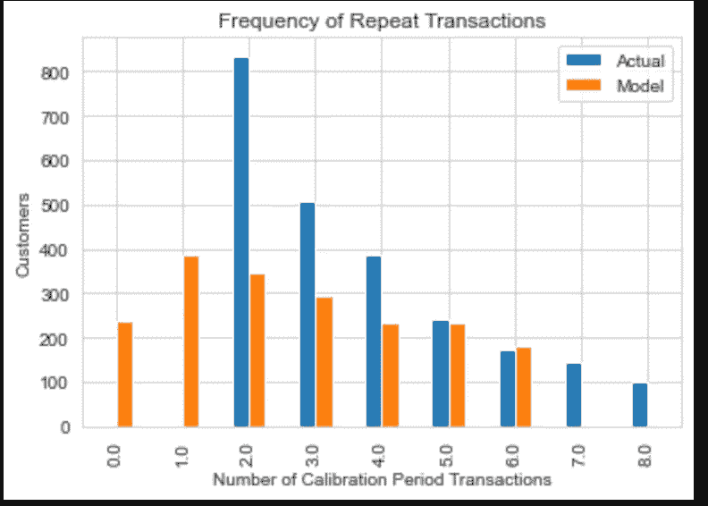

Frequency of Repeat Transactions

## 伽玛—伽玛子模型:

这是一个模型，用于估计未来客户每次交易的购买量。

> 伽马-伽马模型的属性是:
> 
> 用户交易的货币价值在其平均交易价值附近是随机的。
> 
> 平均交易价值因用户而异，但不会随着时间的推移而改变。
> 
> 平均交易值在客户之间呈伽玛分布。

## 前 10 名预期平均利润->

## 最终的 CLTV:

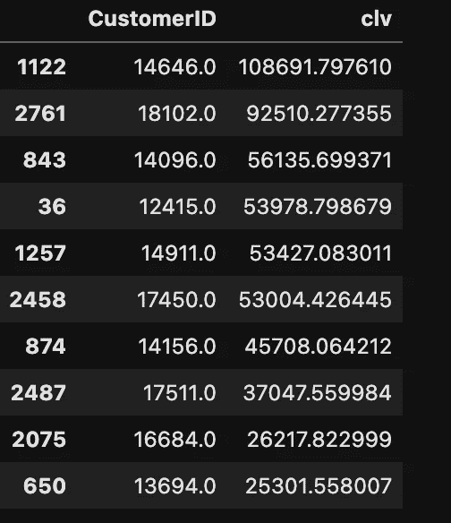

Customer Life Time Values(6 Months)

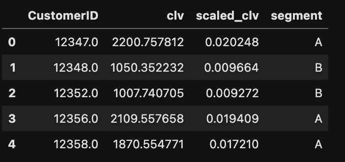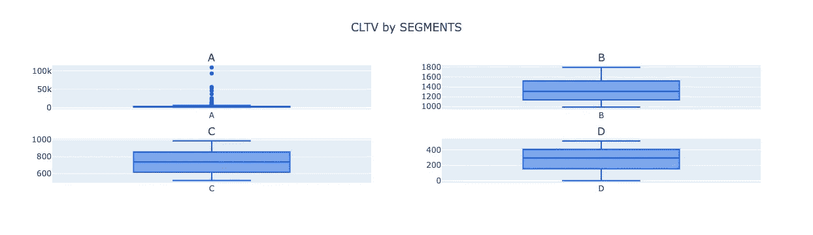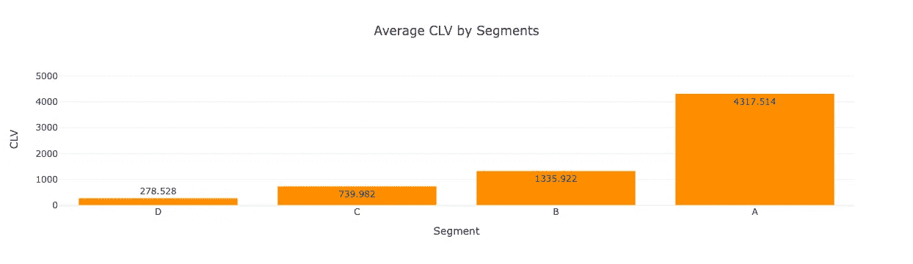

Average Of CLV by Segments

我们已经完成了一项研究。请继续关注，直到我们在下一个案件中看到你。

# 来源:

 [## CRM 分析

### 使用 Kaggle 笔记本探索和运行机器学习代码|使用来自电子商务数据的数据

www.kaggle.com](https://www.kaggle.com/code/sercanyesiloz/crm-analytics)  [## 客户关系管理

### 使用 Kaggle 笔记本探索和运行机器学习代码|使用来自 ML 的在线零售 II 数据集的数据…

www.kaggle.com](https://www.kaggle.com/code/nihandincer/customer-relationship-management-crm)  [## i̇çin·亚萨姆·于波·德涅里尼先生

### 穆特里伊·埃尔德·图特马克·奥涅姆利·比尔·伊斯蒂尔。我的主耶稣基督，我的主耶稣基督，我的主耶稣基督。

b4mind.com](https://b4mind.com/marka-yonetimi/musteri-yasam-boyu-degerini-artirmak-icin-musteri-deneyimini-iyilestirmenin-onemi/)  [## Mlearning.ai 提交建议

### 如何成为 Mlearning.ai 上的作家

medium.com](/mlearning-ai/mlearning-ai-submission-suggestions-b51e2b130bfb)