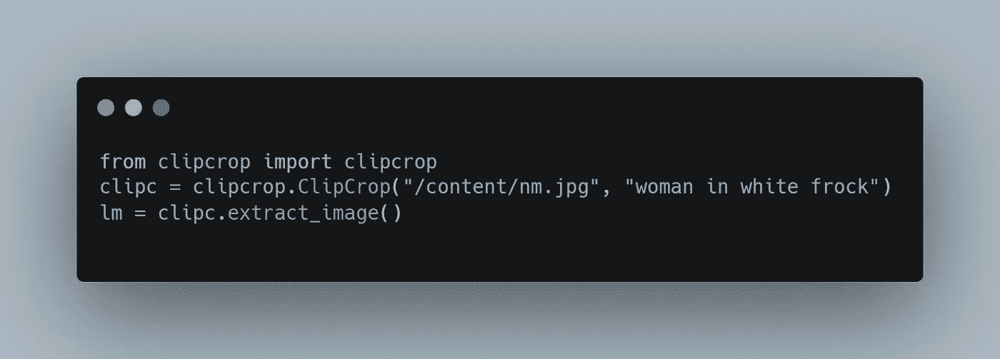
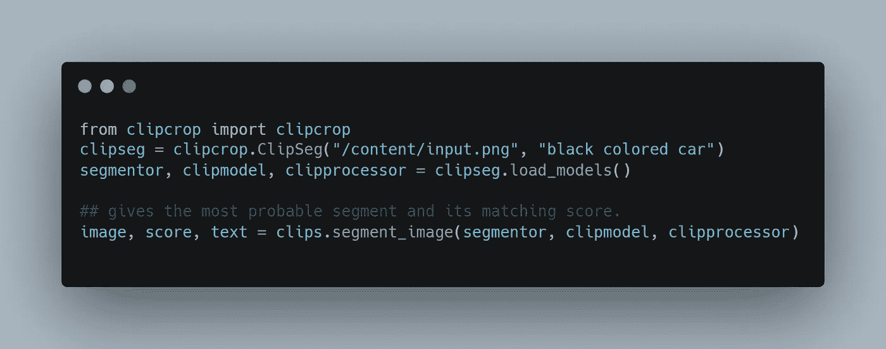

# 使用 OpenAI 的剪辑裁剪和分割图像

> 原文：<https://medium.com/mlearning-ai/crop-and-segment-images-using-openais-clip-8346139425fb?source=collection_archive---------3----------------------->

曾经想知道我们是否可以根据我们的兴趣裁剪出图像中的部分，或者根据我们的愿望通过使用单词查询分割出图像，那么有一种方法我们可以实现同样的目的。利用 OpenAI 的 CLIP 和 DeTr(也可以使用任何其他的)计算机视觉模型，我们可以使用简单的文本查询来分割和裁剪图像的部分。通过为被查询的文本导出图像的每个检测部分的概率，可以使用对象检测模型和剪辑的组合来实现裁剪部分。而为了获得分割，我们必须用全景分割模型来代替对象检测模型。

**什么是剪辑？**

简而言之， **CLIP(对比语言图像预训练)**是著名的 OpenAI 为解决多模态问题而设计的零镜头学习方法。选择多个文本-图像对，并计算它们的编码以创建一个***(N-图像数* M-文本数)*** 矩阵，每个矩阵代表每个文本和图像之间的相似性得分，作为预训练步骤。假设我们要执行零镜头图像分类，我们应该使用预先训练的张量将图像和文本集编码到嵌入中。通过对计算出的相似性分数进行排序，我们可以确定与图像更相关的文本，反之亦然，以便从图像集中找出完美的图像(图像神经搜索)。

在我们的场景中，我们将相同的原理扩展到从图像中裁剪/分割出部分。为了简单起见，我创建了一个简单的 python 库 [clipcrop](https://pypi.org/project/clipcrop/) (仍在开发中)来执行同样的任务。为了执行对象检测和图像分割任务，我使用了脸书的 DeTr，因为它比传统的单级或两级检测器更快、更准确。更重要的是，你甚至可以利用 HuggingFace 管道来完成同样的任务。下面我附上了两个功能的例子。

**实施**

*   使用 ***pip 安装 clipcrop*** 安装库
*   使用从图像中裁剪对象的部分

*   使用以下方法从图像中提取片段

因此，从上面，我们看到，我们可以通过利用 OpenAI 的剪辑和脸书的 DeTr 模型来裁剪部分或片段。我将继续升级更多的选项和功能来改进这个库。欲了解更多信息，请跳转到下面提到的回购。

**来源:**

*   github:[https://github.com/Vishnunkumar/clipcrop](https://github.com/Vishnunkumar/clipcrop)
*   PyPi:[https://pypi.org/project/clipcrop/](https://pypi.org/project/clipcrop/)

好了，谢谢你对我的大力支持，让我们继续这段旅程。让我们一起成长，一起学习。下次见，再见，保重。

 [## Mlearning.ai 提交建议

### 如何成为 Mlearning.ai 上的作家

medium.com](/mlearning-ai/mlearning-ai-submission-suggestions-b51e2b130bfb)