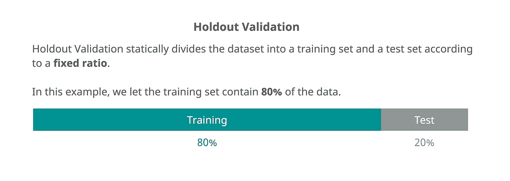
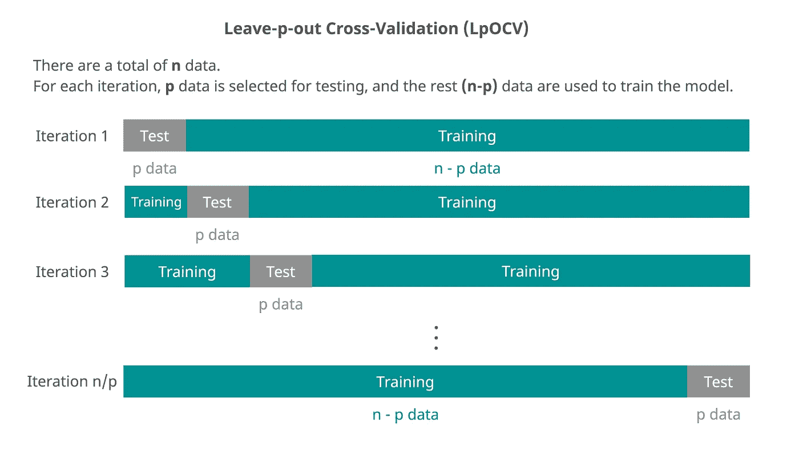
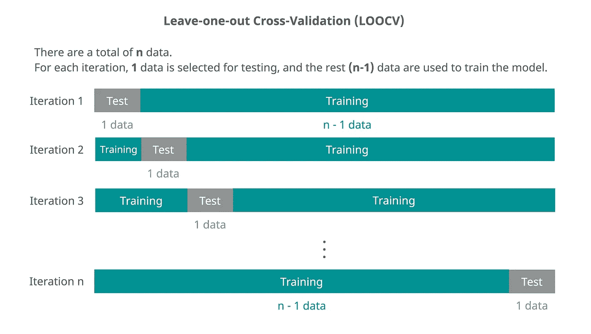
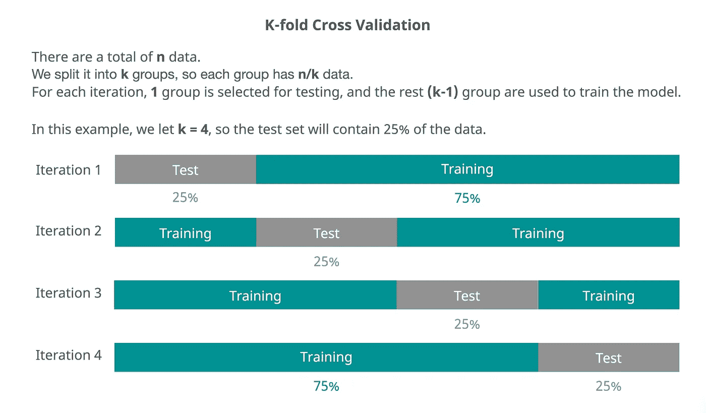
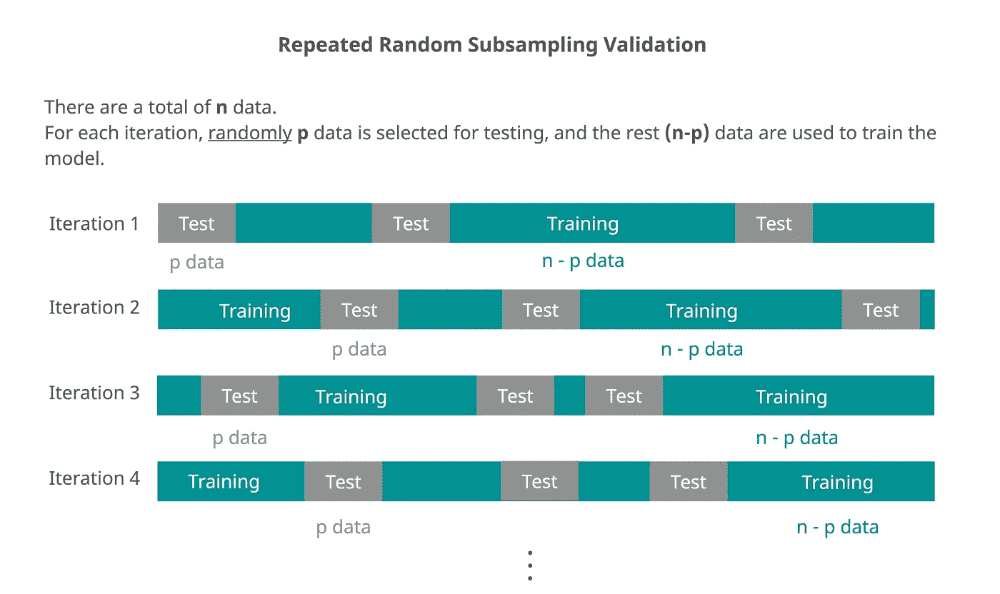

# 交叉验证在 5 张图中有清晰的解释

> 原文：<https://medium.com/mlearning-ai/cross-validation-clearly-explained-in-5-graphs-9b83067bc696?source=collection_archive---------4----------------------->

# 介绍

在本文中，我将介绍维持验证和几种常见的交叉验证方法。

我创作了一些漂亮的插图来帮助理解这些概念。

# 维持验证

Holdout Validation

# 遗漏交叉验证

LpOCV

# 留一法交叉验证(LOOCV)

LOOCV

# *K 倍交叉验证*

K-Fold Cross-Validation

# *重复随机二次抽样验证*

Repeated Random Subsampling Validation

 [## Mlearning.ai 提交建议

### 如何成为 Mlearning.ai 上的作家

medium.com](/mlearning-ai/mlearning-ai-submission-suggestions-b51e2b130bfb)