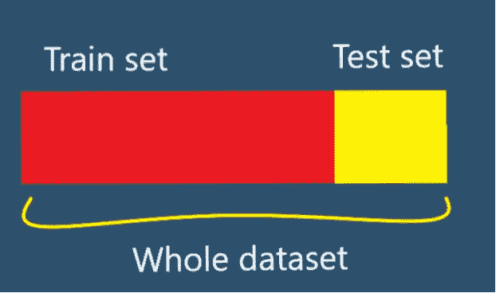
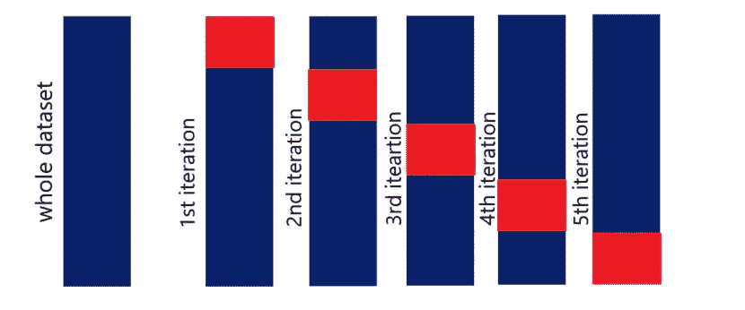

# 数据科学中的交叉验证

> 原文：<https://medium.com/mlearning-ai/cross-validation-must-read-49b1b4c1154b?source=collection_archive---------4----------------------->

## **简介**

如果你了解机器学习，你就会知道在建立机器学习模型时，我们需要数据来训练它。我们如何做到这一点？我们将整个数据集随机分成两个不相等的部分。比如说，80%的数据作为训练集，其余 20%的数据作为测试数据。然后，我们在训练集上训练所选择的 ML 模型，并且为了评估模型的性能，我们在不可见的测试数据上测试模型，我们将这些数据放在一边以供进一步验证。**交叉验证**是一种评估机器学习模型并测试其性能的技术。它还有助于针对特定的预测建模任务比较不同的 ML 模型。它简单且易于实现。

## **不同的 CV 技巧**

有许多 CV 技术到处漫游。其中只有一些是现实世界中常用的，其他的只是存在。我们不会详细讨论所有的方法，但至少你会了解每种方法背后的思想。确实如此

坚持到底

**B- K-fold 交叉验证**

C-留-p-出

D-分层 k-折叠

重复的 k 倍

F-嵌套 k-折叠

G-时间序列 CV

H-验证集方法。

我们有意将 k 倍 CV*留为粗体，因为这是本文感兴趣的主题，并且只是简单介绍一下其他内容，以便您对这些技术有一个简要的了解。所以我们走吧…*

## ***答:坚持***

**

*我们已经在本文中讨论了这种方法。你可能也用过它。你只是不知道这项技术的名字。它的内容如下..*

*1.将整个数据集分成两部分。通常，80%的数据进入训练集，其余的(20%)进入测试集。分割规则不是通用的，所以相应地选择你的分割比例。*

*2.在训练集上训练模型*

*3.在测试集上验证模型。*

*4.计算模型的准确性或性能*

*完成了。*

*简单到看起来微不足道。当您拥有大量数据，并且只需对模型进行一次定型时，这种方法非常有用。*

*因为不平衡的数据集可能导致不准确的模型，所以保留不是交叉验证的优选方法。*

## ***B. K 折交叉验证***

**

*k 重交叉验证是一种常用的 CV 方法。*

*在这种方法中，我们将整个数据集分成 k 个大小相等的组。这些被称为**褶皱。***

*该算法的工作原理如下:*

*1.自己选择 k 的值。通常服用 5 或 10 次。*

*2.将数据集分成 k 个相等的部分。*

*3.选择一组作为测试集，其余的 k-1 个折叠作为训练集。*

*4.使用 k-1 训练集训练模型。*

*5.在测试集上验证*

*6.保存结果*

*7.用一个新的折叠作为测试集，其余的作为训练集，重复第 3 到第 5 步。使用与以前不同的型号。*

*8.得到性能的算术平均值。*

*因为我们是在数据集的不同部分上训练和测试模型，所以它会产生一个更稳定的模型。如果我们想提高模型的性能和鲁棒性，那么我们可以增加 k 的值。*

*有不同的方法来选择 k 的值，比如*

*A.选择 k 的值，使训练集和测试集都足够大，能够在统计上代表主数据集。*

*B.K = 10。从许多实验中可以看出，k = 10 是一个好选择，因为它通常会产生一个具有低偏差和方差的模型。*

*C.K = n。我们将在本文后面详细讨论这一点。*

*k-fold CV 的一个缺点是，对于更大的 k 值，计算成本确实很大并且更复杂，因为我们正在训练多个模型(k)。*

## ***C .离开 p-out***

*在这种方法中，我们取 p 个样本作为测试集，其余的样本(n — p)作为训练集。我们可以用 nCp 的方法从 n 个样本中选出 p 个样本。因此，与 k-fold CV 不同，测试集可以重叠。*

*1.选择 p 个样本，这将是我们的测试集*

*2.选择剩余的样本(n — p)作为训练集。*

*3.使用训练集训练模型。记住，在每次迭代中，都应该训练一个新的模型*

*4.在测试集上验证模型。*

*5.保存结果。*

*6.重复步骤 3-步骤 5 nCp 多次。*

*7.计算结果的平均值*

*这种技术的缺点是，对于较大的 p，它在计算上是昂贵的。*

*一个特例是当 p = 1 时。许多人认为这是一种完全不同的技巧(留出一个简历)。*

*如你所知，nC1 = n，这意味着在这个方法中，你必须迭代 n 次。您只取出一个样本，然后在其余的 n-1 个样本中训练模型。仅用一个数据点验证模型。再次(LOOCV)这种方法也是计算昂贵和耗时的。*

## ***D .层状 k-褶曲***

*有时我们会处理不平衡的数据。就像在回归问题中，我们拥有的数据是某种产品的价格。如果某些产品的价格很高，而其他产品的价格相当低，并且这些低价产品的数量比高价产品多。或者在二元分类的情况下，一个类别的样本多于另一个类别。假设在一个包含 1000 个关于猫和狗的样本的数据集中，有 700 只猫和 300 只狗。在这种不平衡的数据集中，标准的 k-fold 交叉验证技术可能会遇到一些问题。为了解决这个问题，他们想出了一种新的变异 k- fold CV。**分层 k 折 CV。***

*它的工作方式几乎与 k-fold CV 相同。不同之处在于，分层 k 折叠以这样的方式分割数据集，即每个折叠包含与主数据集中相同百分比的每个目标的样本。在回归的情况下，分层 k 折叠确保平均目标值在所有折叠中大致相等。*

*分层 k-fold 很好地处理了偏差和方差。你可以猜测它比标准的 k-fold CV 更好，是的。*

## ***E .重复 k 倍***

*在这种方法中，k 不是标准 k 折叠中的折叠数。k 是我们训练模型的次数。*

*假设我们选择 20 %的数据作为测试集，其余的作为训练集。现在，该技术从原始数据集中随机选择 20 %的数据，并在其余样本上训练模型，并在搁置的 20%样本上验证模型。它这样做 k 次，并平均结果*

*这种方法的优点是，由于它随机地选择训练集和测试集，所以它更健壮。缺点是不能保证所有的样品至少被选择一次进行测试。*

## ***F .嵌套 k 折***

*这是在交叉验证的每个折叠中执行 k 折叠交叉验证的地方，通常在模型评估期间执行超参数调整。*

## ***G .时间序列 CV***

*这是完全不同的话题。当我们有像时间序列这样的序列数据时。在这种情况下，我们不能将随机数据指向训练集或测试集。在这篇文章中，我们不打算讨论关于时间序列 CV。我们还没有写任何关于时间序列的文章，当我们写的时候，会给这篇文章分配一个链接。请等到那个时候。*

## ***H .验证集方法。***

*在这种方法中，我们将原始数据集分成两个相等的部分，训练集和测试或验证集。*

*这种方法的主要缺点是只有 50%的数据用于训练模型。因此，发生的情况是，模型未能捕获原始数据中的许多模式，但训练数据集中没有。*

*就这样。希望对你有所帮助。如果你有，请将这个故事分享给你认识的一位数据科学爱好者，并在 medium 上关注我。*

*或者在这些平台中。*

*[LinkedIn](https://www.linkedin.com/in/shubhendu-ghosh-423092205/) ， [Github](https://github.com/shubhendu-ghosh-DS) ， [Twitter](https://twitter.com/shubhendubro) ， [medium](/@shubhendu-ghosh)*

* [## Mlearning.ai 提交建议

### 如何成为 Mlearning.ai 上的作家

medium.com](/mlearning-ai/mlearning-ai-submission-suggestions-b51e2b130bfb)*