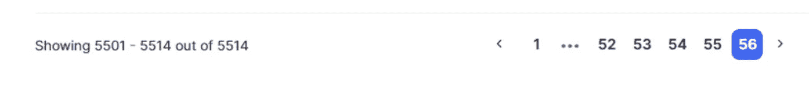
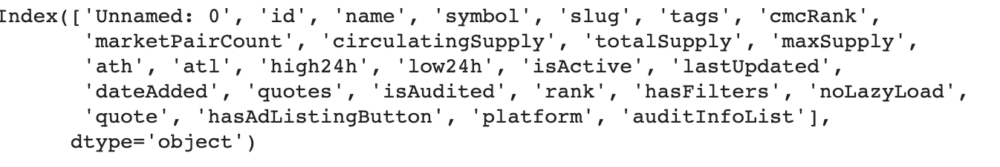
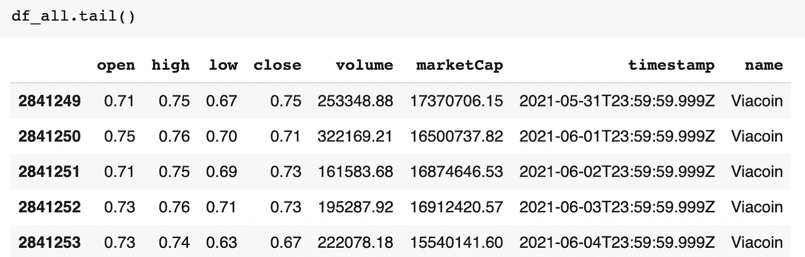

# 使用 API 的加密货币市场

> 原文：<https://medium.com/mlearning-ai/cryptocurrency-markets-using-apis-d8edf7b0c59a?source=collection_archive---------7----------------------->


Photo by [Executium](https://unsplash.com/@executium?utm_source=medium&utm_medium=referral) on [Unsplash](https://unsplash.com?utm_source=medium&utm_medium=referral)

隔离不仅让大多数人成为了厨师，也让我们大多数人成为了投资大师。我们都记得，当两大交易平台向客户提供加密货币后，比特币价格飙升，世界上第一种加密货币——比特币已经上涨了**640%**,以至于我 80 岁的爷爷都在提到它。毫无疑问，加密货币在疫情期间蓬勃发展，并在所有年龄组中普及。

# 使用 BeautifulSoup 进行网页抓取

说到网页抓取，我向像我这样的初学者推荐 [BeautifulSoup](https://pypi.org/project/beautifulsoup4/) 库。正如它的名字所暗示的，它允许你漂亮地从 HTML 和 XML 文件中删除数据，这是帮助我理解网页的所有组成部分和网页删除基础的教程。

[](https://www.dataquest.io/blog/web-scraping-python-using-beautiful-soup/) [## 教程:使用漂亮的汤用 Python 进行网页抓取

### 互联网绝对是一个巨大的数据来源——我们可以使用网络抓取和 Python 来访问这些数据！事实上…

www.dataquest.iogen](https://www.dataquest.io/blog/web-scraping-python-using-beautiful-soup/) 

## **报废卷筒纸的一般步骤**

1.  从 URL 中检查真正感兴趣的内容
2.  从 API 检索数据的请求标头
3.  通过 soup 找到您想要的数据
4.  如果需要重复提取数据，请使用“for 循环”

这是我在抓取网页时最常用的方法；它给出了非常结构化的数据。现在让我们来看看加密货币数据是如何工作的。

**目标:从**[**coinmarketcap**](https://coinmarketcap.com/)**中抓取每枚硬币的历史数据，我们对每枚硬币的日期、市值、成交量、开盘价、最高价、最低价、收盘价感兴趣。**

该项目包含两个部分:

*   第 1 部分:获取所有硬币的名称
*   第 2 部分:通过 API V3 废弃历史数据

# 硬币名称和符号

一旦你打开 [coinmarketcap](https://coinmarketcap.com/) ，你可以看到一个包含所有当前硬币名称的表格。共有 56 页数据，共 5501 枚硬币。(该项目于 2021 年夏季完成)



```
for i in range(1,57):
    url= 'https://coinmarketcap.com/?page='+str(i)
    response  = requests.get(url, headers=headers).text
    soup = BeautifulSoup(response) # soup.prettify() data = soup.find('script',id="__NEXT_DATA__").get_text()
    jsdata = json.loads(data)
    list_data = jsdata['props']['initialState']['cryptocurrency']['listingLatest']['data'] all_data.extend(list_data)
   print(i)
```

以下是保存的所有硬币名称的文件。



# 通过 API v3 的历史数据

[*比特币 API 示例*](https://api.coinmarketcap.com/data-api/v3/cryptocurrency/historical?id=1&convertId=2785&timeStart=1367078400&timeEnd=1622764800)

因为有超过 5000 个硬币，所以在提取时有必要为每个硬币创建一个临时文件夹。最终，将它们合并到一个数据框中。

```
dn = len(os.listdir('data/'))
```

长度表示的是。目录中的 csv 文件；以防在提取数据时出现任何技术问题，我们不需要从头开始。

```
num=dnfor url in urls[dn:]:
   response  = requests.get(url).text
   jsdata = json.loads(response)
   name = jsdata['data']['name'].replace('/',' ')
   quote = [i['quote'] for i in  jsdata['data']['quotes']] df = pd.DataFrame(quote)
   df.to_csv('data/'+name+'.csv') time.sleep(3)
   num+=1 print(num,name,'Done!')
```

结合所有小的。使用 **pd.concat** 将 csv 文件合并成一个。

```
dfs=[]for i in os.listdir('data/'):
   try:
      df = pd.read_csv('data/'+i)
      df['name']=i.strip('.csv')
      dfs.append(df)
   except:
       pass#         print('data/'+i)df = pd.concat(dfs,axis=0)
```

这是最终数据框的样子。



您可以访问名称文件和。我的 [Github](https://github.com/Asuna-sama-1/cryptocurrency) 里的 py 文件。下一步将利用这些历史数据进行加密货币市场分析和预测。