# MongoDB — NOSQL 数据库中的凝乳操作

> 原文：<https://medium.com/mlearning-ai/curd-operations-in-mongodb-nosql-database-494207e9d114?source=collection_archive---------5----------------------->

嘿伙计们，

在这篇文章中，我将展示创建、读取、更新和删除(CURD)操作的例子，您可以在 MongoDB 中执行这些操作。Mongo DB 是一个基于文档的 NOSQL 数据库，在业界非常流行。本文将对如何在 MongoDB 中执行凝乳操作有一个基本的了解。

**那么，让我们深入……**

第一步启动 MongoDB。如果你想知道如何安装和运行 MongoDB，可以参考我的文章[MongoDB 简介—一个 NoSQL 数据库(如何在 Ubuntu 上安装— MongoDB？)](https://aws.plainenglish.io/introduction-to-mongodb-a-nosql-database-3f55b7475e70)

# **1。创建操作:**

首先，我将创建一个数据集。要创建数据库，请运行以下命令:

>使用学生数据库

要在 MongoDB 中创建集合，请运行以下命令:

> db.createCollection("期中")

一旦创建了集合，我就可以将文档插入到集合中。要将文档插入集合，请运行以下命令:

#在集合中插入记录

> db .期中.插入(

{

_id: 1，

姓名:“阿尤什”，

绩点:5.5，

DOA:“2022 年 1 月 1 日”

}

);

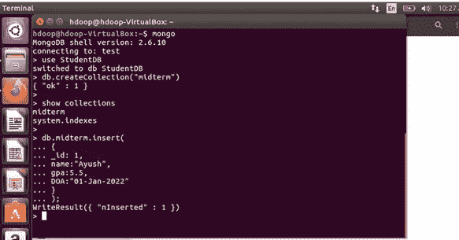

要插入多个文档或批量文档，请运行以下命令:

db .期中.插入(

[

{

_id: 2，

姓名:“杰伦”，

绩点:5.8，

DOA:“2022 年 1 月 2 日”

},

{

_id: 3，

名称:“Aakash”，

绩点:8.5，

DOA:“2022 年 1 月 2 日”

}

]

);

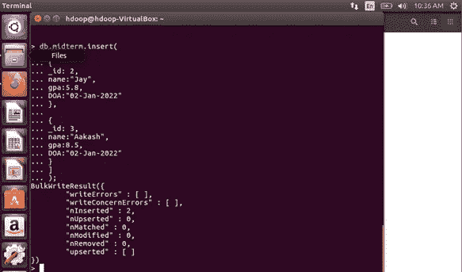

# **2。更新**

MongoDB 允许更新插入到集合中的文档。若要更新集合中的现有文档，请运行以下命令:

> db . terminal . update({ _ id:3 }，{ $ set:{ GPA:2.5 } })；

如果文档不在集合中，它将被插入，否则将被更新。使用以下命令更新记录

db .期中.更新(

{

_id: 5，

名称:“Rohit”，

绩点:6.8，

DOA:“2022 年 1 月 2 日”

},

{$set:{gpa:6.5}

}，{upsert:true}

);

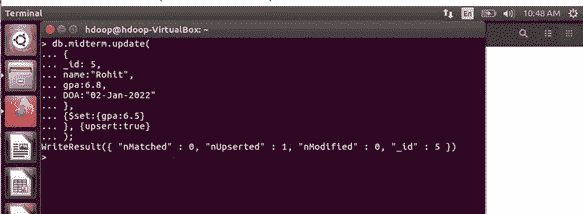

若要在集合中添加其他属性，请运行以下命令:

db . terminal . update({ _ id:3 }，{ $ set:{ class:" BDA " } })；

# **3。读取操作:**

在 MongoDB 中读取文档表单集合非常简单。find()方法允许读取/显示集合中可用的记录。

> db .期中. find()；

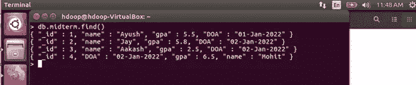

为了格式化读取结果，我们可以使用 pretty()方法

> db . terminal . find()。蛮()；

要在集合中查找特定文档，请运行以下命令:

> db . terminal . find({ name:" ayu sh " })。漂亮()

要仅显示集合期中所有文档的名称，而不应显示标识符 id，请运行以下命令:

> db . terminal . find({ }，{name:1，_id:0})。漂亮()

这里，_id:0 表示 _id 将不包括在结果中。

> db . terminal . find({ }，{name:1，gpa:1，_id:0})。漂亮()

> db . terminal . find({ _ id:1 }，{name:1，gpa:1})。漂亮()

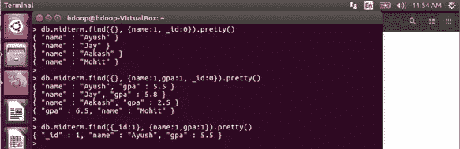

您可以使用条件运算符在满足搜索条件的基础上执行所需的输出。关系运算符有

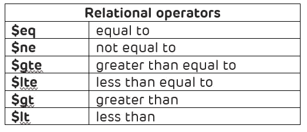

要从 id 为 1 的期中收集中选择名称 gpa，请运行以下命令:

> db . terminal . find({ _ id:1 }，{{}，name:1，gpa:1})

> db . terminal . find({ GPA:{ $ eq:5.5 } }，{name:1})

> db . terminal . find({ GPA:{ $ lt:5 } })。漂亮()

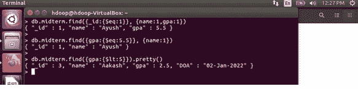

**其他操作员**

在名单中

nin 代表不在列表中

举个例子，

> db . terminal . find({ GPA:{ $ nin:[2.5，7.5]})

> db . terminal . find({ GPA:{ $ nin:[2.3，7.8]})

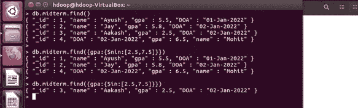

# **4。删除操作:**

可以通过以下命令从集合中删除文档:

> db . terminal . find({ name:" Rohit " })

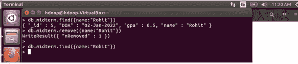

要从集合中删除文档，请运行以下命令:

> db . terminal . remove({ _ id = 4 })

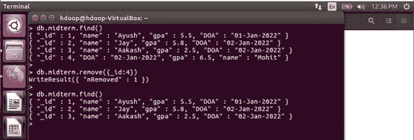

要删除集合，可以使用以下命令:

>数据库温度下降()

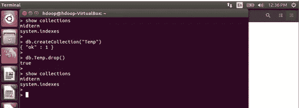

# **结论:**

在本文中，我探讨了 MongoDB 中的基本操作创建、更新、读取和删除(CURD)。在 NOSQL 文档数据库 MongoDB 上执行这些操作非常简单。我确信，它可以成为 MongoDB 新手用户的一个起点。如今它被广泛使用。

总结笔记时，感谢您的阅读，并随时分享您的意见。你的评论一定会帮助我更好地展示内容。下周见。

 [## Mlearning.ai 提交建议

### 如何成为 Mlearning.ai 上的作家

medium.com](/mlearning-ai/mlearning-ai-submission-suggestions-b51e2b130bfb)