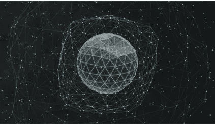
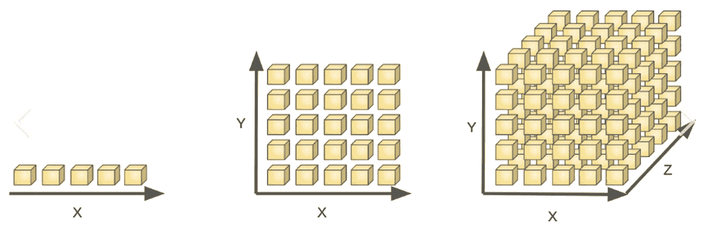
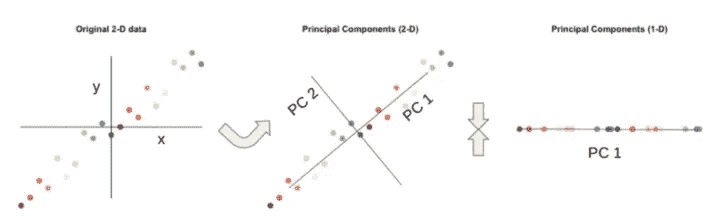
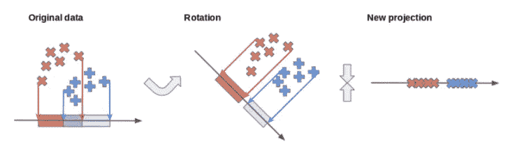
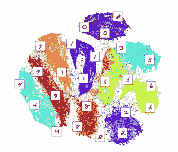
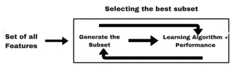

# 维数灾难解释！！

> 原文：<https://medium.com/mlearning-ai/curse-of-dimensionality-explained-1a725ea4df14?source=collection_archive---------4----------------------->

[**High dimensional space**](https://livewallpapers4free.com/sphere-abstract-4k-free-live-wallpaper/)

**诅咒:**对某物造成巨大伤害，这里指的是机器学习模型。

**维度** : 空间范围的度量，尤其是宽度、高度或长度等。在这种情况下，特征的数量代表维度的数量。所以，简而言之，高特征对我们的机器学习模型造成伤害。

## 维度的诅咒-

在使用高维数据的 ML 模型中，存在一个最佳特征数量，在该数量之后，模型不会增加精度。模型性能反过来会降低准确性，并使模型在计算上更加复杂。

你处理的维度越多，标准的计算和统计技术就变得越低效。

[1st,2nd and 3rd Dimensions in space](https://www.freecodecamp.org/news/the-curse-of-dimensionality-how-we-can-save-big-data-from-itself-d9fa0f872335/)

## 高维数据

1.  图像
2.  文本数据

## 为什么在更高维度会有问题？

数据的稀疏性是造成这种情况的主要原因。

假设有一颗钻石装在上面图片的盒子里。在第一种情况下，有 5 个盒子，更容易找到，因为它是一维的。在第二种情况下，比第一种情况更难找到钻石，因为有 25 个盒子。第三种情况非常困难，因为有 125 个盒子。

同样，增加维度会导致更高维度的复杂性增加(指数级)。随着数据变得稀疏，即彼此远离，统计和最大似然模型失效。

> 例如，k-nearest neighborhood，其中如果数据点非常远，比如它们相距 50 维，那么距离度量也彼此远离，我们无法将其视为邻居，因为这些点相距如此之远。

## 维数灾难的问题

1.  性能下降
2.  计算量增加
3.  距离度量复杂度增加。

## 解决方案-

为了解决这个问题，有一种技术叫做降维。我们减少数据集中的列数，并将其修改为新列。

> *降维有 2 种技术:* ***特征选择*** *和* ***特征提取*** 。

# 特征提取-

> *从现有的列集创建一个全新的列集。*

## i) PCA(主成分分析)

通过旋转轴将高维数据降低到较低的维度，其中主成分存储了最大的方差。

[**PCA Visual understanding**](https://www.freecodecamp.org/news/the-curse-of-dimensionality-how-we-can-save-big-data-from-itself-d9fa0f872335/) **(Image-Free code camp)**

## ii)线性鉴别分析

通过旋转轴将高维数据降维为低维，提高了类分离。

[**LDA visualized (image-freecodecamp)**](https://www.freecodecamp.org/news/the-curse-of-dimensionality-how-we-can-save-big-data-from-itself-d9fa0f872335/)

## iii)t-SNE(t-分布式随机邻居嵌入)

它是一种非线性降维技术，专注于在低维空间中将非常相似的数据点保持在一起。它非常适合嵌入高维数据，以便在二维或三维的低维空间中可视化。

**t-SNE visualised in MNIST Dataset**

# 功能选择-

> 从给定的具有高信息量的数据集中选择一组列。

## I)向前选择-

在每个阶段，该估计器基于 ML 算法中估计器的交叉验证分数来选择最佳特征子集。

[**Forward selection process**](https://towardsdatascience.com/top-7-feature-selection-techniques-in-machine-learning-94e08730cd09)

## 二)逆向淘汰-

这是一种迭代方法，我们最初从所有特性开始，在每次迭代之后，我们删除最不重要的特性。当移除特征后模型的性能没有改善时，我们停止。

> ***步骤 1)*** *选择一个显著的 p 值*
> 
> ***步骤 2)*** *拟合模型*
> 
> ***步骤 3)*** *选择具有最大 P 值的预测值和*
> 
> ***步骤 4)*** *丢弃该预测值。*

## iii)双向消除-

它类似于向前选择，但不同之处在于，添加新要素时，它还会检查先前添加的要素的重要性，如果发现任何先前选择的要素不重要，它会通过向后消除来简单地移除该要素。

> *组合* **正向选择***和* **反向淘汰** *。*

感谢阅读！

关注我了解更多关于 DS 和 ML 的内容。

 [## Mlearning.ai 提交建议

### 如何成为 Mlearning.ai 上的作家

medium.com](/mlearning-ai/mlearning-ai-submission-suggestions-b51e2b130bfb)