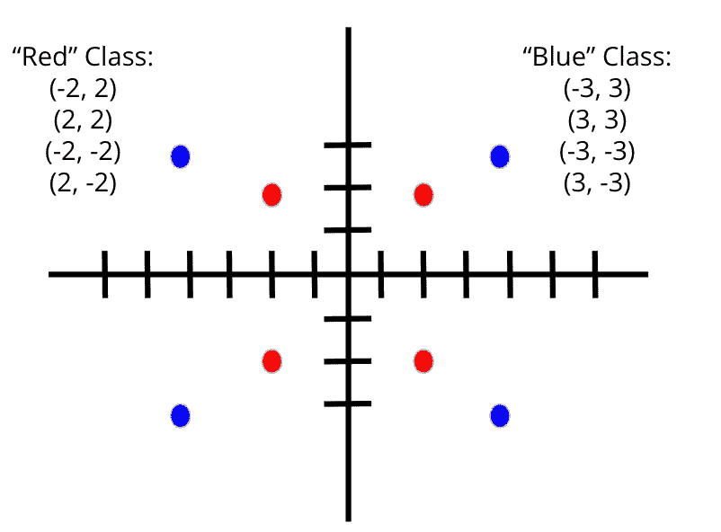
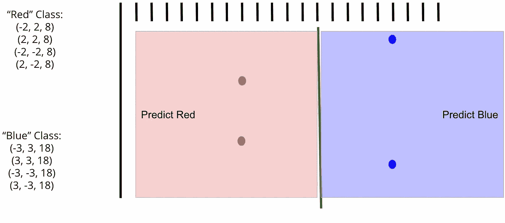
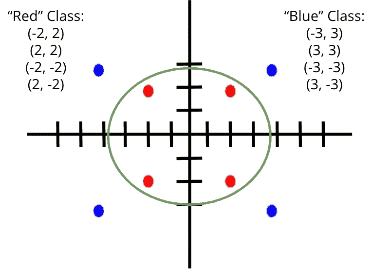
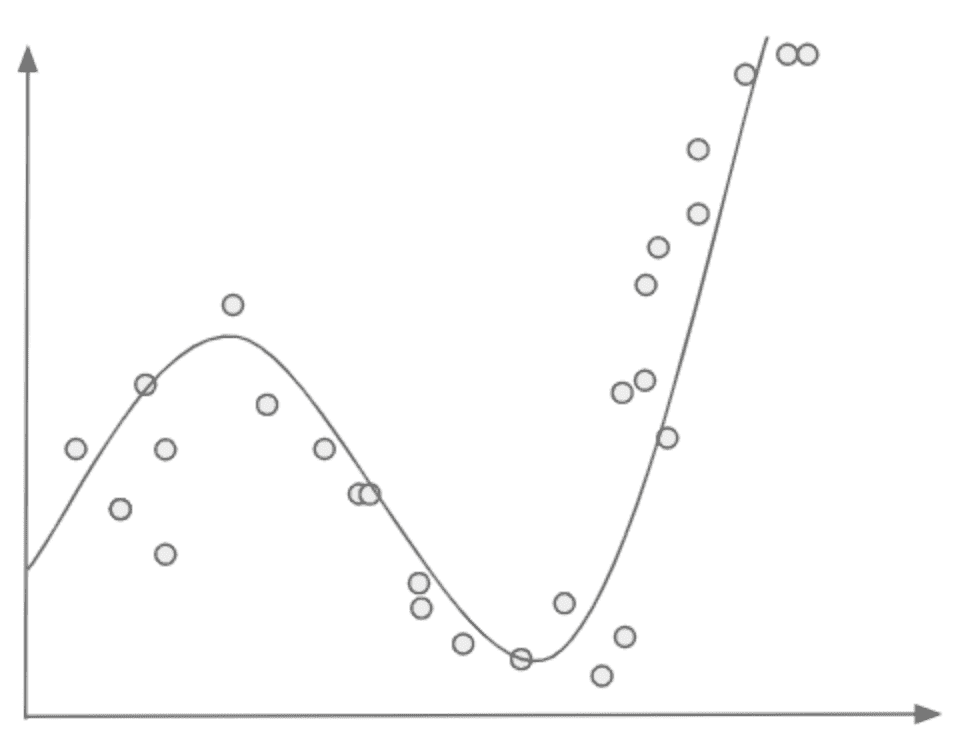
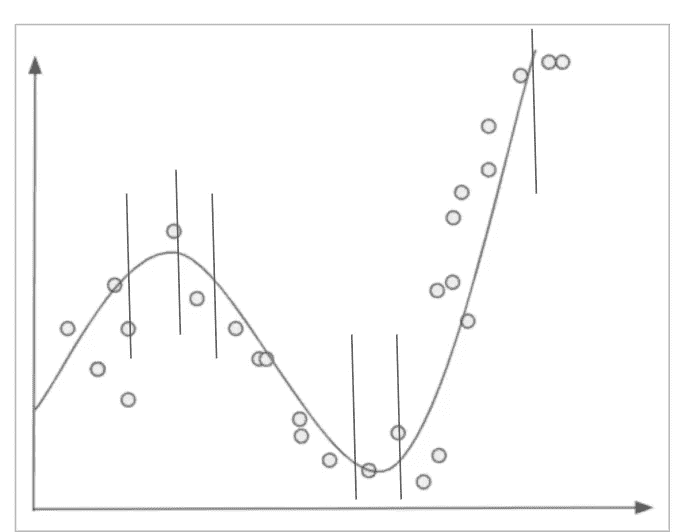

# 弯道，平地

> 原文：<https://medium.com/mlearning-ai/curving-the-straights-hilling-the-flats-a7a5da111cea?source=collection_archive---------4----------------------->

创造性地制作弯曲的分类器

我差点把这本书命名为《杜克的危险》，但我不确定这本书在今天是否会像 20 世纪 80 年代那样引起共鸣。对于外行人来说:

Yup. The whole set-up was for that one line in the song. You’re welcome.

当我写关于支持向量机和特征扩展的文章时，我并没有明确指出当你获取如下数据时会发生什么:

…并添加一个新的维度，使其可分离，如下所示:

有趣的是，如果我们翻回到我们的二维视图，看看这个分离器(它仍然只是一个穿过第三维的常规旧线性超平面)，它看起来好像我们已经使用我们的线性分类器绘制了一个圆形。

Spooky!

在这种情况下，这只是通过添加第三维度引入的一种错觉——我们定义的超平面绝对是平的和直的。如果你想对这个概念进行有趣的探索，看看这个视频，在大约 90 秒的时候，他们展示了一个三维气球穿过二维空间，这可能会帮助你想象正在发生的事情:

Trippy!

这一切都很好，但如果我们需要使用机器学习来找到一个看起来像这样的函数呢？

Beats all you ever saw…

对于直的线性分类器，这是行的结尾(两个双关语，都是最明确的意图。也就是说，线性建模方法可以得到增强，以便这些更复杂的函数也可以以许多创造性的方式来拟合。

例如，您可能会以不同的方式处理预测变量，例如，一次方方、另一次平方、另一次 12 次方等。这可能导致我们在上图中看到的那种在正确点的摆动。或者你可以插入更复杂的数学，给每个变量赋予它自己的函数形式，调整直到你得到你想要的结果(最小化损失)。)您可以将训练数据分成一堆更小的分组数据集，并在区域基础上构建许多常规线性模型，然后将它们粘合在一起(取决于方法，有时称为“样条”)，然后根据一组规则平滑它们。

It was really just six linear classification problems all along! (Or 8? 10? 12?….)

类似地，您可以从 k-NN 开始，首先定义 k 个离测试点最近的点，然后在该数据子集上构建一个简单的线性分类器。或者你甚至可以结合以上的各种组合(以及你能想到的任何其他创意)。)如果你能想象得到，有人可能已经在 Caret 或 Scikit-Learn 中内置了该功能。

曲线函数——它们不再只是决策树的专利了！:)

在可用于生成复杂函数的改进线性方法中，多层感知器(也称为神经网络)及其分支无疑是当今解决最大、最复杂的数据科学问题的一些最受欢迎的算法，在接下来的几篇博客文章中，我将尝试解开这些谜团，并深入探究其背后发生的事情。但在我深入研究深度学习之前(抱歉，但我不能保证这是最后一次……)，我想承认还有其他线性方法可以产生类似的结果。根据您的使用情况，这些其他方法(特别是一般的加法建模或 GAM)可能会提供可解释性方面的信息，比当今大多数深度学习方法更容易获得，因此实际上可能是更好的选择。值得检查这些替代方法，并可能将它们添加到您的数据科学工具包中。

 [## Mlearning.ai 提交建议

### 如何成为 Mlearning.ai 上的作家

medium.com](/mlearning-ai/mlearning-ai-submission-suggestions-b51e2b130bfb)