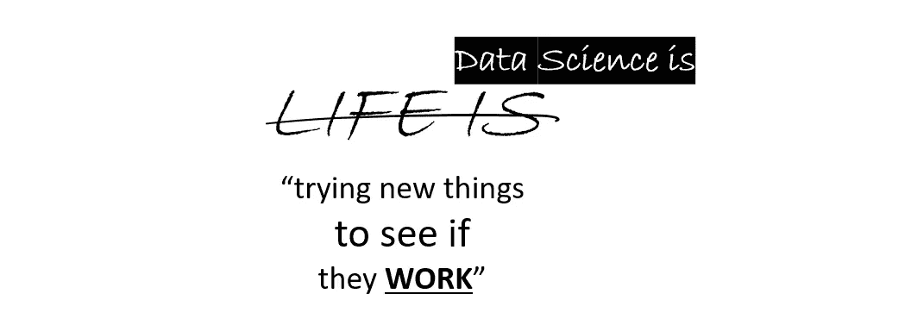
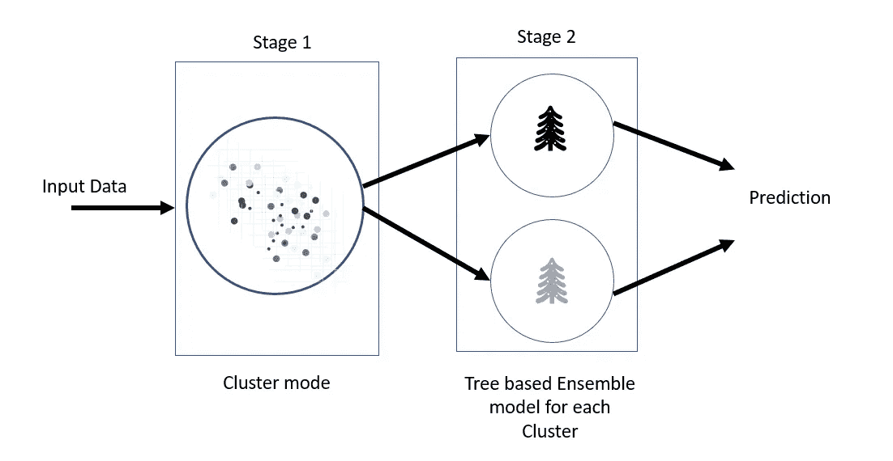
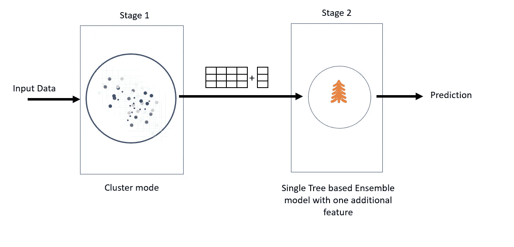

# 二手车价格预测的定制集成方法——第一部分

> 原文：<https://medium.com/mlearning-ai/custom-ensemble-methods-for-used-car-price-prediction-part-i-9a941aa7656d?source=collection_archive---------9----------------------->

## 这是集中讨论高级设计方法的系列文章的第一部分。本系列的第二部分将讨论这种设计的代码实现。

Photo by [Mpumelelo Macu](https://unsplash.com/@mpumelelomacu?utm_source=medium&utm_medium=referral) on [Unsplash](https://unsplash.com?utm_source=medium&utm_medium=referral)

二手车的(买/卖)价格预测本质上是一个回归问题。并且传统上使用线性回归或一种基于树的集成方法来处理。

根据可用于建模的数据集/特征，这两种方法或其中一种方法都可以产生好的分数。

然而，由于线性回归需要更多的数据清理和预处理，再加上通常比集成方法得分低，数据科学家通常最终会选择集成方法中的一种作为他们的首选算法。

这些是业内经过充分研究和广泛实施的方法，并且已经产生了得分通常在 90+ %范围内的下降结果。

使用类似的方法，我们能够在“Travis Car Sales”(出于显而易见的原因，这是一个虚构的公司名称)的 Random Forest 上获得大约 96%的(r square)分数。NDA，适当的数据和所有..).

> 这是否意味着没有改进的余地？
> 
> 绝对不行。
> 
> 进一步改进容易吗？
> 
> 可能也不会。

作为一个终生研究“变化”的人，我决定尝试一些新的东西，争取更好的模型准确性。我们想到了下面讨论的两种新颖的定制集成方法:

## **方法 1-使用聚类和多模型的定制集成。**

Method 1

我们首先将数据集输入到一个聚类模型(如 k-均值、k-模式等)。)将数据分成“k”个组。每个组都有自己的基于树的集合模型(如随机森林，XGBoost 等)。).这种架构可以进一步提高准确率。然而，它也有自己的缺点。

> 缺点—很明显，ML 模型的总数= 1+k。因此，如果 k=4，我们最终得到总共 5 个 ML 模型(第 1 阶段 1 个，第 2 阶段 4 个)。就可伸缩性和维护而言，体系结构的复杂性大大增加了。由于每个 ML 模型都有单独的管道，因此对模型的持续监控和再训练也需要更多的工作。

然而，在大多数情况下，使用这种体系结构的优点超过了复杂性的缺点。

## **方法 2——使用聚类和单一模型以及特征工程进行定制集成。**

Method 2

在这种方法中，我们在很大程度上解决了方法 1 的复杂架构的缺点。阶段 1 与方法 1 相同。但是，我们不是在阶段 2 中创建“k”模型，而是首先将聚类模型的输出作为新特征添加到原始数据集中，然后在阶段 2 中将其提供给单个集成模型。因此，这种体系结构不是以 1+k 个模型结束，而是产生 1+1 =2 个模型。

> 缺点-虽然这种架构比方法 1 简单，但它仍然需要 2 个模型和一个中间的“特征工程”步骤，以将聚类阶段的结果组合为原始数据集中的一个新特征。精度往往略低于方法 1。

这两种方法通常会产生更好的准确度分数，除非数据集不适合聚类。

注意——我将在本系列的第二部分发布这两种方法的代码实现。

感谢阅读！敬请关注更多内容。

 [## Mlearning.ai 提交建议

### 如何成为 Mlearning.ai 上的作家

medium.com](/mlearning-ai/mlearning-ai-submission-suggestions-b51e2b130bfb)