# 使用 Azure Translator 文本认知服务进行自定义翻译

> 原文：<https://medium.com/mlearning-ai/custom-translation-with-azure-translator-text-cognitive-service-9f62322bb76e?source=collection_archive---------6----------------------->

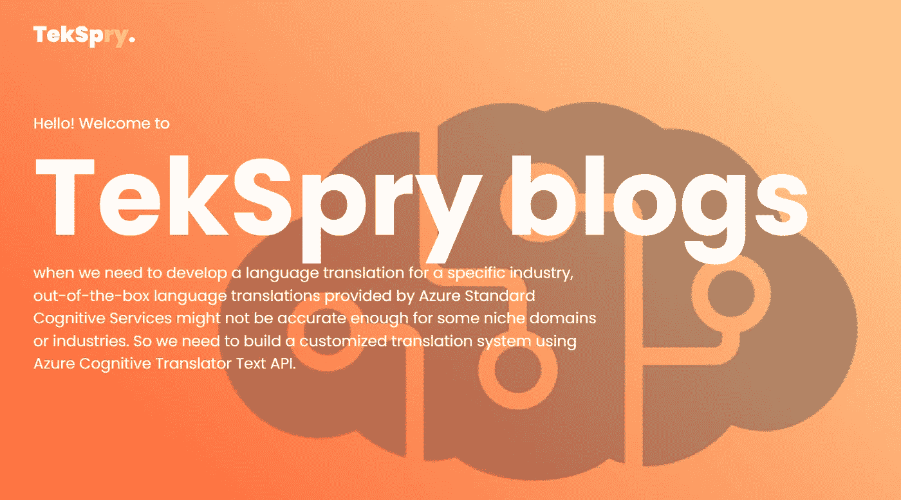

Title Image

如今，随着全球业务的扩展，对构建多语言系统的需求也呈指数级增长。对于在多个地区提供的产品，不可能用多种语言构建系统及其文档，因此总是需要实时或离线翻译机制，因为涉及每种语言的翻译人员会非常耗时且昂贵。

这个问题可以通过为翻译开发机器学习模型来解决，但开发 ML 模型包括陡峭的学习曲线和人工智能领域的专业人员。为了解决学习曲线和资源的挑战，云提供商推出了翻译认知服务，该服务抽象了完整的 ML 实施，组织可以使用他们的特定数据来直接训练模型并加以利用。即使我们没有用于训练的特定数据，这些认知服务也暴露了预先训练的 ML 模型，这些模型可以被客户端应用直接使用。一旦微软 Azure 提供了名为 **Azure Translator Text API** 的服务

# 特定领域翻译

尽管提供实时或离线翻译并不新鲜，但 Google translator 或 Azure translator 等服务可以满足这一需求。但是对于这种 API 来说，翻译的质量一直是个问题，因为不同的行业和科学领域都有自己的词汇，而这些词汇是非常专业的，并不用于日常翻译。这就是我们使用标准翻译器可能得不到最佳结果的原因，也是需要定制翻译器的地方。

**Azure Translator Text API** 为标准和自定义翻译器提供支持，这里我们将讨论使用 Azure cognitive 的**自定义翻译器**。要创建自定义翻译器，我们需要预先存在的文档，如产品手册、技术文档等。为了训练。

# 创建 Azure Translator 文本 API 认知服务

创建自定义翻译器的第一步是创建 Azure Translator Text API 的新实例，为此我们可以登录 Azure portal。在这里，我们可以选择订阅和资源组，在这里我们需要对我们的资源进行逻辑分组。在这里，我创建了一个新的资源组“自定义-翻译-演示”，我们可以使用任何现有的资源组。

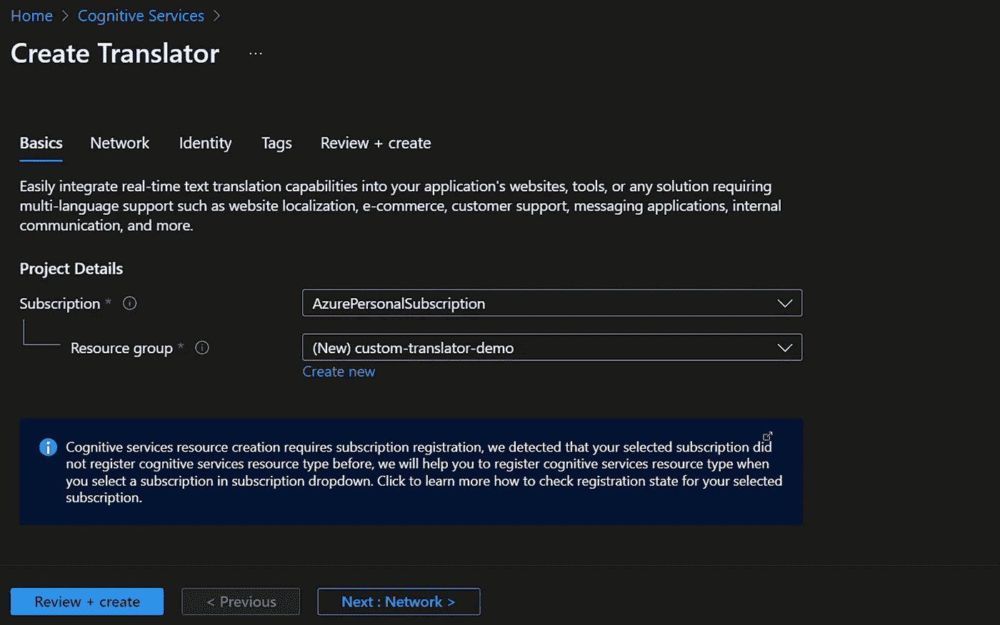

Create Translator Cognitive

接下来，我们将选择区域，并为 Translator Text API 的实例提供唯一的名称。我选择了“自定义-翻译-演示”。接下来，我们必须选择定价层，我选择了 F0，这是一个免费层，每月翻译 200 万个字符。如果我们的翻译字符超出这一范围，我们需要升级定价层。

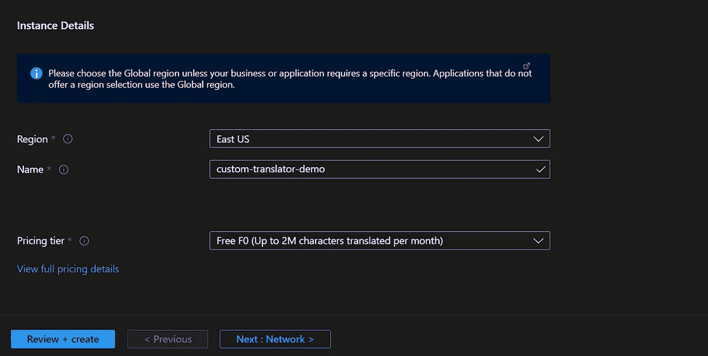

对于演示，我们可以保留所有默认选项并启动部署，这可能需要几分钟时间。部署完成后，将会看到以下屏幕。

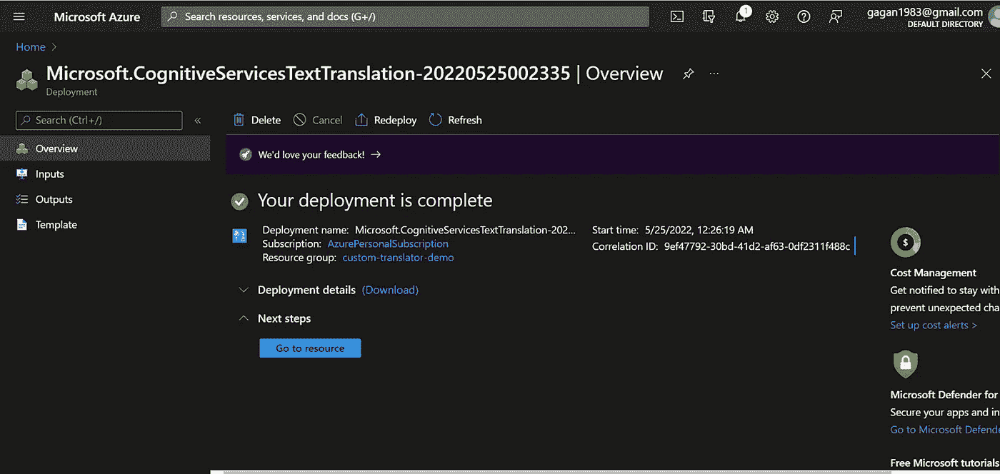

Translator cognitive created

部署完成后，我们可以转到“自定义-转换器-演示”并单击“密钥和端点”。在这里，我们可以看到有 2 把钥匙，我们可以点击复制图标，复制任何一把钥匙(钥匙 1，钥匙 2)。我选择了键 1。

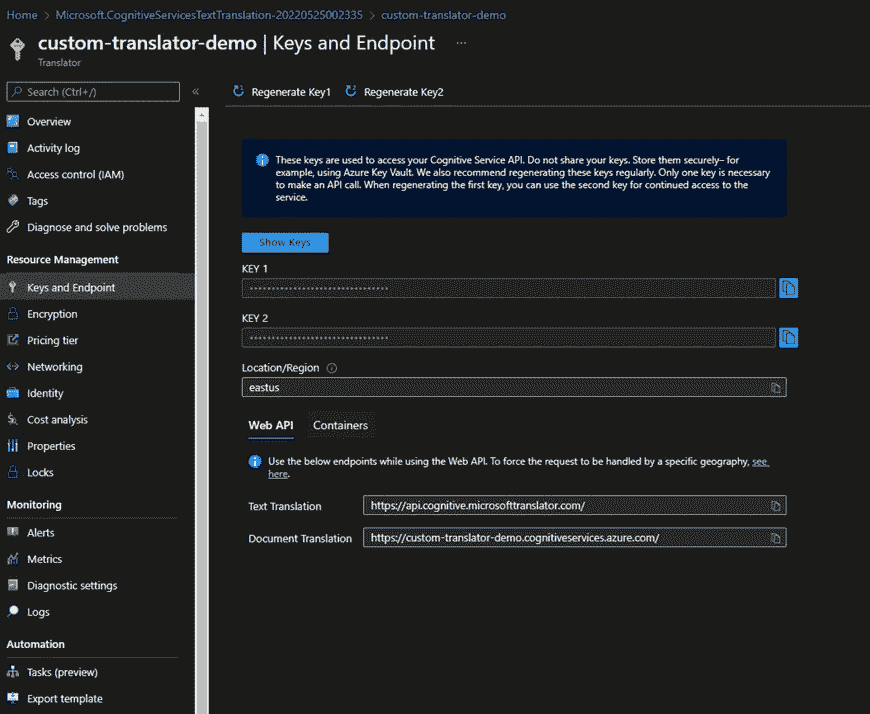

Keys and End points details

# 创建自定义翻译

一旦在 Azure 中创建了翻译器文本 API，并且我们获得了密钥，现在我们将转到 [Azure 自定义翻译器门户](https://portal.customtranslator.azure.ai/)。这是创建和管理翻译项目的独立门户。

## 创建新工作区

我们可以使用 Azure 凭据登录门户，然后我们将登陆到空的工作区页面。首先，我们将创建一个名为“自定义-翻译-演示”的工作空间。

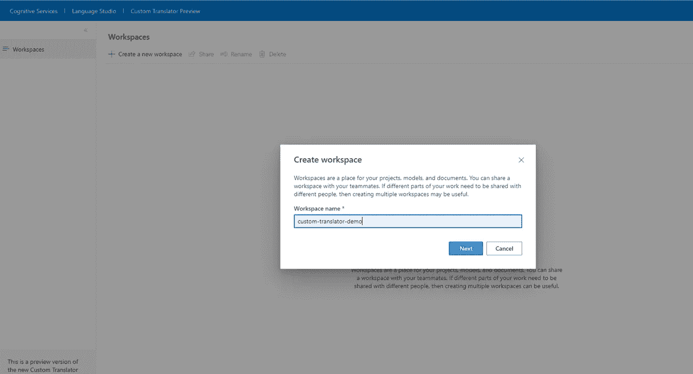

Create Workspace

在下一步中，我们必须选择区域并添加资源键。在这里，我们将选择我们在 Azure 中创建了 Translator Text API 实例的同一地区，即美国东部。接下来我们将添加从 Azure portal 复制的密钥作为认知服务密钥。

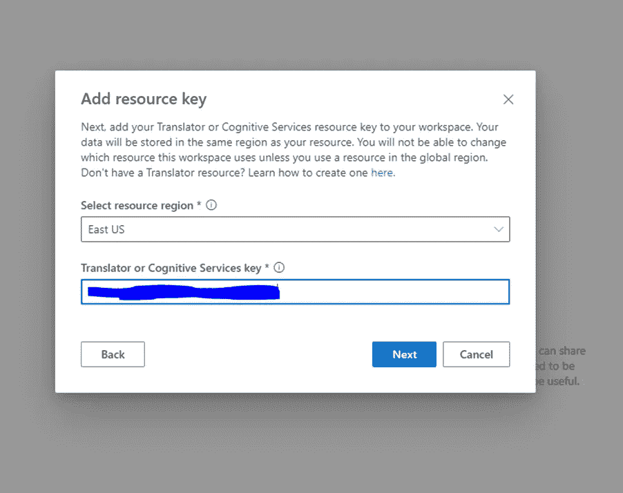

单击“下一步”将添加资源键。

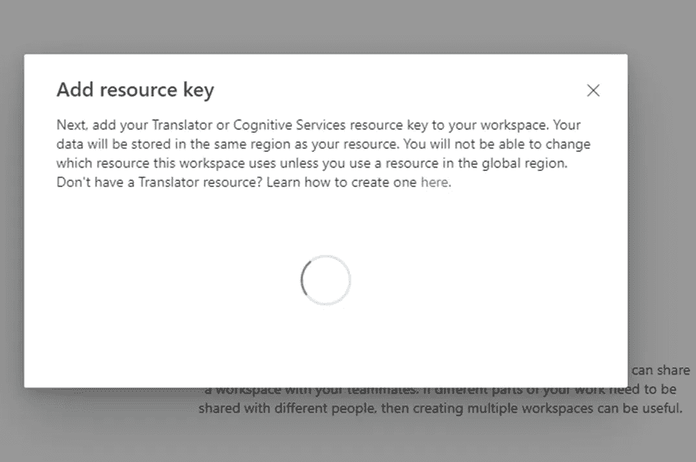

现在工作区已经创建，我们可以交叉检查工作区设置中的详细信息

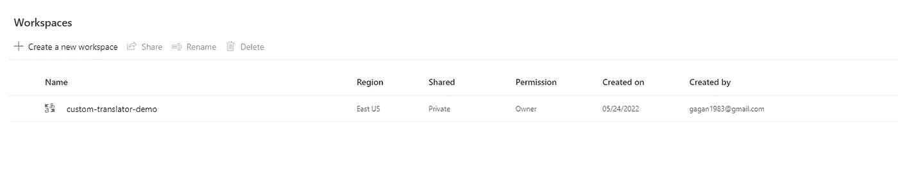

Workspace created

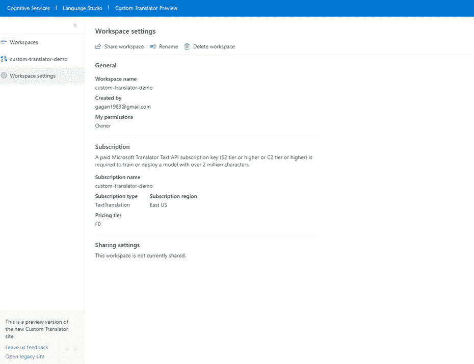

Workspace settings

## 创建新项目

单击“自定义-翻译-演示”工作区，我们必须通过单击“创建项目”链接创建一个新项目。点击“创建项目”链接，将打开一个弹出窗口，要求提供一个唯一的项目名称，我们将添加“自定义-翻译-演示-prj”，然后选择源语言和目标语言。

目前自定义翻译支持 111 种语言。这里我们将选择英语作为源语言，法语作为目标语言。

正如我们所看到的，我们需要选择另一个必填字段“Domain”。目前该服务支持 44 个域名。我使用 Azure 文档来训练我们的英语和法语模型，所以将选择“技术”作为领域。但是您可以根据用例选择合适的领域。

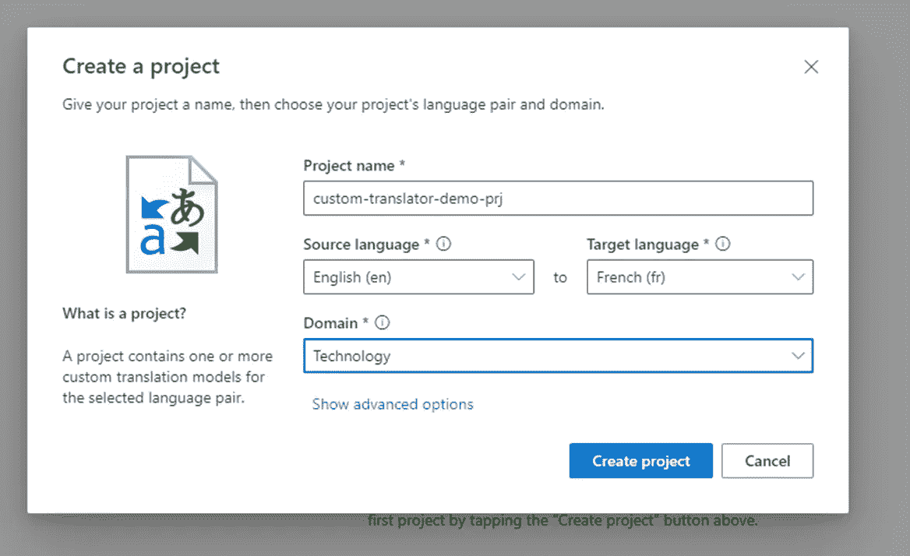

Create New Project

选择域并单击“创建项目”后，就会创建一个新的翻译项目。这里需要注意的一点是，如果我们创建另一个相同领域的项目，源语言和目标语言系统将不允许我们这样做。

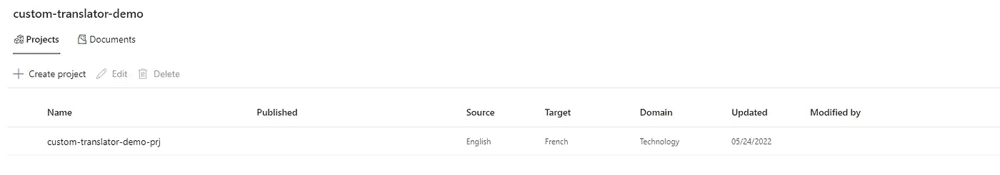

New Project created

## **添加单据集**

一旦我们从项目列表中选择了项目，我们就可以管理文档了。这里我们将选择“添加文档集”。单击“添加文档集”,我们将在下面的屏幕中选择文档集类型。如我们所见，这里有多种选择。

训练集是定制模型的基础，我们选择不同语言的同一个文档，上传到训练模型。这就是我们将选择训练我们的模型。

测试集用于计算上传文档的 **BLEU** 分数。BLEU 代表“双语评估替角”,它将自动翻译的连续短语与在参考翻译中找到的连续短语进行比较，并以加权方式计算匹配的数量。我们可以在这里了解更多关于布鲁[的信息。当我们想要比较文件的翻译质量时，就使用它。](https://docs.microsoft.com/en-us/azure/cognitive-services/translator/custom-translator/what-is-bleu-score)

顾名思义，Tuning Set 用于优化我们现有的模型，而 Dictionary set 用于我们需要为单词或短语添加一些特定翻译的时候。

Adding document sets

因此，我们将为我们的用例选择训练集，然后单击 Next。

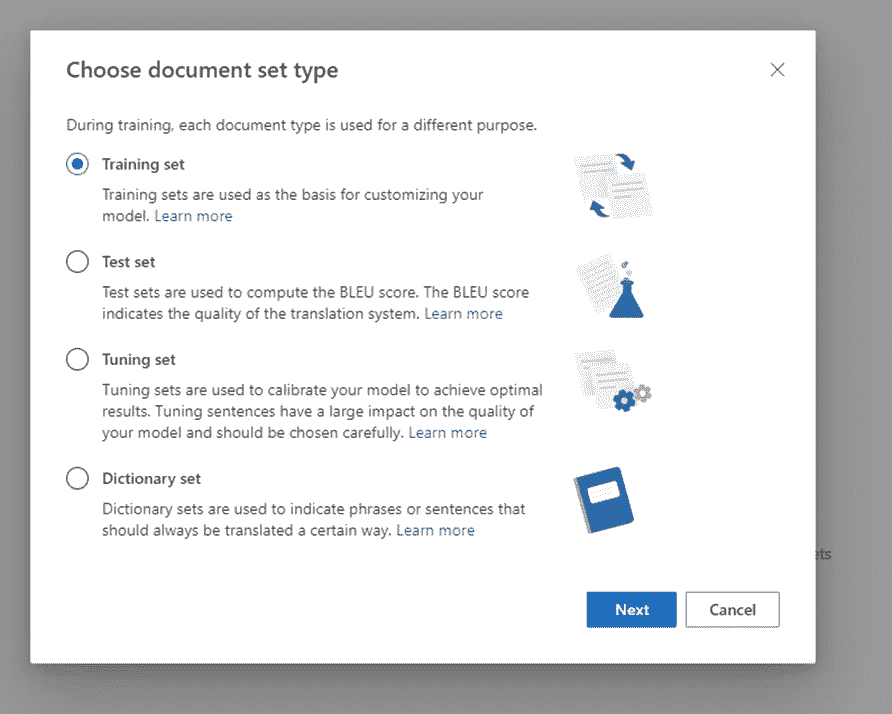

Selecting document set type

Azure 提供了不同的选项来上传培训文档。我们可以上传之前选择的语言的并行文档。它还提供上传 TM 文件或 ZIP 格式。

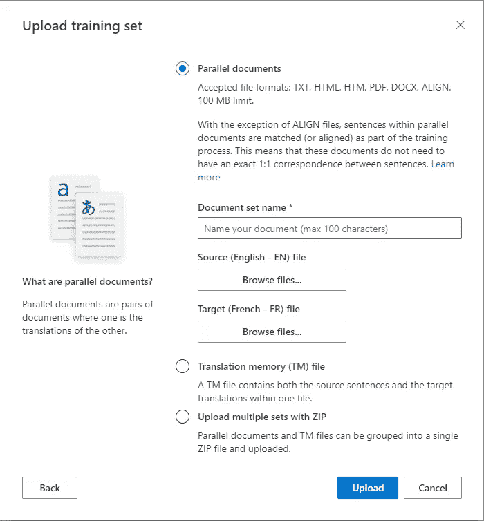

Uploading parallel documents

对于我们的情况，我们将考虑并行文档，并上传文档的英文版本和法文版本。我使用 Azure 文档作为这个演示的各种语言的样本文档，并单击“上传”按钮。

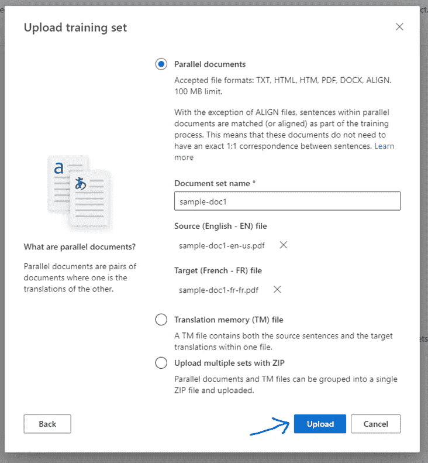

Uploading parallel documents

文档上传后，我们可以在管理文档屏幕中查看它们。

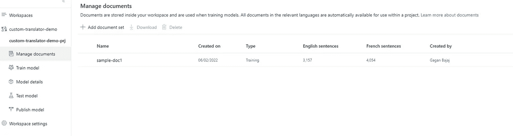

Parallel document sets uploaded

接下来，我将选择另一个示例文档并上传它。

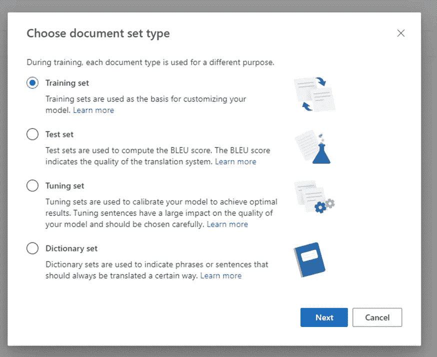

Selecting document set type

从文档列表中选择样本文档 2 的英语和法语版本。

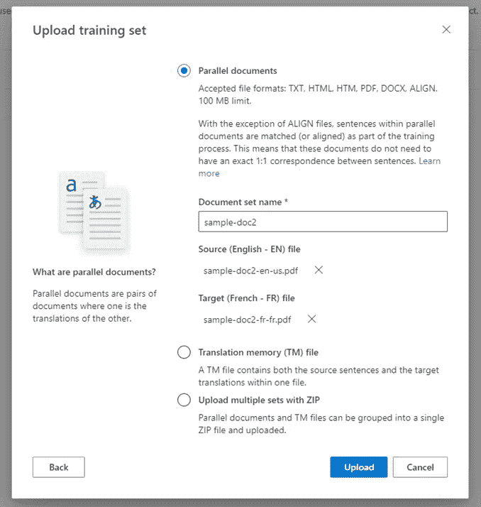

Uploading parallel documents

这两个平行的文档集都已上传，可以在管理文档部分查看。

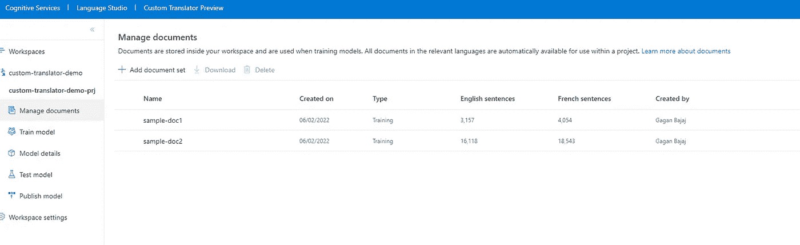

Multiple documents uploaded

## 培训模式

一旦上传了文档，我们就可以开始训练模型了。对于培训模型，我们必须在门户左侧导航中选择“**培训模型**”链接。

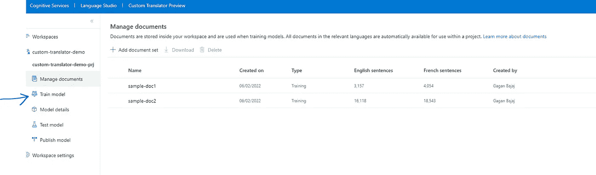

Train Model Landing screen

接下来，我们将进入列车模型页面，在这里我们必须执行 3 项操作:

1.  我们必须提供我正在添加的“自定义-翻译-演示-模型-培训”的名称。您可以根据用例添加名称。
2.  接下来，我们必须选择培训类型。现在培训可以分为两种类型，**全面培训**和**仅字典培训**。

**全面训练:**取文档集，基于上一步上传的并行文档集全面训练模型。

**仅字典训练:**如果我们已经上传了字典文档，并且只想基于字典训练模型，则进行该训练。

对于本演示，我们只上传了平行文档，因此我们将选择完整培训类型。正如我们在下图中看到的，上一步上传的并行文档列表可用于培训。样本文档 1 具有 3157 个英语句子和 4054 个法语句子，其中样本文档 2 具有 16118 个英语句子，而等效的法语文档具有 18543 个句子。

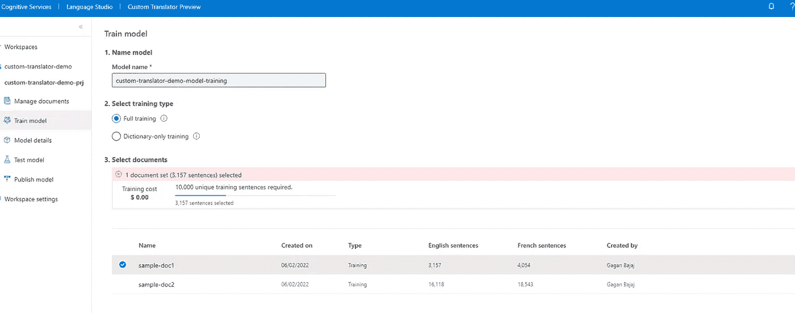

error when document has less than 10k sentences

> 为了训练具有平行文档的模型，至少需要 10000 个训练句子

正如我们在上面的图像中看到的，当我们选择样本-doc1，它有少于 10000 个训练句子，我们将得到一个错误和“现在训练”按钮保持禁用。

当我们选择下图所示的两个样本文档时，标签将变为绿色，并且“立即培训”按钮将被启用。除此之外，我们还可以看到一部分培训成本，这有助于估计翻译服务的成本，因为我选择了免费层，所以成本为 0.00 美元。

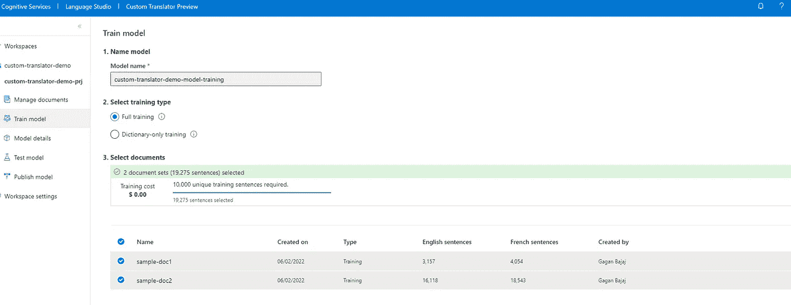

successfully selecting training documents

接下来，当我们单击“立即培训”按钮时，我们将收到一个警告，通知我们定制模型的培训将需要几个小时，一旦开始就不能取消。

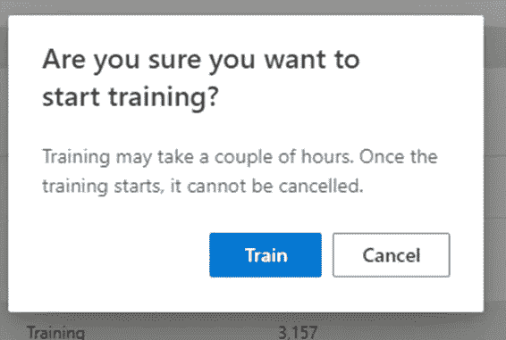

Train Documents

接下来，我们将单击“Train”按钮，但不是开始培训，而是出现以下错误

***“你的训练目前包含超过两百万个字符。你需要一个付费的翻译器文本 API 订阅来训练一个有这么多角色的模型。”***

原因是当我们选择超过 10000 个句子的自由层时，将有超过 200 万个字符，这是自由层所不支持的。

因此，我们必须回到 Azure 门户网站，将定价层更新为 S1(按需付费)

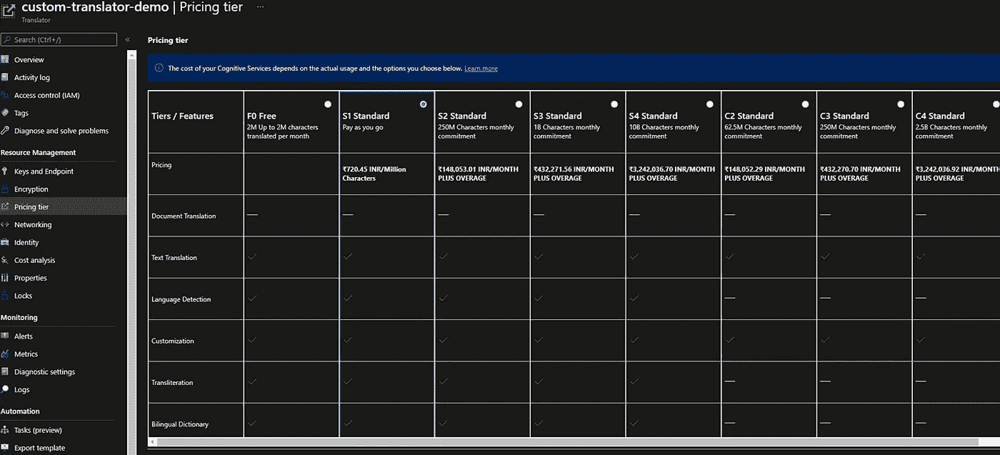

Upgrading Pricing tier

一旦我们更新了我们的定价层，我们将选择包含超过 10k 个句子的 sample-doc2，并开始训练我们的定制模型。这一次我们将不会得到任何错误，但我们将得到新的通知，提醒我们培训正在进行中，需要几个小时才能完成。所以要等几个小时。这一次的培训费用是 44.86 美元。

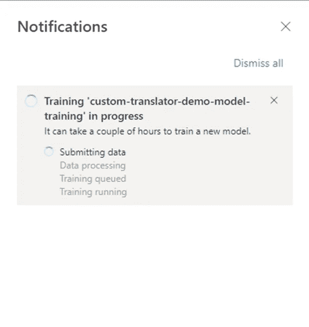

## 模型细节

培训完成后，我们将转到模型详细信息部分，查看我们的培训模型，如下图所示。如我们所见，它为我们提供了 BLEU 分数和基线 BLEU 的信息。

基线 BLEU 分数基于标准翻译计算，而此处的 BLEU 分数基于自定义翻译。我们可以看到，超过 10k 个句子的单个文档的自定义翻译 BLEU 低于标准翻译 BLEU 分数，这不是很好。

为了更好的翻译质量，我们需要比基线 BLEU 更高的 BLEU 分数。

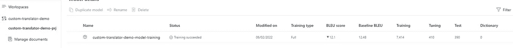

Trained document with low BLEU score

为了提高我们的 BLEU 分数，我们将再上传 3 个平行文档，并再次训练我们的模型。这将花费我们额外的 29.27 美元。

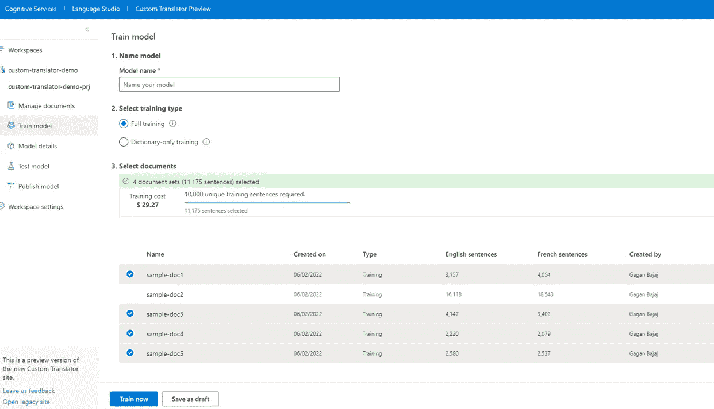

Training Multiple parallel documents

定制模型完成后，我们可以在模型详细信息部分看到另一行。这一次 BLEU 得分为 65.49，高于基线 BLEU 的 56.96。这意味着与标准翻译相比，我们的定制翻译将提供更好的翻译。

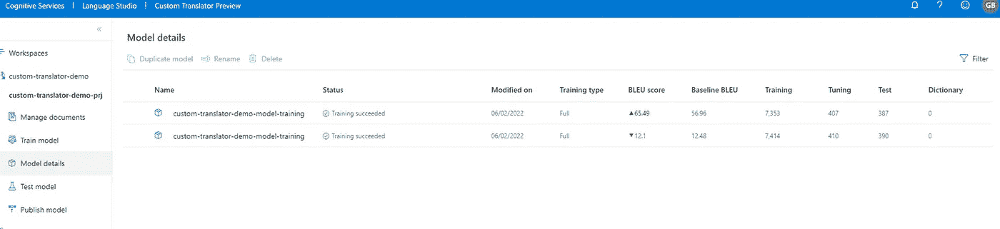

Trained model with high BLEU score

当我们点击 BLEU 得分为 65.49 的型号名称时，我们可以看到以下详细信息。这里有一点要注意，我们没有提供任何调优或测试数据，但它显示了 407 和 387 个调优和测试的句子。这是因为如果没有上传调整和测试文档，系统将在创建模型时从训练集中随机挑选 2，500 个句子用作测试集，并将其用作测试集。

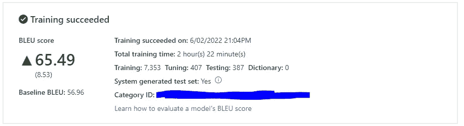

Model details

以下信息提供了培训文档的详细信息。它显示了每个文档中有多少英语和法语句子。除此之外，它还显示了从这些英语和法语句子中提取了多少对齐的句子，以及其中有多少用于翻译。我们可以看到，使用的句子比对齐的句子少，这是因为剩余的句子用于训练和调整。

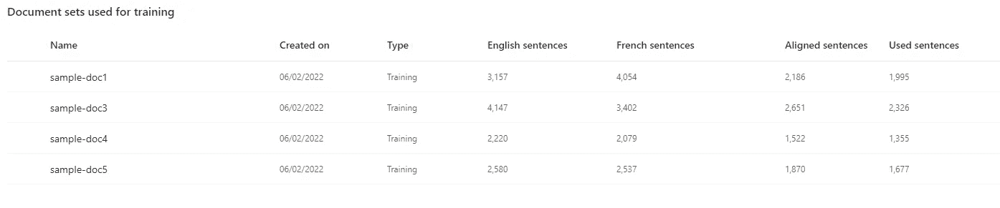

Trained model sentence information

## 测试自定义模型

要测试定制模型，让我们单击“测试模型”。接下来，我们必须选择需要测试结果的模型。

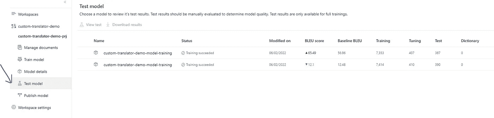

Test Custom Model

我点击了 BLEU 分数为 65.49 的模型，它打开了以下屏幕。在这里我们可以看到所有的测试，英语句子在左边，自动生成的法语句子在右边。

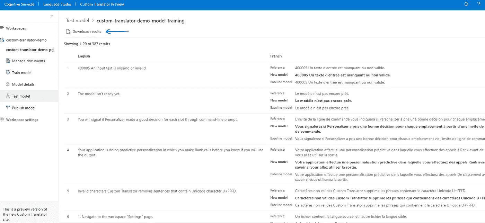

Test Model results

此外，它还提供了通过点击“下载结果”以文本格式下载所有引用翻译的规定

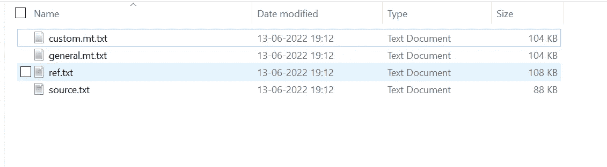

Download results

## 发布模型

现在我们的模型已经训练好了，可以部署了。要发布我们的模型，我们将单击“发布模型”选项卡，并选择 BLEU 得分为 65.49 的模型。

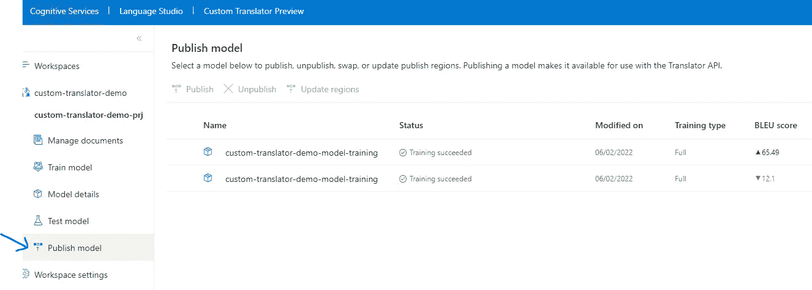

Publish Model

选择模型后，我们将单击“发布”按钮。

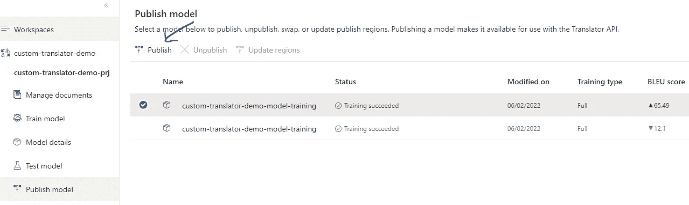

Publish model

单击 publish 按钮，我们将看到下面的弹出窗口，询问我们要在哪个地区部署我们的模型。目前它提供 3 个地区，北美，欧洲和亚太地区。我将在这里选择北美。它还显示了模型的托管费用。

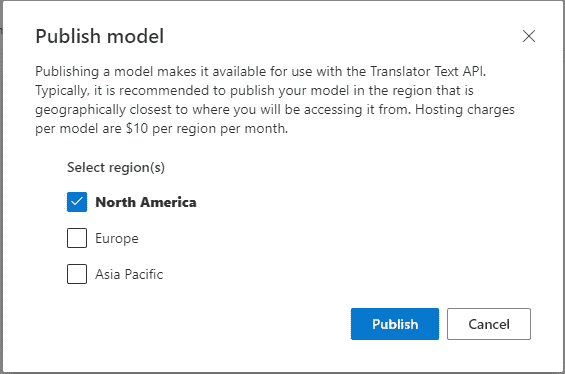

Selecting region

点击“Publish ”,我们会得到一个通知，告诉我们发布模型需要几分钟时间。

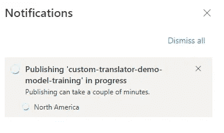

我们可以看到，状态从“培训成功”更改为“正在部署”。

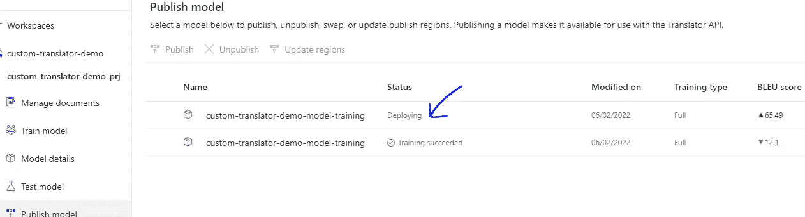

Deploying model

部署完成后，状态将变为“Published ”,并显示部署模型的区域。

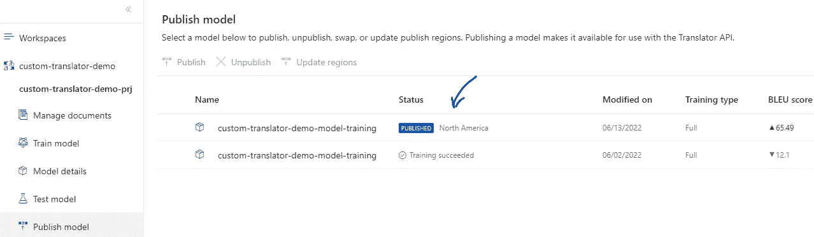

Model published

## 使用 Postman 通过 API 翻译

现在我们的新翻译器已经部署好了，我们可以使用 Translator v3 API 来翻译句子。对于演示，我们将使用 post man 来访问 API。

我们可以从 Azure portal 获得翻译端点和密钥。这里我们将使用文本翻译端点。

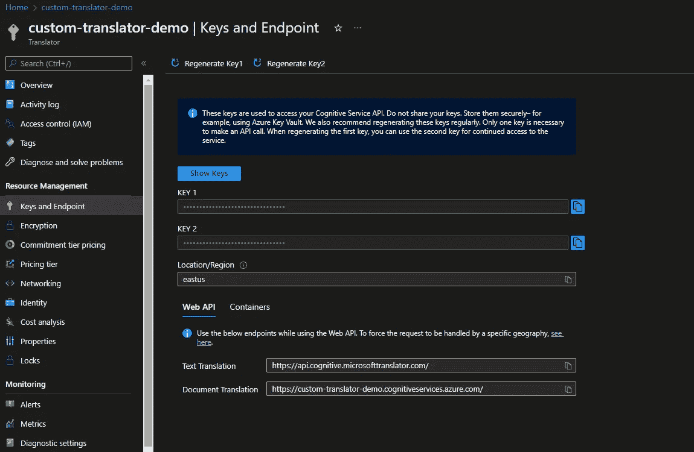

接下来，我们将打开 Postman 并创建一个端点为的新 POST 请求:

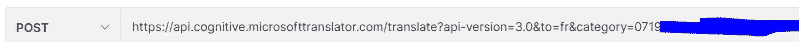

Translator api endpoint

这里我们将使用“*https://api.cognitive.microsofttranslator.com/translate?*”作为端点，并添加以下查询字符串参数。我们将使用的 API 版本是“ *3.0* ”，“*到*”是我们要翻译的目标语言，类别是 categoryID，我们将从自定义翻译器门户获得。

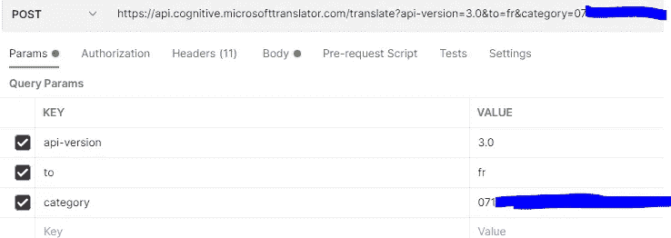

Query parameters

接下来，我们将在请求中添加以下 3 个标题。这里的订阅密钥是我们可以从 Azure portal 复制的秘密密钥。订阅区域是部署服务的区域，内容类型为 application/json

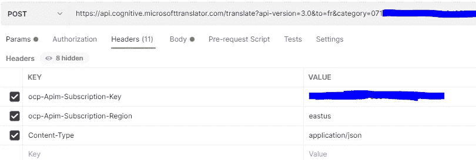

Headers information

现在我们的请求配置已经准备好了，接下来我们将准备主体。为了创建主体，我考虑了一个来自 Azure 文档的简单文本。

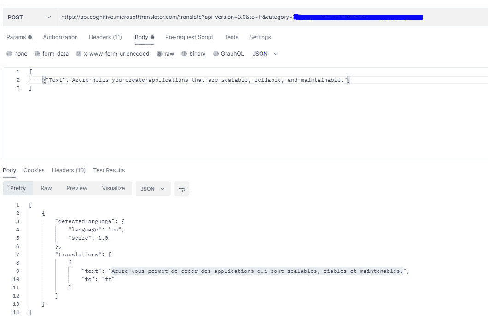

Custom Translation API response

当我们传递这句话时，我们可以看到“Azure 帮助您创建可伸缩、可靠和可维护的应用程序。”在 body 中点击“Send”请求，我们得到它的法语翻译以及检测到的语言和对“fr”参数的翻译。

现在，如果我们想测试同一文本的标准翻译，很简单，我们只需要删除“类别”查询字符串。所以我们要做的是删除“类别”查询字符串，然后点击“发送”请求。

Standard translation API response

我们仍然会得到回应，但正如我们所看到的，回应与自定义翻译略有不同。

这篇文章就是这么说的。下一步，我们可以用更多的文档集进一步训练我们的模型，以提高 BLEU 得分，并将翻译 API 端点集成到我们的应用程序中，用于实时或离线翻译。

> 声明:这是一个个人博客。除非明确声明，本博客中的任何观点或意见都是个人的，仅属于博客所有者，不代表博客所有者在专业或个人能力方面可能或可能不相关的人、机构或组织。

 [## Mlearning.ai 提交建议

### 如何成为 Mlearning.ai 上的作家

medium.com](/mlearning-ai/mlearning-ai-submission-suggestions-b51e2b130bfb)