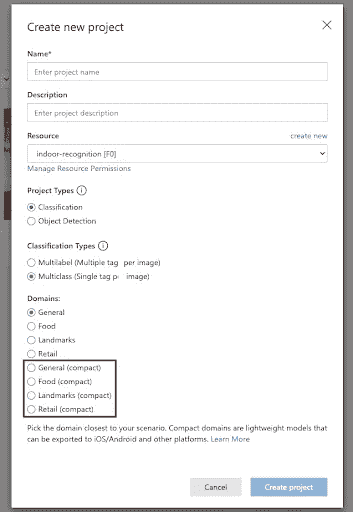
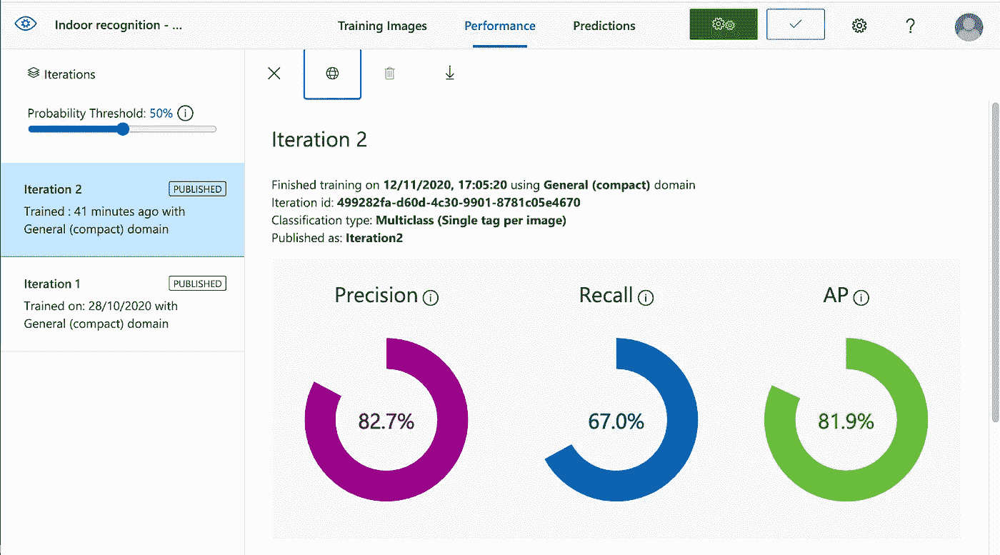
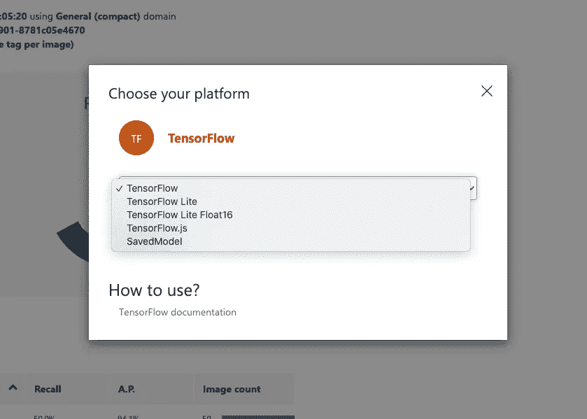
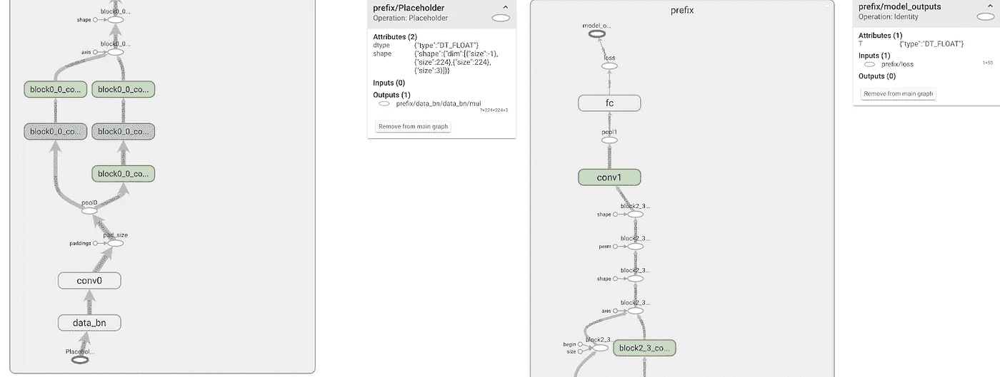

# 定制视觉“紧凑型”模型

> 原文：<https://medium.com/mlearning-ai/custom-vision-compact-models-62ac5a2e2687?source=collection_archive---------3----------------------->

正如我在上一篇文章中所承诺的，我们现在将重点关注定制视觉“紧凑型”模型。它们是什么？用例？与标准型号相比，它们的性能如何？


Photo by [Jamie Street](https://unsplash.com/@jamie452?utm_source=medium&utm_medium=referral) on [Unsplash](https://unsplash.com?utm_source=medium&utm_medium=referral)

# 紧凑的世界

一个非常有趣的定制视觉功能是可以导出一个简化版本的模型，在 Azure 环境之外的小型(IoT)设备或手机上运行。

当安装在设备中时，它将允许在没有互联网连接的情况下获得快速推断(因为它不需要访问外部 API)。因此，应用程序可以提供实时功能和/或离线支持。

# 它是如何工作的

在 Custom Vision 中使用紧凑模型与我们习惯使用其他模型类型没有什么不同。事实上，这是完全一样的，除了我们需要考虑的几个细节:

*   创建新模型时选择“紧凑”,每个域都有一个轻量级版本。不要担心，您可以稍后设置这个选项，这样您就可以在重新训练模型后导出它。



*   按照标准机制上传图像、标记和训练模型。
*   当您对结果满意时，从选项卡“Performance”中导出模型。似乎微软在构建这一功能时感觉很慷慨，因此您将能够导出模型，以便在大量不同格式的环境中使用，包括 TensorFlow 等知名的开源平台。
*   从那时起，这个模型就是你的了，你想怎么做就怎么做。您可以使用更多图像在本地重新训练它(这样您就不必在自定义视觉中支付额外的时间)或在外部系统中运行它。

# 测试模型

但是一切都是有代价的，所以我们将测试我们模型的独立格式的性能，以识别室内图像，并将其与我们上一篇文章中进行的调查中获得的结果进行比较。

为了遵循完全相同的步骤，我们再次运行我们的脚本，用 2500 幅图像来训练模型。经过 2 次迭代后，该模型呈现以下行为:



其显示了相对于标准模型(**精度** : 85.6%、**召回** : 79.5%和 **AP** : 89.9%)在 AP、精度以及特别是召回值方面的显著下降。这是我们从一个简化的实例中所期待的。

现在，让我们检查模型的性能，并通过使用单独的验证数据集检索 API 推理来模拟它在生产环境中的工作方式…

*   总计:500
*   正确预测:285
*   失败的预测:215
*   精度:0.571
*   回忆:0.57
*   平均预测时间:0.29 秒

…可以与之前的结果相比较…

*   总计:500
*   正确预测:363
*   失败的预测:137 次
*   精度:0.75
*   回忆:0.73
*   平均预测时间:0.53 秒

正如可以观察到的，精度和召回指标显示了额外的损失。另一方面，平均预测时间大大减少了(当模型安装在设备上时，这种差异甚至会更显著，从而节省了网络延迟时间)。

这些值是否足够将取决于您的应用程序的要求，但请记住，此时可以遵循不同的策略来改善结果(如使用更大的数据集训练模型或预处理图像以找到最佳图像配置)。

# 使用导出的模型

最后，我们将探讨 Tensorflow 导出模型的格式。



下载文件夹的内容由同一级别的 4 个文件组成:

*   **cvexport.manifest** —包含与自定义视觉项目和下载文件夹相关的信息。

```
{
  "DomainType": "Classification",
  "Platform": "TensorFlow",
  "Flavor": "TensorFlowSavedModel",
  "ExporterVersion": "2.0",
  "ExportedDate": "2020-11-13T12:02:17.8476449Z",
  "IterationId": "xx-xxx-xxx-xxx",
  "ModelFileName": "saved_model.pb",
  "LabelFileName": "labels.txt",
  "MetadataPropsFileName": "metadata_properties.json",
  "SchemaVersion": "1.0"
}
```

*   **labels.txt** —包含分类标签(在我们的例子中是不同室内场景类别的列表)。
*   **metadata _ properties . JSON**—包含与模型的训练和预处理相关的信息。

```
{
    "CustomVision.Metadata.AdditionalModelInfo": "Additional information about the model",
    "CustomVision.Metadata.Version": "1.1",
    "CustomVision.Postprocess.Method": "ClassificationMultiClass",
    "CustomVision.Postprocess.Yolo.Biases": "null",
    "CustomVision.Postprocess.Yolo.NmsThreshold": "null",
    "CustomVision.Preprocess.CropHeight": "0",
    "CustomVision.Preprocess.CropMethod": "FullImageShorterSide",
    "CustomVision.Preprocess.CropWidth": "0",
    "CustomVision.Preprocess.MaxDimension": "0",
    "CustomVision.Preprocess.MaxScale": "0",
    "CustomVision.Preprocess.MinDimension": "0",
    "CustomVision.Preprocess.MinScale": "0",
    "CustomVision.Preprocess.NormalizeMean": "[0.0, 0.0, 0.0]",
    "CustomVision.Preprocess.NormalizeStd": "[1.0, 1.0, 1.0]",
    "CustomVision.Preprocess.ResizeMethod": "ByShorterSideAlign32",
    "CustomVision.Preprocess.TargetHeight": "224",
    "CustomVision.Preprocess.TargetWidth": "224",
    "Image.BitmapPixelFormat": "Rgb8",
    "Image.ColorSpaceGamma": "SRGB",
    "Image.NominalPixelRange": "Normalized_0_1"
}
```

*   **model.pb** —标准 Tensorflow protobuf 格式的训练模型。在本教程中，可以找到如何运行它来执行分类推理。**重要提示**:该教程可能有点过时，该型号似乎接受 224X224 图像，而不是 256X256。



Structure of the model graph when explored with TensorBoard

我们的大小。pb 模型为 5.2MB，对于存储在资源有限的小工具中来说，这似乎是一个合理的大小。

# 结论

即使有些限制，我认为当计划在小型独立设备中使用时，紧凑型是一个非常有趣的选择，可能没有互联网接入。我的建议是:试一试，和他们一起玩，看看他们的能力是否适合你的下一个项目。

*最初发布于:*[*https://cleverstuff.ai/article/custom-vision-compact-models*](https://cleverstuff.ai/article/custom-vision-compact-models)