# 客户个性分析 II:聚类分析和客户排名

> 原文：<https://medium.com/mlearning-ai/customer-personality-analysis-ii-cluster-analysis-and-customer-ranking-bdad75000b33?source=collection_archive---------4----------------------->

机器学习是一个广泛的研究领域，可以大致分为几个子域，如监督学习、非监督学习、强化学习等等。大多数相关书籍都将大部分内容致力于监督学习，因为这是一个很好理解的领域。监督学习技术通常具有明确的目标(目标函数或成本函数)以及系统的方法来评估训练模型的*实时*性能(例如准确度、召回率、精确度等)。).另一方面，无监督学习指的是在没有任何目标或响应变量的情况下揭示数据模式的方法。无监督学习往往更主观，大多数时候是探索性数据分析的一部分。

作为无监督学习的一个分支，聚类分析(CA)(也称为聚类或数据分割)旨在发现数据中隐藏的子组或片段，使得同一个子组(聚类)中的数据点与分配给其他聚类的数据点相比，彼此更加相似和密切相关。数据对之间的相似性/不相似性/接近性的概念是 CA 算法的组成部分，通常通过**距离**来测量。两个实例之间的距离越高，相似性度量越低。在我们的例子中，CA 被用来将客户分成几个不同的同类组，目的是为每个客户组定制不同的营销活动和广告。

在简要讨论了集群的一般概念之后，让我们看看如何利用 CA 来执行客户细分。最后，提出了一种多准则决策分析方法——理想解相似优先排序法(TOPSIS ),用于对属于特定类别的客户进行排序。在进入代码之前，善意的提醒:本文的第一部分可以在[这里](https://jq0112358.medium.com/exploratory-customer-personality-analysis-i-data-visualization-51386c678f92)找到。

# 加载库包

```
**library**(tidyverse)
**library**(e1071)   *# for skewness calculation*
**require**(cluster)  *# gower distance matrix and pam algorithm* **library**(fpc)      *# cluster evaluation metrics*
**library**(mdw)      *# entropy-based feature weights*
**library**(MCDA)      *# TOPSIS*
**library**(FactoMineR)  *# Factor analysis for mixed data (FAMD)*
**library**(factoextra)  # Visualization of factor analysis
**library**(knitr)       *# For beatiful table display*
**library**(car)         *# For interactive 3D scatter plot* **library**(kableExtra)  # Custom html table styles
```

# 导入以前保存的数据

```
*# set the working directory*
**setwd**("~/ml projects/customer segmentation")
cust_data = **readRDS**("preprocessed_cust_data.rds")
```

# 聚类分析

## 利用高尔距离度量计算相异矩阵

高尔距离测量两个数据点的相异度，这两个数据点具有混合的数值和分类数据。我不会在这里谈论高尔距离的公式，但可以在这里找到高尔距离计算的简单示例。

对于混合数据类型，`cluster`包中的函数`daisy()`可用于计算观察值之间的成对相异度。`type`参数中的`daisy`函数用于指定输入`cust_data_without_ID`中的变量类型。关于`daisy`功能的更多信息可从控制台上的`help()`功能或输入命令`?daisy`获得。

```
idx_col_retain = !(**colnames**(cust_data) %in% **c**("ID", "min_num_household", "tot_AcceptedCmp"))
cust_data_without_ID = cust_data[,idx_col_retain]

*# Boolean attributes*
seq_binary = **c**("Complain", "Response", "Accepted")
idx_binary = **sapply**(seq_binary, 
                    **function**(x) **grep**(x, **colnames**(cust_data_without_ID)))
idx_binary = **unlist**(idx_binary)

*# continuos attributes*
cont_features_patterns = **c**("Mnt", "Num", "Income","Recency", "age", 
                           "days_enroll") 
idx_cont = **sapply**(cont_features_patterns, 
                  **function**(x) **grep**(x, **colnames**(cust_data_without_ID)))
idx_cont = **unlist**(idx_cont)

skewness_col = **apply**(cust_data_without_ID[, idx_cont], 2, skewness)
idx_logtrans = idx_cont[**which**(**abs**(skewness_col)>1)]

*# Ordinal attributes*

dissimilarity_matrix = **daisy**(cust_data_without_ID, metric = "gower", 
                             type = **list**(ordratio=**grep**("home", **colnames**(cust_data)),
                                         asymm = idx_binary,
                                         logratio = idx_logtrans))
```

## K-medoid 聚类(PAM 算法)

有各种聚类方法，如基于划分、基于层次、基于密度和基于模型。

与流行的 k-means 聚类类似，K-medoid 聚类是一种分区聚类方法，其中数据点被分成组，即所谓的聚类。超参数，集群数量由用户选择。然而，k-medoid 通常比 k-means 聚类更健壮，对异常值更不敏感。为什么？答案有两个方面:

*   k-medoid 选择 medoids(实际数据点)作为质心(即聚类的中心，而 k-means 选择平均值作为质心。这类似于中位数和平均数之间的类比，中位数比平均数更稳健，因为中位数的分解值为 0.5，而平均数的分解点为 1/n。您可以将分解值视为对异常值的抵抗。它越高，统计测量就越稳健。
*   如果我们观察如下所示的两种聚类方法的成本函数，我们会注意到 k-means 的成本函数实际上在聚类平方和内，而 k-medoid 的距离函数 d(x，z)是任意的。L2 范数代价函数会受到异常值的影响。

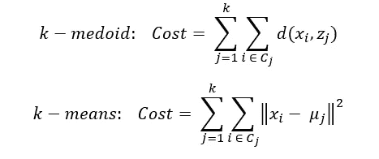

在本研究中，k-medoid 聚类选择了基于 medoids 的划分(PAM)算法。该算法与 k-means 算法非常相似:1)初始化:随机选择 k 个数据点作为中间点， *m* 2)将每个非中间点， *o* 分配给最近的中间点，3)对于每个*m*o 和 *o，*swap*m*o 和 *o，重复步骤 2 至 3，直到代价函数停止下降。*

**选择最佳聚类数，k**

在决定了使用哪种聚类方法之后，现在的问题是我们如何度量为不同的 k 生成的聚类的“良好性”?答案是通过集群验证指数(内部或外部)。

1.  内部:聚类中的典型目标函数将获得高的类内相似性(紧密性)和低的类间相似性(分离性)的目标形式化。相似性是两个数据实例相似程度的数值度量，通常通过距离度量(欧几里德距离)来量化。两个数据点之间的距离越大，相似度越低。
2.  外部:应该有基本事实或黄金标准来评估聚类结果与基本事实标签的匹配程度。

由于数据不带有任何注释标签，因此，我们只剩下内部评估指标。为了选择最佳 k，我将使用在`fpc`包中找到的内部聚类评估指标，例如*在聚类平方和(肘方法)*、*平均轮廓宽度*、*卡林斯基-哈拉巴斯指数*和*邓恩指数。*

最佳 k 可以从平方和对 k 的曲线的拐点(平方和开始稳定下降的点)选择；对于平均轮廓宽度、CH 指数和 Dunn 指数的情况，我们试图最大化验证指数，因此在实验的 k 值范围内，当这些指数最大时，k 值最佳。我没有在这里显示公式，但为了清楚起见，关键是平均轮廓宽度、CH 指数和 Dunn 指数是通过考虑数据点之间的成对距离得出的标量值。对于希望深入了解的感兴趣的读者来说，这些指数的公式列在这篇[论文](http://datamining.rutgers.edu/publication/internalmeasures.pdf)中。

```
*# Possible number of clusters are assumed to be in the range of 2 to 8\.* 
k_array = **seq**(from = 2, to = 8, by=1)
cluster_eval_df = **data.frame**(**matrix**(, nrow = **length**(k_array), ncol = 4))
**colnames**(cluster_eval_df) = **c**("silhouette", "CH_index", "Dunn_index", "wc_SOS")
cluster_eval_df$k = k_array

**for** (i **in** (1:**length**(k_array))){
  **set.seed**(i+100)
  kmedoid = **pam**(dissimilarity_matrix, k = k_array[i], diss = TRUE,
                nstart = 10)
  *# set diss to TRUE, and set the number of random start as 10.*
  clust_stat = **cluster.stats**(dissimilarity_matrix, 
                             clustering = kmedoid$clustering)
  cluster_eval_df[i,"silhouette"] = clust_stat$avg.silwidth
  cluster_eval_df[i, "CH_index"] = clust_stat$ch
  cluster_eval_df[i, "Dunn_index"] = clust_stat$dunn
  *# Add in the within cluster sum of squares*
  cluster_eval_df[i, "wc_SOS"] = clust_stat$within.cluster.ss
}

*# Line plot for all evaluation metrics (internal cluster evaluation)*
cluster_eval_df %>% 
  **pivot_longer**(!k, names_to = "cluster_eval", values_to = "value") %>% 
  **ggplot**(**aes**(x = k, y = value)) +
  **geom_line**() + **geom_point**() + **facet_grid**(rows = **vars**(cluster_eval), 
                                          scales = "free_y")
```

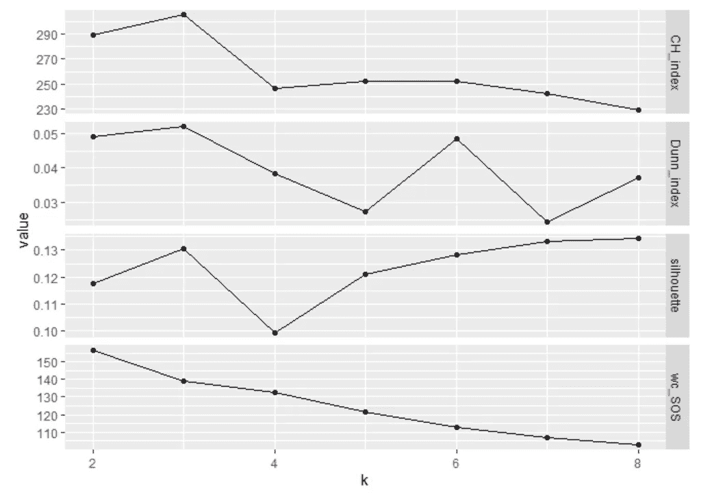

Line plots of multiple cluster evaluation metrics for different number of clusters, k. The best k is 3, as suggested by CH index and Dunn index. The possible number of clusters are assumed to be within 2 to 8.

我们通过将 k 参数作为 3 传递来运行 PAM 算法。

```
*# find the best_k from stackoverflow using the mode function found on*
*# https://stackoverflow.com/questions/2547402/how-to-find-the-statistical-mode?page=1&tab=scoredesc#tab-top*
mode = **function**(x){
  ux = **unique**(x)
  ux[**which.max**(**tabulate**(**match**(x, ux)))]
}
best_k = **mode**(**c**(**which.max**(cluster_eval_df$silhouette), 
                **which.max**(cluster_eval_df$CH_index),
                **which.max**(cluster_eval_df$Dunn_index))) + 1**set.seed**(100 + best_k - 1)  # for reproducibility
kmedoid = **pam**(dissimilarity_matrix, k = best_k, diss = TRUE, nstart = 10)   # set nstart as 10 for cluster stability
*# Save the cluster label in the dataframe. Change it to factor to facilitate data wrangling.*
cust_data$cluster_label = **as.factor**(kmedoid$clustering)
```

## 不同客户群特征的统计摘要

1.  每个集群中的客户数量。

```
*#1: Number of observations (customers)*
cust_data %>% **group_by**(cluster_label) %>% 
  **summarise**(n = **n**()) %>% **kable**(caption = "Number of observations in each cluster")
```

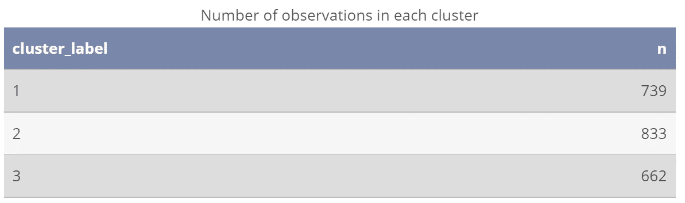

2.每个聚类下*数字特征*的平均值

```
*#2: Average of numerical features for each cluster*
summary_cont_features_per_cluster = 
  cust_data %>% **group_by**(cluster_label) %>% 
  **summarise_if**(is.numeric, mean) %>% **select**(-ID)
summary_cont_features_per_cluster
```

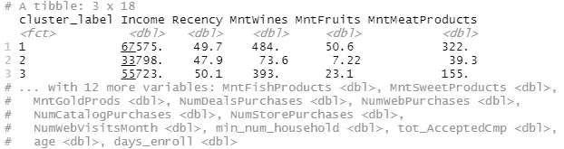

Screenshot of R console output. The full table can be viewed on [RPubs](http://rpubs.com/JQ_programmer_92/907418).

3.每个聚类的*分类特征*的分布(比例)。

```
*#3: Distribution of categorical features for each cluster*
cate_features_names = **names**(**Filter**(is.factor, cust_data))
*# Change the second argument of group_by() and third argument aes() to desired categorical feature names: Education, Marital_status, Kidhome, Teenhome.*
cust_data %>% **select**(**one_of**(cate_features_names)) %>% 
  **group_by**(cluster_label, Teenhome) %>% **summarise**(n = **n**()) %>% 
  **mutate**(prop = (n/**sum**(n))) %>% 
  **ggplot**(**aes**(x = cluster_label, y = prop, fill = Teenhome)) +
  **geom_bar**(stat = "identity", position = **position_dodge**()) +
  **geom_text**(**aes**(label = **round**(prop, 2)), vjust = 1.5, size = 2,
            position = **position_dodge**(0.9)) +
  **theme_minimal**()
```

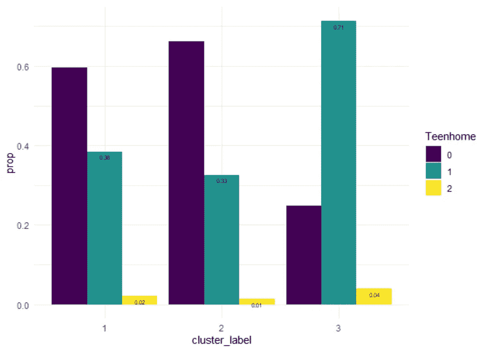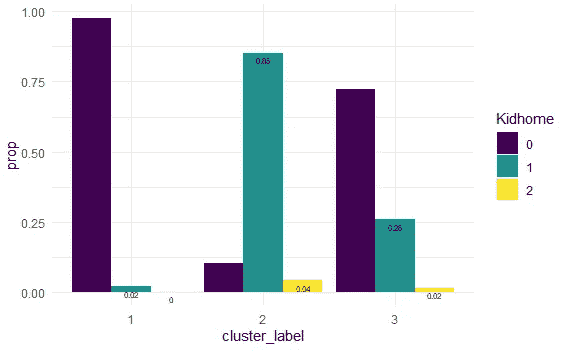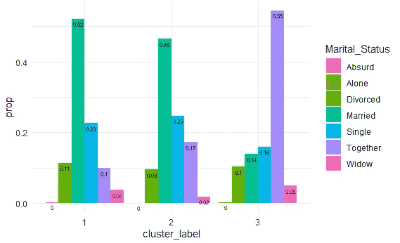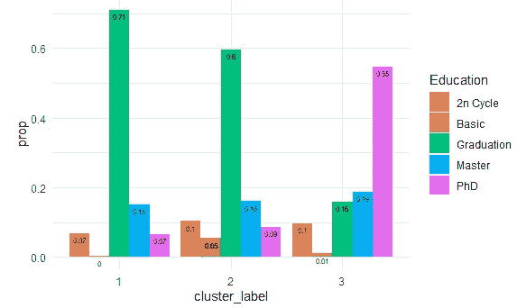

4.每个聚类的派生属性(例如，最小家庭成员数)的分布。

```
cust_data$min_num_household = **factor**(cust_data$min_num_household, ordered = TRUE)
cust_data %>% **group_by**(cluster_label, min_num_household) %>% **summarise**(n = **n**()) %>% 
  **mutate**(prop = (n/**sum**(n))) %>% 
  **ggplot**(**aes**(x = cluster_label, y = prop, fill = min_num_household)) +
  **geom_bar**(stat = "identity", position = **position_dodge**()) +
  **geom_text**(**aes**(label = **round**(prop, 2)), vjust = 1.5, size = 2,
            position = **position_dodge**(0.9)) +
  **theme_minimal**()
```

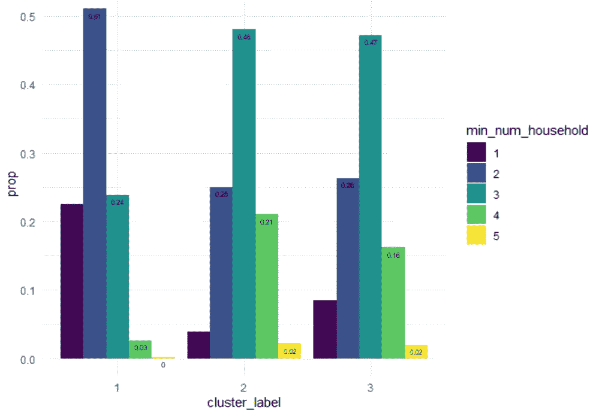

5.为每个分类列出二进制(布尔型)变量。

```
table1 = 
  cust_data %>% 
  **group_by**(cluster_label, Complain) %>% **summarise**(n = **n**()) %>% 
  **mutate**(prop = (n/**sum**(n))) %>% **select**(-n)
**colnames**(table1)[2] = "Binary_outcomes"

*#pattern = c("Complain", "Response", "Accept", "cluster")*
*#idx_select = lapply(pattern, function (x) grep(x, colnames(cust_data)))*
*#idx = unlist(idx_select)*
cust_data_1 = cust_data %>% 
  **select**(**contains**("Response") | **contains**("Accept") | **contains**("cluster"))

n_col = **ncol**(cust_data_1)
**for** (i **in** (1:(n_col-2))){
  table2 = cust_data_1 %>%  **select**(**c**(n_col, **all_of**(i))) %>% 
    **group_by_all**() %>% 
    **summarise**(n = **n**()) %>% 
    **mutate**(prop = (n/**sum**(n))) %>% 
    **select**(-n)
  **colnames**(table2)[2] = "Binary_outcomes"
  table1 = table1 %>% 
    **left_join**(table2, by = **c**("cluster_label" = "cluster_label", 
                             "Binary_outcomes" = "Binary_outcomes"))
}
oldname = **colnames**(table1)[3:**length**(**colnames**(table1))]
newname = **c**("Complain", 
            **colnames**(cust_data_1)[-**length**(**colnames**(cust_data_1))])
*# Rename*
**for** (i **in** (1:**length**(newname))){
  **names**(table1)[**names**(table1) == oldname[i]] = newname[i]
}
table1 %>% as_tibble()
```


Screenshot of R console output. The full table can be viewed on [RPubs](http://rpubs.com/JQ_programmer_92/907418).

从上述统计概要中推断出的每个聚类的特征被列表为 below⁴:

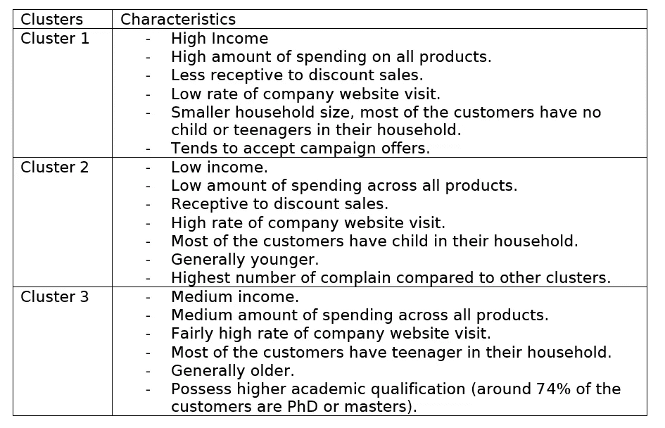

## 混合数据的主成分分析

主成分分析主要用于降维，以便我们可以在低维空间中可视化数据。

```
res.famd = **FAMD**(cust_data_without_ID, graph = F)

eig.value = **get_eigenvalue**(res.famd)
**head**(eig.value)
**fviz_screeplot**(res.famd)
```

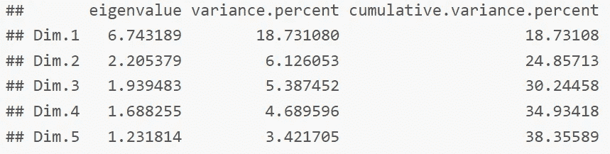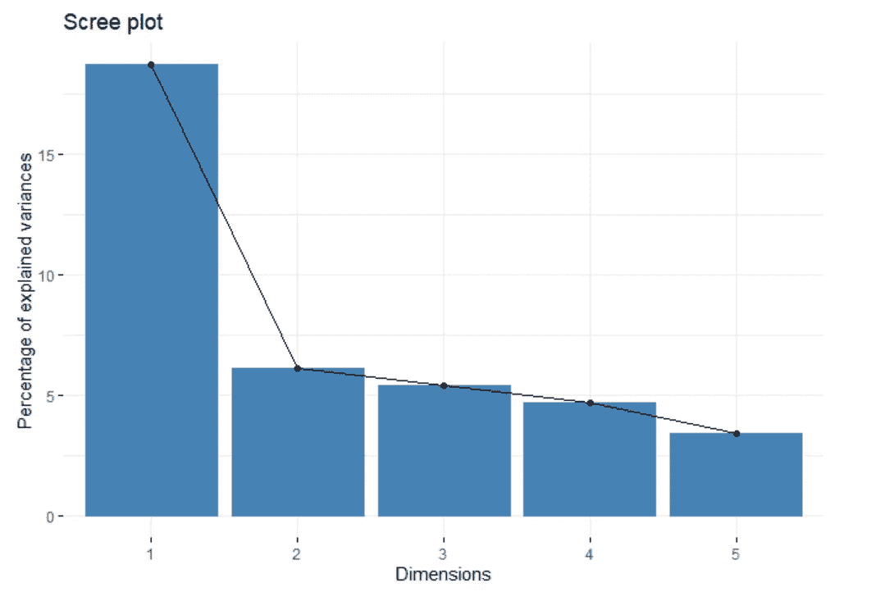

```
*# predict to get the transformed feature space and plot on 3 dimensional scatter plot*
transformed_data = **predict**(res.famd, cust_data_without_ID)**library**(rgl)
**scatter3d**(x = transformed_data$coord[,1], y = transformed_data$coord[,2],
          z = transformed_data$coord[,3], 
          groups = cust_data$cluster_label, grid = FALSE, 
          surface = FALSE, ellipsoid = TRUE, 
          surface.col = **c**("#80FF00", "#009999", "#FF007F"))
```

如果运行上述代码块，Rstudio 中将出现一个弹出窗口，您可以自由旋转交互式 3D 散点图，并从不同角度查看该图。如果您以 html 格式打开 R markdown 代码，请确保您的浏览器启用了 WebGL。关于如何在不同浏览器上启用 WebGL，可以参考这篇[文章](https://www.picmonkey.com/help/errors-and-troubleshooting/crashes-and-performance/how-to-enable-webgl#:~:text=Microsoft%20Edge-,Enable%20WebGL%20status,so%20the%20change%20takes%20effect.)。

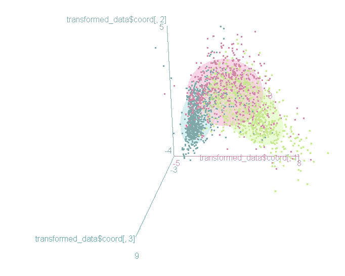

请记住，散点图(以转换维度表示的数据)仅代表原始数据变化的大约 30%。因此，应谨慎使用。此外，3 个集群之间有高度的重叠。

# 特定聚类(客户群)的客户排名

根据帕累托法则(又称 80-20 法则)，五分之一(20%)的客户贡献了公司收入的 80%。因此，识别最有价值的客户对于公司分配更多资源来培养与这些客户的密切关系至关重要。

## 相似优先排序技术

TOPSIS 是多准则决策分析(MCDA)工具之一，用于根据多个准则(选择的特征集)对备选方案(客户)进行排序或选择。从直观上讲，与正理想解距离短、与负理想解距离大的备选方案应授予高分。你可以在这个[维基页面](https://en.wikipedia.org/wiki/TOPSIS#:~:text=The%20Technique%20for%20Order%20of,Lai%20and%20Liu%20in%201993.)上找到详细的 TOPSIS 算法描述，所以我在这里就跳过细节了。实施 TOPSIS 的底线是:

*   您可以设置要素权重，使某些属性优先于其他属性。如果你是一个专家，知道每个特征的重要性，你可以自己设置特征权重。本实验采用熵权法。主要思想是分散程度越高，可以提取的信息就越多，因此该特定特征将被赋予更高的权重。
*   输出分数范围从 0 到 1，接近 1 的值是最佳选择。

假设我们有兴趣对第一个集群中的客户进行排序，

```
*# Calculate feature weights for continuous and categorical features for first cluster*
i = 1
data_analysis_cont = cust_data %>% **filter**(cluster_label==i) %>% dplyr::**select**(**starts_with**(**c**("Mnt", "Num")))
data_analysis_cate = cust_data %>% **filter**(cluster_label==i) %>% 
  dplyr::**select**(**starts_with**(**c**("Accepted", "Response")))

h_cont = **get.bw**(**scale**(data_analysis_cont), bw = "nrd", nb = 'na')
w_cont = **entropy.weight**(**scale**(data_analysis_cont), h = h_cont)
w_cate = **entropy.weight**(data_analysis_cate, h='na')
```

上面的代码片段可能需要一些时间来执行。

```
data_analysis_cate <- **lapply**(data_analysis_cate, 
                             **function**(x) **as.numeric**(**as.character**(x)))
data_analysis = **cbind**(data_analysis_cont, data_analysis_cate)

feat_imp = **c**(w_cont, w_cate)
overall = **TOPSIS**(data_analysis, 
                 feat_imp, 
                 criteriaMinMax = **rep**("max", **length**(feat_imp)))
data_analysis$topsis_score = overall
data_analysis$ID = cust_data %>% **filter**(cluster_label==i) %>% **select**(ID)

*# Top 10 customers for cluster 1*
data_analysis %>% **arrange**(**desc**(topsis_score)) %>% **as_tibble**() %>% **head**(10) %>%  **relocate**(ID, topsis_score)
```

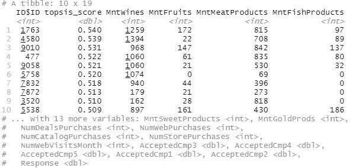

Screenshots of R console. The full table can be found on [RPubs](http://rpubs.com/JQ_programmer_92/907418).

# 结论

让我们简要介绍一下这个实验的工作流程:

1.  数据采集。下载数据并导入到 R workspace。
2.  数据预处理。
    -去除零方差变量。
    -丢弃异常值/无效观察值。
    -特征提取。
    -缺失值插补。
3.  数据可视化。
4.  基于 k-medoid 聚类的聚类分析。
5.  TOPSIS 客户排名。

我想强调一下这种客户细分方法的一些缺点:

*   这不是增量学习。如果我们想对新客户进行细分或分组，我们需要对整个数据集(包括新数据)运行聚类模型。
*   其他聚类方法可能无法重现这些结果。集群的稳定性和一致性一直是 CA 的一个固有问题。对于这个实验，我采用了基于分区的聚类方法，但是不能保证这是最好的方法。更好的方法是尝试具有不同假设的其他聚类方法，并比较聚类结果。

值得注意的是，客户细分模型应该不断地被监控和评估(迭代过程),以确保其有效性和稳健性，因为客户的行为会随着时间的推移而演变。

最后，本文中的所有代码都可以在 [Github](https://github.com/Jacky-lim-data-analyst/programmer.git) 和 [RPubs](http://rpubs.com/JQ_programmer_92/907418) 上找到。感谢阅读！

[1]:詹姆斯，g .，威滕，d .，哈斯蒂，t .，蒂布拉尼，R. (2021)。引言。统计学习导论。统计学中的斯普林格文本。纽约州纽约市斯普林格。

[2]: K-medoid 问题是 NP-hard 问题，PAM 算法是一种启发式算法。

[3]:除了考虑集群内和集群间相似性的传统验证度量之外，[集群稳定性](https://indigo.uic.edu/articles/journal_contribution/Selection_of_the_number_of_clusters_via_the_bootstrap_method/10773005/1)和[预测强度](https://statweb.stanford.edu/~gwalther/predictionstrength.pdf)是一些其他可行的选项。

[4]:每个集群的特征适用于大多数集群成员，而不是所有成员。

[](/mlearning-ai/mlearning-ai-submission-suggestions-b51e2b130bfb) [## Mlearning.ai 提交建议

### 如何成为 Mlearning.ai 上的作家

medium.com](/mlearning-ai/mlearning-ai-submission-suggestions-b51e2b130bfb)