# 巴西电子商务企业的客户细分

> 原文：<https://medium.com/mlearning-ai/customer-segmentation-of-a-brazilian-e-commerce-business-c6dae31a7861?source=collection_archive---------0----------------------->

## 奥利斯特故事的第三章:集群和战略

Photo by [CHUTTERSNAP](https://unsplash.com/@chuttersnap?utm_source=medium&utm_medium=referral) on [Unsplash](https://unsplash.com?utm_source=medium&utm_medium=referral)

# 项目定义

## 项目概述

Olist 是一个巴西百货公司平台，在电子商务领域(软件即服务)运营。这项服务包括管理店主和客户之间的销售过程，还包括一份客户满意度报告。店主的优势是更好的市场地位和透明的声誉指标。业务的驱动力是吸引更多的客户并提高流程的质量。这个项目的动机是支持这一努力。

Image: Olist Facebook

**市场细分**

对于一般的业务发展过程，特别是对于供应链，了解客户行为和地理条件是做出更好决策的有用方法。通过提取共同共享的人口统计和地理人口统计特征，可以定义集群(或段)。这使得我们可以针对目标客户应用量身定制的策略，并更有效地优化供应链。

## 问题陈述

本文背后的分析是一个商业案例调查的一部分，该调查的重点是支持 Olist 的业务目标。它们是:通过提高服务吸引更多的店主，通过更广泛的产品范围和更高的满意度吸引更多的最终客户。这一努力的一部分也是调查扩大商业服务，包括物流和仓储。

在分析了总体业务趋势和日常动态(另见[电子商务数据故事](/swlh/an-e-commerce-data-story-e53eb8e16f90))和订单概况([订单概况分析](https://larstinnefeld.medium.com/sku-and-order-profile-analysis-dedc40c9e0ae))之后，这种客户细分分析现在正在审查购买行为和地理分布。应用不同的分割方法来获得不同的视角并识别共同有效的图片。通过这样做，必须回答以下问题:

*   **客户之间有哪些人口统计关系？**
*   **客户特征的地理关系是什么？**
*   **需要针对目标客户群的营销策略。**
*   **物流流程的结论是什么？**

## 方法

这篇文章总结了可以在 [GitHub](https://github.com/LarsTinnefeld/olist_ecom_analysis) 中找到的主要分析结果。应用以下步骤和方法:

*   数据准备和争论
*   探索性数据分析
*   人口细分
*   地理人口分割
*   RFM 分析
*   k 均值聚类
*   结论

## 韵律学

分类基于每个客户的几个输入参数(I):

***最近****(I)=参考日期(数据集中的最后一天)—最后订单的日期(i) )*

***频率*** *(i) =计数(订单数)(i)*

***货币*** *(一):总和(采购订单价值)(一)*

**R(i)** :基于分位数的 RFM 分类离散化

*   1: *最近(i) ≥总时间段的第三个四分位数(Q3)*
*   2: *最近(i) ≥总时间段的第二个四分位数(Q2)<总时间段的第三个四分位数(Q3)*
*   3: *最近(i) ≥总时间段的第一个四分位数(Q1)<总时间段的第二个四分位数(Q2)*
*   4: *最近(i) <总时间段的第一个四分位数(Q1)*

**F(i)** :基于条件的 RFM 分类的频率得分

*   1: *频率(i) < 2*
*   2: *频率(i) < 4 &频率(i) ≥ 2*
*   3: *频率(i) < 7 &频率(i) ≥ 4*
*   4: *频率(i) ≥ 7*

**M(I)**:RFM 分类的基于分位数的离散化

*   1: *货币(i) ≥总购买范围的第三个四分位数(Q3)*
*   2: *货币(i) ≥总购买范围的第二个四分位数(Q2)<总购买范围的第三个四分位数(Q3)*
*   3: *货币(i) ≥总购买范围的第一个四分位数(Q1)<总购买范围的第二个四分位数(Q2)*
*   4: *货币(i) <购买总额范围的第一个四分位数(Q1)*

***RFM 评分****= R-score * F-score * M-score*

用于 K 均值聚类的 **SSE** (误差平方和)

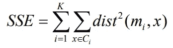

其中 x 是聚类 c(i)中的数据点，m(i)是聚类 c(i)的代表点

上述指标的可视化是解释的基础。没有成功标准，因为问题陈述是咨询性质的。

# 数据探索和可视化

## 数据

提供的数据由 2016 年至 2018 年的历史订单数据组成，包含 100，000 个订单。有 8 个文件可用。下面的数据模型显示了这些数据表和查找表之间的高级引用。在这篇文章的分析中，并不是所有的数据表都会用到。这些数据是 Olist 在许可证 CC BY-NC-SA 4.0 下慷慨提供的，可以在 Kaggle 的 [***这里***](https://www.kaggle.com/olistbr/brazilian-ecommerce) 找到。

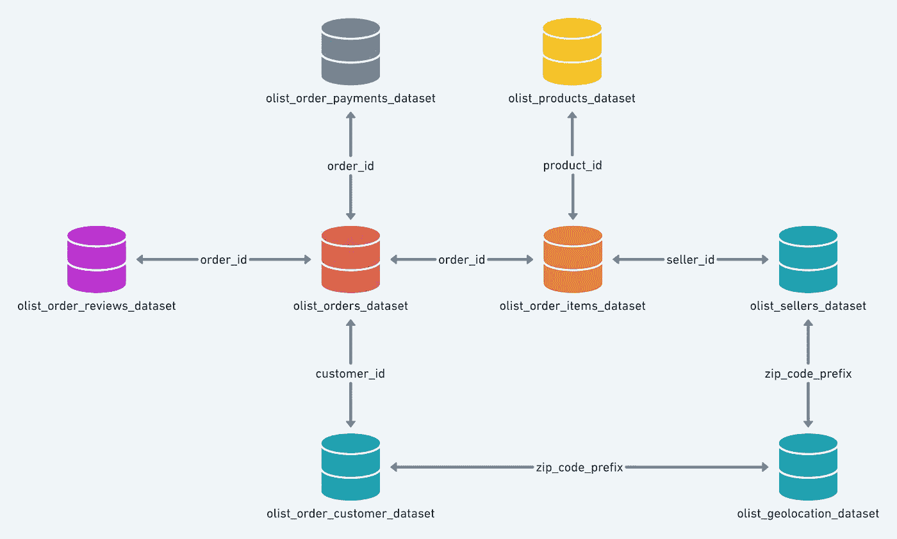

Image by Kaggle/ Olist

## 数据准备

数据导入和争论通常会占用分析的大部分时间。我不会展示所有需要的步骤和代码行，但是完整的分析可以在这里查看和下载*。因为使用干净的数据是一项关键要求，所以我总是注意一些基本的东西:*

*   *理解数据的内容*
*   *检查丢失的数据*
*   *检查是否有多条记录*
*   *检查数据格式*
*   *质疑你看到的结果是否有意义*
*   *评论你的步骤*
*   *命名您的变量*

**

*Photo by [William Iven](https://unsplash.com/@firmbee?utm_source=medium&utm_medium=referral) on [Unsplash](https://unsplash.com?utm_source=medium&utm_medium=referral)*

## *探索性数据分析*

*在进入具体任务之前，提取一些关于手头数据的事实是有用的。这有助于将下游的努力引向有趣的方向。在这种情况下，我们希望了解客户:他们住在哪里？他们何时以及如何点菜？可以说一下客户的统一程度吗？*

*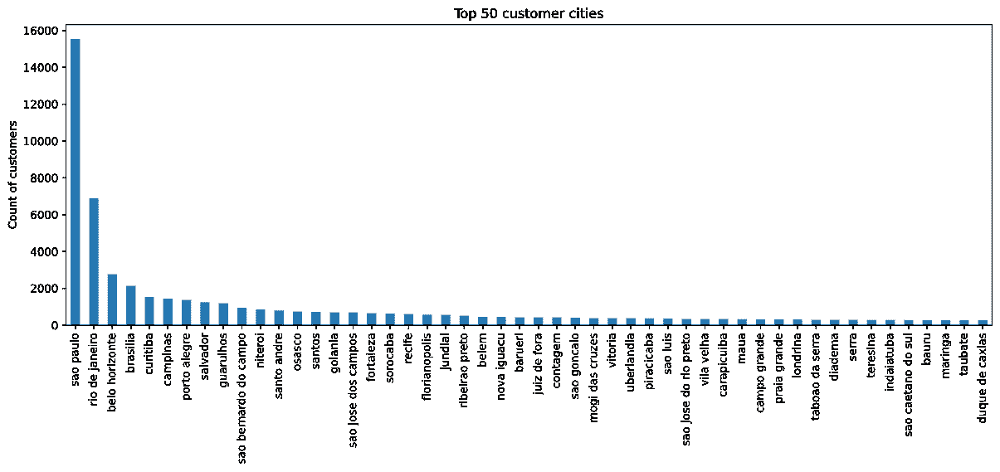*

*有超过 96，000 名客户。其中 16%住在圣保罗，这是 4119 个城市中最大的一个。在得出结论时，需要记住这种不平衡。*

***什么时候有新客户加入？***

*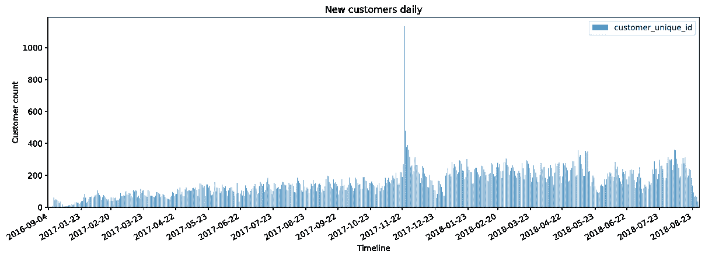**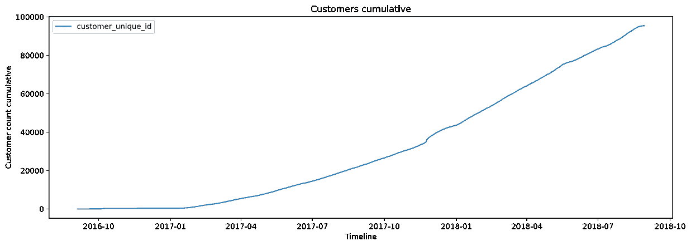*

*黑色星期五出现了很多新顾客。当查看每日价值时，这似乎是一个重要事件，但是当考虑到客户的累积增长时，这种情况就发生了变化。总的来说，新客户的增长不是线性的，而是指数式的，这对企业来说是一个好兆头。*

***EDA 结论***

*超过 96，000 名客户居住在 4，119 个城市，圣保罗是首选城市(占所有客户的 16%)。新客户持续小幅增长。*

# *方法学*

**

*Photo by [Pedro Menezes](https://unsplash.com/@pedromenezes?utm_source=medium&utm_medium=referral) on [Unsplash](https://unsplash.com?utm_source=medium&utm_medium=referral)*

# *方法 1:客户细分*

*通过了解更多人的共同价值观、喜好和人口背景，客户细分是一种有效的方法。这篇文章背后的分析并没有考虑很多细节和个人信息，如年龄、种族或教育程度，而只是利用最基本的可用信息。*

## *数据预处理*

*正如最初定义的那样，客户细分的指标是:*

*   ****最近:*** 自上次订单以来的天数*
*   ****货币*** :采购总价值金额*

*这是极其有限的信息量，但已经可以用来进行分类。像在所有聚类算法中一样，分段处理数据点之间的相对距离，或者换句话说:我们将观察值范围分成几个部分，然后将单个客户分配到这些部分。*

***新近度**:*

*数据的时间线将被分成四个主要部分。每个片段是数据总时间跨度的 1/4。我们定义了以下新近细分:*

*   *不活动的*
*   *寒冷*
*   *热的*
*   *活跃的*

***总购买价值:***

*中位数是划分客户的阈值:*

*   *低的*
*   *高的*

## *履行*

*在将客户分配到这些集群之后，通过组合两个主要细分来形成子细分。“非活动”段不再进一步分为“低”和“高”，因此我们得到 7 个子段:*

*   *不活动的*
*   *低温*
*   *冷-高*
*   *热-低*
*   *高温*
*   *低电平有效*
*   *高电平有效*

*这可以用各种方式来形象化。我选择了一个华夫饼图表:*

*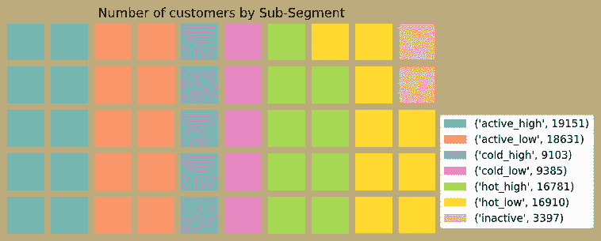*

*当我们按总购买价值过滤时，分布显示了每个细分市场的收入分布。*

*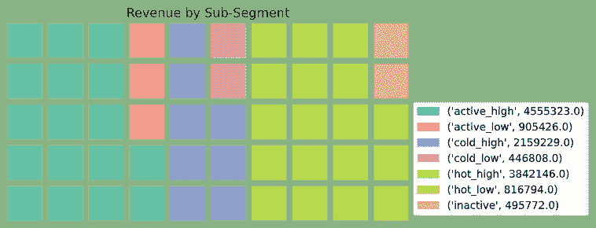*

***结论，客户之间的人口统计关系***

*   *7 个细分市场中最强的一类是“高消费活跃”客户，其次是“高消费热门”客户。*
*   *高消费和低消费的“活跃”客户收入最多，其次是“热门”客户。*
*   *就人数而言，活跃客户是最大的群体。*
*   *不活跃客户在每个图表中所占的比例最小。*

*如上所述，术语“活动”或“不活动”在该数据集中相互关联使用。无法与外部参考点进行比较。*

# *方法 2:地理人口分段*

**

*Photo by [Thor Alvis](https://unsplash.com/@terminath0r?utm_source=medium&utm_medium=referral) on [Unsplash](https://unsplash.com?utm_source=medium&utm_medium=referral)*

*通过将人口背景与地理信息相结合，可以获得非常有用的结果。在许多情况下，这对营销策略有影响。当地条件甚至会影响仓储和供应链。例如，在当前的疫情期间，可以看出向当地采购的转变。人们开始在当地商店购买，而不是在回家的路上去大型超市。这可能会改变购物行为和订单模式，进而影响配送中心履行商店订单的方式。*

*提高客户满意度是 Olist 的一项重要 KPI。可以假定，在重要客户群附近建立一个假想的物流设施可以缩短交货时间，提高服务水平。此外，从营销策略的角度来看，了解客户是如何聚集的也是很有趣的。*

## *数据预处理*

*“Olist_geolocation_dataset”中的邮政编码前缀不是唯一的。一个邮政编码前缀最多可以列出 600 个经纬度坐标。这意味着表中有许多重复的邮政编码前缀。因为邮政编码前缀是客户的关键字段，所以需要假设通过平均经度和纬度坐标来生成唯一的邮政编码前缀。这样做将生成一个查找表，该表具有位于其邻域中心的唯一坐标。*

*这种方法的缺点是，现在有许多客户需要用地图上的同一个点来表示。这只适用于为每个邮政编码前缀聚合的数据。换句话说:数据需要按邮政编码前缀分组，值需要按平均值、总和或值的模式进行汇总。我们需要为这种简化付出代价:我们再也看不到地图上点后面的客户数量了。这需要在解释中加以考虑。*

## *履行*

*上面定义的应用于地理位置的子段创建了下面的地图。*

*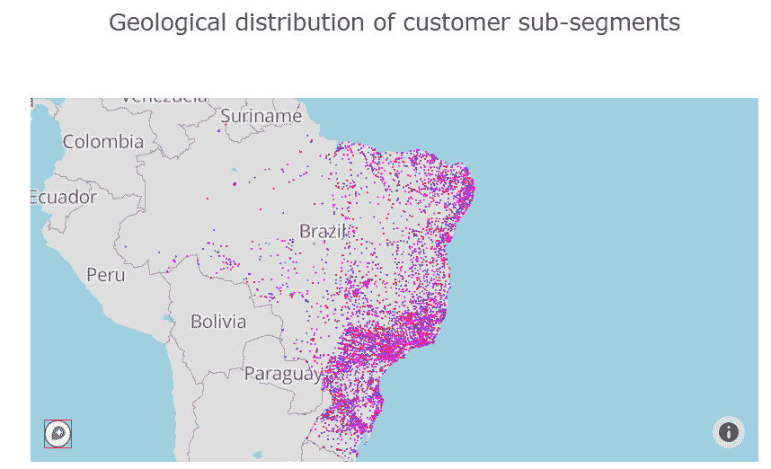*

*首先，地图显示了可以预期的情况:在巴西东部，尤其是在大城市周围，人口高度集中。此外，没有直接可见的上面开发的子段的分布或聚类可以看到。亮红点代表“活跃-高”段，而蓝色代表“不活跃”和“冷”段。*

***最大的收入来自哪里？***

*需要注意的是，总收入在所有社区的分布并不均匀，而是集中在 100-120 的低实数范围内。*

*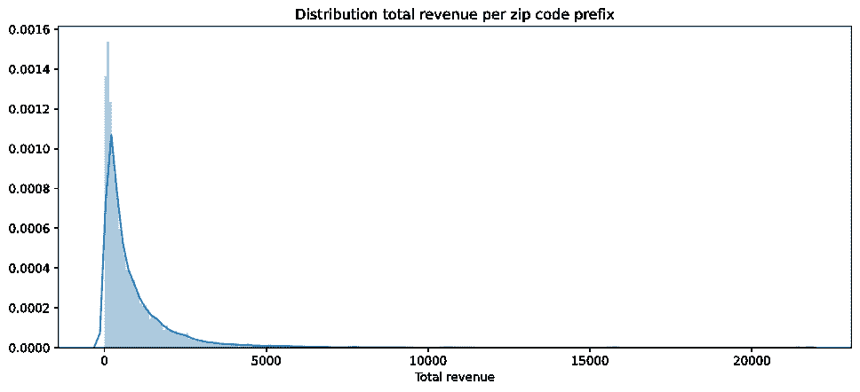*

*投影到地图上给了我们这样的视觉效果:*

*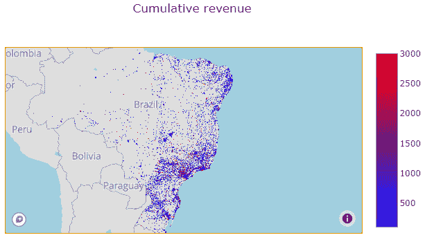*

*放大圣保罗和里约热内卢时:*

*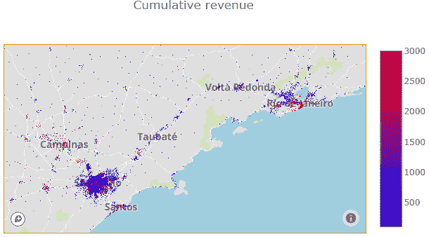*

*该图表显示，在较高收入和较低收入区域之间存在一些局部聚集，尤其是在调整下限阈值的情况下。在“坎皮纳斯”社区，总价值通常较高，而在郊区“维拉阿米莉亚”、“巴西兰迪亚”和“李茂区”，总价值通常较低。里约热内卢，尤其是滨水区周围大多是红色(高收入)，而西北郊区主要是蓝色(低收入)。*

*尽管如此，我们可以确定业务更感兴趣的领域，但我们需要在单个客户层面上小心解读:*

*如 EDA 部分所示，一些邮政编码分配了更多的客户，因此较高的总价值可能是较大的组规模的结果，因此累积收入较高。*

***每位顾客平均购买量分布***

*为了了解普通顾客在哪些社区消费，应用了平均购买价值。如前所述，首先将回顾总体分布。*

*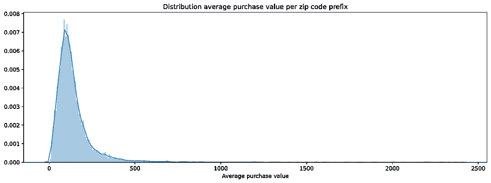*

*与累计收入类似，平均购买价值分布也集中在较低的范围内，并且严重向右倾斜。*

*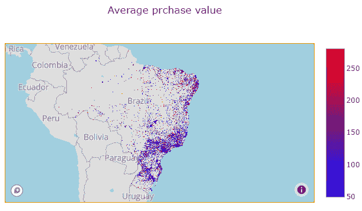*

*通过调整色阶的上下范围，可以看出巴西南部的个人购买价格普遍较低，而北部的购买价格较高。效果不是很明显，但仍然可见。如果这在最终的商业案例中被认为是重要的，则需要进行显著性测试，以从统计上证明这种差异有足够的证据。*

***结论，客户特征的地理关系***

*   *位置和客户细分之间没有明确的相关性。*
*   *沿着里约热内卢的消费线是最大的社区，这也符合高收入地区。另一方面，圣保罗拥有最多的顾客。这是物流和供应链的一个重要结论。*
*   *可以看到针对较高和较低总收入的某种程度的聚类。这在很大程度上可能是群体规模的影响。高收入的地理集群是“坎皮纳斯”和里约热内卢的东南部。*
*   *从个人客户的角度来看，巴西北部的平均购买价格似乎略高。在以此为基础做出任何决定之前，需要进行统计测试来验证这一说法。*

**

*Photo by [Campaign Creators](https://unsplash.com/@campaign_creators?utm_source=medium&utm_medium=referral) on [Unsplash](https://unsplash.com?utm_source=medium&utm_medium=referral)*

# *方法三:RFM 分析*

*RFM 分析对客户进行细分，以制定营销策略。三个使用的度量****频率*** 和 ***货币*** 导致组合的个体分类。**

*   *****最近:*** 自上次订单以来的天数**
*   *****频率*** :订单总数**
*   *****货币*** :采购总价值金额**

## **数据预处理**

**数据是根据最初定义的指标准备的。将为每个单独的客户计算分数。**

****R(I)**:RFM 分类的基于分位数的离散化**

*   **1: *最近(i) ≥总时间段的第三个四分位数(Q3)***
*   **2: *最近(i) ≥总时间段的第二个四分位数(Q2)<总时间段的第三个四分位数(Q3)***
*   **3: *最近(i) ≥总时间段的第一个四分位数(Q1)<总时间段的第二个四分位数(Q2)***
*   **4: *最近(i) <总时间段的第一个四分位数(Q1)***

****F(i)** :基于条件的 RFM 分类的频率得分**

*   **1: *频率(i) < 2***
*   **2: *频率(i) < 4 &频率(i) ≥ 2***
*   **3: *频率(i) < 7 &频率(i) ≥ 4***
*   **4: *频率(i) ≥ 7***

****M(I)**:RFM 分类的基于分位数的离散化**

*   **1: *货币(i) ≥总购买范围的第三个四分位数(Q3)***
*   **2: *货币(i) ≥总购买范围的第二个四分位数(Q2)<总购买范围的第三个四分位数(Q3)***
*   **3: *货币(i) ≥总购买范围的第一个四分位数(Q1)<总购买范围的第二个四分位数(Q2)***
*   **4: *货币(i) <购买总额范围的第一个四分位数(Q1)***

**在应用分段之前，回顾一下统计数据有助于理解后来的结果。**

**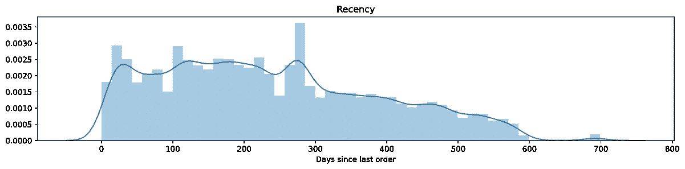**

**在参考日之前大约 270 天的峰值落在黑色星期五销售量大的时间段内，许多客户在这一天下了他们的最新订单。**

**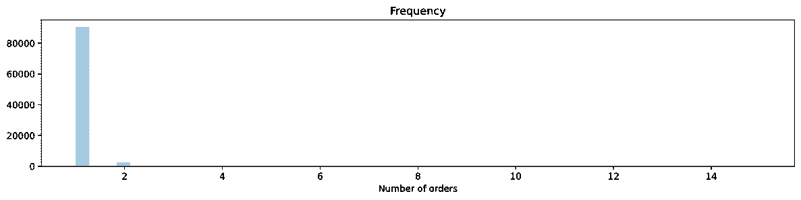**

**上图与我们在订单分析中看到的一致。有许多客户只下了一份订单。平均订单频率刚刚超过 1。**

**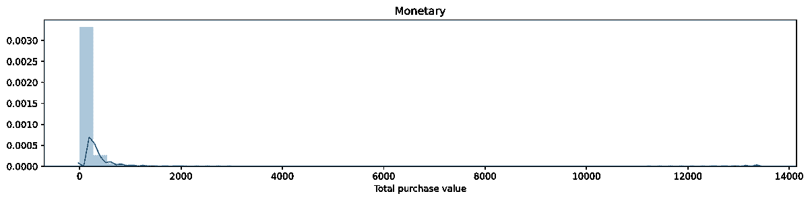**

## **履行**

**在 RFM 细分过程的步骤一中，每个标签****频率*** 和 ***货币*** 是针对每个客户单独计算的。在下一步中，将开发两个指标:***

1.  ****RFM 得分**:三个得分的乘积 *(RFM 得分= R-得分* F-得分* M-得分)***
2.  ****RFM 段标签**:将一行中的三个分数(*R-score&F-score&M-score*)组合成一个数字代码。**

**在第三步中，定义了基于客户类型的两个指标的三个过滤条件。这些过滤条件为三个指标设置了阈值。在我们的案例中，细分过程定义了 7 种客户类型:**

*   ****最佳客户****
*   ****挥金如土****
*   ****官军****
*   ****潜在的官军****
*   ****冬眠****
*   ****差点输了****
*   ****失去客户****

**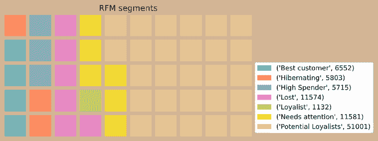**

**基于观察到的客户行为，适当的营销策略被添加到摘要列表中。**

**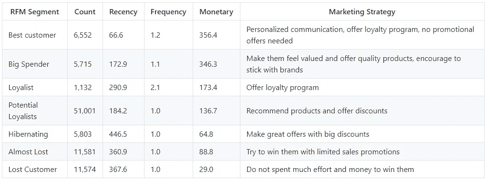**

****结论，针对特定客户群的战略****

*   **订单频率和订单金额集中在低端。这是我们以前反复看到的。**
*   **最大的 RFM 分段是这群 ***的潜在亲信*** 。这些客户需要有针对性的优惠和折扣，以使业务取得成功。如果 Olist 能够通过赢得这一细分市场的大部分份额来做好工作，它将对增长产生影响。**
*   **有一个 ***最佳客户*** 的良好基础，这对企业来说是个好消息。**
*   **需要花一些功夫去瞄准 ***冬眠*** 客户和几乎流失的客户。**

# **方法 4: K 均值聚类**

****

**Image: Wikipedia**

**K-Means 聚类是一种支持在未标记数据中识别聚类的方法。K-means 算法用于帮助找到不同于任意选择的 RFM 类的聚类。这将提供不同的视角。我不会在本文中详细介绍该理论，因为该理论在互联网上的许多来源中都有涉及，而是集中在我们案例的应用上。**

## **数据预处理**

**在处理数据之前，散点图通常有助于预先以视觉方式识别聚类。之前开发的指标将重新用作本次聚类练习的输入参数。**

*   *****最近:*** 自上次订购以来的天数**
*   *****频率*** :总订单数**
*   *****货币*** :采购总价值金额**

**完整的客户数据集与三个输入指标一起显示在 3D 散点图中。**

**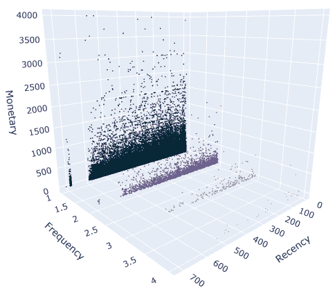**

**Customers represented as data points with three feature dimensions**

**显然，该图中的主要细分因素是由购买频率产生的。除此之外，还有一小群非常早的客户(在最近 700 天的范围内)，没有明显的聚类可观察。**

**输入变量在不同的范围内(频率在 20 以下的低范围内，货币在 4000 以下的范围内，等等。).为了避免单一指标占据主导地位，需要对数据进行标准化。**

**为了标准化数据*，使用了 Sklearn 的标准定标器*。在此过程中，提取了仅包含三个输入变量的数据帧。**

**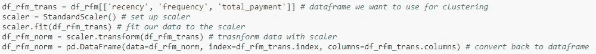**

## **履行**

**Sklearn 的 KMeans 分类器用于执行分类。**

**作为起点，建立了两个聚类模型，并使数据符合数据。**

**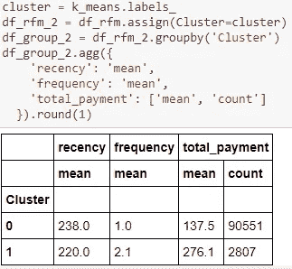**

**表达聚类方法准确性的一个度量是 ***误差平方和，简称*** 或 ***SSE*** 。这描述了聚类模型与数据的吻合程度。**

****

**第一轮的上证综指是 201978 点。目标是最大限度地减少这种误差，使模型更好地符合数据。**

## **精炼**

**K 均值聚类中的 SSE 取决于所选聚类的数量。目标是选择一些尽可能小的集群，但是如果符合数据，仍然可以实现显著的改进。这一过程被称为“弯头法”。**

**将 1 到 10 个聚类应用于该算法。对于每次迭代，计算 SSE。下图显示了所选集群的数量以及由此产生的 SSE。**

**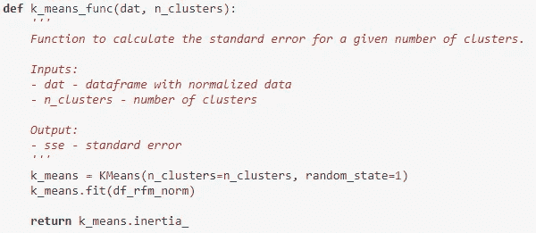****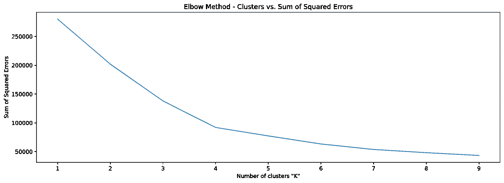**

**根据 Elbow 方法，聚类数为 4 是该模型的一个好选择。我们已经可以看出这与上面进一步应用的分割方法有什么不同。在下一步中，数据用 K-均值聚类成 4 个部分，每个客户用其 K-均值聚类来标记。我为每个集群添加了一个描述。**

**一个具有 4 个集群的模型产生的 SSE 为 92，051，这是我们在这些条件下可以预期的最佳结果。**

**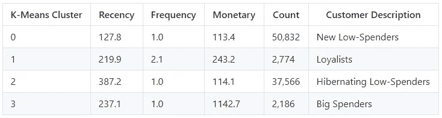****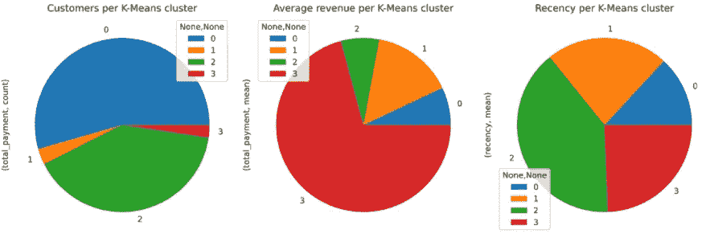**

*****大客户*** 占客户的一小部分，但对收入的影响很大。让这些客户感受到被重视是至关重要的。鼓励他们坚持使用自己的品牌。 ***新晋低消费人群*** 是最大的群体，但收入相对较少。为了业务的增长，重要的是在这些顾客身上花大力气，以便把他们变成忠诚的顾客。**

**在 3D 散点图中，每个客户现在都可以用各自的聚类标签来可视化。**

**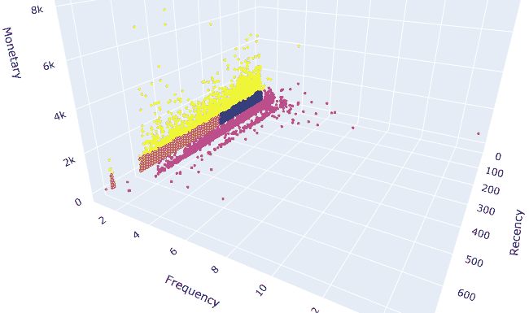**

**Customers represented with labeled data points**

**群集边框:**

**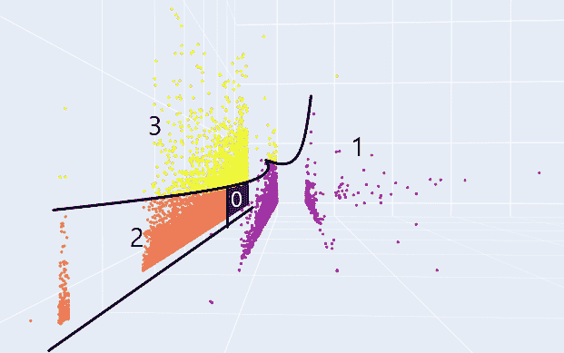**

**上面放大的视图显示了数据点在三维空间中是如何聚集的。我添加了与我们从算法中得到的聚类标签相对应的标签。现在有趣的是看看这些星团在地理上是如何定位的。**

**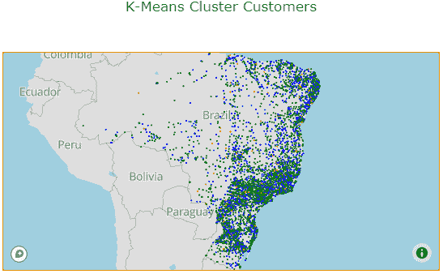**

****颜色代码:****

*   **蓝色:新的低消费人群**
*   **橙色:忠诚者**
*   **绿色:冬眠的低消费人群**
*   **红色:挥金如土**

**从整体上看巴西，没有一个普遍的趋势可以观察。但仔细观察就会发现，在较大的城市中存在局部聚集现象。**

**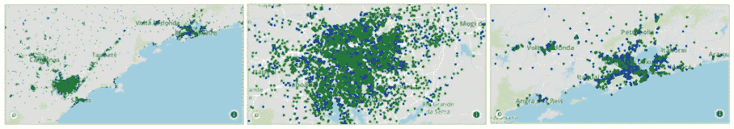**

**彩色编码显示圣保罗的一大部分街区是 ***冬眠的低消费人群*** 。相比之下，里约热内卢似乎有更多新的低消费人群。没有清晰可见的重要部门 ***大客户*** 的集中度，这也可能与其集团规模较小有关。**

# **结果**

## **评估和验证**

**采用 3 种细分方法:*客户细分、RFM 分析、K-Means 聚类。*现在重要的是要正确看待结果并理解差异。**

**对于解释来说重要的是，我们将所有生成的输出理解为分类，这些分类没有定量的性质，而是定性的。换句话说:结果类“低有效”由给定数据集中的相对位置定义。在不同的数据集中，相同的数据点将是“低有效”。因此，结果仍取决于专业领域专家的进一步解释，并结合其他结果。**

## **正当理由；辩解**

**客户细分使用 2 个输入指标和一个简单的定义机制。RFM 分析也适用于订单频率，但方法非常相似。类别的定义和增加的营销策略似乎有点武断。当比较结果时，K-Means 聚类方法显得更有逻辑性。段的数量应该是可变的，以允许更好地适合数据集的聚类。结果可以用 SSE 值来衡量。这使得 K-Means 聚类成为一种很好的方法，是开始分析的一个更好的基础。**

# **结论**

## **反射**

****客户之间的人口统计关系****

**不同细分方法之间的共同信息是，有一小部分高消费客户是必须保持的，因为它代表了收入的重要部分，而相对较大的客户群有可能影响 Olist 的未来业务。**

**该订单数据集中的订单频率通常较低，高度集中在一个订单以上。这使得频率度量非常“敏感”。**

****针对客户特点的地理关系****

**关于顾客住在哪里，存在着很大的不平衡。大部分顾客都住在圣保罗。这必须对统计验证以及以业务发展为目标的决策产生影响。**

**巴西境内确定的 RFM 段的地质分布似乎是随机的。另一方面，K-均值段表明一些局部聚类，这可以用统计方法进一步验证。按照这种观点，圣保罗的大部分地区显示出“冬眠的低消费人群”，而里约热内卢的大部分地区显示出“新的低消费人群”。就累积收入而言，也有一些地方集群现象值得观察。里约热内卢的东南部和“坎皮纳斯”显示了更高的累积收入密度。这很可能受到居住密度的影响。地图上显示平均个人购买价值的颜色表明，巴西北部地区可能会在购买上花费更多。**

****针对特定客户群的战略****

**除了客户细分，还有一个包含营销策略的表格。此表中的建议也需要根据该细分市场对业务的重要性来考虑。如上所述， ***挥金如土*** 和 ***新挥金如土*** 的庞大群体具有很高的重要性。因此，他们的营销策略具有更高的优先级。**

****物流流程的结论是什么？****

**正如在最初的 [*Olist 业务趋势分析*](/swlh/an-e-commerce-data-story-e53eb8e16f90) 中所看到的，运输时间是变化的，并且与产品成本具有某种程度的相关性。虽然与运输持续时间和客户满意度的相关性仍需调查，但从上述地理人口统计分析中可以得出结论，某些领域与业务的相关性更高。当包括**直接运输**与**直接运输**时，我们可以考虑靠近圣保罗或里约热内卢密集区域的微型履行设施。该设施将是混合概念的一部分，其中“热门”产品组**健康&美容**、**礼品手表**和**信息配件**(参见[商业趋势分析](/swlh/an-e-commerce-data-story-e53eb8e16f90)和[订单概况分析](https://larstinnefeld.medium.com/sku-and-order-profile-analysis-dedc40c9e0ae))将被逻辑整合，以便为非常重要的 ***高消费群体-*** 和 ***忠诚者*)归档有效的供应链这种产品组合的小产品尺寸和有限的 SKU 范围允许保持较小的 DC 足迹，这有助于建立良好的仓库流程并保持低投资成本。这种混合业务的更大一部分仍将通过今天运营的直运来执行。这有助于更有效地服务于大群*(或*)的潜在忠臣。正如在订单分析中看到的，对于广泛的产品范围，仓库概念对 Olist 没有太大意义。目前，这些都是假设的想法，将进一步调查和详细说明。******

## ***改进***

***项目这一部分的分析反映了消费者的习惯以及 Olist 提供的服务。一些观察结果需要进行统计验证，以证明所提供的陈述或假设。一个改进是不仅使用平均坐标，而且使用完整的邮政编码来获得更多细节。这样一来，地图上的聚类就不会被一个彩色的点所掩盖，它只是多达 600 个单独数据点的平均值。***

***可以进一步调查每个输入变量的相对重要性，以得出哪个客户群最重要的结论。***

# ***参考***

***代码: [GitHub 库](https://github.com/LarsTinnefeld/olist_ecom_analysis/tree/main/3%20-%20Customer%20Segmentation)***

***数据: [Kaggle 数据](https://www.kaggle.com/olistbr/brazilian-ecommerce)***

******

***Photo by [Jon Tyson](https://unsplash.com/@jontyson?utm_source=medium&utm_medium=referral) on [Unsplash](https://unsplash.com?utm_source=medium&utm_medium=referral)***

# ***谢谢你***

***我希望你觉得这篇文章很有趣。这是 Udacity 的数据科学家纳米学位计划的顶点项目。我感谢建设性的意见和建议，它们帮助我成为更好的数据科学家。***