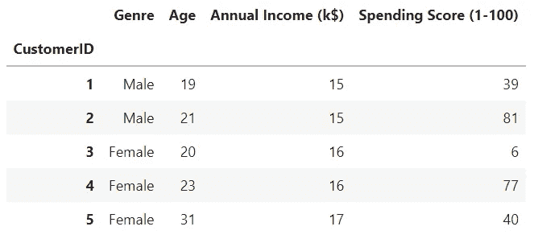
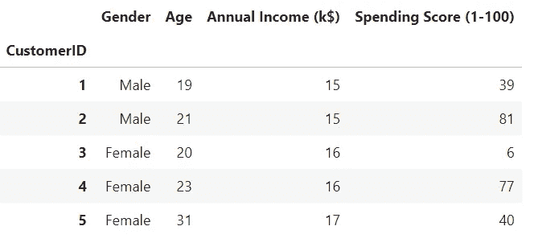
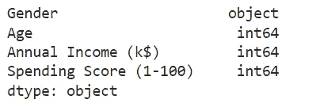
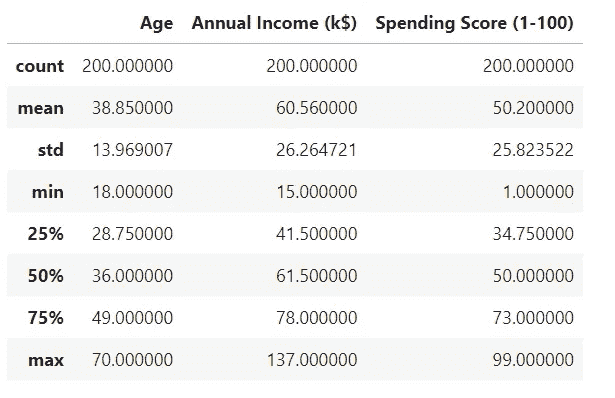
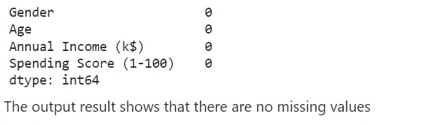
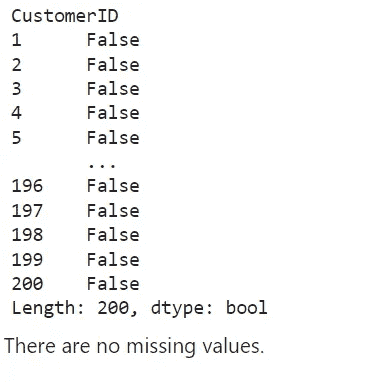
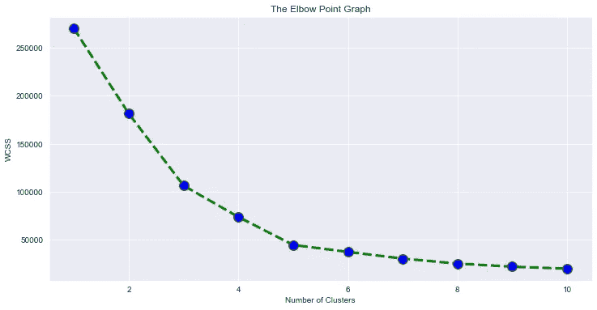
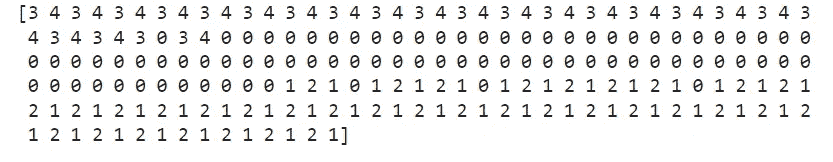
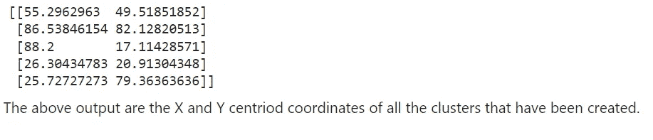
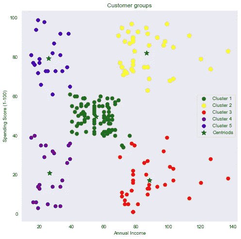

# 基于 K 均值聚类的客户细分

> 原文：<https://medium.com/mlearning-ai/customer-segmentation-using-k-means-clustering-ae73e3d82934?source=collection_archive---------0----------------------->

客户细分就是对具有相似特征的客户进行分组。这些特征包括地理、人口、行为、购买力、环境因素、个性、生活方式、心理等。客户细分的目标是通过设计营销措施或方案和改进目标营销措施来获得客户、保留客户、提高客户盈利能力、客户满意度、资源分配[1]。

聚类是一种用于客户细分的有效技术。聚类将同质数据点放在给定的数据集中。这些组中的每一个都被称为一个簇[2]。虽然每个集群中的对象之间是相似的，但是它们与其他组中的对象是不同的。聚类是机器学习中的一种数据挖掘方法，归类于无监督学习[3]。这是因为它能够从未标记的数据中发现模式和信息。它广泛用于机器学习、分类和模式识别[3]。

聚类算法包括 K-means 算法、层次聚类、DBSCAN [4]。在本项目中，k-means 聚类算法被应用于客户细分。K-means 是一种基于划分原则的聚类算法[5]。字母 k 代表所选择的簇的数量。这是最常见的基于质心的算法。

K-means 聚类的步骤有[5]:

1.确定聚类数(k)。
2。选择初始质心。
3。将每个数据点映射到最近的聚类中(最类似于质心)。
4。更新每个聚类的平均值(质心)。
5。重复步骤 3–4，直到所有质心都没有改变。

让我们直接跳进来吧！

## ***问题陈述***

一家零售店希望深入了解其客户。然后构建一个系统，将客户分成不同的组。

## ***关于数据集***

数据集可以从 kaggle 网站下载，该网站可以在[这里](https://www.kaggle.com/datasets/vjchoudhary7/customer-segmentation-tutorial-in-python)找到。

该数据包括以下特征:

1.客户 ID
2。客户性别
3。客户年龄
4。客户年收入(千美元)
5。客户的支出分数(基于客户行为和支出性质)

**导入库**

**读取数据集**

First five rows of the dataset. Image by the author.

## 探索性数据分析

在这一步中，我们将执行下面的操作来检查数据集由什么组成。我们将执行以下操作:

—重命名数据集中的一列
—检查数据类型
—描述性统计
—查找空值或缺失值
—查找重复值

## **重命名数据集中的一列**

rename()函数用于数据帧中的列。我们将第二列从“流派”更名为“性别”

df.rename( ). Image by the author

## 检查数据类型和形状

dtypes 函数用于检查数据帧中的所有数据类型。

df.dtypes( ). Image by the author

shape 函数用于检查行数和列数。

在我们的数据集中有 200 行(数据点)和 4 列。

## 描述统计学

describe()函数用于获取给定数据帧的描述性统计概要。这包括所有要素的平均值、计数、标准差、百分位数和最小-最大值。

Descriptive statistics summary of the dataframe. Image by the author.

## 查找空值或缺失值

isnull()函数用于检测缺失值。

isnull( ) to check for missing values. Image by the author

## 寻找重复的值

duplicated()函数用于在数据帧中查找重复的行。它返回一系列真值和假值，描述数据帧中的哪些行是重复的，哪些是不重复的。

df.duplicated( ). Image by the author.

## 二元分析—散点图

我们感兴趣的是确定年收入(k$)和支出分数(1-100)之间的关系，我们将使用散点图。

Scatterplot between Annual Income (k$) and Spending Score (1–100). Image by the author.

## 特征选择(为聚类选择感兴趣的列)

我们只对年收入(k$)和支出分数(1-100)感兴趣。因此，让我们使用。loc()函数。

## 特征标准化

特征标准化有助于将所有数据元素调整到一个共同的范围，以提高聚类算法的性能。例如，在我们的数据集中，年收入以千计，支出分数只有两位数。由于这些变量中的数据尺度不同，很难对这些变量进行比较。每个数据点都转换为 0 到+1 的范围。归一化技术包括最小-最大值、十进制缩放和 z 分数。在数据集上运行 k-Means 算法之前，使用最小最大比例归一化技术对要素进行归一化。

Feature normalization. Image by the author.

输出显示了我们的变量年收入(k$)和支出分数(1-100)的转换数字。所有值都在 0 和 1 之间。没有负值，也没有大于 1 的数字。

## 选择最佳聚类数

a)为了找到最佳聚类数，我们使用了 WCSS(聚类平方和内)

**WCSS** 被定义为集群的每个成员与其质心之间的平方距离之和。当我们考虑一个集群，然后两个集群直到 10 时，我们创建一个 for 循环来查找 wcss 值。然后找到最小 wcss 值

“init”参数是初始化质心的方法。

b)绘制肘形图

**肘图**用于确定数据集中的聚类数。

Elbow graph. Image by the author

从上图中，我们可以观察到，从聚类数= 4 到聚类数= 6 之间有显著减少(一个肘形),因此，我们选择数据集的 K 值为 5。

## 训练 K-Means 聚类模型

现在，让我们在具有多个分类 5 的数据集上训练模型。

cluster number for each of the data points. Image by the author.

上面的值表示每个数据点的聚类数。

## 检查外部聚类的中心(也称为质心)

X and Y centroid coordinates of all the clusters that have been created. Image by the author.

## 可视化所有集群

clusters. Image by the author.

## 商业洞察力

分析的结果表明，零售商店的顾客可以被分成 5 个群或段，以便进行有针对性的营销。

**聚类 1(绿色):**这些是平均收入者，平均支出分数。他们在商店消费时很谨慎。

**聚类 2(黄色):**该组中的客户是高收入人群，并且具有高消费分数。他们带来利润。针对这一群体的折扣和其他优惠将增加他们的消费分数，并使利润最大化。

**聚类 3(红色):**这一组顾客收入较高，但他们不会在商店花费更多。其中一个假设可能是他们对商店提供的服务不满意。他们是营销团队瞄准的另一个理想群体，因为他们有潜力为商店带来更多利润。

**聚类 4(紫色):**消费得分低的低收入者。我可以假设这是因为低收入的人会倾向于在商店购买较少的商品。

**聚类 5(蓝色)**:这些是低收入客户，消费得分高。我可以假设，为什么这群顾客在收入较低的情况下却在零售店消费较多，是因为他们喜欢并满意零售店提供的服务。

# 参考

1.k .索森、t .托姆扎克和 a .赫尔曼(2005 年)。战略市场细分分类法的发展:弥合规范市场细分和商业实践之间差距的框架。*战略营销杂志*， *13* (3)，151–173。

2.K. R .卡什万和 C. M .韦卢(2013 年)。使用聚类和数据挖掘技术进行客户细分。*国际计算机理论与工程杂志*， *5* (6)，856。

3.拉伊和辛格(2010 年)。聚类技术综述。*国际计算机应用杂志*， *7* (12)，1–5。

4.T.Nelson Gnanaraj，K.Ramesh Kumar N.Monica 博士――使用新的 k 均值算法从结构化和非结构化数据中挖掘聚类的调查。国际计算机科学与技术进展杂志。2007.第三卷第二页。

5.韩，裴，金，米(2011)。数据挖掘:概念和技术。爱思唯尔。

 [## Mlearning.ai 提交建议

### 如何成为 Mlearning.ai 上的作家

medium.com](/mlearning-ai/mlearning-ai-submission-suggestions-b51e2b130bfb)