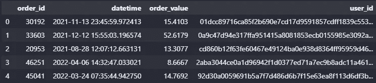
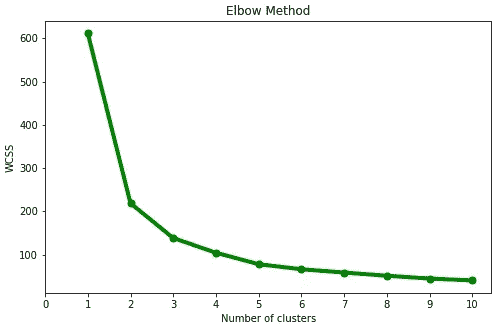
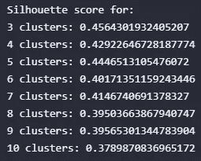
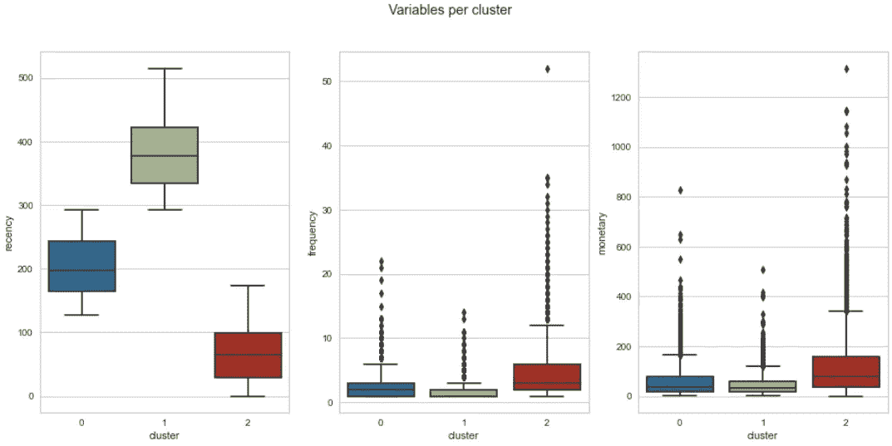
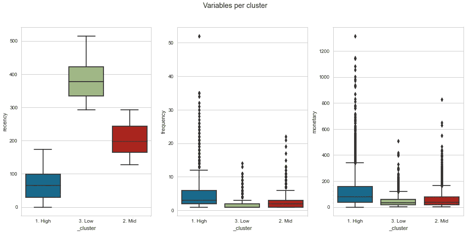

# 使用 RFM 分析和 KMeans 进行客户细分

> 原文：<https://medium.com/mlearning-ai/customer-segmentation-using-rfm-analysis-with-kmeans-1e868f8e5bb2?source=collection_archive---------1----------------------->

## 基于 **RFM 分析**和 **K 均值算法**增强您的客户细分

Photo by [Chris Linnett](https://unsplash.com/@chrislinnett?utm_source=medium&utm_medium=referral) on [Unsplash](https://unsplash.com?utm_source=medium&utm_medium=referral)

## 目录

1.  背景——什么是客户细分？RFM？克迈恩斯？
2.  业务场景
3.  履行
4.  结果

## **背景**

> **客户细分**是根据客户群的相似性将客户群分成不同组的过程。

这种相似性的概念取决于共同的特征，例如人口统计*(例如，年龄、性别、收入水平)*或交易行为*(例如，消费金额、购买数量、自上次购买以来的天数)* [ [1](https://www.qualtrics.com/experience-management/brand/customer-segmentation/#:~:text=Customer%20segmentation%20is%20the%20process,of%20building%20a%20marketing%20persona.) 。

如果我们成功地确定了这些群体之间的相似性和差异性，那么我们就可以为他们中的每一个建立有针对性的策略。

客户细分的一些好处是[ [2](https://wpswings.com/blog/customer-segmentation-benefits/) ]:

*   更多的客户保留
*   增强竞争力
*   导致价格优化

现在，有几种方法来细分客户，但有一种方法在数字营销人员中相当普遍，它被称为 **RFM 分析。**

> **RFM 分析**是一种基本的客户细分算法，用于通过测量和分析消费习惯来识别公司的最佳客户[ [3](https://www.investopedia.com/terms/r/rfm-recency-frequency-monetary-value.asp) ]。

该模型基于三个主要变量:

1.  **最近:**顾客最近购买了什么东西*(即，如果你在 6 月 3 日买了东西，今天是 6 月 10 日，你的最近时间是 7 天)*。
2.  **频率:**客户购买的频率*(即，如果您在特定的分析时间间隔内购买了 5 次，则您的频率为 5)* 。
3.  **货币:**顾客在购买上花了多少钱*(即，如果你买了 3 件定价为 5 美元的产品，那么你的货币价值就是 15 美元)*。

这些变量是客户行为的相关指标，因为频率和货币价值会影响客户的终身价值，而新近性会影响保留率(参与度的衡量标准)[ [4](https://clevertap.com/blog/rfm-analysis/) ]。

然而，我们不想在这种方法上只使用 RFM 分析，所以我们引入了一种流行的无监督机器学习算法，称为 **KMeans** 。

> **KMeans** 是一种聚类算法，将数据集划分为 k 个聚类，其中 k 是先验定义的。每个集群指的是由于某些相似性而聚集在一起的数据(在本例中是用户)的集合[ [5](https://towardsdatascience.com/understanding-k-means-clustering-in-machine-learning-6a6e67336aa1) ]。

简而言之，我们将把相似的观察结果分组在一起(在 k 个集群中),并发现潜在的模式。

## 业务场景

在下面的分析中，我们将使用一个随机生成的事务数据集。目标是使用日期、订单 id、用户 id 和订单价值等变量来识别至少 3 个基于交易的客户群。

## 履行

你可以在这里找到数据集。它包含四个变量:

*   **订单标识:**交易的标识
*   **日期时间:**进行交易的日期和时间
*   **订单价值:**交易价值(美元)
*   **用户标识:**用户的标识

**第一步:**导入库，设置通用选项，加载数据。

data.head()

**第二步:**使用 [RFM 类和 get_vars 方法](https://github.com/alejlatorre/KMeans-RFM-Segmentation/blob/main/engine/models.py)创建最近、频率和货币变量。

**第三步:**对变量应用标量函数。我们可能会注意到，KMeans 是一个基于距离的模型，因此我们需要调整范围，以避免构建有偏差的模型。

rfm_vars.describe()

**第四步:**获取最优 k 值。有几种方法可以确定最佳超参数，在这种情况下，我们将使用肘方法和轮廓分数。

Elbow method (Image by the autor)

x 轴是聚类的数量，y 轴是“类内平方和”度量。我们在 k=3 处有“肘”，我们可以注意到，k=4 之后的减量是不明显的，因此我们将使用轮廓分数来验证这个聚类数。

> **聚类内平方和(惯性)**是样本到其最近聚类中心的平方距离之和。我们希望将它最小化，保持最少的集群数量。
> 
> **剪影得分**是一种用于计算聚类技术优劣的度量，其中 1 表示聚类彼此相距很远，并且它们被清楚地区分，0 表示聚类无关紧要，而-1 表示聚类被错误地分配[ [7](https://towardsdatascience.com/silhouette-coefficient-validating-clustering-techniques-e976bb81d10c) ]。

Silhouette scores per cluster

Silhouette plot of KMeans Clustering in 3 centers (Image by author)

因此，我们可以看到，最高分是由 3 个集群获得的。

**第五步:**应用 KMeans 算法。我们可以使用 sklearn 实现中的 fit 和 predict 方法。

## 结果

我们可以使用箱线图来查看每个集群的数据分布。

Boxplots per each variable and cluster (Image by the author)

这些图向我们展示了具有最高频率值和货币值(客户价值)以及最低新近值(客户参与度)的聚类是聚类 2，其次是聚类 0，然后是聚类 1。

为了更好地理解集群，我们还可以将这些值映射到有意义的名称，例如 ***high、mid 和 low*** 。

Boxplots with mapped values (Image by author)

**感谢阅读！**

*查看我的*[***GitHub repo***](https://github.com/alejlatorre/KMeans-RFM-Segmentation)*查看完整实现*

*如果你想和我联系，这里有我的*[***Linkedin***](https://www.linkedin.com/in/alejandro-latorre-rojas/)

你也可以打***alej669@gmail.com***找我

***参考文献***

【1】[*什么是客户细分？*](https://www.qualtrics.com/experience-management/brand/customer-segmentation/#:~:text=Customer%20segmentation%20is%20the%20process,of%20building%20a%20marketing%20persona.) *。于 2022 年 6 月 28 日访问。*

[*客户细分的好处*](https://wpswings.com/blog/customer-segmentation-benefits/) 。2022 年 6 月 28 日访问。

[*【3】新近性、频率、货币价值*](https://www.investopedia.com/terms/r/rfm-recency-frequency-monetary-value.asp) 。2022 年 6 月 28 日访问。

[*【4】RFM 对客户细分的分析*](https://clevertap.com/blog/rfm-analysis/) 。2022 年 6 月 28 日访问。

[5] [*理解机器学习中的 K-means 聚类*](https://towardsdatascience.com/understanding-k-means-clustering-in-machine-learning-6a6e67336aa1) 。2022 年 6 月 28 日访问。

[*【肘法】求 k 的最优值的方法*](https://www.geeksforgeeks.org/elbow-method-for-optimal-value-of-k-in-kmeans/) 。于 2022 年 6 月 29 日访问。

*【7】剪影系数。2022 年 6 月 30 日访问。*

* [## Mlearning.ai 提交建议

### 如何成为 Mlearning.ai 上的作家

medium.com](/mlearning-ai/mlearning-ai-submission-suggestions-b51e2b130bfb)*