# 使用 K-均值聚类的客户特征分析

> 原文：<https://medium.com/mlearning-ai/customers-profiling-using-k-means-clustering-2264c3c30775?source=collection_archive---------0----------------------->


Image By [Link](https://www.flickr.com/photos/arena_provietnam/4326152763/in/photolist-7AhEuK-bNRTYr-2jLjK8-D3gSyj-bn5rmB-CPwyF3-aDNXVy-aDNXVC-2kPu6ts-2mmjRCH-2mKkMDD-2n6Vwir-2jwVZeU-Co7hdS-aDP24N-aEALVo-aEwY8t-DMryM-asBUQc-aEADRG-czo48Q-3ewzM7-6ueRfu-614BRn-9jZaMs-267C5gP-bycueF-2jdmMVp-9bk9um-eZE1qS-9dzmwB-8sHnrT-8sHns6-95ULAc-68DFTd-9iVEUY-cLhvDN-2dzhv9g-nQDVQ4-2e8RPRW-2e8Se97-9dhMPt-8sHnpT-8sLq1m-8sLq17-7SYArZ-bZ76Mj-8sHnqc-bxKBCt-QJQyka)

营销团队一直在尽最大努力了解他们的客户是谁。通过了解更多的用户，该团队将更好地了解如何根据客户行为创建营销活动、促销、特别优惠等。

在本文中，我将演示如何使用 K-Means 聚类，根据购物中心数据集([数据链接](https://www.kaggle.com/kandij/mall-customers))中的收入和支出分数对我们的客户进行细分。

## 商场顾客细分的聚类模型

目标:根据客户的收入和支出得分创建客户档案

指导方针:

1.  数据准备、清理和争论
2.  探索性数据分析
3.  开发集群模型

文件描述:

1.  CustomerID:每个客户的唯一 ID
2.  类型:用户的性别
3.  年龄:用户当前的生命长度
4.  年收入(千美元) :用户年收入以千美元计
5.  消费得分(1-100):用户消费习惯(得分越高意味着消费越多，反之亦然)

## 1.数据准备、清理和争论

```
#Import Library and Load File
import pandas as pd
import numpy as npdf = pd.read_csv('/kaggle/input/mall-customers/Mall_Customers.csv')
df.info() *#checking data types and total null values*
```

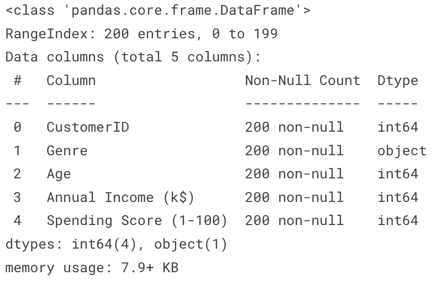

Dataframe Summary

我们的数据框中有 5 列 200 行，数据中没有空值。

让我们检查一下数据框中是否有重复的行。

```
*#Checking If any duplicated values* 

print(f'Total Duplicated Rows : **{**df.duplicated().sum()**}**')
```

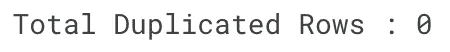

接下来，我们将检查从 0 到 100 的每个数字列百分比汇总。

```
*#Let's see the percentile from each numerical columns from the dataset*

def percentile(df, column) :
    print(f'**{**column**}** Percentile Summary :')
    for a **in** range(0,101,10) :
        print(f'- **{**a**}**th Percentile : **{**round(np.percentile(df[column],a),2)**}**')

*#Percentile for Age*
percentile(df, 'Age')*#Annual Income Percentile*
percentile(df,'Annual Income (k$)')*#Spending Score Percentile*
percentile(df,'Spending Score (1-100)')
```

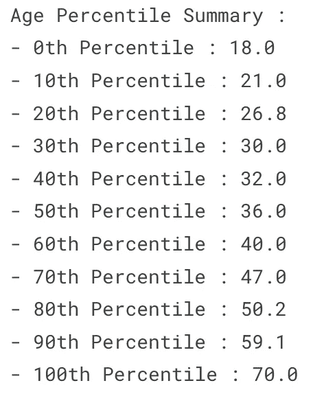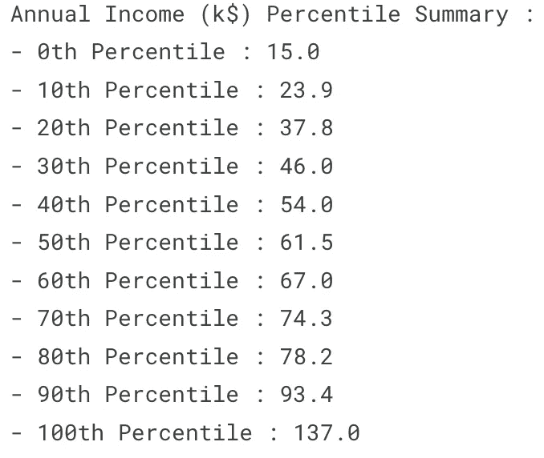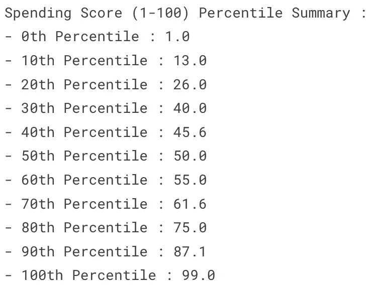

Numeric Columns Percentile Summary

```
*#Count Each Gender total* 

gender_total = df['Genre'].value_counts().reset_index()
gender_total['perc_genre'] = round(gender_total['Genre']/sum(gender_total['Genre']),2)*100
gender_total
```

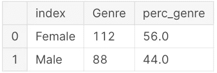

我们检查了空值，复制并显示了数字列的百分比和分类列中每个唯一值的总值。

然后，我们将开始研究上面的一些数据，以更好地了解我们的数据集。

## 2.探索性数据分析

```
import matplotlib.pyplot as plt
import seaborn as sns
import plotly.express as px

num_cols = ['Age','Annual Income (k$)','Spending Score (1-100)']
def plot_stats(df, col_list) :
    for a **in** num_cols :
        fig,ax = plt.subplots(1,2, figsize = (9,6))

        sns.distplot(df[a], ax = ax[0])
        sns.boxplot(df[a], ax = ax[1])

        ax[0].axvline(df[a].mean(), linestyle = '--', linewidth = 2, color = 'green')
        ax[0].axvline(df[a].median(), linestyle = '--', linewidth = 2 , color = 'red')

        ax[0].set_ylabel('Frequency')
        ax[0].set_title('Distribution Plot')

        ax[1].set_title('Box Plot')

        plt.suptitle(a)
        plt.show()

plot_stats(df, num_cols)
```

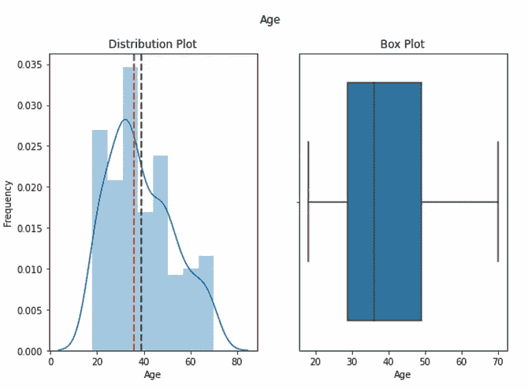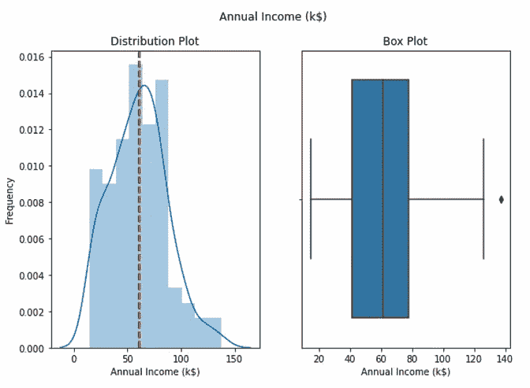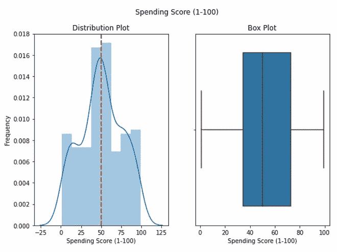

Distribution and Box Plot for Numerical Columns

列“年龄”和“年收入(k$)”是正偏的，我们希望用第 10 和第 90 个百分位替换异常值，以使数据正常化。

```
*#Flooring and Capping by replacing outliers with 10th and 90th Percentile*

*#Age 10th Percentile and 90th Percentile* 
tenth_percentile_age = np.percentile(df['Age'], 10)
ninetieth_percentile_age = np.percentile(df['Age'], 90)

df['Age'] = np.where(df['Age'] < tenth_percentile_age, tenth_percentile_age, df['Age'])
df['Age'] = np.where(df['Age'] > ninetieth_percentile_age, ninetieth_percentile_age, df['Age'])

*#Annual Income 10th Percentile and 90th Percentile*
tenth_percentile_annualincome = np.percentile(df['Annual Income (k$)'], 10)
ninetieth_percentile_annualincome = np.percentile(df['Annual Income (k$)'], 90)
df['Annual Income (k$)'] = np.where(df['Annual Income (k$)'] < tenth_percentile_annualincome, tenth_percentile_annualincome, df['Annual Income (k$)'])
df['Annual Income (k$)'] = np.where(df['Annual Income (k$)'] > ninetieth_percentile_annualincome, ninetieth_percentile_annualincome, df['Annual Income (k$)'])plot_stats(df, num_cols) *#Checking Distribution after replacing outliers with 10th and 90th Percentile*
```

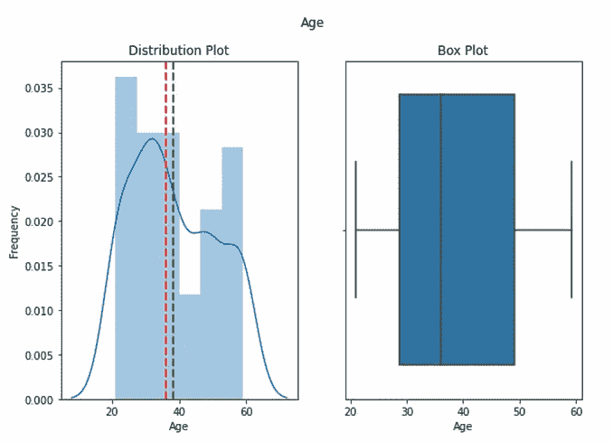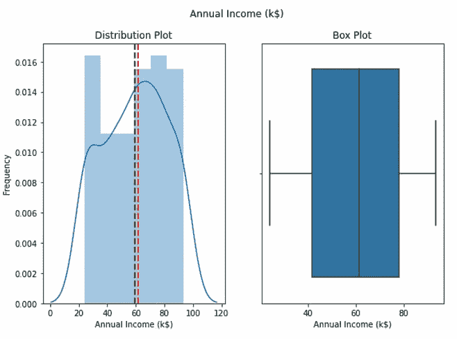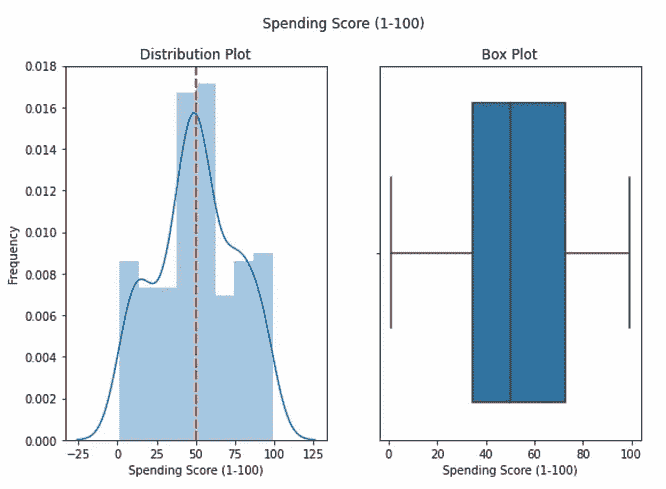

Distribution and Box Plot After Replacing Outliers

数据已经标准化，从上面的图表中我们可以看到，在列中没有检测到异常值。

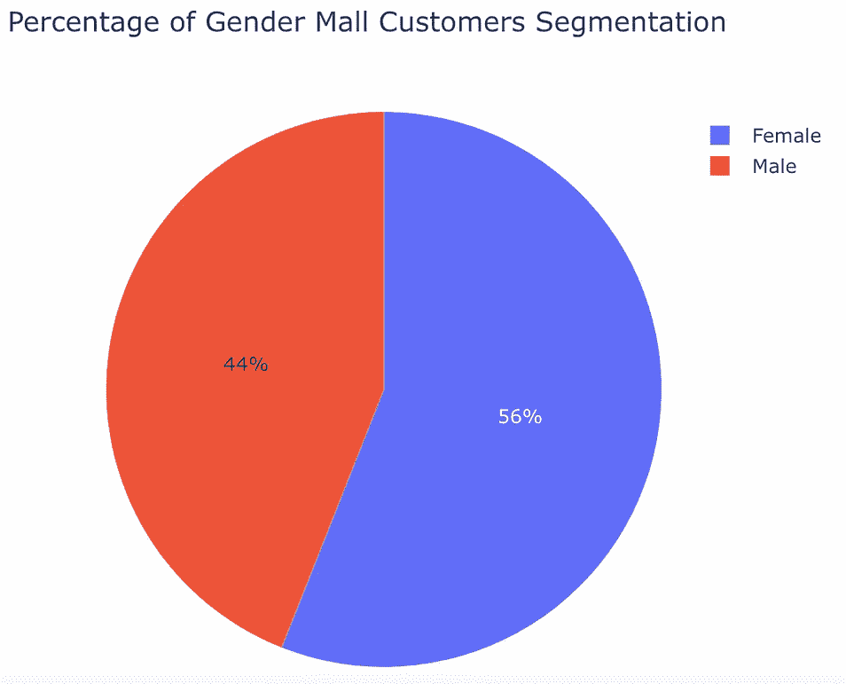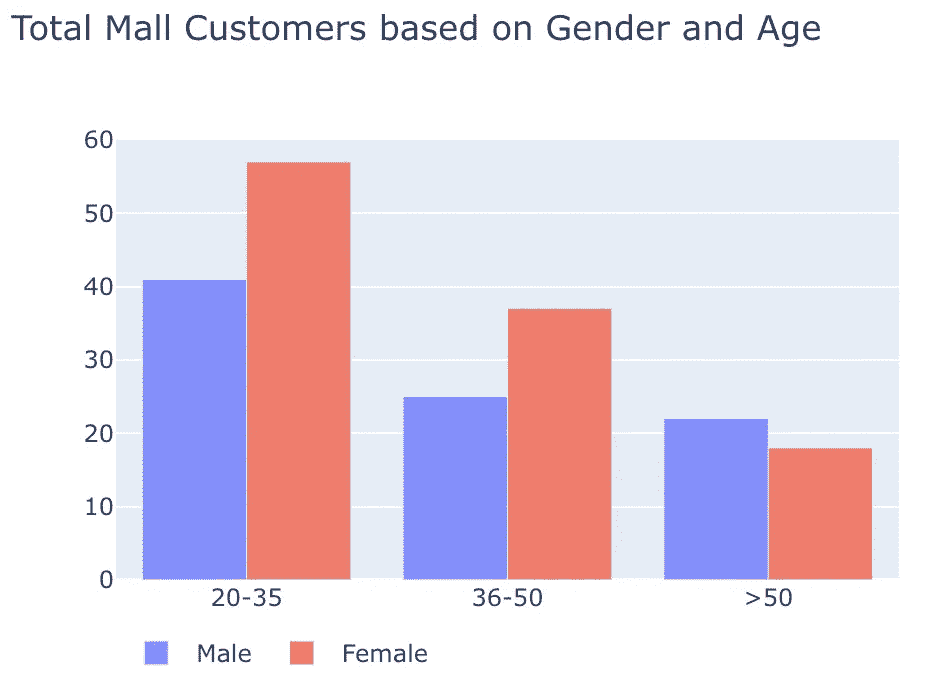

大多数顾客是女性(56%)，从年龄组来看，去购物中心的人都是年轻人(20-35 岁年龄组)。

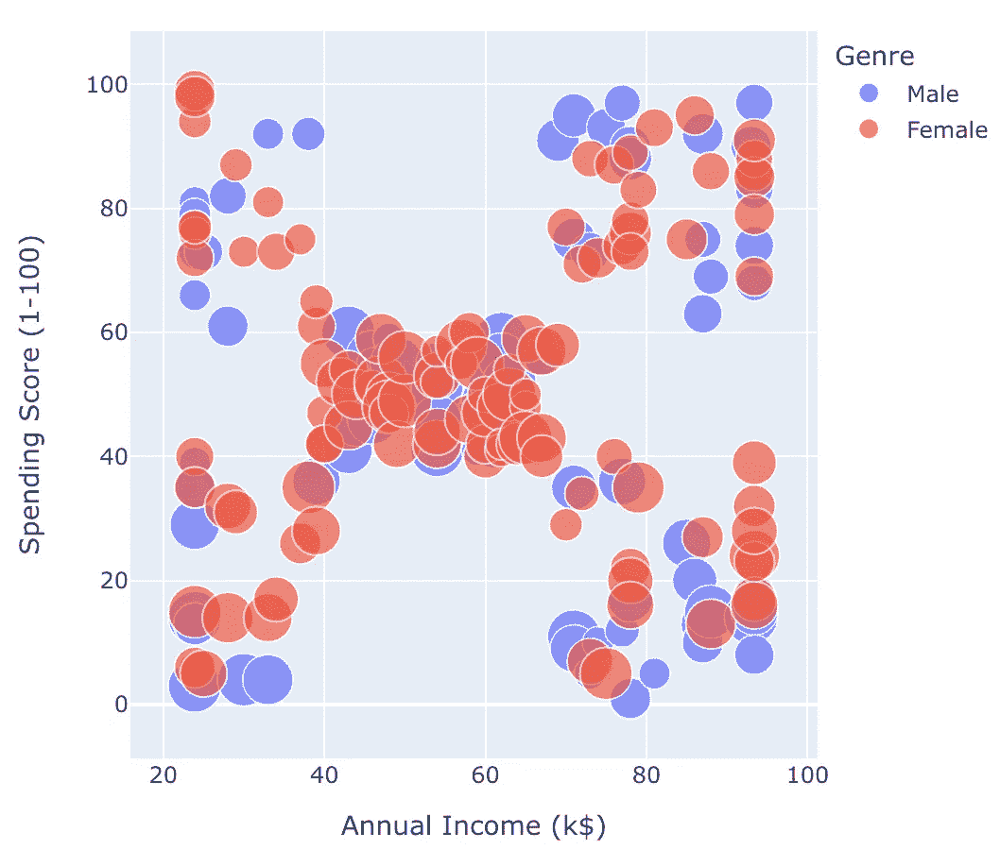

根据上面的散点图，我们可以看到大多数客户的平均收入和平均支出得分。除此之外，根据收入和支出得分，我们的数据集中还有另外 4 个独立的组。

散点图可以分为以下几类:

1.  高收入低支出
2.  高收入高支出
3.  平均收入平均支出
4.  低收入低支出
5.  低收入高支出

接下来，我们将使用上面的 5 个类别来标记我们的数据。

## 3.开发集群模型

```
from sklearn.preprocessing import MinMaxScaler
from sklearn.decomposition import PCA
from sklearn.cluster import KMeans*#Normalize Numeric Features*
scaled_features = MinMaxScaler().fit_transform(df.iloc[:,3:5])

*#Get 2 Principal Components*
pca = PCA(n_components = 2).fit(scaled_features)
features_2d = pca.transform(scaled_features)*#5 Centroids Model* 
model = KMeans(n_clusters = 5, init= 'k-means++', n_init = 100, max_iter = 1000, random_state=16)

*#Fit to the data and predict the cluster assignments to each data points*
feature = df.iloc[:,3:5]
km_clusters = model.fit_predict(feature.values)
km_clusters
```

为了使用 KMeans 开发我们的聚类模型，我们需要对数据集中的数字特征进行缩放/归一化。

在上面的代码中，我使用 MinMaxScaler()通过将每个特征缩放到给定的范围来转换特征。其次是主成分分析，主要用于降低大数据集的维数。

我在当前的数据集中使用主成分分析，只是为了给如何在实际应用中使用它树立一个榜样。

因此，数据已经标准化和简化，然后我们可以开始训练我们的聚类模型来标记数据集。

下面是生成的结果。

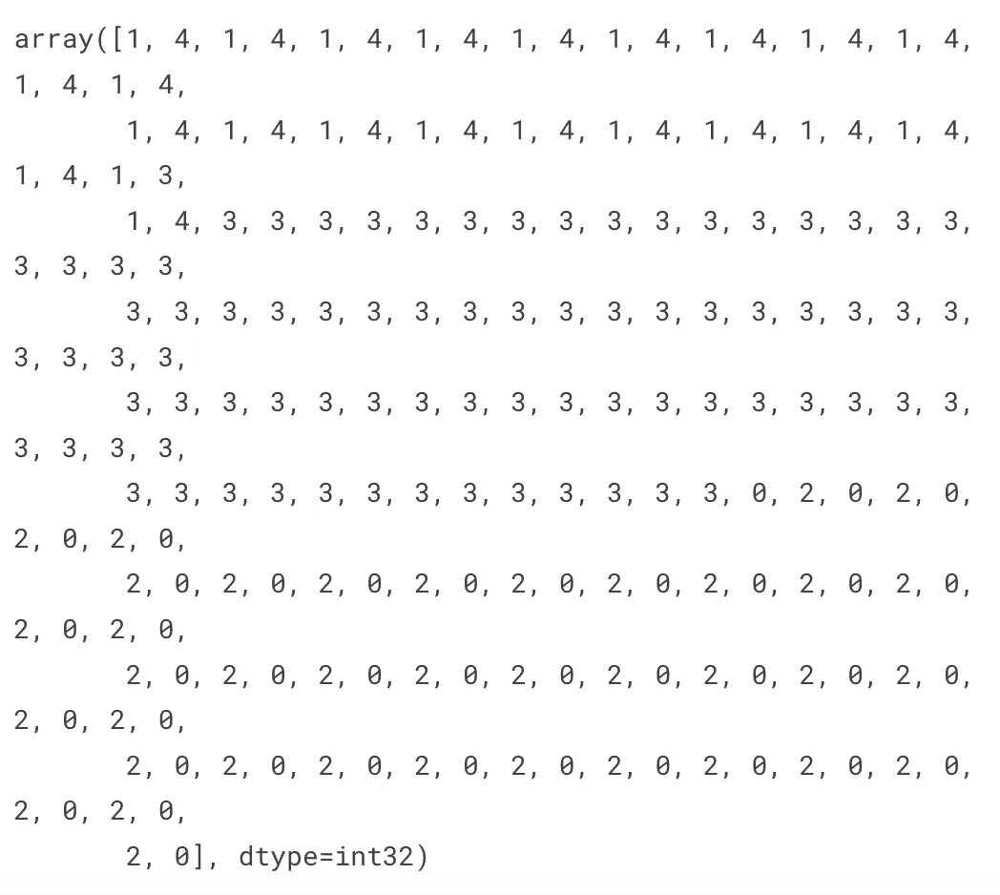

Array Result After Model Training

然后，最后我们将使用散点图来可视化结果，以查看我们生成的标签。

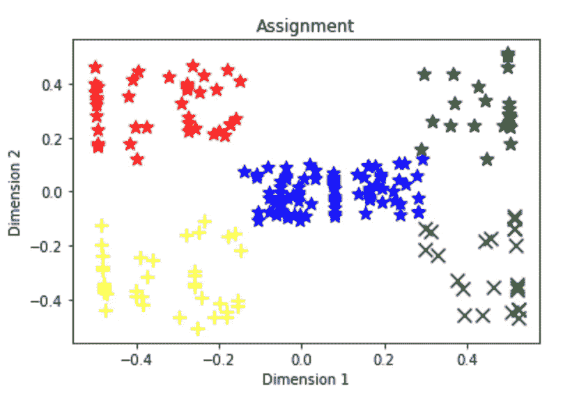

对于开发上述情节中的代码，我将在文章末尾发布链接。但是，现在，我们可以看到每个组都根据数据集中的相似性进行了标记。

这是客户特征分析的最终结果。

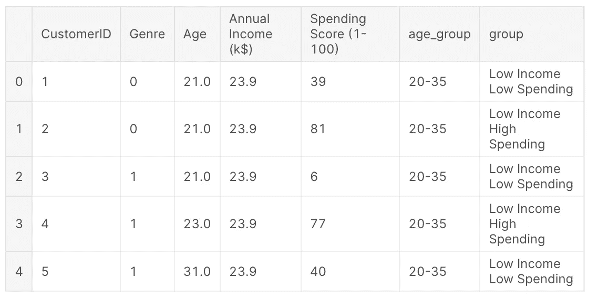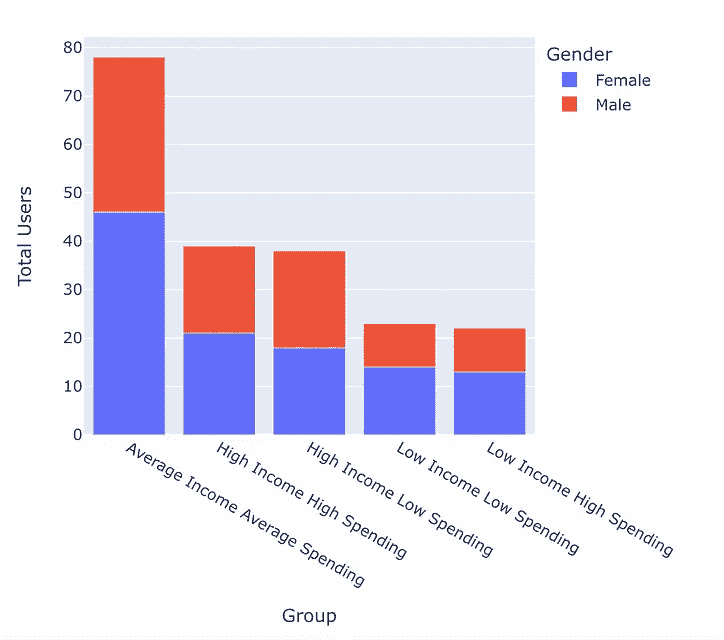

这就是你要做的，这是开发客户细分最流行的方法之一。

我希望这篇文章对你创建自己的客户档案有所帮助。

感谢你阅读这篇文章，如果你们想了解我的帖子，请关注我的媒体简介！

**参考文献:**

[](https://www.kaggle.com/kelvinprawtama/mall-customers-segmentation?scriptVersionId=89515113) [## 商场客户细分

### 使用 Kaggle 笔记本探索和运行机器学习代码|使用来自商场客户的数据

www.kaggle.com](https://www.kaggle.com/kelvinprawtama/mall-customers-segmentation?scriptVersionId=89515113) [](https://www.kaggle.com/kandij/mall-customers) [## 商场顾客

### 在这个核中，我们主要使用 K-means 聚类算法。

www.kaggle.com](https://www.kaggle.com/kandij/mall-customers) [](/mlearning-ai/mlearning-ai-submission-suggestions-b51e2b130bfb) [## Mlearning.ai 提交建议

### 如何成为 Mlearning.ai 上的作家

medium.com](/mlearning-ai/mlearning-ai-submission-suggestions-b51e2b130bfb)