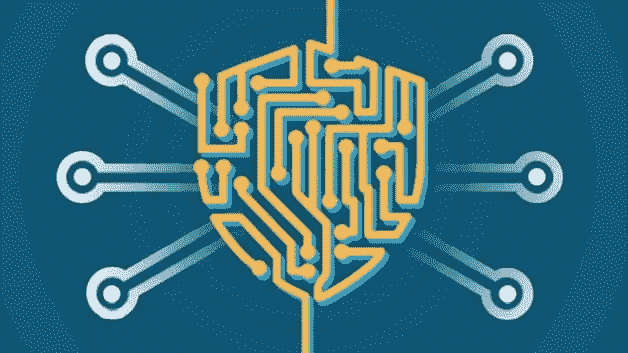

# 网络安全:是什么？

> 原文：<https://medium.com/mlearning-ai/cyber-securities-what-is-it-1adb6f48f412?source=collection_archive---------11----------------------->

保护计算机、服务器、移动设备、电子系统、网络和数据免受恶意攻击的过程被称为网络安全。它也被称为电子信息安全或信息技术安全。这个词被用在很多场合，从商业到移动计算，它可以被分成几类。

## **要点**

*   保护计算机网络免受入侵者(无论是蓄意攻击者还是机会主义恶意软件)攻击的技术被称为网络安全。
*   应用程序安全的目标是保护软件和设备免受攻击。一个被黑客攻击的程序可能会提供对它应该保护的数据的访问。安全始于整个设计阶段，远在部署程序或设备之前。
*   在存储和传输过程中，数据完整性和隐私都受到信息安全的保护。
*   运营安全中包含处理和保护数字资产的方法和决策。定义数据保存或交换的方式和位置的流程，以及用户在访问网络时拥有的权限，都属于这一范畴。
*   灾难恢复和业务连续性是用来描述公司如何应对网络安全违规或任何其他导致运营或数据丢失的灾难的术语。灾难恢复策略定义了组织如何将操作和信息恢复到与灾难发生前相同的操作能力。业务连续性是一个组织在因缺乏资源而无法运营时使用的策略。
*   最终用户教育解决了网络安全最不可预测的方面:人类。由于未能遵循适当的安全程序，任何人都可能无意中将病毒引入到受保护的系统中。教导人们删除可疑的电子邮件附件，不要插入不熟悉的 USB 设备，以及各种其他重要的教导，对于每个组织的安全都至关重要。

# 网络威胁的危险

全球网络威胁正在快速演变，数据泄露事件每年都在增加。根据 RiskBased Security 发布的研究报告，2019 年前九个月，数据泄露暴露了 79 亿条记录。这是去年同期披露的记录数量的两倍多(112%)。

大多数违规行为发生在医疗服务、零售和政府机构中，恶意犯罪分子对大多数情况负有责任。由于它们收集金融和医疗数据，其中一些行业对网络罪犯特别有吸引力，但任何使用网络的公司都可能因消费者数据、企业间谍或网络犯罪而受到攻击。

国际数据公司预测，随着网络威胁的规模继续增长，到 2022 年，全球在网络安全解决方案上的支出将达到惊人的 1337 亿美元。世界各国政府已发布指导方针，帮助企业建立强大的网络安全程序，以应对日益增长的网络威胁。

美国国家标准和技术研究所(NIST)开发了一个网络安全架构。该框架主张对所有电子资源进行持续的实时监控，以防止有害恶意软件的传播，并帮助早期识别。

系统监控的重要性反映在英国政府国家网络安全中心的“网络安全 10 阶段”指南中。澳大利亚网络安全中心(ACSC)定期在澳大利亚就企业如何应对最新的网络安全威胁提供建议。

# 一些数字危险

正常的数字危险包括:

1.  恶意软件，例如勒索软件、僵尸网络编程、rat(远程访问木马)、rootkits 和 bootkits、间谍软件、木马、感染和蠕虫。
2.  次要通道，允许远程访问。
3.  劫持表单，将恶意代码嵌入在线结构。
4.  密码劫持，引入非法数字货币挖掘编程。
5.  DDoS(分布式拒绝管理)攻击，用流量淹没服务器、框架和组织，使它们断开连接。
6.  DNS(空间名称框架)危害攻击，损害 DNS 以将流量转移到有害的目的地。

(这是对网络危险的基本理解，我将在以后的文章中详细介绍)

 [## Mlearning.ai 提交建议

### 如何成为 Mlearning.ai 上的作家

medium.com](/mlearning-ai/mlearning-ai-submission-suggestions-b51e2b130bfb)