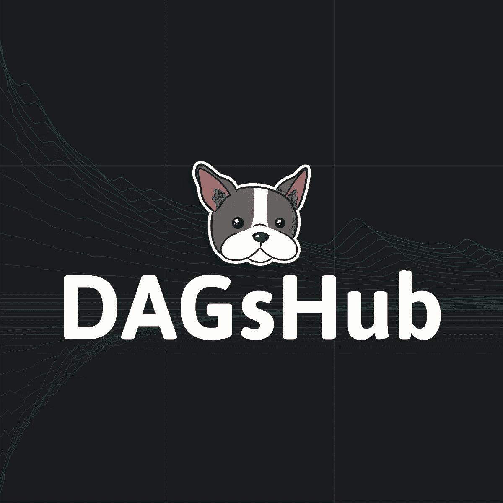
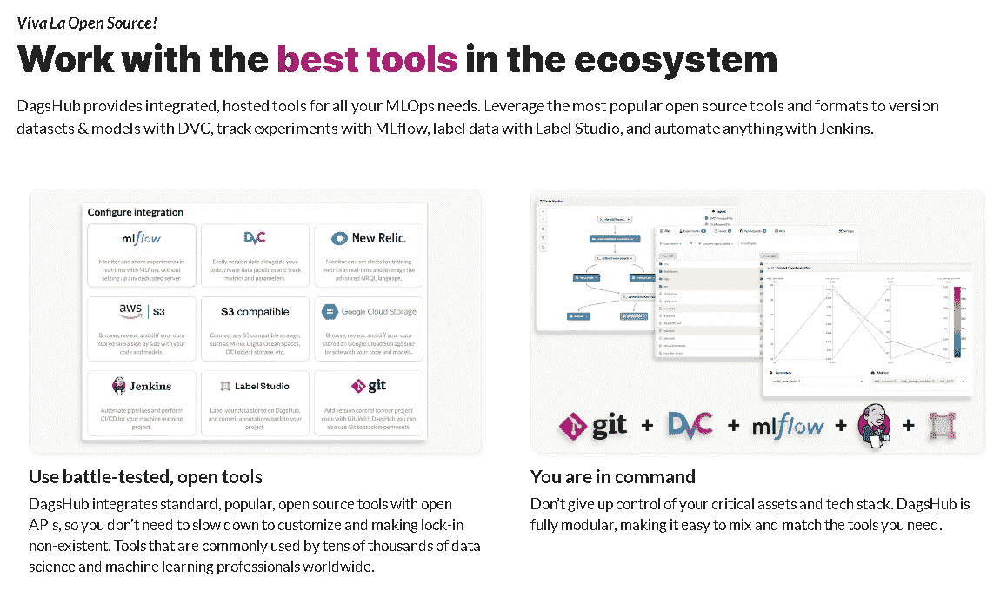
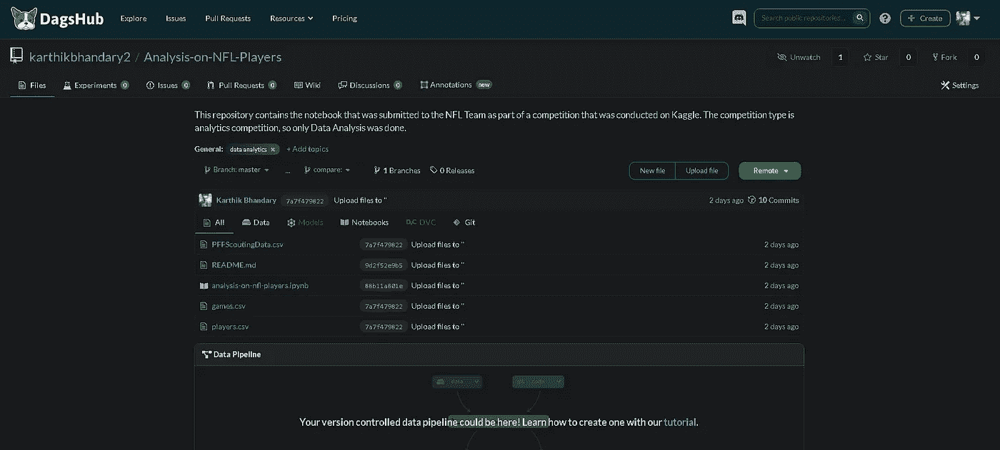
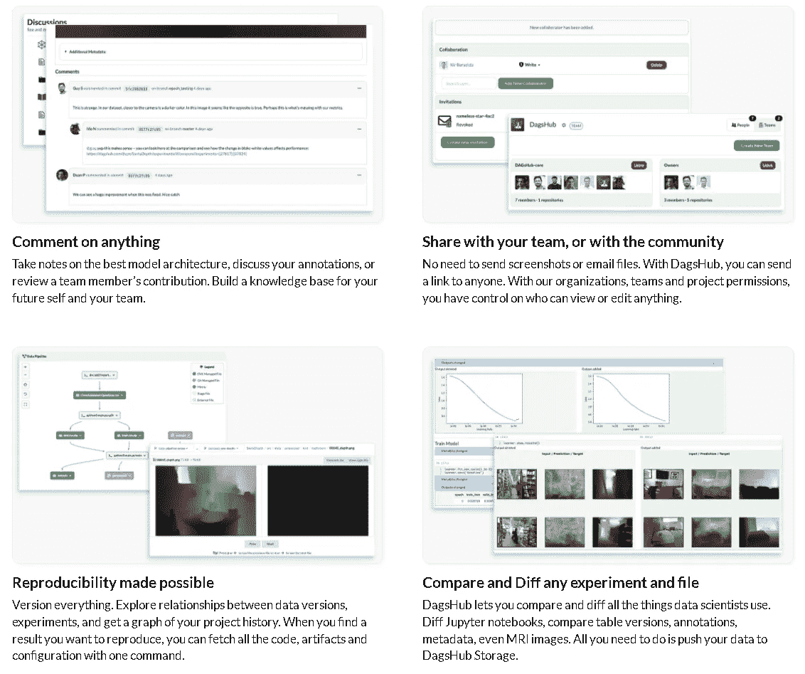
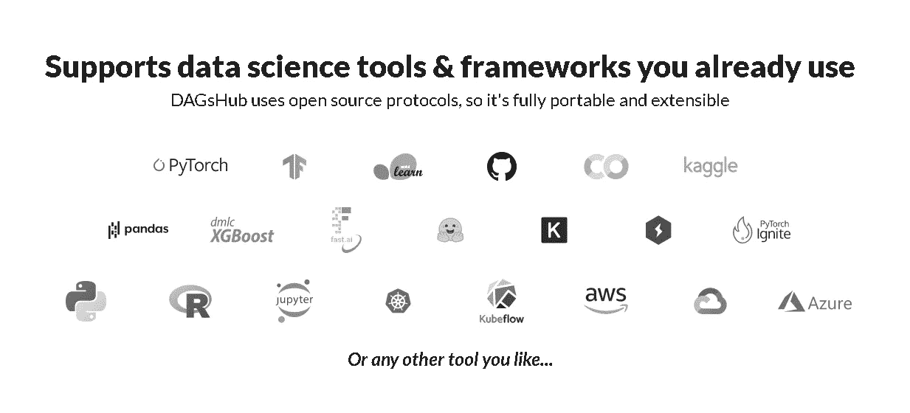
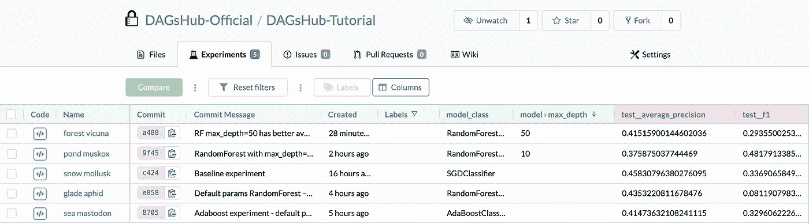
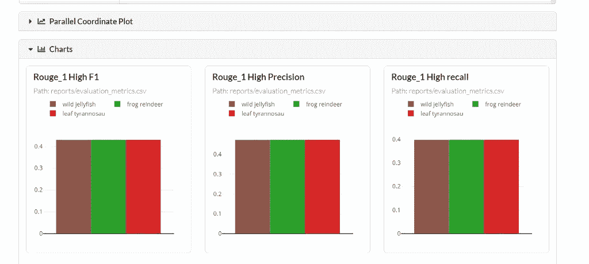
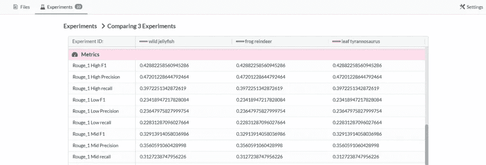

# Dagshub 是数据科学家的必由之路

> 原文：<https://medium.com/mlearning-ai/dagshub-is-the-way-to-go-for-data-scientist-ce24c5c19680?source=collection_archive---------4----------------------->

Image from dagshub.com

嘿，你想知道 Dagshub 是什么吗？为什么我喋喋不休地说“这是数据科学家的首选”？🤔嗯？如果你系好安全带，因为这将会很有趣🤑。

现在，如果我说有一个地方，你不仅可以存储你的数据科学项目，还可以有机会进行实验(这将会被谈论很多。抬头！！)就在那里？如果我在了解 dagshub 之前被问到这个问题，我可能会大笑并嘲笑他！哈哈😂😅。但这是真的！有可能这么做，**说真的**！！

让我切入正题。你可以说 DagsHub 是数据科学家的 GitHub。唯一的变化是 DagsHub 能做的事情比 GitHub 和 Gitlab 多很多。

其中之一是我们可以覆盖整个 **ML 生命周期**，我们甚至不需要任何**开发运营**。

该网站的布局和设计与 GitHub 完全相同，使我们很容易进入其中。它也以同样的方式工作，并包含其他方法。今天我不打算向你展示它是如何做到的，也许在另一篇文章中？无论如何，*我写这篇文章是为了让数据科学家或数据科学爱好者知道这个网站的存在，他们也可以从这个网站中获益。*

我们可以在我们的模型上进行实验，并看到我们从这些实验中获得的洞察力。我们可以利用像 MLflow，DVC，新遗迹，詹金斯等工具。，可以集成到 dagshub 中。

Image from dagshub.com

他们使得有条不紊地组织事情成为可能。就像你把笔记本放在一个地方，数据放在一个地方等等。,

Image by author

正如你在上面看到的，它与 GitHub 非常相似。如果你注意到它中间有不同的标签——全部、数据、模型、笔记本、DVC、Git。如果你仔细想想，事情的组织是非常有效的。

接下来我想谈的是协作。它是有效的。我的意思是它有点类似于 GitHub，但在这里我们可以做得更像:

*   评论工作
*   与团队分享
*   以期望的结果再现模型
*   比较不同的实验

看看下面的图片。

Image from dagshub.com

正如我之前所说，我们可以进行实验。我的意思是，我们可以在我们的模型上尝试不同的假设，看看它们是如何工作的。

# 这是开源的

创建这个平台的主要原因是为了解决协作的问题。因为现有的可用工具更倾向于软件开发而不是数据科学。

这方面有点类似 GitLab。通过开源，它使开发过程变得透明，每个人都可以做出贡献。

我会说 DagsHub 和 GitHub、GitLab 有相似之处。来自 GitLab 的开源的东西和来自 GitHub 的数据的高效组织放在一起，就做出了 DagsHub。

DagsHub 使用开源协议，所以它是完全可移植和可扩展的。

# 那为什么是达格·哈马舍尔德？

DagsHub 允许您快速构建、共享和重用机器学习和数据科学项目，消除了团队每次从头开始的麻烦。以下是 DagsHub 的一些特性，这些特性使它从其他传统平台中脱颖而出:

内置工具，如用于源代码跟踪的 Git、用于数据版本跟踪的 DVC 和用于实验跟踪的 MLflow，这些工具允许您在一个地方连接所有东西，无需任何配置。

它还支持您已经使用的数据科学工具和框架。这不是很好吗？

Image from dagshub.com

我们可以使用提供的仪表板跟踪实验。我们甚至可以比较实验和想象。只需轻轻一点，你就可以从实验到来源。

Image from dagshub.com

Image from towardsai.com

Image from towardsai.com

# 结论

即使有 Github 和 Gitlab，我认为，作为一名数据科学家，使用 dagshub 更有益。它不仅存储数据，还通过提供在平台上进行实验的机会以及与团队的合作，帮助项目变得更好。

我希望这篇文章对你有所帮助，并让你感兴趣。请在评论区告诉我你的想法。

# 参考

*   [https://dagshub.com/](https://dagshub.com/docs/)

另外，看看我的其他作品:

 [## 学习数据科学的最佳资源

### 你打算学习数据科学吗？🤩却不知道去哪里学，怎么学？😫别担心，因为我有你…

medium.com](/mlearning-ai/best-resources-for-learning-data-science-6167e09765dc)  [## 人力资源数据集的分析和预测

### 使用 RandomForest

medium.com](/mlearning-ai/analysis-and-prediction-on-hr-data-set-d022ca4ef80e)  [## Mlearning.ai 提交建议

### 如何成为 Mlearning.ai 上的作家

medium.com](/mlearning-ai/mlearning-ai-submission-suggestions-b51e2b130bfb)