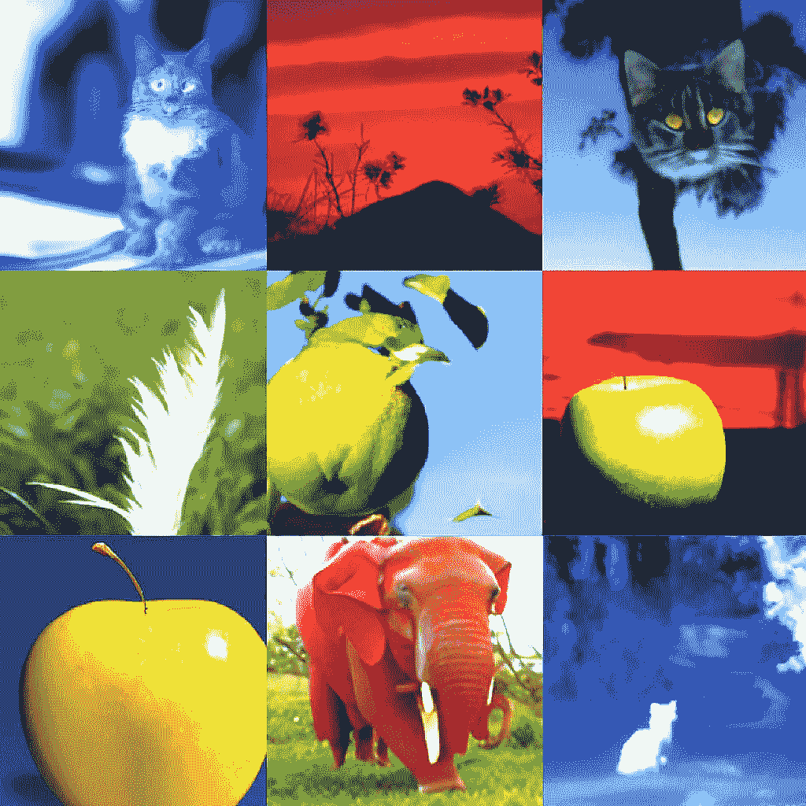

# DALL E 2 替代方案，文本到图像

> 原文：<https://medium.com/mlearning-ai/dall-e-2-alternatives-text-to-image-c1196da5231?source=collection_archive---------0----------------------->

## [机器学习艺术](https://mlearning.substack.com/p/a-good-alternative-to-dalle-2-that?r=z7zu8&s=w&utm_campaign=post&utm_medium=web)

## [更新 2023](https://open.substack.com/pub/mlearning/p/state-of-the-ai-art-january-2023?r=z7zu8&utm_campaign=post&utm_medium=web)

[A good alternative to DALL·E 2 that you can use while waiting](https://mlearning.substack.com/p/a-good-alternative-to-dalle-2-that?r=z7zu8&s=w&utm_campaign=post&utm_medium=web) Ready to Use

一个关于 [**AI 生成艺术**](https://mlearning.substack.com/p/a-good-alternative-to-dalle-2-that?r=z7zu8&s=w&utm_campaign=post&utm_medium=web) 的故事。我喜欢称之为“有目的的艺术”这是你第一次看到这种技术的应用，所以如果你还不兴奋，等到你知道它能做什么。