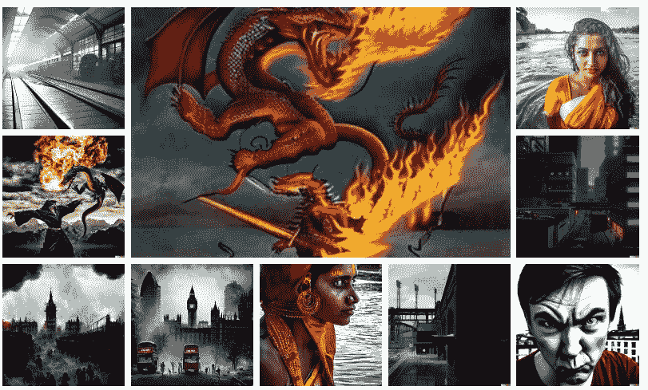

# DALL E 2 vs 中途 vs 稳定扩散

> 原文：<https://medium.com/mlearning-ai/dall-e-2-vs-midjourney-vs-stable-diffusion-8eb9eb7d20be?source=collection_archive---------0----------------------->

## 最流行的人工智能艺术生成工具之间的比较

Generated images

文本到图像的生成已经有一段时间了。最初，这些都是从生成模型的演化开始的，如生成对抗网络(GANs)和变分自动编码器(VAEs)。你可以在这里阅读更多关于甘斯的信息。