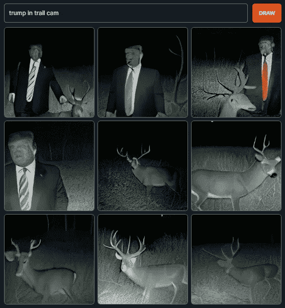
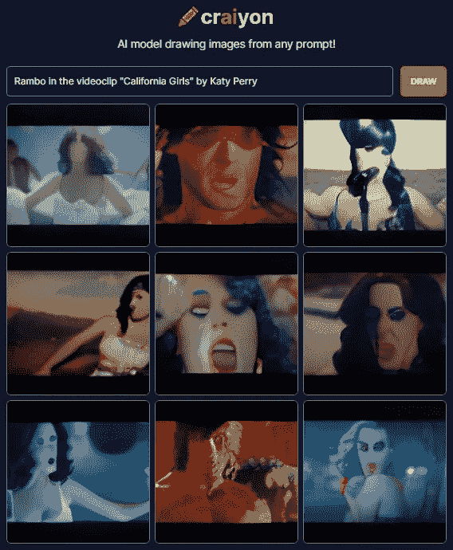
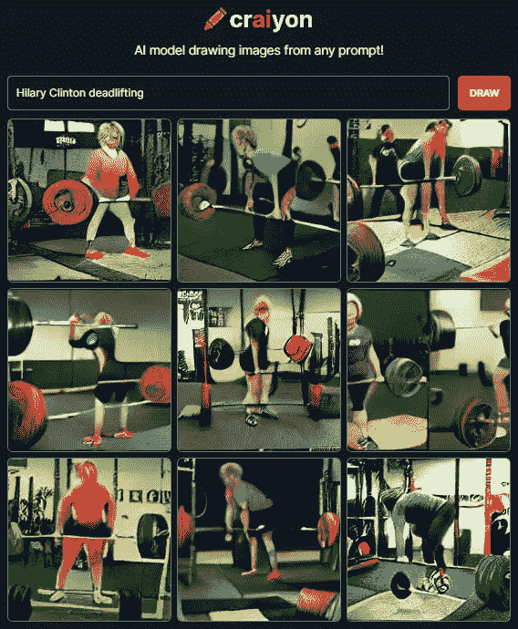
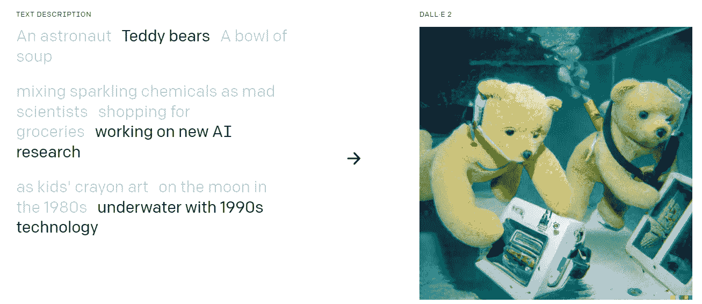
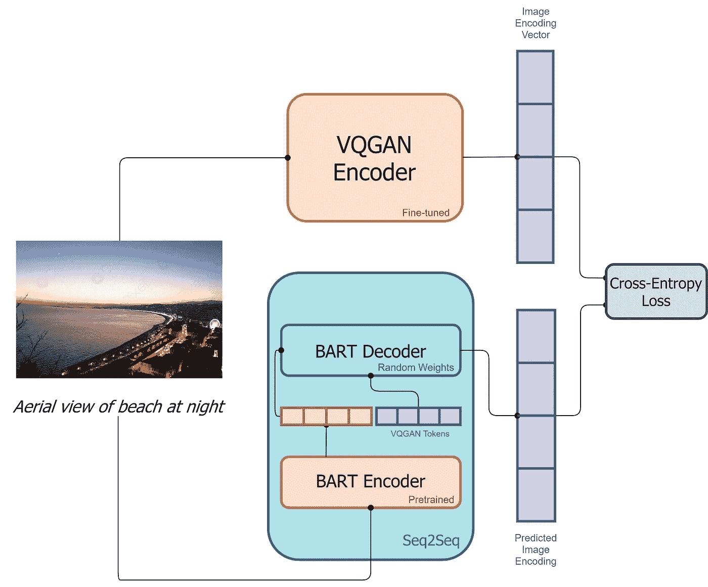
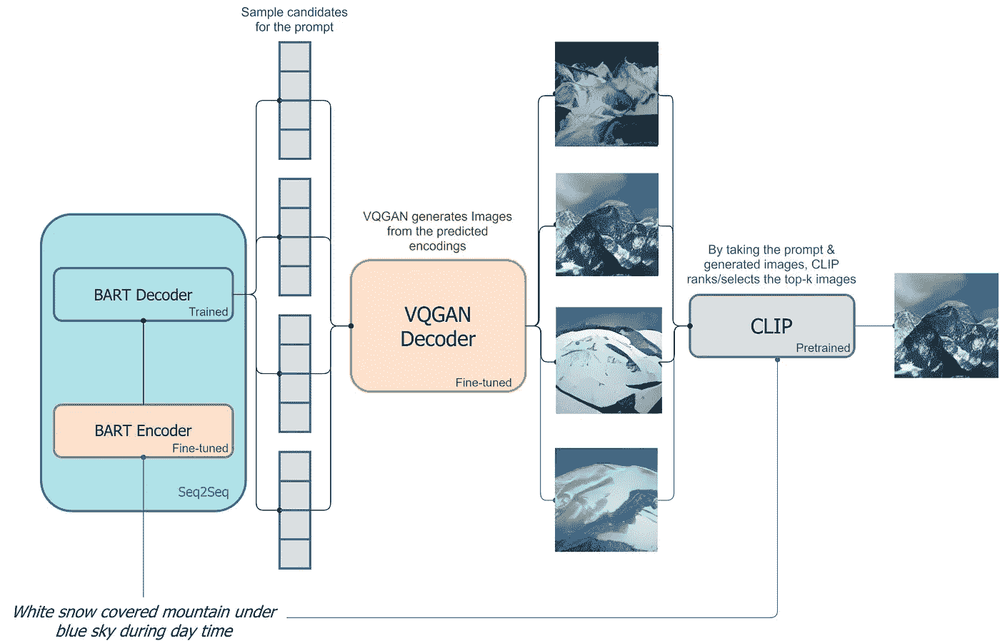
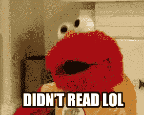

# DALL E mini 用演示解释

> 原文：<https://medium.com/mlearning-ai/dall-e-mini-explained-with-demo-144d6e2d39dc?source=collection_archive---------3----------------------->

## 如何从文本提示创建图像:DALL E Mini，一个 OpenAI DALL E 的复制品，解释并演示。

OpenAI 有了第一个令人印象深刻的用 [DALL E](https://openai.com/blog/dall-e/) 生成图像的模型。DALL E mini 试图用开源模型重现这些结果。

# 内容

*   历史
*   演示
*   小型建筑模型

# 历史

一小组科学家在 2021 年年中开始工作，使用一个更小的架构复制 OpenAI 的 DALL E 的成果。
他们在拥有少得多的硬件资源的情况下产生了显著的(尽管质量较低)成果。他们的模型比原来的 DALL E 小 27 倍，在一台 TPU v3–8 上训练只花了 3 天时间。
他们通过简化架构和模型内存需求，以及利用开源代码和预训练模型，在三天内完成了这项工作。

# 演示

[任何人都可以在这里使用他们的应用程序！](https://www.craiyon.com/)

以下是 DALL E mini 可以创造的几个例子。

pls call 911..

正如你所看到的结果不是很高的清晰度，但仍然令人印象深刻！作为参考，可以看看下面 OpenAI 最新的 DALL-E 2 的性能:

[[Source]](https://openai.com/dall-e-2/)

# 小型建筑模型

## 培训过程

图像和描述都是在训练期间提供的，并按以下顺序在系统中流动:

*   图像通过一个 [VQGAN](https://arxiv.org/abs/2012.09841) 编码器进行编码，该编码器将图像转换成一系列标记。
*   描述通过 [BART](https://arxiv.org/abs/1910.13461) 编码器进行编码。
*   BART 编码器的输出和编码图像通过 BART 解码器提供，BART 解码器是一个自回归模型，其目标是预测下一个令牌。
*   Loss 是模型预测逻辑和来自 VQGAN 的实际图像编码之间的 [softmax 交叉熵](https://wandb.ai/sauravm/Activation-Functions/reports/Activation-Functions-Softmax--VmlldzoxNDU1Njgy#%F0%9F%93%A2-softmax-+-cross-entropy-loss-(caution:-math-alert))。

[The training pipeline of DALL·E mini.](https://wandb.ai/dalle-mini/dalle-mini/reports/DALL-E-Mini-Explained-with-Demo--Vmlldzo4NjIxODA#authors)

## 推理过程

在推理时，一个人只有标题可用，并希望生成图像:

*   字幕通过 BART 编码器进行编码。
*   一个<bos>标记(识别“序列开始”的特殊标记)通过 BART 解码器输入。</bos>
*   基于解码器对下一个标记的预测分布，对图像标记进行顺序采样。
*   图像标记序列通过 VQGAN 解码器解码。
    CLIP 用于选择生成的最佳图像。

[The inference pipeline DALL](https://wandb.ai/dalle-mini/dalle-mini/reports/DALL-E-Mini-Explained-with-Demo--Vmlldzo4NjIxODA#authors)·[E mini.](https://wandb.ai/dalle-mini/dalle-mini/reports/DALL-E-Mini-Explained-with-Demo--Vmlldzo4NjIxODA#authors)

**关注我:** [推特:@ r3d _ robot](https://twitter.com/r3d_robot)
[Youtube:r3d _ robot](https://www.youtube.com/channel/UC-47UN9znQBo3ItNj8Ghspw/featured)

 [## Mlearning.ai 提交建议

### 如何成为 Mlearning.ai 上的作家

medium.com](/mlearning-ai/mlearning-ai-submission-suggestions-b51e2b130bfb)