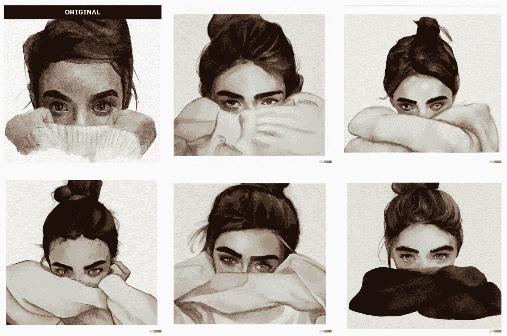

# Dall-E2 AI 重现了我的画作

> 原文：<https://medium.com/mlearning-ai/dall-e2-ai-recreated-my-paintings-b0db08f8197b?source=collection_archive---------0----------------------->

Image by [Jim Clyde Monge](https://medium.com/u/819323b399ac?source=post_page-----b0db08f8197b--------------------------------)

几周前，我发表了一篇关于 [Dall-E2](https://labs.openai.com/) AI 在不到 20 秒的时间内重新创作我的画的[故事](/mlearning-ai/ai-recreate-my-paintings-in-under-20-seconds-see-the-results-4be9652566bd)。

这个故事得到了 3K 的关注，并得到了很多积极的反馈。所以，我决定制作第二部分。

## 什么是 Dall-E2？

直接抄袭他们的[官网](https://openai.com/dall-e-2/)

> DALL E 2 是一个新的人工智能系统，可以创建逼真的图像…