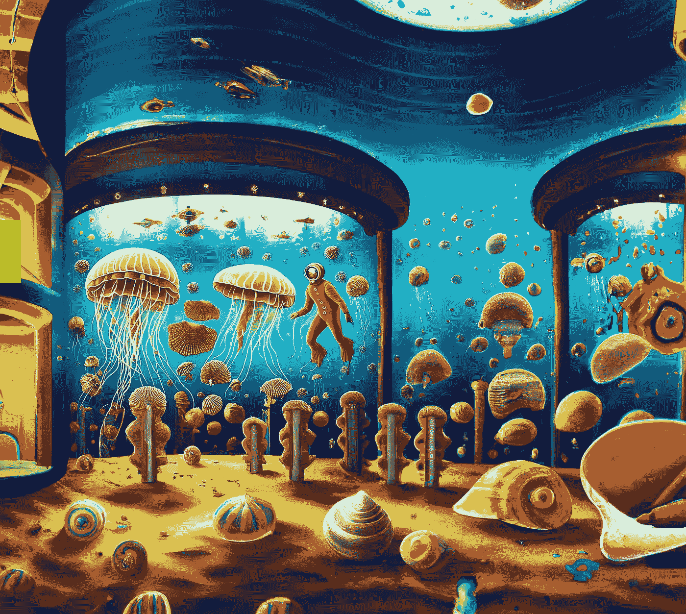

# Dall-E2 AI 的 Outpainting 功能令人难以置信

> 原文：<https://medium.com/mlearning-ai/dall-e2-ais-outpainting-feature-is-incredible-450cdf5b804f?source=collection_archive---------2----------------------->

Image by [Jim Clyde Monge](https://medium.com/u/819323b399ac?source=post_page-----450cdf5b804f--------------------------------)

昨天， [OpenAI](https://openai.com/) 发布了“Outpainting”，这是一个名为 [Dall-E2](https://openai.com/dall-e-2/) 的著名文本到图像人工智能工具的全新功能。

这是一个内置在桌面应用程序中的编辑器，可以将图像延续到原始边界之外。这里有一个演示它是如何工作的。