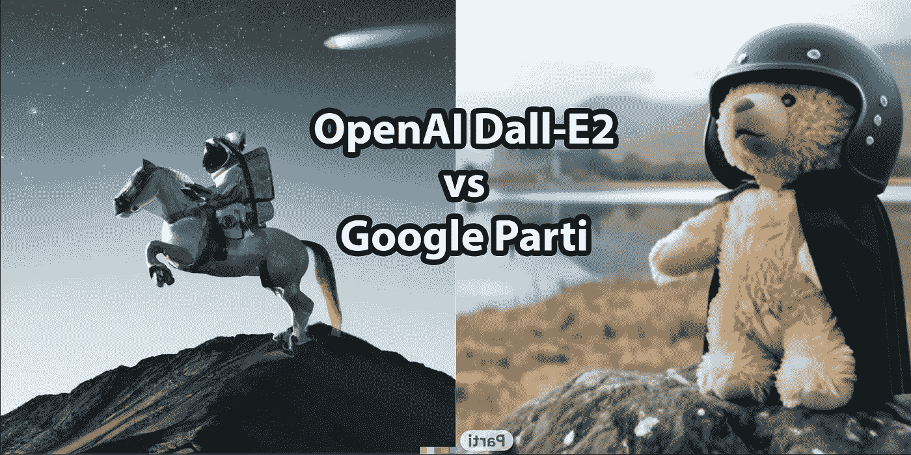

# ML so Dall-E2 vs Google Parti——同样的提示，不同的结果

> 原文：<https://medium.com/mlearning-ai/dall-e2-vs-google-parti-same-prompt-different-results-34458bac928b?source=collection_archive---------0----------------------->

Image by Author

过去几个月，文本到图像的人工智能生成器风靡一时。

当 OpenAI 发布其新的发电机模型 [Dall-E2](https://openai.com/dall-e-2/) 时，互联网上一片兴奋。它被设计成从文本描述中生成图像，它没有让人失望。

结果令人惊讶，人们很快将 Dall-E2 与其他工具进行了比较，如…