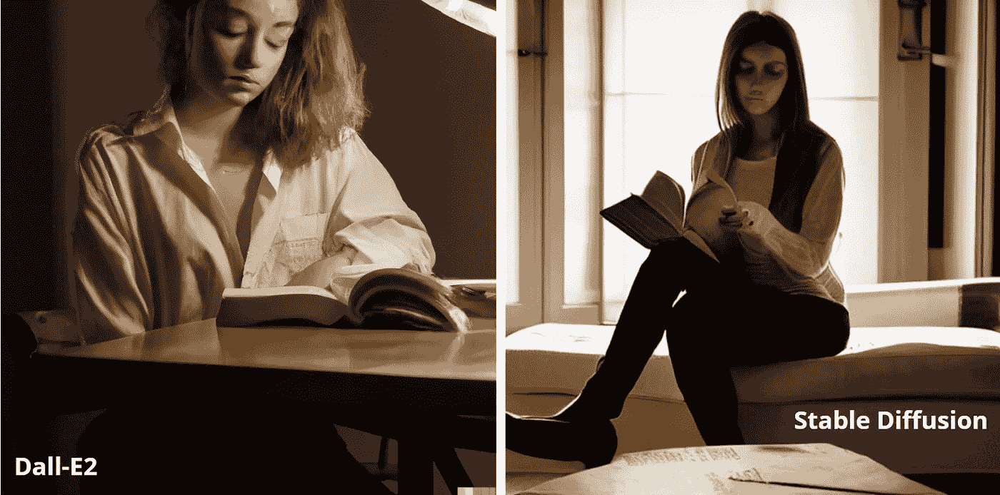

# Dall-E2 与稳定扩散:相同的提示，不同的结果

> 原文：<https://medium.com/mlearning-ai/dall-e2-vs-stable-diffusion-same-prompt-different-results-e795c84adc56?source=collection_archive---------0----------------------->

Image by [Jim Clyde Monge](https://medium.com/u/819323b399ac?source=post_page-----e795c84adc56--------------------------------)

当谈到文本到图像的人工智能工具时，现在已经有许多选项可供选择。但是有两个比较突出:Dall-E2 和稳定扩散。

两者都有自己独特的优点和缺点，但是哪一个是更好的工具呢？

在这个故事中，我将比较两个人工智能工具使用类似的图像结果…