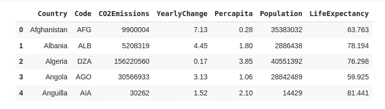
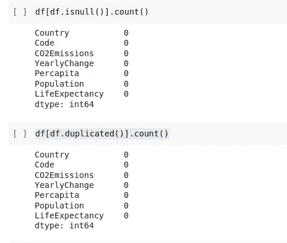
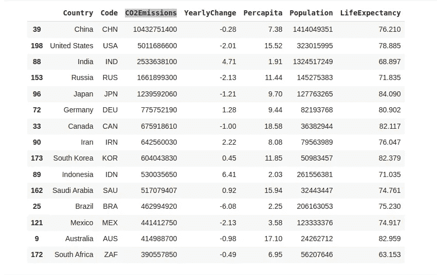
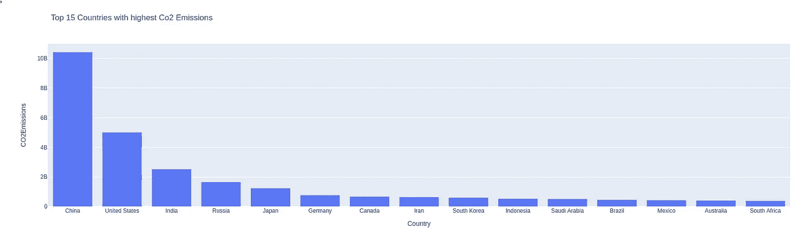
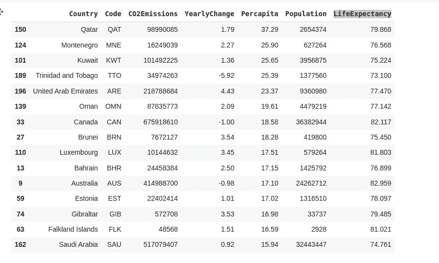
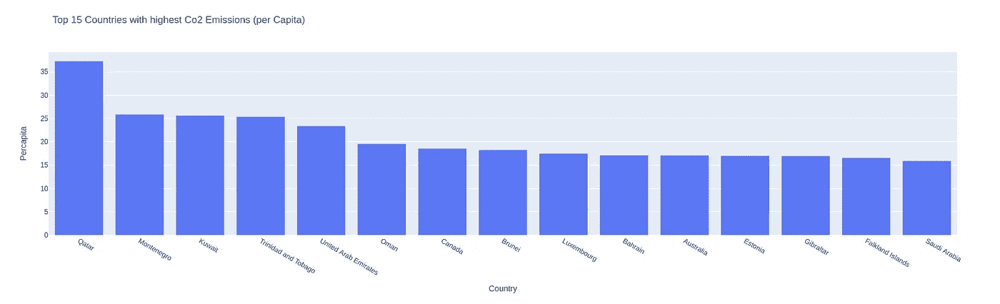
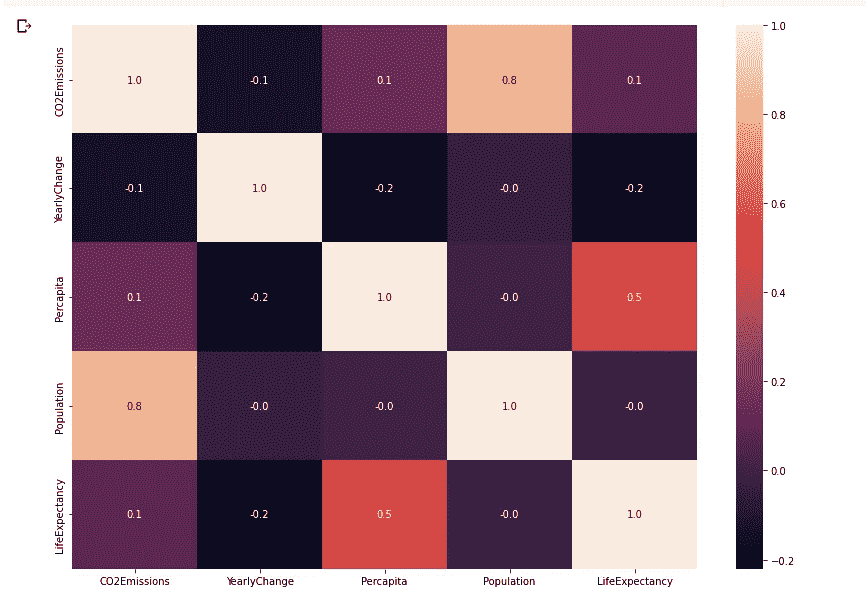
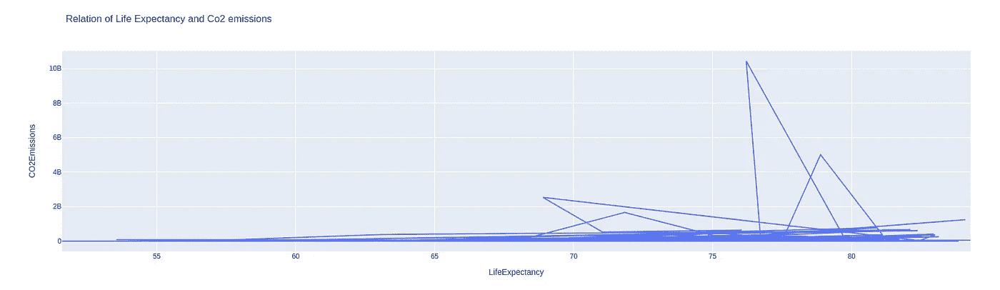
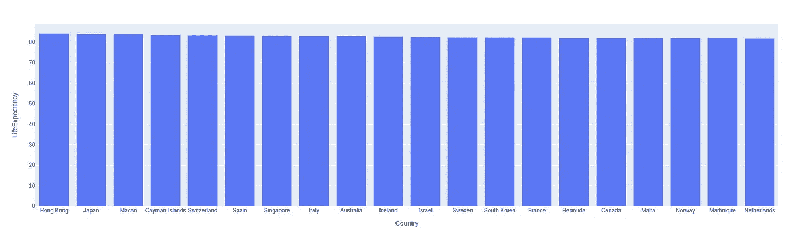
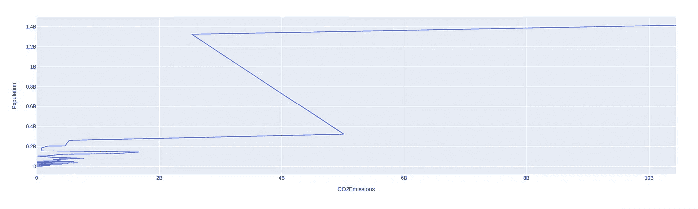

# 不同国家二氧化碳排放的数据分析和可视化

> 原文：<https://medium.com/mlearning-ai/data-analysis-and-visualization-of-co2-emission-by-different-countries-7d9cadec50a3?source=collection_archive---------1----------------------->

## Python 中的数据分析和可视化项目


Photo by [Kouji Tsuru](https://unsplash.com/@pafuxu?utm_source=medium&utm_medium=referral) on [Unsplash](https://unsplash.com?utm_source=medium&utm_medium=referral)

在过去的几年里，气候变化很快。每个人都在谈论污染及其对气候的影响。但是我们大多数人对此无动于衷。如果我们现在不认真对待，那就太晚了。地球是我们的家园，让我们保护它。

在这篇文章中，我们将对世界上不同国家的二氧化碳排放进行一些分析。我希望这种分析和可视化能够帮助年轻的企业家降低全球二氧化碳排放率。所以，我们先从一杯咖啡开始一些数据分析。

# 带分析的代码

你可以在 Google Colab 或 Jupyter Notebook 中执行任务。本文末尾给出了该项目中使用的数据集的链接。

*   导入下列库

```
#for mathematical computationimport numpy as np
import pandas as pd
import scipy.stats as stats#for data visualizationimport seaborn as sns
import matplotlib.pyplot as plt
import plotly
import plotly.express as px
from matplotlib.pyplot import figure% matplotlib inline
```

*   让我们加载并先睹为快。下载数据集并将其添加到路径中。之后，渲染数据集的前 5 个数据。

```
df = pd.read_csv("/content/CO2Emission_LifeExp.csv",
encoding='latin-1')
df.head()
```

运行单元格，您会在屏幕上看到类似这样的内容。



Co2 emission: Analysis and visualization

*   获取更多关于数据的信息

```
#data info
df.info()#Check missing values
df.isnull().sum()
```

检查每一列中的空值。幸运的是，我们的数据集中没有空值。
之后，用每个列的类型属性获得更多关于我们数据集的信息。

*   数据的描述和复制

```
df[df.duplicated()].count()df.describe()
```



Co2 emission: Analysis and visualization

*   碳排放量最高的国家

```
df_emissions = df.sort_values(by='CO2Emissions', ascending=False)
df_emissions.head(15)
```



Co2 emission: Analysis and visualization

正如预期的那样，中国名列榜首。我们正在寻找二氧化碳排放量最高的前 15 个国家。

也看一下图形视图。

```
px.bar(x='Country', y='CO2Emissions', data_frame=df_emissions.head(15), title="Top 15 Countries with highest Co2 Emissions")
```



Co2 emission: Analysis and visualization

> 这份名单的地理分布相当多样化。但是你可以看到，亚洲国家产生了最多的二氧化碳
> 
> 名单中的大多数国家都是大型经济体
> 
> 这些国家中的大多数也是世界上人口最多的国家
> 
> 大多数这些国家的人口预期寿命与全球平均水平相当。

*   二氧化碳排放量最高的国家(人均)

```
df_capita = df.sort_values(by='Percapita', ascending=False)
df_capita.head(15)
```



Co2 emission: Analysis and visualization

以上是人均二氧化碳排放量最高的前 15 个国家名单。卡塔尔名列榜首，紧随其后的是黑山和科威特。让我们看一下图表

```
px.bar(x='Country', y='Percapita', data_frame=df_capita.head(15), title="Top 15 Countries with highest Co2 Emissions (per Capita)")
```



Co2 emission: Analysis and visualization

> 这份名单的地理分布有所不同。但是你可以看到，中东国家人均二氧化碳排放量最高。
> 
> 这些国家大多富裕且人口稀少。
> 
> 所有这些国家的人口预期寿命都高于全球平均水平。

*   相互关系

让我们找出列之间的相关性。但是首先，将列转换成数字。

```
df[['CO2Emissions', 'YearlyChange', 'Percapita', 'Population', 'LifeExpectancy']] = df[['CO2Emissions', 'YearlyChange', 'Percapita', 'Population', 'LifeExpectancy']].apply(pd.to_numeric)f,ax = plt.subplots(figsize=(14,10))
sns.heatmap(df.corr(), annot=True, fmt=".1f", ax=ax)
plt.show()
```



Co2 emission: Analysis and visualization

如你所见，预期寿命与二氧化碳排放量的年变化呈负相关。很有道理。

*   二氧化碳排放与预期寿命的关系

```
px.line(x='LifeExpectancy', y='CO2Emissions', data_frame=df, title="Relation of Life Expectancy and Co2 emissions")
```



Co2 emission: Analysis and visualization

两者之间的关系并不那么依赖。大多数人的预期寿命在 70 到 80 岁之间，人口低于 2B。

*   预期寿命最高的国家

```
df_life = df.groupby('Country').sum().sort_values('LifeExpectancy', ascending=False)[:20]
df_life = df_life.reset_index()
px.bar(x='Country', y ="LifeExpectancy", data_frame=df_life)
```



Co2 emission: Analysis and visualization

香港人是世界上最长寿的，其次是日本和澳门。你也可以指定他们的地理区域。世界平均寿命为 72.69 岁。

*   人口与污染的关系

```
df_pop = df.groupby('CO2Emissions').sum().sort_values('Population', ascending=False)
df_pop = df_pop.reset_index()
px.line(x='CO2Emissions', y ="Population", data_frame=df_pop)
```



Co2 emission: Analysis and visualization

嗯，就是这样。

恭喜，你分析了二氧化碳排放数据集。你可以自己多挖掘。因为你可以用数据做很多事情。你得到的信息是有价值的。

**数据库和完整的 Github 源代码有** [**这里有**](https://github.com/imrohit007/Co2-emission-Data-Analysis-and-Visualization) **。**

# 更多数据科学项目

[**顶级网络数据泄露(2004–2021):数据分析和可视化**](/mlearning-ai/top-cyber-data-breaches-2004-2021-data-analysis-and-visualization-db61318148f)

[**中型文章数据可视化与分析使用 Python**](/mlearning-ai/medium-articles-data-visualization-and-analysis-using-python-730a538207ab)

[**使用 Python 的 Spotify 数据可视化和分析**](/geekculture/spotify-data-visualization-and-analysis-using-python-4af81c5531a7)

[**IPL 数据分析(2008–2020)使用 Python**](/nerd-for-tech/ipl-data-analysis-2008-2020-using-python-c031d3e1ae0c)

[**用 Jupyter 笔记本进行 Zomato 数据分析**](/nerd-for-tech/zomato-data-analysis-with-jupyter-notebook-6116ea03bd9d)

你好，我叫 Rohit Kumar Thakur。我对自由职业持开放态度。我构建了 **react 原生项目**，目前正在开发 **Python Django** 。随时联系我(**freelance.rohit7@gmail.com**)