# 数据分析-使用 Goodreads 数据和 Python 找到一本好书

> 原文：<https://medium.com/mlearning-ai/data-analysis-find-a-good-book-using-goodreads-data-and-python-43af50fb711f?source=collection_archive---------2----------------------->

作为一个书虫，找到一本好书就像找到了宝藏。对我来说，找到好书的最好地方是 Goodreads([https://www.goodreads.com/](https://www.goodreads.com/))，因为它包含了来自世界各地读者的推荐。

Source: www.goodreads.com

作为一名数据分析师，我想挖掘 Goodreads 的数据来回答一些与这个平台相关的有趣问题。

我将使用 Python 和一个名为 dtale 的库，我认为它是 EDA(探索性数据分析)的快速工具。

你可以在这里找到我使用的数据集:[https://www . ka ggle . com/datasets/jealous leopard/goodreadsbooks](https://www.kaggle.com/datasets/jealousleopard/goodreadsbooks)

这篇文章的灵感来自于
[使用数据挖掘推荐 Goodreads 书籍](/analytics-vidhya/do-you-love-reading-lets-use-data-mining-and-find-some-good-reads-for-you-e5bf1b576316)

开始吧！！

# 数据清理

如果使用熊猫库从 Kaggle 加载数据集，会发现加载 csv 文件时出现问题。因为有些书有不止一个作者，所以“作者”列中的数据在 pandas 中将包含一个逗号和混乱的列分隔符(pandas 用逗号分隔列)。

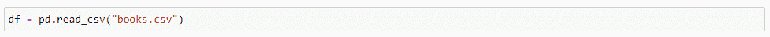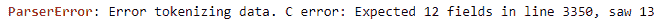

我使用 excel 解决了这个问题(这不是最佳实践。最好用 Python 写数据清理的代码，因为 Excel 不能打开大数据集，但 Excel 对我来说更快)

*   首先，添加过滤器(Ctrl_Shift+L)。
*   筛选 m 列。如果数据正确，则该列中一定没有数据，但您会看到 4 行有值。

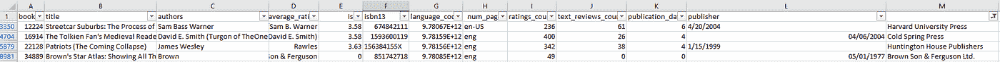

*   这是因为“作者”列被分成两列，正如您所看到的,“平均评级”列中的值不是数字。
*   我通过将平均值列中的值复制到作者列中并用分号(；)，所以熊猫不会再用逗号分隔这个值了。然后，我将 rest 列中的值复制到它们的位置。

# 数据概述

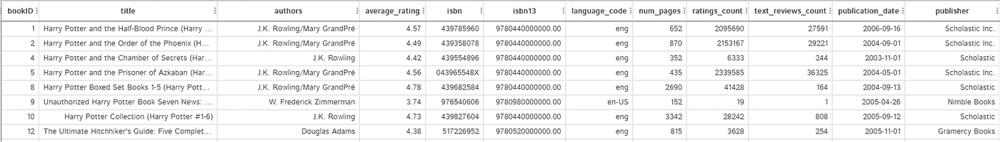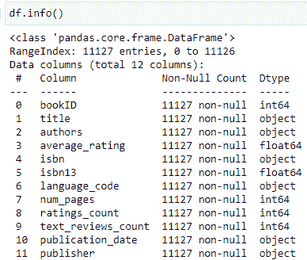

📝**栏目描述**

**bookID:** 每本书的唯一标识号。

书名:这本书出版时的名字。

**作者:**本书作者的姓名。多个作者用-分隔。

**average_rating:** 该书总收到的平均评分。

**isbn:** 另一个识别图书的唯一编号，国际标准书号。

isbn13: 一个 13 位的 isbn 来标识图书，而不是标准的 11 位 ISBN。

**language_code:** 帮助理解这本书的主要语言是什么。例如，eng 是英语的标准。

本书包含的页数。

**ratings_count:** 该书获得的评分总数。

**text_reviews_count:** 该书收到的文字评论总数。

*   数据集有 11127 行和 12 列
*   没有缺失值
*   isbn 和 isbn13 在此分析中没有用

# 我想回答的问题

对于下面的所有问题，我只使用 dtale 库，这是一个用于 EDA(探索性数据分析)的可视化库。有了这个快捷的工具，10 个有趣的问题可以通过绘制图表来回答。

**1。多少收视率才算高？**

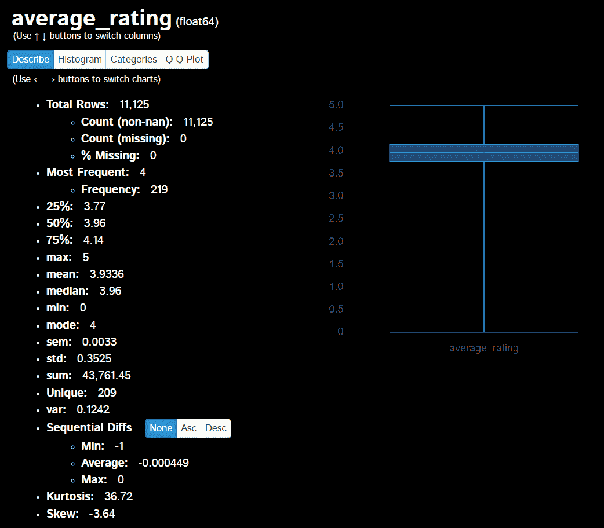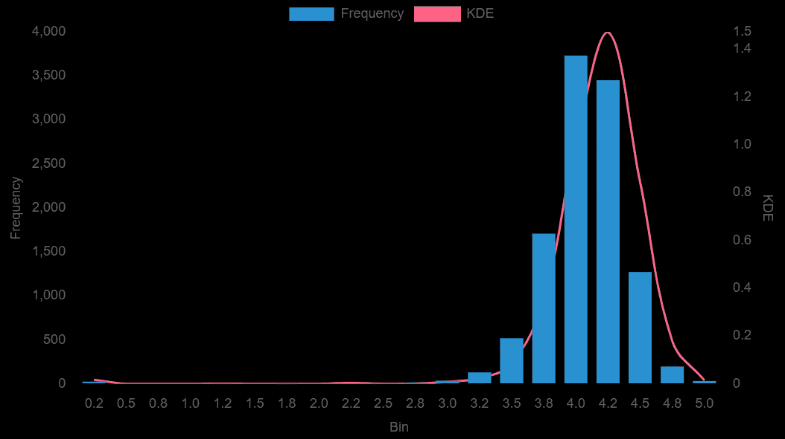

*   我画了一个方框图和直方图来说明图书评分的分布(1 个图应该足以理解数据分布，但我画了 2 个图以使其更容易解释)。
*   统计值与图一起显示。
*   从箱线图中可以看出，大多数评级在 3.75-4.1 左右(箱线图中的箱线图是 Q1-Q3)。您也可以查看直方图，在 4 和 4.2 小节处有一个高频率。
*   我会将一本书的评级超过 4.14(评级数据的 Q3)视为高评级，因为评级为 4.14 的书超过了总书的 75%，所以它应该被视为 A 级书。

**2。大多数书有多少页？**

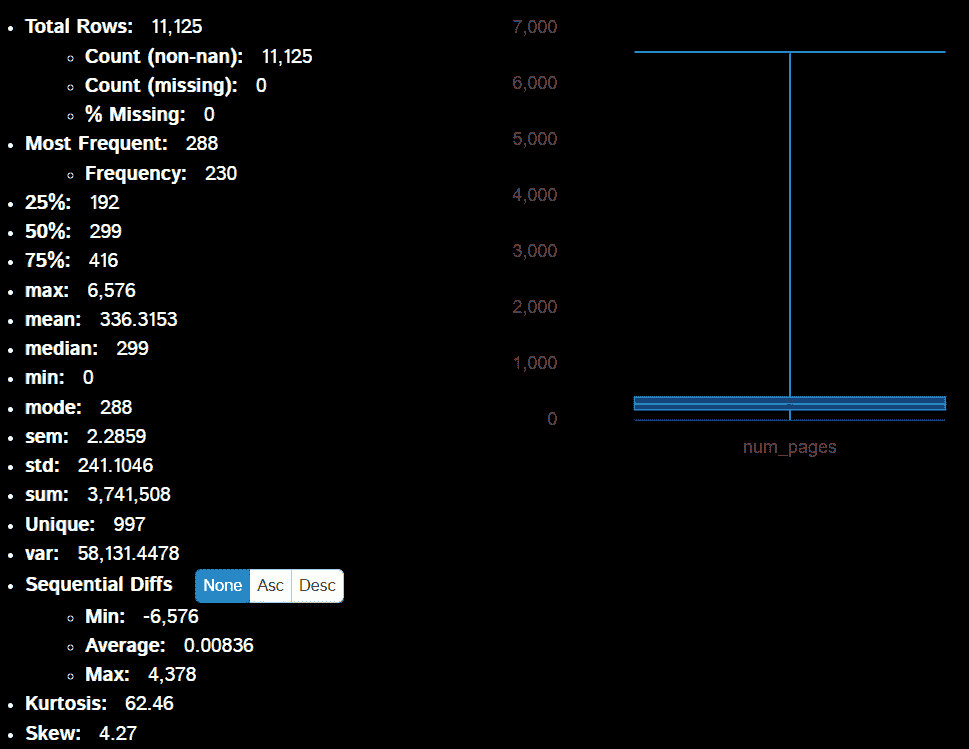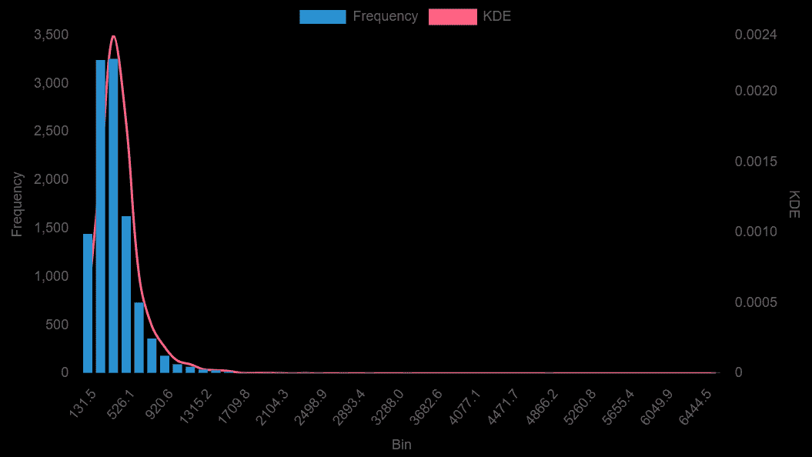

*   从这些剧情来看，很明显是有一本 outliner 的书包含了这么多页。该大纲视图使直方图向左倾斜。
*   从统计值我们知道最大页数是 6576 页(如果你想知道，是《奥布里/马图林小说全集(5 卷)》)
*   最好把 2000 页以上的书排除掉，再来画图。因为这些书的页数是少数，但它们覆盖了大约 75%的直方图区域，并压缩了图表左侧的其他数据。
*   反正我只用统计值就能回答问题。
*   192-416 页很常见。这是价值范围从 Q1 到第三季度，其中包括一半的书籍。这一发现与我们对图书范围的经验是一致的。
*   在这个分析中，有一些事情需要记住。由于 Goodreads 上评论的书籍可能包含一个书籍集，如一本 6，576 页的书籍，因此这些情况下的页数是该书籍集中书籍的总页数。那就是我们得到的答案可能被高估了(实际 Q3 不到 416 页)。
*   下面列出了 10 本最高页数的书。

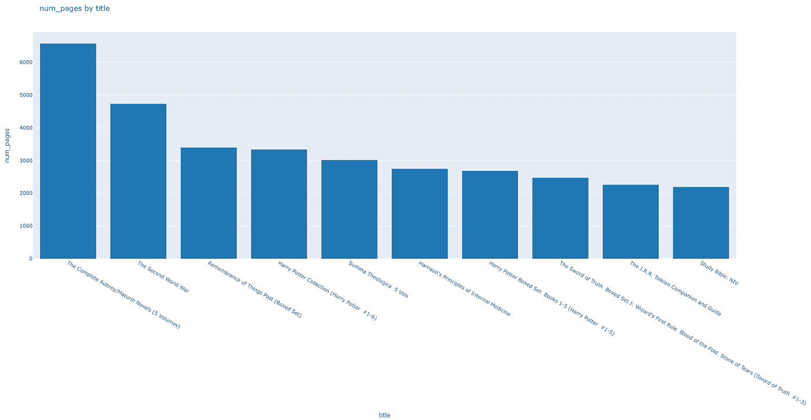

**3。收视率最高的 10 本书是什么？**

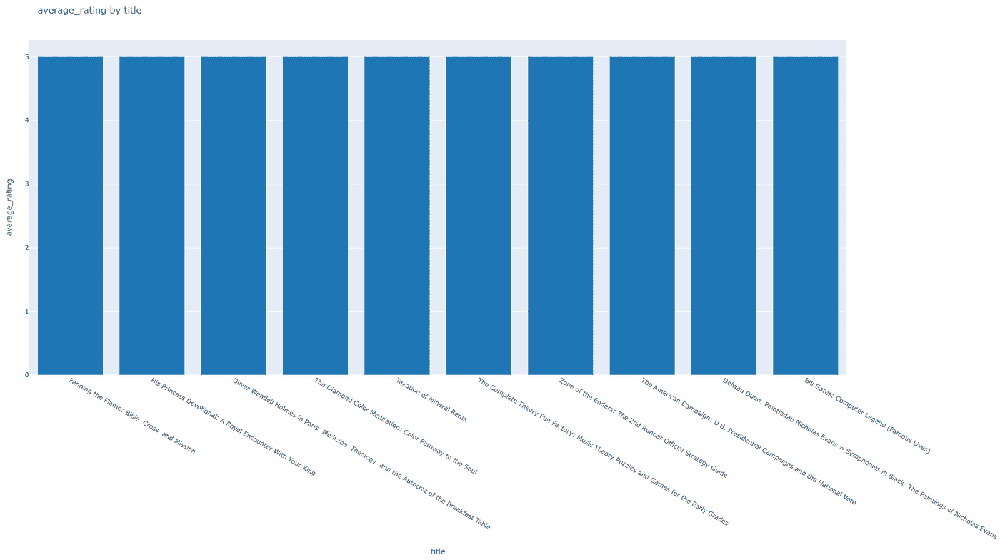

*   有许多书的评分为 5 分，但这些书的用户数量很少，所以它们可能不代表实际的评分。
*   最好只过滤评级超过 10，000 个用户的书籍，以确保这个评级是可信的。

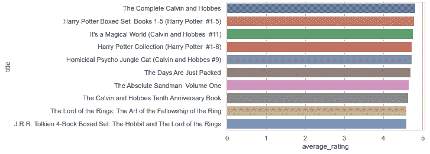

*   经过过滤，只有评分超过 10，000 用户的书籍，其中许多是著名的，如哈利波特和指环王。

**4。用户评价最高的前 10 本书是什么？**

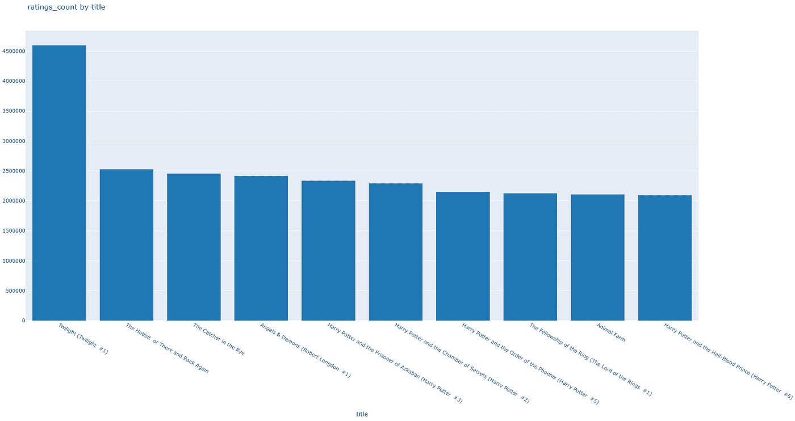

*   它们中的大多数都有电影，所以用户可能会在观看电影后阅读这些书籍。

**5。书名中哪些词用得最多？**

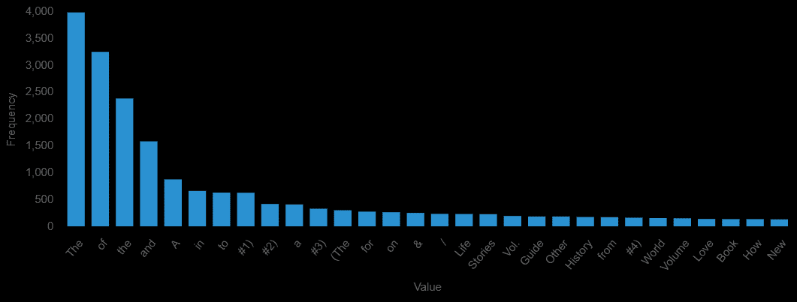

*   最常见的 30 个单词包括 1)冠词和介词:The，of，and，a，in，to，for，on 2)第一册的数字 3)其他单词:I，life，stories，guide，history，world，love
*   最后一组(换句话说)是我最感兴趣的。它暗示了许多书谈论的趋势，如生活、爱情和历史。

**6。哪位作家写的书最多？**

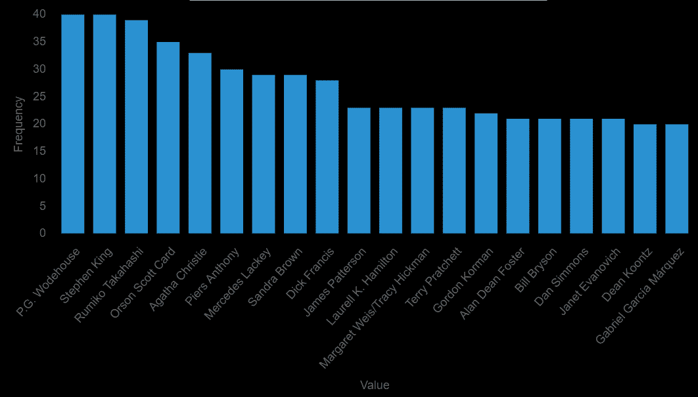

*   答案:出书最多的作者(在这个数据集中)分别是 P.G .沃德豪斯、斯蒂芬·金、高桥留美子(日本漫画家)、奥森·斯科特·卡德和阿加莎·克里斯蒂。
*   他们都很有名，他们的书被多次改编成电影或连续剧。

**7。用户评价最高的前 10 位作者是哪些？**

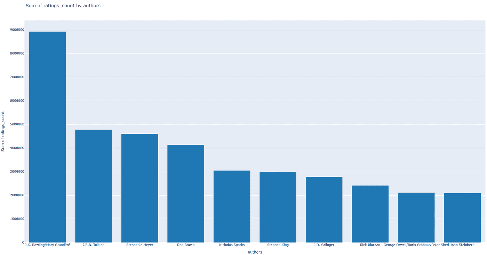

*   用户评价最高的作者是 J.K .罗琳，一位哈利波特作家，她的评价几乎是第二名作者的两倍。

**8。大多数书的语言是什么？**

*   大多数书是用英语写的。
*   因为 Goodreads 是英文的，所以很容易看到大多数书也是英文的。

**9。哪个出版商出版的书最多？**

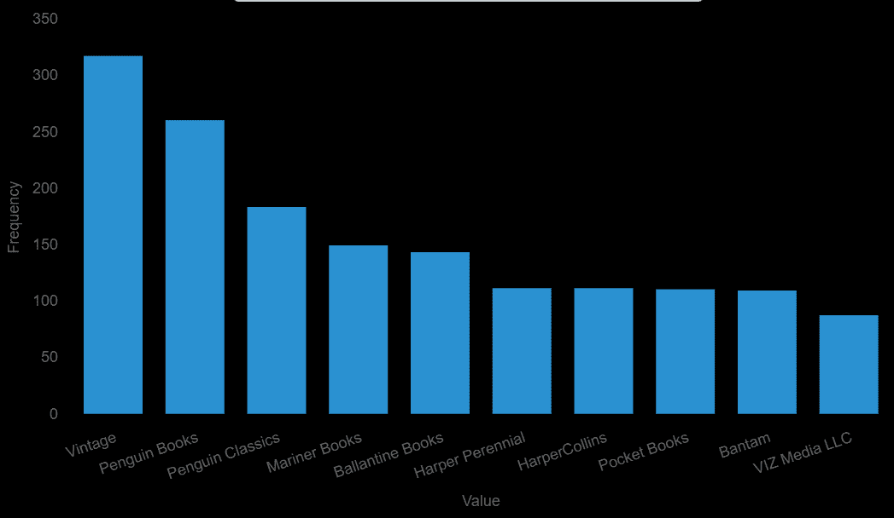

*   复古和企鹅在这方面领先。

**10。页数/评分数/评论文字长度和平均评分有没有相关性？**

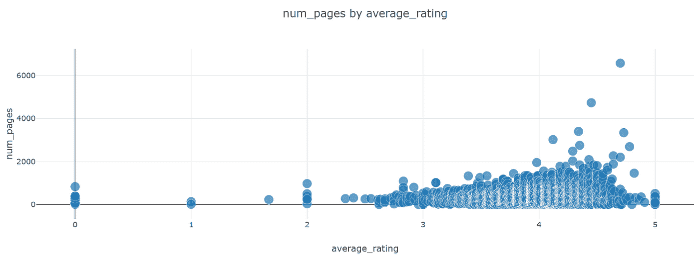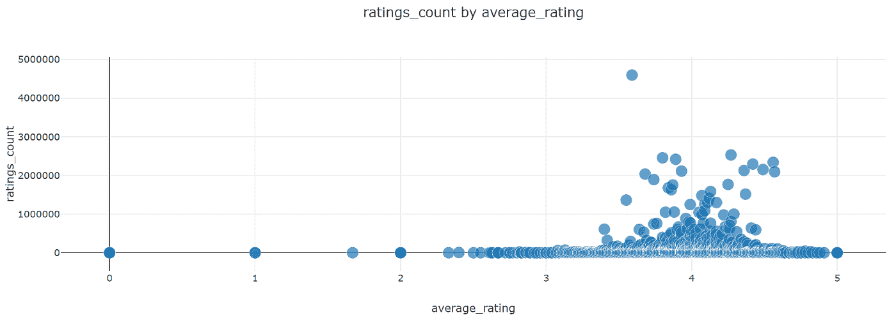

*   从这 3 个散点图来看，评级是围绕 4 的聚类，正如我们从箱线图和直方图中看到的那样。
*   平均评分和评分数量/评论文本长度之间没有明显的相关性
*   页数多(超过 2000 页)的书似乎有很高的评级，原因可能是这些书的出版成本可能很高，所以页数多的书会比页数少的书更仔细地筛选。
*   但是有几本少于 2000 页的书的评分分布在 3.5 到 4.5 左右，很难预测。

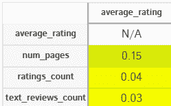

*   皮尔逊相关性与散点图的结果一致。对于所有参数，平均评级和其他参数之间的相关性很低(几乎为零)。

你可以在这里找到我的代码和清理过的数据集:[https://github.com/Yannawut/Goodreads_Analysis](https://github.com/Yannawut/Goodreads_Analysis)

这是我第一篇关于数据分析的文章。如果您有任何意见或建议，请随时告诉我。

 [## Mlearning.ai 提交建议

### 如何成为 Mlearning.ai 上的作家

medium.com](/mlearning-ai/mlearning-ai-submission-suggestions-b51e2b130bfb)