# 权力 BI——数据科学家的工作变化

> 原文：<https://medium.com/mlearning-ai/data-analysis-job-change-of-data-scientist-685f3de0a983?source=collection_archive---------1----------------------->

> 哪些因素导致一个人离开现在的工作？

这是公司通常会问员工和潜在候选人的问题。

如果这个问题能够得到回答，公司也许能够减少离开公司的员工数量，并降低寻找新员工的成本。

在本文中，我将展示如何使用 Power BI 来分析可能影响工作变动决策的因素。

# 💽资料组

本文中使用的数据来自

 [## 人力资源分析:数据科学家的工作变化

### 预测谁将跳槽到新的工作岗位

www.kaggle.com](https://www.kaggle.com/datasets/arashnic/hr-analytics-job-change-of-data-scientists?datasetId=1019790&sortBy=voteCount&select=aug_train.csv) 

该数据集由一家在大数据和数据科学领域活跃的公司收集，该公司希望在成功通过该公司举办的一些课程的人中聘用数据科学家。

该数据包含 19，158 个候选项和 14 列

**列明细**

*   登记者标识:候选人的唯一标识
*   城市:城市代码
*   城市发展指数:城市的发展指数(按比例)
*   性别:候选人的性别
*   relevent_experience:候选人的相关经验
*   注册 _ 大学:注册的大学课程类型(如果有)
*   教育程度:候选人的教育程度
*   专业 _ 学科:考生的教育专业学科
*   经验:候选人的总经验(年)
*   company_size:当前雇主公司的员工人数
*   company_type:当前雇主的类型
*   last_new_job:前一职务和当前职务之间的年数差异
*   培训时数:已完成的培训时数
*   目标:0 —不找工作变动，1 —找工作变动

# 📊探索性数据分析

**EDA 步骤**

1.  缺失数据检测
2.  单变量分析
3.  多变量分析

**第一步:缺失数据检测**

这一步的目的是在进一步分析之前量化每一列中缺失值的数量。例如，我们可能会排除缺少太多值的列，或者尝试填充缺少的值。

从 csv 文件加载数据后，单击“转换数据”打开 Power Query 编辑器。

在 Power Query Editor 中，您可以从列名下面的颜色了解每列中缺失值的比率，灰色是该列中缺失值的比率。下面是性别栏的一个例子。

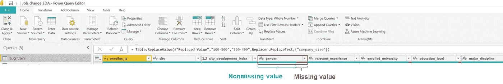

公司规模和公司类型是最缺少值的两列。原因可能是有些应聘者还没有为公司工作(学习)，所以不知道如何回答这些问题。我对下一份问卷的建议是，在询问公司的问题中包括“还没有工作”这一选项。

对于这个数据集，缺失值的数量并不高，因此我们可以使用所有列进行分析。

**第二步:单变量分析**

这一步就像展开表格上的所有列，以查看概貌并构思进一步的分析方法。

这就是我所做的。

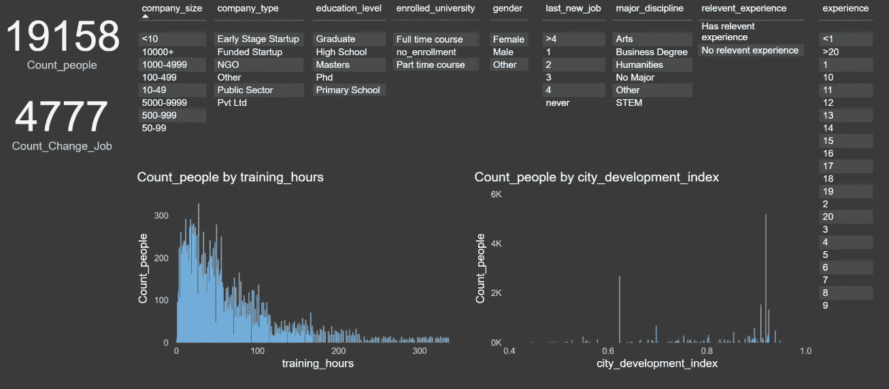

1.  统计整个数据和感兴趣的数据的行数，在这种情况下，谁想换工作。首先，我创建两个新的度量:Count_people 和 Count _ Change _ Job Count _ people = Count(aug _ train[enroluer _ id])Count _ Change _ Job = sum(aug _ train[Is _ Change _ Job])，然后，使用卡片来可视化。
2.  了解每个文本列中存在的每个值。只需拖动仪表板上的列。
3.  数字列的分布图。使用簇状柱形图。

幸运的是，这些数据的文本列不包含许多不同的值，因此不难绘制。

**第三步:多变量分析**

在这一步中，我想知道哪一列与换工作决策相关。

我创建了两个新的度量:计数 _ 非 _ 变化 _ 工作和百分比 _ 变化 _ 工作。

count _ Not _ Change _ Job = count(aug _ train[enroller _ id])-sum(aug _ train[Is _ Change _ Job])

percent _ Change _ Job = aug _ train[计数 _ 更改 _ 作业]* 100/(aug _ train[计数 _ 更改 _ 作业]+aug _ train[计数 _ 非更改 _ 作业])

1.  公司规模

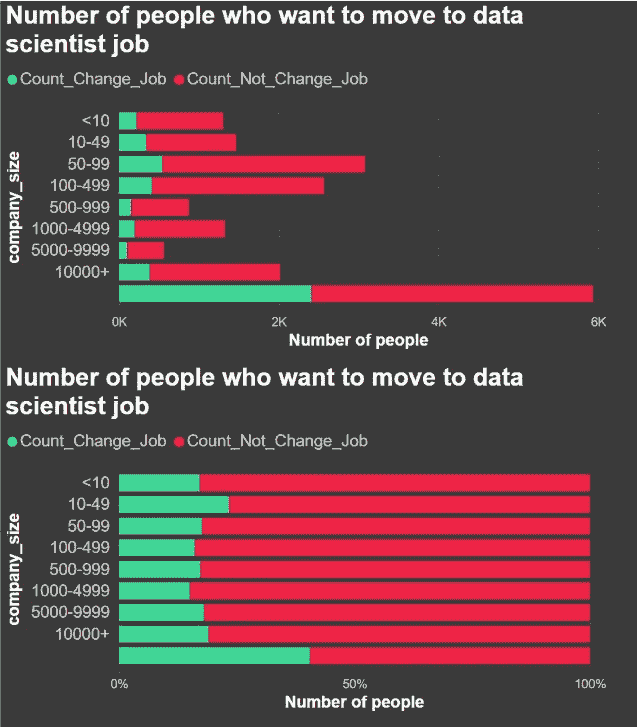

在第一个图表中，我用一个堆积条形图来绘制想换工作和不想换工作的人数。这种图表类型的优点是，您可以看到每个类别的总人数。但是，很难比较每个类别的变更工作部分，因此我绘制了一个 100%堆积条形图来说明另一个维度。

在第二个图表中，百分比堆积条形图将所有类别更改为 100%。会更容易找到他们的员工最想换工作的公司规模。

从这两个图表中，我们可以观察到大多数人在一个拥有 50-499 名员工的公司工作。如果在小公司工作，人们很可能会换工作，但这与大公司没有太大区别。空白答案想换工作的人最多。原因可能是他们还没有为任何公司工作，所以，通常情况下，他们希望有一份新工作。无论如何，很难得出这样的结论，因为人们可能不会回答这个问题，因为他们只是不想暴露他们的数据。

2.公司类型

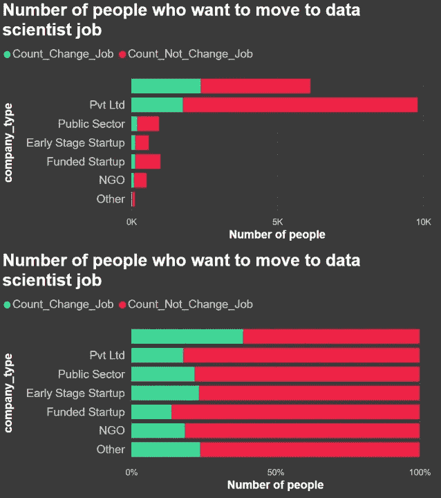

大多数人在私营公司工作。在早期创业公司工作的人比在有资助的创业公司工作的人更容易跳槽(有资助的创业公司似乎更稳定)。在我看来，公司类型在发现想换工作的人方面并不是一个有用的特征，因为大多数人都在私营公司工作。

3.教育水平

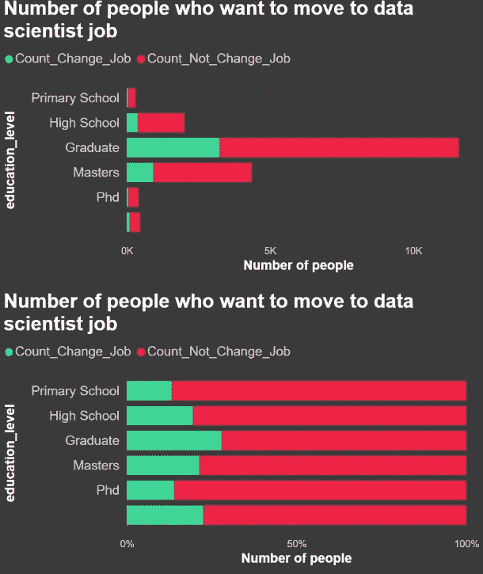

大多数受访者拥有研究生学位，他们最想换工作。其次是有硕士学位的人。

4.上一份新工作的工作年限

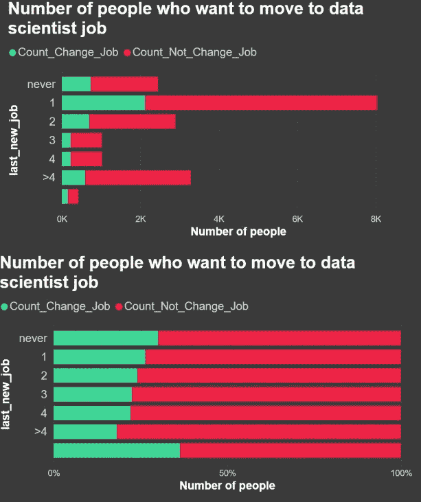

大多数人刚开始新工作。他们为一家公司工作的时间越少，他们想换工作的概率就越高。原因可能是他们为一家公司工作的时间越长，就越喜欢现在的工作，不想跳槽。

5.工作经验

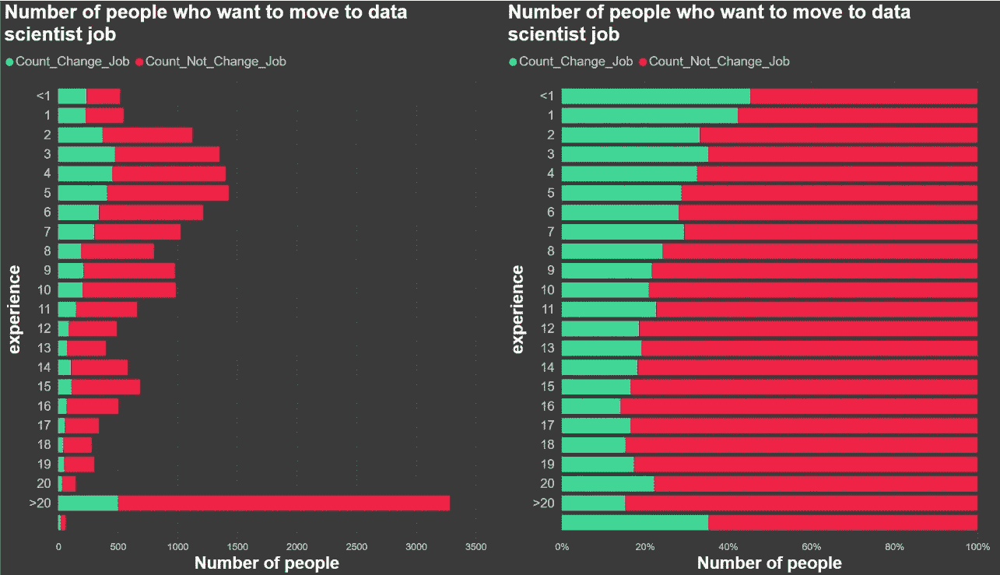

大部分参加培训的人都有 20 多年的经验！！

排除有 20 年以上工作经验的人，有一个趋势是希望换工作的经验员工越来越少。也许他们想有更多的经验。

6.相关经验

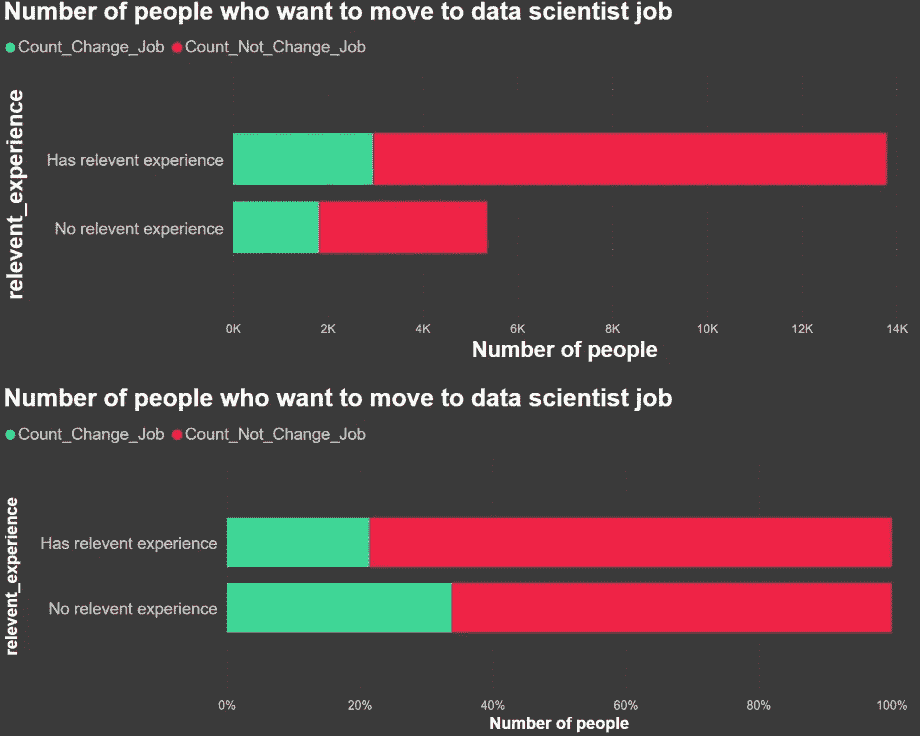

大多数受访者都有数据科学方面的相关经验。但是，没有相关经验的人比有经验的人对转行更感兴趣。

7.公司规模和教育水平

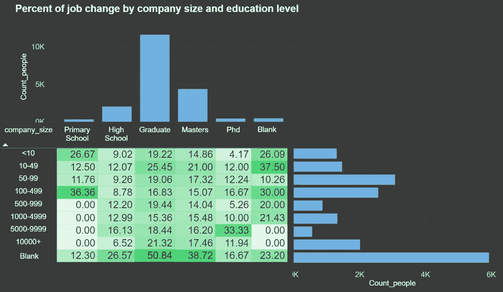

实现矩阵和条件格式以了解两个以上变量之间的相关性。

上面的图显示了根据公司规模和教育水平想换工作的人的百分比。高绿色对比度意味着想换工作的人比例更高。研究生学历，没有指定公司规模的人跳槽兴趣最高(可能刚毕业，没有工作)。

我还沿着表格绘制了直方图，以查看人口分布。

8.数字栏:城市发展指数和培训时间

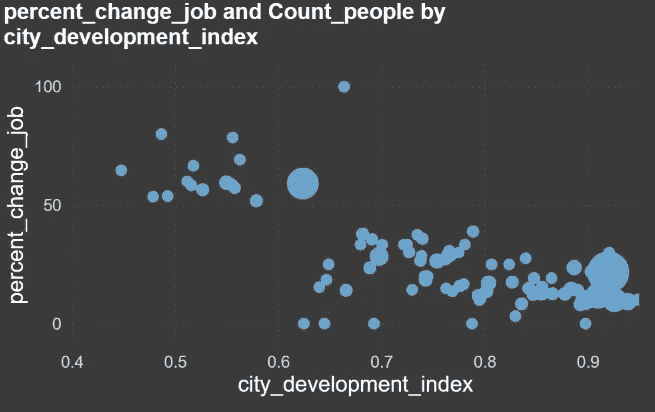

为了找出整数变量之间的相关性，使用了散点图。

在上图中，我绘制了工作变动百分比和城市发展指数。我由几个人指定气泡大小。

你可能会观察到，生活在城市发展指数低的国家的人更有可能换工作。

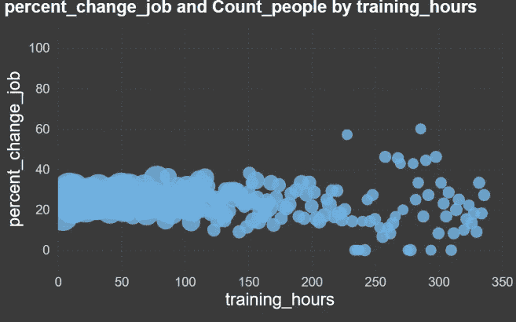

对于训练时间，人们聚集在低训练时间区域。培训时间和工作变动百分比之间没有趋势。

# 🐚结论

通过使用 Power BI，您可以找到影响工作变动决策的重要因素。下次您想要寻找新的数据科学家员工时，请尝试搜索具有以下特性之一的候选人。

*   为最新的公司短期工作
*   低工作经验
*   没有数据科学方面的相关经验
*   刚毕业，现在没有工作

请记住，EDA 是从数据中获得洞察力的快速过程。如果想要更准确的预测，数据建模是更好的选择。

希望你喜欢阅读这篇文章。如果你有任何建议，请让我知道。

 [## Mlearning.ai 提交建议

### 如何成为 Mlearning.ai 上的作家

medium.com](/mlearning-ai/mlearning-ai-submission-suggestions-b51e2b130bfb)