# 网飞原创电影与 IMDB 评分的数据分析

> 原文：<https://medium.com/mlearning-ai/data-analysis-of-netflix-original-films-and-imdb-scores-e349791b2ec4?source=collection_archive---------5----------------------->


Photo by [charlesdeluvio](https://unsplash.com/@charlesdeluvio?utm_source=medium&utm_medium=referral) on [Unsplash](https://unsplash.com?utm_source=medium&utm_medium=referral)

学习的目标是对初学者友好，并对初学者的每一步都尽可能给出解释。该数据集包含不同类型的 584 部网飞原创电影。网飞的受欢迎程度逐年上升。网飞是一种基于订阅的流媒体服务，允许用户在任何联网设备上观看没有广告的电视节目和电影。

其内容因地点而异，并会随着时间的推移而变化。您可以观看屡获殊荣的网飞原创作品、电视剧、电影、纪录片等。该 EDA 将使用 Pandas、NumPy、Matplotlib 和 Seaborn 等库，通过可视化和图形来探索*网飞原创电影和 IMDB 评分数据集*。

用于本次 EDA 的[网飞原创电影& IMDB 评分数据集](https://www.kaggle.com/luiscorter/netflix-original-films-imdb-scores)已从 Kaggle 下载。该数据集包括截至 2021 年 6 月 1 日上映的所有网飞原创电影及其 IMDB 评分。

该数据集中包括的列有:

*   电影名称
*   这部电影的类型
*   最初首映日期
*   运行时间(分钟)
*   IMDB 分数
*   可用语言

***导入相关库并加载数据集***

```
import matplotlib as plt
import seaborn as sns
import numpy as np
import pandas as pd
import matplotlib.pyplot as plt
import plotly.express as px
data=pd.read_csv("NetflixOriginals.csv",encoding='unicode_escape')
print(data.head())
```

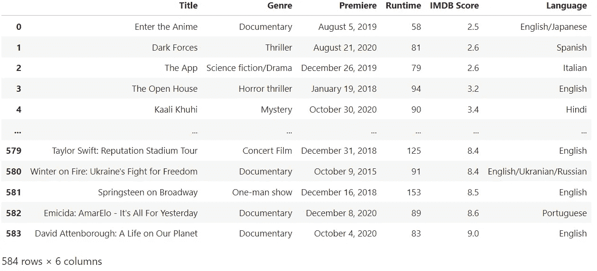

1.  ***语言是根据数据集和可视化创建的长期运行的电影。***

```
data.groupby("Language").agg({"Runtime":"mean"}).sort_values(by="Runtime", ascending=False)runtimeSort = data.groupby("Language").agg({"Runtime": "mean"}).sort_values(by="Runtime", ascending=False).reset_index()
fig = px.bar(data_frame=runtimeSort, x=runtimeSort.Language, y=runtimeSort.Runtime)
fig.show()
```

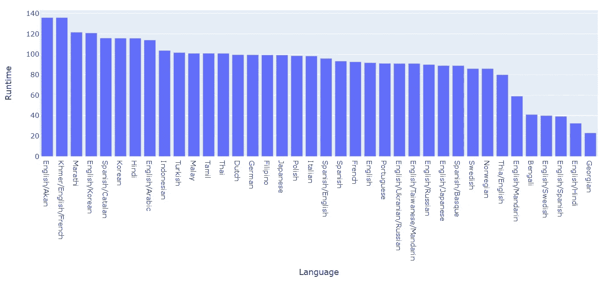

***2。印度电影的时长是多少？***

```
Hindi = data.loc[(data["Language"] == "Hindi")]
x = Hindi.Runtime
x.mean()genre = data.Genre.value_counts().nlargest(20)
genre
fig = px.bar(data_frame=genre, x=genre.index, y=genre.values, labels={"y":"Genre Movies", "index":"Genres"})fig.show()
```

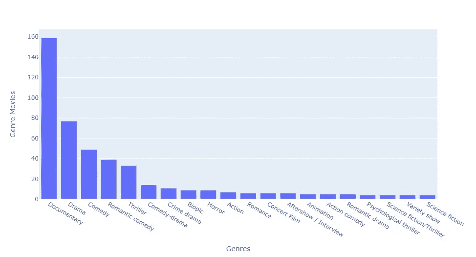

***3。2019 年 1 月至 2020 年 6 月间拍摄的‘纪录片’类型电影的 IMDB 值是多少？***

```
data["Date"] = pd.to_datetime(data.Premiere)data.loc[(data["Genre"] == "Documentary") & (data["Date"] > "2019-01-31") & (data["Date"] < "2020-06-01")].head()docum = data.loc[(data["Genre"] == "Documentary") & (data["Date"] > "2019-01-31") & (data["Date"] < "2020-06-01")].head()docum["Title"].value_counts()print(data.loc[(data["Genre"] == "Documentary") & (data["Date"] > "2019-01-31") & (data["Date"] < "2020-06-01")].head())
fig = px.bar(data_frame=docum, x=docum.Title, y=docum["IMDB Score"], labels={"y":"IMDB Score", "index":"Titles"})
fig.update_layout(xaxis={"categoryorder":"total descending"})
fig.show()*#Viz.*
plt.figure(figsize=(15,10))
sns.barplot(date_range["IMDB Score"], date_range["Title"] )
plt.title("What is the 'Documentary' Genre on IMDB Score by Years?")
plt.legend()
plt.grid()

plt.show()
```

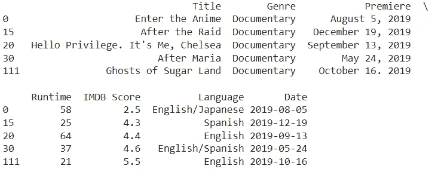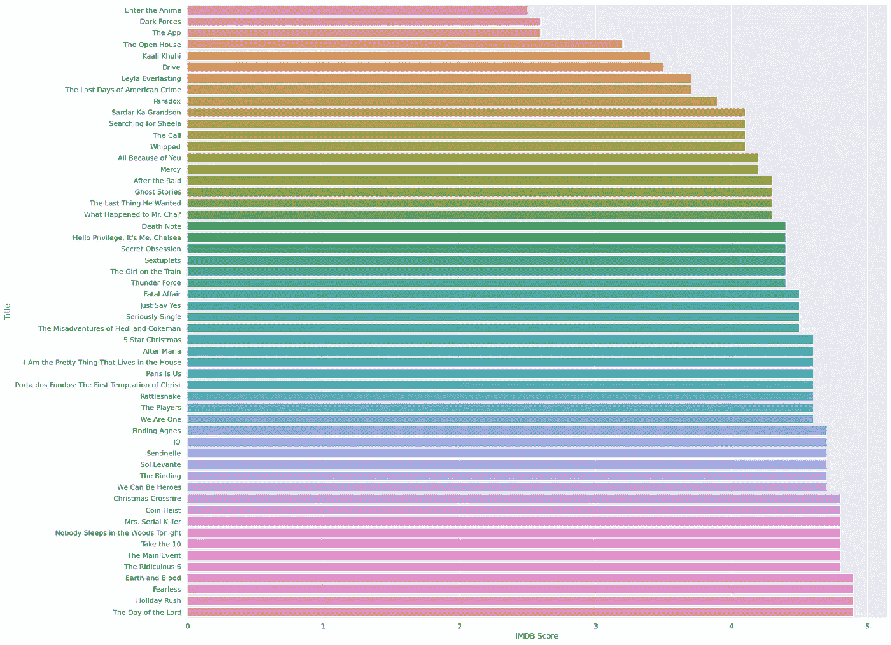

***4。语言电影的平均 IMDB 评分和可视化程度最低。***

```
low_10_mov = data[["Title","Genre","Premiere","Runtime","IMDB Score","Language"]].sort_values(["IMDB Score"], ascending=True)[:10]low_10_movlow_10_mov = data.groupby("Language")["IMDB Score"].mean().nsmallest(15)low_10_movfig = px.bar(low_10_mov, x=low_10_mov.index, y=low_10_mov.values,
labels={'y':'Average Rating Score', 'x':'Language'})
fig.show()
```

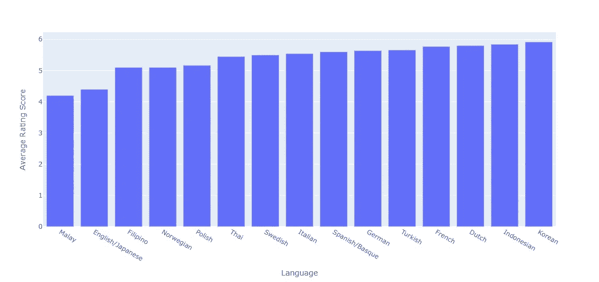

Lowest average IMDB rating

***5。“运行时间”和可视化程度最高的 10 部电影。***

```
df.sort_values(by="IMDB Score", ascending=False)[0:10]

top_10_ratings = df.sort_values(by="IMDB Score", ascending=False)[0:10]
fig = px.scatter(top_10_ratings, y= 'Title', x='IMDB Score', color='Genre', 
                 title = "Top 10 High Rated Programs")

fig.show()
```

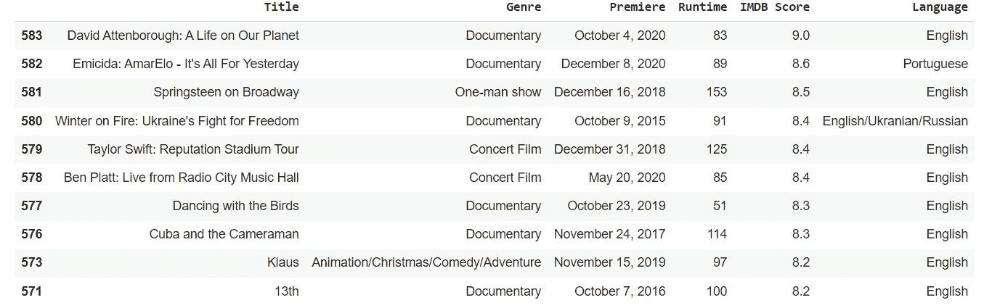

Top 10 High Rated Programs

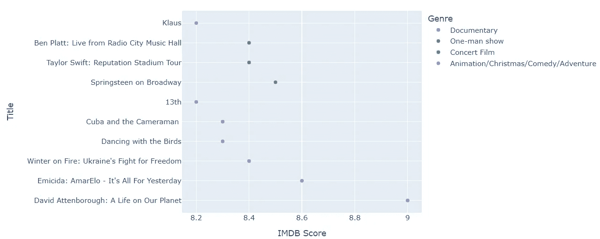

***6。IMDB 分数与“运行时间”和可视化之间的相关性。***

```
def correlation_matrix(dataframe, cols):
    fig = plt.gcf()
    fig.set_size_inches(10, 8)
    plt.xticks(fontsize=10)
    plt.yticks(fontsize=10)
    fig = sns.heatmap(dataframe[cols].corr(), annot=True, linewidths=0.5, annot_kws={'size': 12}, linecolor='w',
                      cmap='RdBu')
    plt.show(block=True)

print(df[["IMDB Score", "Runtime"]].corr())
correlation_matrix(df, num_cols)
print("There is no high correlation between Runtime and IMDB Scores")
```

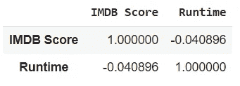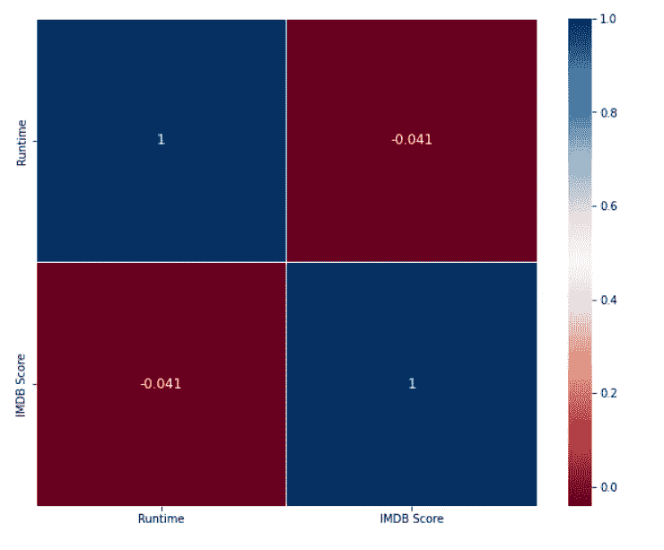

There is no high correlation between Runtime and IMDB Scores

***7。哪一年的总运行时间最长？***

```
data.groupby("Year").agg({"Runtime": "sum"}).sort_values(by="Runtime", ascending=False)[0:1]
year = data.Year.value_counts()
RunYear = data.groupby("Year").agg({"Runtime": "sum"}).sort_values(by="Runtime", ascending=False)plt.figure(figsize=(10,10))
plt.pie(years_runtime["Runtime"], autopct="**%.2f%%**", labels=years_runtime.index)
plt.legend()
plt.title("Runtimes by Years")
plt.show()
```

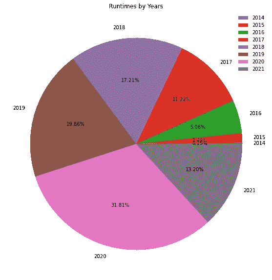

***8。检查电影语言的数量。***

```
lang =df.groupby('Language')['Language'].count().nlargest(15)
y=lang
x=lang.index

fig=plt.figure(figsize=(15,7))
l=sns.barplot(x=y,y=x);
l.set(title='Distribution of Language of Films', xlabel="Count", ylabel="");
```

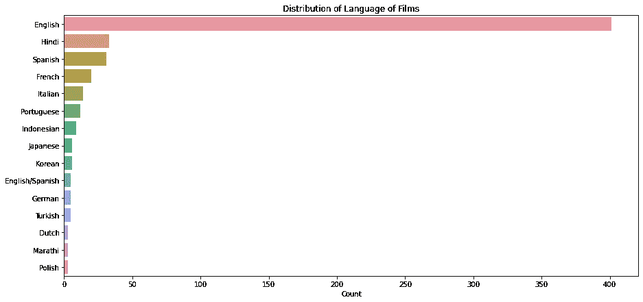

`Distribution of Language of Films`

**9*。数据集中是否存在离群数据？解释一下。***

```
def grab_col_names(dataframe, cat_th=10, car_th=20):
    *# cat_cols, cat_but_car*
    cat_cols = [col for col **in** dataframe.columns if dataframe[col].dtypes == "O"]
    num_but_cat = [col for col **in** dataframe.columns if dataframe[col].nunique() < cat_th **and**
                   dataframe[col].dtypes != "O"]
    cat_but_car = [col for col **in** dataframe.columns if dataframe[col].nunique() > car_th **and**
                   dataframe[col].dtypes == "O"]
    cat_cols = cat_cols + num_but_cat
    cat_cols = [col for col **in** cat_cols if col **not** **in** cat_but_car]

    *# num_cols*
    num_cols = [col for col **in** dataframe.columns if dataframe[col].dtypes != "O"]
    num_cols = [col for col **in** num_cols if col **not** **in** num_but_cat]

    *# print(f"Observations: {dataframe.shape[0]}")*
    *# print(f"Variables: {dataframe.shape[1]}")*
    *# print(f'cat_cols: {len(cat_cols)}')*
    *# print(f'num_cols: {len(num_cols)}')*
     *# print(f'cat_but_car: {len(cat_but_car)}')*
    *# print(f'num_but_cat: {len(num_but_cat)}')*
    return cat_cols, num_cols, cat_but_car

cat_cols, num_cols, cat_but_car = grab_col_names(df, cat_th=5, car_th=20)

def outlier_thresholds(dataframe, col_name, q1=0.25, q3=0.75):
    quartile1 = dataframe[col_name].quantile(q1)
    quartile3 = dataframe[col_name].quantile(q3)
    interquantile_range = quartile3 - quartile1
    up_limit = quartile3 + 1.5 * interquantile_range
    low_limit = quartile1 - 1.5 * interquantile_range
    return low_limit, up_limit

def check_outlier(dataframe, col_name, q1=0.25, q3=0.75):
    low_limit, up_limit = outlier_thresholds(dataframe, col_name, q1, q3)
    if dataframe[(dataframe[col_name] > up_limit) | (dataframe[col_name] < low_limit)].any(axis=None):
        return True
    else:
        return False

for col **in** num_cols:
    print(col, check_outlier(df, col, 0.1, 0.9))
```

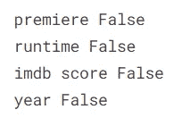

**10*。过滤掉电影数量大于 5 的类型。***

```
genre_filter**=**df**.**groupby('Genre')**.**filter(**lambda** x : len(x)**>**5)**.**sort_values(by**=**"Release Year")
*#the filter() method subsets the dataframe rows or columns according to the specified index labels.*

*# plotting the genre_filter in a line plot along with the years* 
g**=**sns**.**lineplot(data**=**genre_filter, x**=**genre_filter["Release Year"], y**=**genre_filter['IMDB Score'], hue**=**genre_filter["Genre"], ci**=None**,linewidth **=** 2, palette**=**"Set2")
g**.**legend(loc**=**'upper right', bbox_to_anchor**=**(1.35, 1), prop**=**{'size': 15})
fig **=** plt**.**gcf()
fig**.**set_size_inches(12, 8)
```

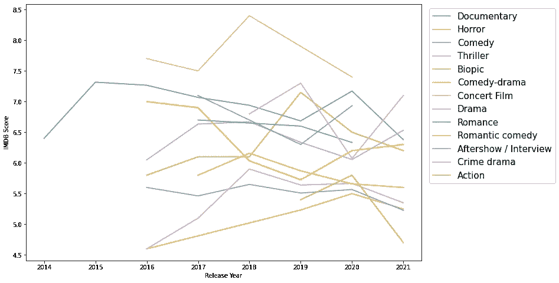

时间线图显示了这些年来每个流派的 IMDB 分数。IMDB 评分最高的前 3 个类型是*音乐会电影、犯罪剧和纪录片。*

# 结论

我们对网飞数据集的探索性分析到此结束。此分析的主要目的是熟悉数据分析和可视化的基本概念，如何提问和回答数据驱动的问题，并很好地掌握 python pandas、NumPy、Matplotlib 和 seaborn。

上面提到了一些非常有趣的见解和可视化。关于这个数据还有很多问题需要回答，但是为了简洁起见，现在只回答了几个。

这个初学者项目对我来说是一次很好的学习经历，因为它让我了解了如何开始数据分析以及如何解决数据驱动的问题。

[](/mlearning-ai/mlearning-ai-submission-suggestions-b51e2b130bfb) [## Mlearning.ai 提交建议

### 如何成为 Mlearning.ai 上的作家

medium.com](/mlearning-ai/mlearning-ai-submission-suggestions-b51e2b130bfb)