# 口袋妖怪数据集上的数据分析

> 原文：<https://medium.com/mlearning-ai/data-analysis-on-pokemon-dataset-44cdc7d15e56?source=collection_archive---------1----------------------->

这个数据分析案例研究将在口袋妖怪数据集上进行。我们将执行一些数据操作，然后尝试使用数据和一些统计的视觉效果来找到一些问题的答案。

该数据集包含来自所有七代口袋妖怪的所有 802 个口袋妖怪的信息，包含关于它们的类型和统计数据的数据。考虑到口袋妖怪的多样性，我对分析这个数据集很感兴趣，以了解一些问题的答案，并潜在地确定最好的口袋妖怪，如果存在的话。这是使用 Python 开源库进行探索性数据分析的良好实践:Pandas 用于数据分析，Seaborn 用于可视化。

Image taken from : [https://wallpapers.com/images](https://wallpapers.com/images)

你可以在我的 Kaggle 个人资料中找到这篇博客的代码:[https://www . ka ggle . com/code/anirudhchauhan/data-analysis-on-pokemon-dataset](https://www.kaggle.com/code/anirudhchauhan/data-analysis-on-pokemon-dataset)

在整个分析过程中，我们将尝试寻找这些问题的答案:

1.  口袋妖怪的速度和各种基数因素有什么关系？
2.  口袋妖怪每一代的计数是多少？
3.  每一代有多少种口袋妖怪？
4.  哪种类型的口袋妖怪最容易抓到？
5.  无论是初级类型还是次级类型，口袋妖怪最普遍的类型有哪些？
6.  口袋妖怪的身高和体重与它的各种基础统计数据有什么关系？
7.  哪种类型最有可能成为传说中的口袋妖怪？
8.  能不能找到最强的口袋妖怪？
9.  口袋妖怪分类器——传奇与否？

# 我们开始吧🙋‍♂️

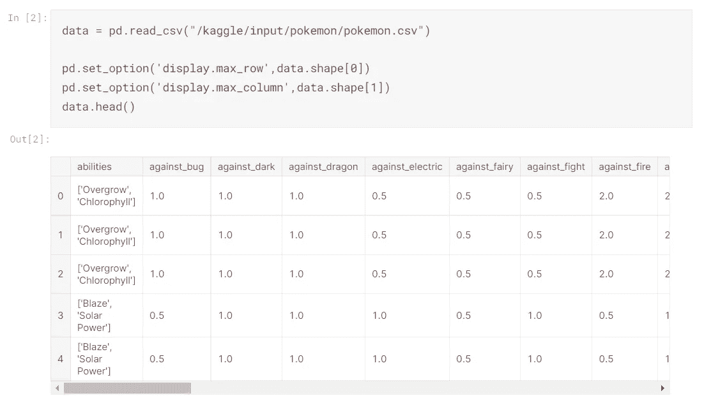

# 描述统计学📈

## 让我们首先检查数据的形状，然后是数据集的最后 5 行。

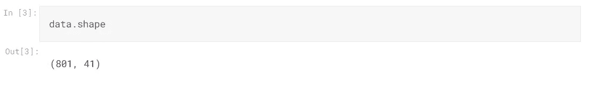

现在我们知道我们的数据集有 **801 行和 41 列**。该死的。！这是一个口袋妖怪的很多细节。

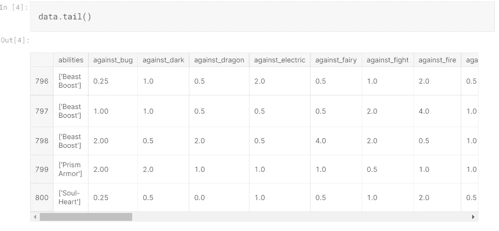

Sample Image of code & output from my Kaggle Notebook

*   因此，从数据的随机样本和我们提取的数据集的最后 5 行中，我们可以看到在“percentage_male”和“type2”列中有一些“NaN”值。
*   我们的数据集中有浮点型、整型和字符串型的值。
    让我们深入检查一下这些细节。

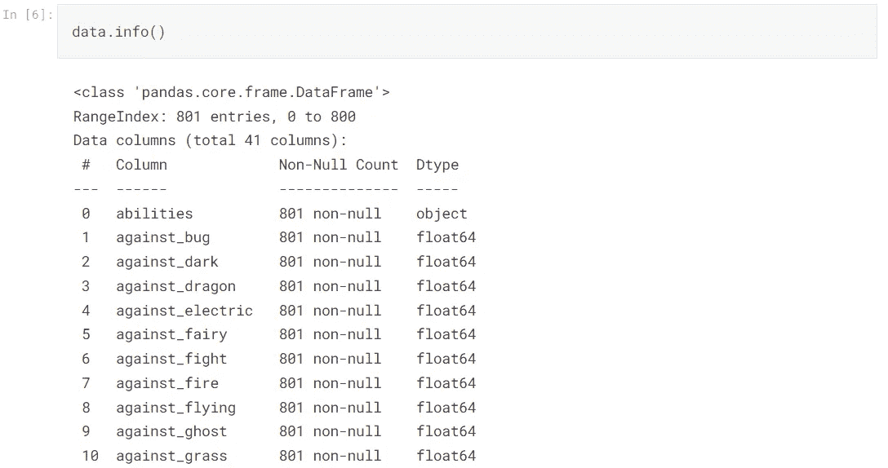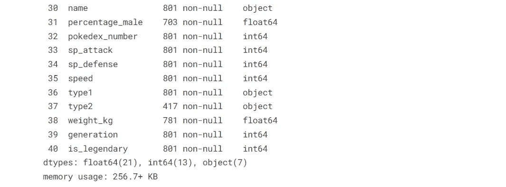

Sample Image of code & output from my Kaggle Notebook

我们从这里得出的基本结论是，我们有 21 个浮点类型列值、13 个整数类型列值和 7 个对象类型列值。

# ◾数据预处理和特征工程👨‍🏭

让我们检查一下数据集中的 Null 或 NaN 值。我确信一定有很多…

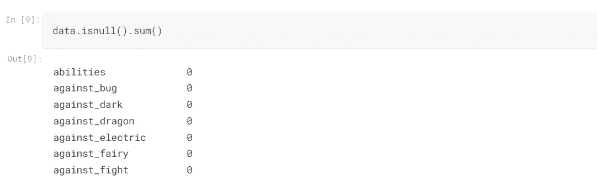

Sample Image of code & output from my Kaggle Notebook

## 好极了。！

因此，我们在名为“type2”的列**中得到许多缺失的数据，即 384。**

接下来是**“percentage _ male”，其中我们得到了 98 个空值，我们在“height_m”和“weight _ kg”**列中分别得到了 20–20 个空值。

但是根据我们的数据集描述，我们可以看到在**“percentage _ male”中具有空值的 98 个口袋妖怪实际上是无性别的**，所以我们不能删除它们或者用一些模式或中值替换它们，我们只是将空值更改为指示它们属性的值。

此外，只有一些口袋妖怪可以有 2 型能力，因此我们不能用一些随机值来填充它的值。我们将用更有意义的东西来设置它。

剩下的，“height_m”和“weight_kg”这些值可以用口袋妖怪所有身高和体重的平均值/众数值代替**，以便更好的分析。**

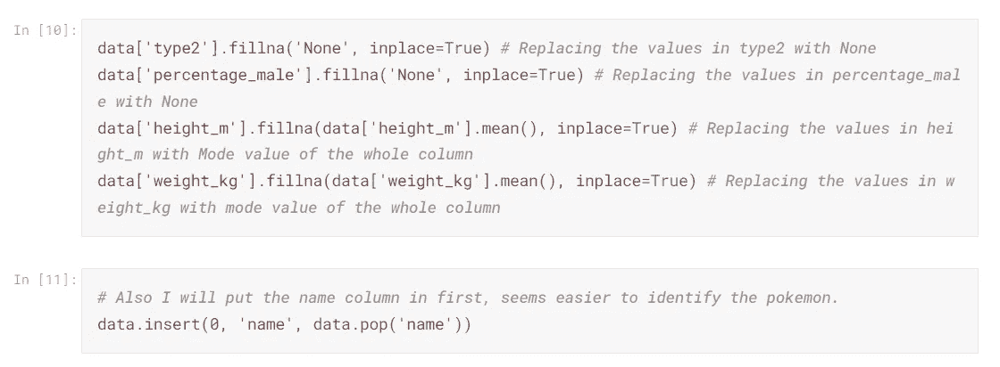

现在，在 **data.info()中可以发现的一个问题是，它有 7 个对象类型列**，但是在检查数据时，我们可以看到，我们从函数 data.sample()、head()和 tail()中获得的所有值都是列**“capture _ rate”中的所有数值**，但是它仍然被计入对象类型中。

我们将分别检查这个专栏，以便更好地理解是什么导致了这种情况。

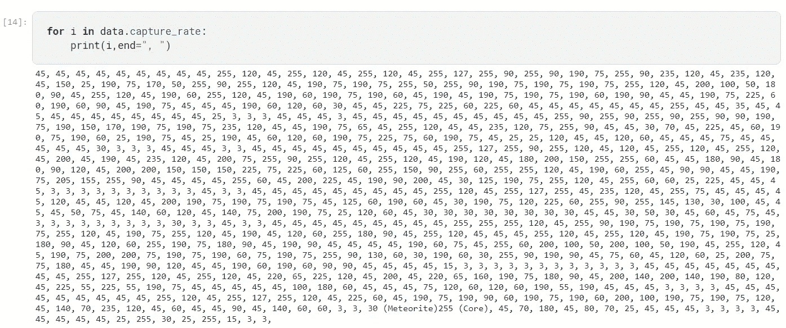

好吧！！现在我们知道了 capture_rate 被认为是一种对象类型的确切原因。

一个特定口袋妖怪的值有 **2 个捕捉率(即 30(陨石)255(核心))**。我们将把它替换为一个单一的值，然后我们就可以把这个列转换成整数类型。

因此，从这一点上，我们现在知道口袋妖怪**“未成年人”是一个流星型口袋妖怪** &因此我们将考虑它的陨石捕捉率，并将取代它。

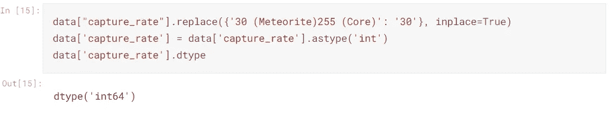

现在让我们更清楚地了解我们的数据集。让我们删除一些不需要的列，并根据需要添加一些列。

我们将删除我认为不必要的 3 列:**日语姓名，pokedex 号码，&百分比男性**

*   此外，我们还将添加一些列:能力的数量以及类型 1 和类型 2 的组合类型

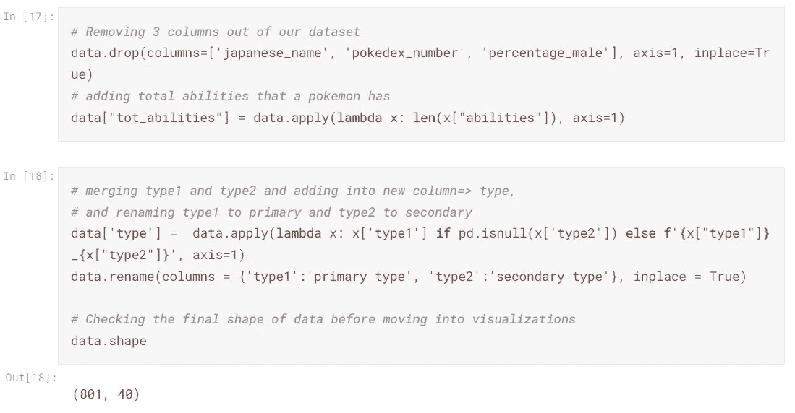

# 数据分析和可视化

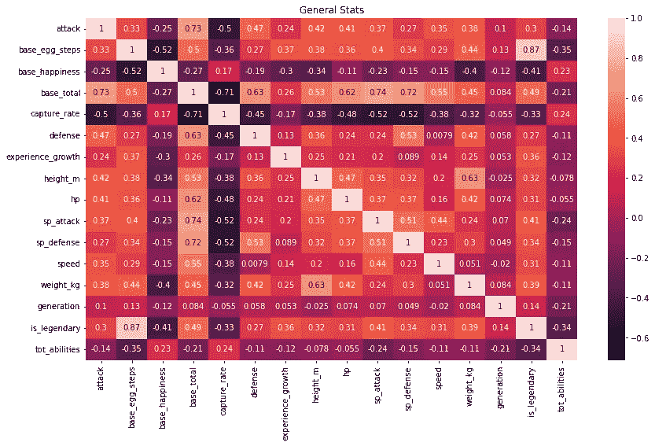

在常规统计数据中，我们可以看到:

1.  Base total (base_total)与攻防属性有很好的相关性。举个例子，

*   带攻击的 base _ total:0.73
*   带速度攻击的基数总计:0.74
*   带防御的基数合计:0.63
*   带 sp.defense 的 base _ total:0.72

2.一个口袋妖怪成为传奇与口袋妖怪的蛋步数有着巨大的相关性(即 0.87)。

3.口袋妖怪的重量依赖于口袋妖怪的高度并与之相关。(即 0.63)

# 1.口袋妖怪的速度和各种基数因素有什么关系？

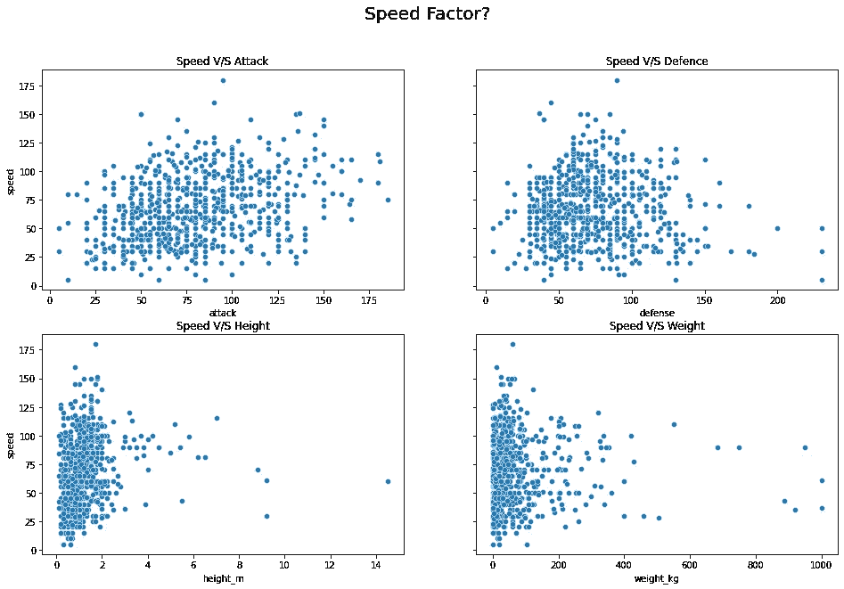

该图显示了速度系数与其他参数之间的关系，以下是我们可以从该图中收集到的一些见解:

*   口袋妖怪的攻击能力稍微取决于它的速度，因为有些口袋妖怪速度适中但攻击能力很好，而有些口袋妖怪速度很快但攻击能力不足。
*   对于口袋妖怪的防御速度并没有太多的要求，因为我们可以从上面的速度与防御图中看到，速度较慢的口袋妖怪拥有更多的防御能力。
*   口袋妖怪的高度高度影响它的速度，从速度 V/S 高度图我们可以看到，高度值非常小的口袋妖怪拥有更快的速度。
*   同样，口袋妖怪的重量高度影响其速度，因为重量级的口袋妖怪速度较慢，而大多数口袋妖怪都是轻量级的，速度适中。

# 2.口袋妖怪每一代的计数是多少？

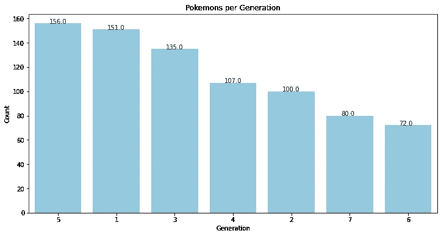

从上面的计数图中，我们可以看出大多数口袋妖怪来自第五代，最少来自第六代。

此外，我们可以看到奇数代比偶数代拥有更多数量的口袋妖怪。

# 3.每一代有多少种口袋妖怪？

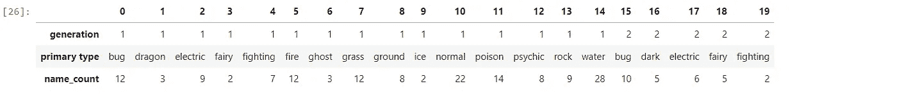

Sample data

我们可以看到，没有一代包含所有类型的口袋妖怪，就像我们在第一代没有任何飞行，钢铁，或黑暗类型的口袋妖怪。我们还可以看到，只有 5 & 6 代有飞行型口袋妖怪。我们有:

*   1、2、3 代的口袋妖怪大多是水型的。
*   4 代的口袋妖怪大部分都是正常类型。
*   5 代的口袋妖怪大部分都是 Bug 类型的。
*   6 代的口袋妖怪大部分都是仙女型的。
*   第 7 代的口袋妖怪大多是草&正常类型。

# 4.哪种类型的口袋妖怪最容易抓到？

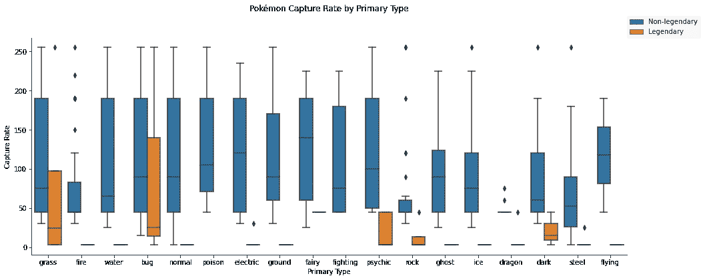

最容易捕捉的口袋妖怪是“仙女型”，而最难捕捉的是“龙型”。此外，很难捕捉到“火型”或“岩石型”口袋妖怪。另一方面，在传奇口袋妖怪中，最容易捕捉的口袋妖怪将是“草或虫”类型的。

# 5.无论是初级类型还是次级类型，口袋妖怪最普遍的类型有哪些？

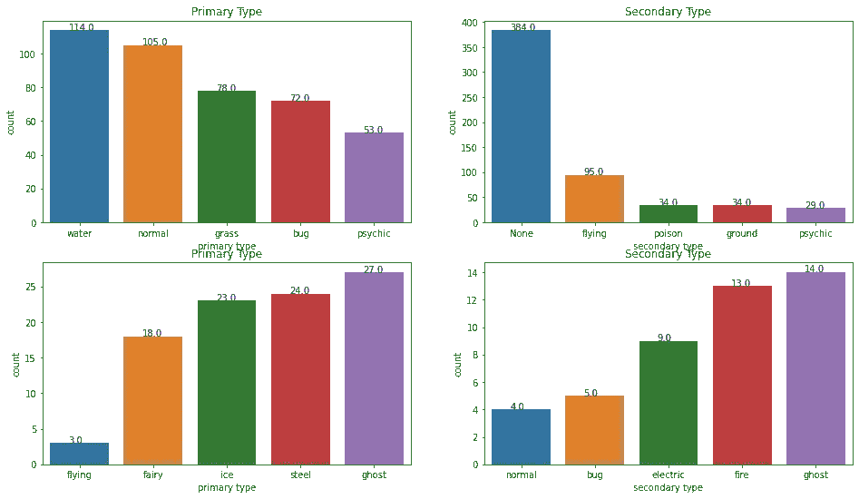

最普遍的口袋妖怪出现在:

*   初级型=水型口袋妖怪
*   次要类型=飞行型口袋妖怪(因为这是次要类型，所以大多数口袋妖怪没有次要类型)

最不普遍的口袋妖怪是:

*   初级型=飞行型口袋妖怪
*   次要类型=普通类型口袋妖怪

请注意，虽然飞行型口袋妖怪在第二类型中数量最多，但飞行型口袋妖怪在第一类型中数量最少。

# 6.口袋妖怪的身高和体重与它的各种基础数据有什么关系？

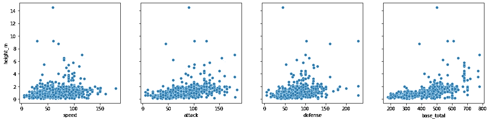

*   我们可以看到，身高和速度都是适度相关的，身高小的口袋妖怪更快，身高大的口袋妖怪更慢。但在某些情况下，我们可以看到有一些口袋妖怪的高度很小，也很慢，但除了他们大多数口袋妖怪速度适中，但高度很小。
*   身高 v/s 攻击也是如此，这里大部分身高小的口袋妖怪攻击力高，速度也明显更快。
*   身高和防御力是适度相关的，因为除了某些情况，大多数口袋妖怪都拥有较小的身高和中等的防御力。
*   虽然在基数总数中，我们可以看到有些口袋妖怪身高适中，但基数总数很高。

因此，一个身高值大的口袋妖怪有它自己的额外津贴，但大多数口袋妖怪身高小，但他们在他们的基本统计数据方面领先，这对他们是必要的。

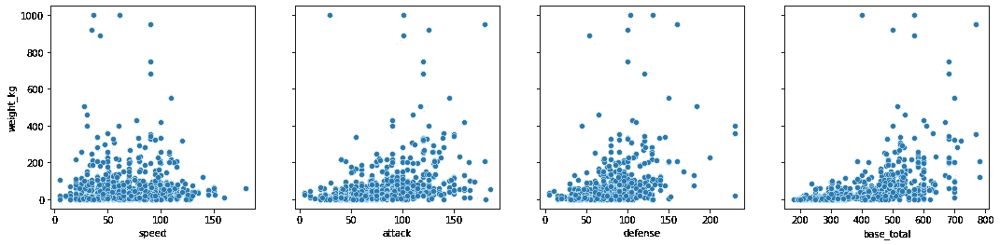

体重高的口袋妖怪速度较慢，而体重低的口袋妖怪速度较快，尽管有 4-5 例体重高的口袋妖怪速度也高于正常速度，但最有可能的是像 Charizard 一样的飞行型口袋妖怪。

# 7.哪种类型最有可能成为传说中的口袋妖怪？

由于“次要类型”和“类型”列的值中都没有，因此我们将忽略它们，因为在“类型”列中，即没有的组合列值仅表示主要类型，在正确的分析中用处不大。

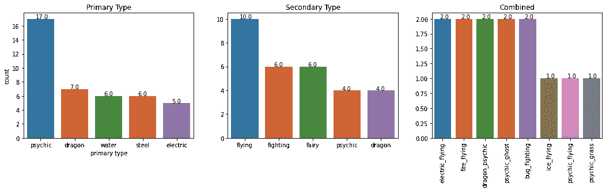

从上面的可视化，我们可以收集一些见解:

1.  如果一个口袋妖怪的主要类型是“精神”类型，那么这个口袋妖怪很有可能是传奇。
2.  从次要类型的角度来看，如果一个口袋妖怪的次要类型是“飞行”,那么这个口袋妖怪成为传奇的可能性就更大。
3.  还有一点要注意的是，虽然“通灵”在初级类型中远远领先于“飞行”在次级类型中，但是将两种类型结合在一个口袋妖怪中使得它不太可能是一个传说中的口袋妖怪。
4.  如果一些口袋妖怪同时有主要和次要类型，那么这些可能的口袋妖怪类型可以被认为是传奇:

*   电动和飞行型
*   火与飞行型
*   龙&通灵型
*   通灵&幽灵类型
*   Bug &战斗型

# 8.哪种类型整体最强？哪个最弱？

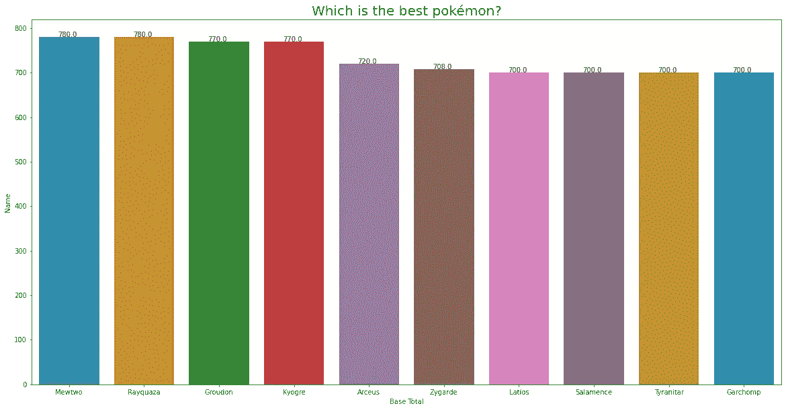

从上面所有基地实力的对比图来看，我们得到了两个实力相同的口袋妖怪。即“梅特沃”和“烈空坐”。

但是实际上，口袋妖怪“阿尔宙斯”无疑是最强大的传奇口袋妖怪。这种正常类型的神话神奇宝贝是宇宙的创造者，因此是神奇宝贝世界中最接近神的一个。根据我们对基础参数的分析，它是第五强口袋妖怪。

另一方面，第二，最强的神奇宝贝是通灵型的神奇宝贝 Mewtwo 是人造的，基因增强版的神奇宝贝 Mew。Mewtwo 是有史以来最强大的神奇宝贝之一。它能够使用同类特有的能力，以及心灵遥感和心灵感应。

为了确定最强的口袋妖怪，我们总结了每个物种的基本统计数据。虽然我们的指标尽可能客观地接近了口袋妖怪的实力，但最终，它可能不会对所有玩家都有意义。因此，玩家在战斗中对招式、攻击和防御点的选择最终是比所选口袋妖怪的实力更大的决定成功的因素。因此，开发者们把口袋妖怪变成了一个不仅仅是优化数据和力量的游戏，而是一个战术和个人体验。

# 最强口袋妖怪 V/S 口袋妖怪之神

我们在最强口袋妖怪中有一个平局，所以我们将比较两个顶级玩家口袋妖怪和口袋妖怪之神:阿尔宙斯。

我们将会比较他们的攻击、防御等基本统计数据，并绘制雷达图，因为该图可以用来比较单个组件的属性或比较两个或更多变量的属性，这将有助于我们轻松地比较两个口袋妖怪。

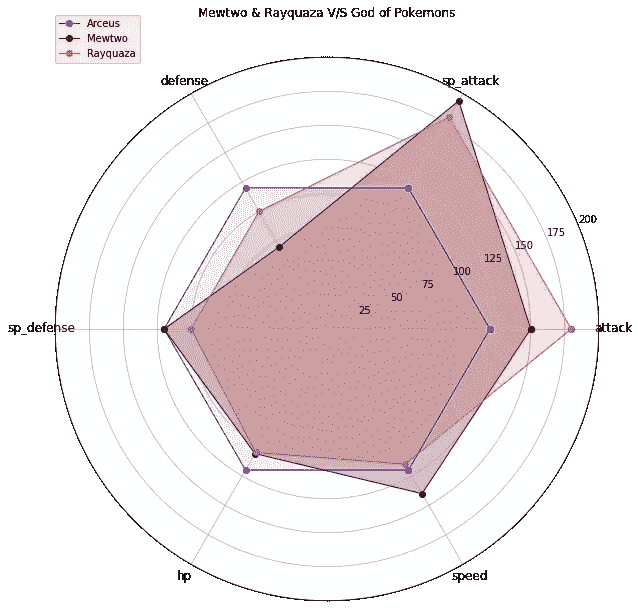

从上面的图中，我们可以看出，由于人造口袋妖怪 Mewtwo 的特殊攻击，它在总基数中具有更高的值，并且达到了我们之前绘制的实力图表的顶部。

虽然 Mewtwo 在防守上欠缺很多，但由于其特殊的攻击和速度参数，它仍然在力量竞赛中领先。另一方面，烈空坐只是在攻击值上领先，高于其他两个国家，但烈空坐在所有其他方面都有所欠缺。

所以来比较一下最强的口袋妖怪:梅特沃和烈空坐。Mewtwo 是一个明显的赢家，因为它在所有其他参数上都领先，并且根据统计数据可以被认为是**最强的口袋妖怪。**

口袋妖怪阿尔宙斯之神有所有平衡的参数，每个参数都有相同的值(大约 124)，这也使它成为一个高度稳定和平衡的口袋妖怪。

# 9.传奇与否？分类器—逻辑回归

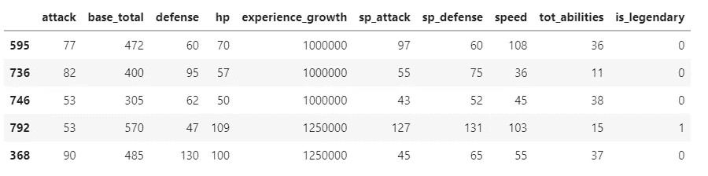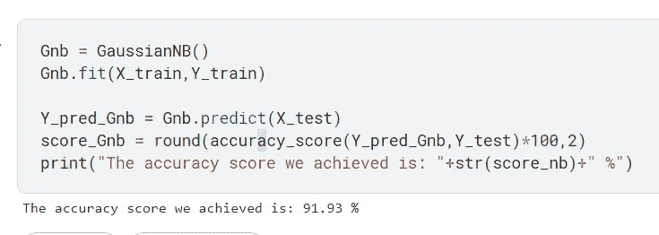

我们可以填充这些值，然后也可以测试一些随机值，但为了便于理解，作为预测的一个示例，我将使用同一数据集中的一些随机名称。

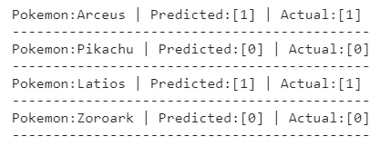

# 参考资料:

*   [https://www . ka ggle . com/code/jai metrickz/pok-dex-best/notebook](https://www.kaggle.com/code/jaimetrickz/pok-dex-best/notebook)
*   [https://www . ka ggle . com/code/shree Kant 009/pokemon-data-visualization/notebook](https://www.kaggle.com/code/shreekant009/pokemon-data-visualization/notebook)
*   [https://www . ka ggle . com/code/joaopdrg/discovering-the-best-pok-mon？scriptVersionId=96280460](https://www.kaggle.com/code/joaopdrg/discovering-the-best-pok-mon?scriptVersionId=96280460)

# 联系我并关注我:

1.领英:[https://www.linkedin.com/in/anirudh-singh-chauhan](https://www.linkedin.com/in/anirudh-singh-chauhan/?source=about_page-------------------------------------)

2.https://www.kaggle.com/anirudhchauhan

3.github:[https://github.com/Anirudh-Chauhan](https://github.com/Anirudh-Chauhan?source=about_page-------------------------------------)

4.YouTube:[https://www.youtube.com/c/AnirudhSinghChauhan](https://www.youtube.com/c/AnirudhSinghChauhan/featured?source=about_page-------------------------------------)

## 如果你喜欢读这篇文章，a👏会激励我做更多这类工作。
另外，如果有任何反馈或建议，请在评论区告诉我。

## 感谢您的阅读😇

 [## Mlearning.ai 提交建议

### 如何成为 Mlearning.ai 上的作家

medium.com](/mlearning-ai/mlearning-ai-submission-suggestions-b51e2b130bfb)