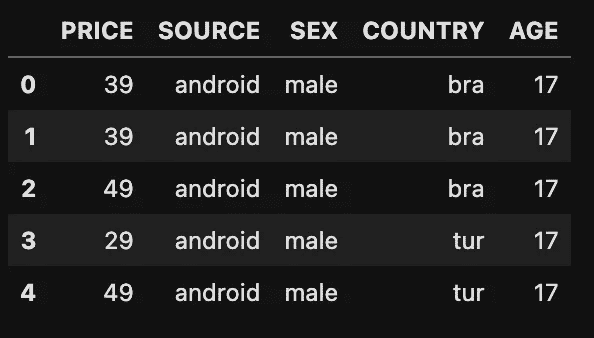
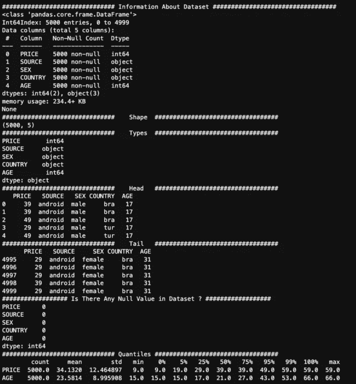
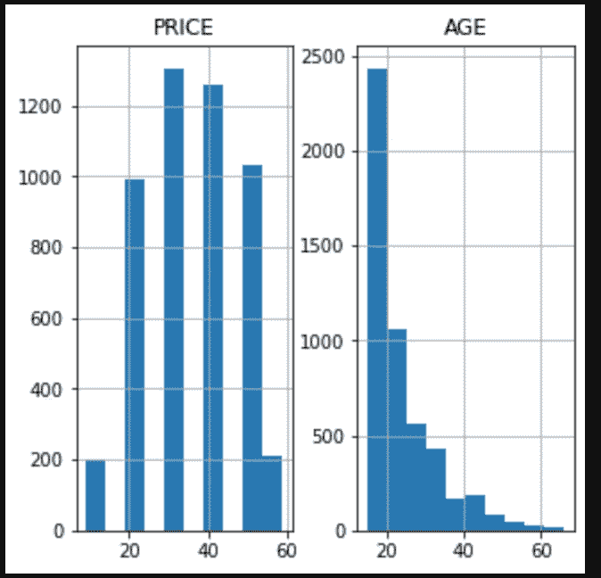
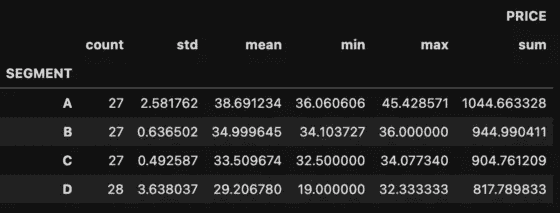
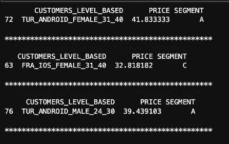

# 数据分析:基于规则的分类

> 原文：<https://medium.com/mlearning-ai/data-analysis-rule-based-classification-967861524cf6?source=collection_archive---------3----------------------->

## 根据现有的客户资料创建人物角色，并根据客户购买情况进行分类

Photo by [Lukas](https://www.pexels.com/tr-tr/@goumbik/) on [Pexels](https://www.pexels.com/tr-tr/)

本文由[阿尔帕斯兰·梅斯里](https://medium.com/u/fe99f0a4a612?source=post_page-----967861524cf6--------------------------------)和[杰姆·özçeli̇k](https://medium.com/u/e7aec74cd6ed?source=post_page-----967861524cf6--------------------------------)撰写。

组织花费大量的金钱来为他们现有的客户提供最好的服务。在进行这些支出时，充分了解客户概况并了解客户的消费习惯可以让支出以最佳方式进行。哪一个客户简档给他带来多少利润的知识可能取决于客户简档的各种可变性。例如，根据机构的影响程度，当创建客户简档时，诸如相关客户的国籍、年龄和性别、他们购物使用的设备类型、购物发生的时间、购物发生的季节、相关客户从机构购物的频率等信息可以是有效的变量。在这种情况下，今天，组织可以受益于各种方法，同时创建他们的客户档案。

从数据科学和机器学习的角度来看，各种分割和聚类算法为这个和类似的分类过程提供了定制的性能。然而，尽管分类和聚类算法(如 K-Means)听起来可能更酷，但有时我们拥有的数据集并不需要如此复杂的算法。我们还可以使用客户的某些特征进行基于规则的分类，以便在较小、紧凑的数据集中进行分类，从而减少可变性和不确定性。采用这种方法不仅为我们的团队节省了大量的工作，而且使我们能够为当前的业务问题带来一个更通用和可接受的解决方案。

在本研究中，作为一个示例业务问题，一家国际游戏公司希望创建新的基于级别的客户定义(人物角色)，方法是使用其客户的一些特征根据这些新的客户定义创建细分市场，并根据这些细分市场估计新客户平均可以赚多少钱。例如，他想确定一个 26 岁的土耳其 Android 用户能为相关公司提供多少。

现在我们可以开始工作了。首先，让我们了解一下我们的数据集:

我们的数据集由 5 个变量组成，包括:

*   价格'，
*   '来源'，
*   性，
*   国家'，
*   “年龄”。

让我们也认识到这些变量:

*   价格:客户的支出金额。
*   来源:客户的操作系统。
*   性别:客户的性别信息。
*   国家/地区:客户的国家/国籍信息。
*   年龄:客户的年龄信息

首先，让我们导入我们将在研究中使用的库。

接下来，导入我们的数据集并查看数据集的摘要。

Dataset Overview

现在，让我们从总体上检查数据集:

我们可以在下图中看到这个函数博客的输出:

Descriptive Statistics of Dataset

Histogram Charts of PRICE & AGE Features

当我们查看数据集时，我们看到没有空行。当然，我们不应该忘记这是一个学习案例。在实际情况下，大多数数据并不干净。

我们有两个数字变量(年龄、价格)。当我们查看这两个变量的统计数据时，我们可以看到可变价格在 9 个单位和 59 个单位之间变化，平均值为 34 个单位。使用者的年龄从 15 岁到 66 岁不等。与价格变量相比，年龄变量是右偏的形式。用户大多是年轻人。考虑到数据属于一家移动游戏公司，这是一种预期的情况。

我们有一些问题。第一个是:

1-每个来源(操作系统)产生了多少销售额？

2-每个价格值有多少销售额？

从输出中我们可以看到，我们提供给客户的产品的价格是 9、19、29、39、49 和 59。

3-每个国家的销售量是多少？

在输出中，我们可以看到销售集中在美国和巴西。虽然德国和土耳其在欧洲国家中的数字接近，但法国的销售额最少。同时，在世界范围内，最少的销售来自加拿大。

4-基于国家/地区的销售收入总计是多少

当按国家分析来自客户的收益时，可以看到，正如预期的那样，来自美国用户的收益最高。

5-按来源类型划分的销售收入总额是多少？

从这里的结果可以推断，Android 用户的收益比 IOS 用户多 47%。

6-各国的平均价格是多少？

土耳其和巴西名列榜首，其次是德国和美国。

7-不同来源的平均价格是多少？

数字几乎相同，但 android 用户支付的费用略高于 IOS 用户。

8-该国的平均价格是多少-来源？

从产出来看，支出最高的是土耳其-安卓客户群，支出最少的是法国-IOS 客户群。

9-按国家-来源-性别-年龄分列的平均收入是多少？

现在让我们更详细地研究一下客户群。男性，巴西，46 岁，android 用户(也是美国和法国的客户群体)似乎花费最多。

法国年轻的女性 android 用户在消费方面也是一个引人注目的群体。

到目前为止，我们对数据提出了一些问题，并得到了答案。下一步，让我们根据年龄对数据进行分类。

我们连接变量来创建基于级别的客户定义变量。

这里我们需要注意的一点是，在使用列表理解创建了基于 customers _ level _ 的值之后，这些值需要是唯一的。比如不能有以下一个以上:BRA_ANDROID_MALE_24_30。

然后，我们根据我们创建的基于 CUSTOMERS _ LEVEL _ 的变量来查看价格平均值。

我们根据我们创建的角色的平均价格将用户分成不同的部分。我们将这些线段命名为 A、B、C 和 d。

最后，让我们检查一下我们所创建的细分市场的统计属性:

Statistics of the Segments

正如我们在该表中看到的，每个细分市场中有 27 个用户。收益最高的细分市场是收益最少的 A 细分市场和 D 细分市场。A 部分实现的最高销售价值为 45.42 台。最低金额为 36.06 单位。其平均值为 38.69 单位。

这里，作为一种不同的方法，我们可以组合彼此显示最相似的片段。对于这个问题，B 段和 C 段是彼此最相似的两个段。我们看的时候，B 段的平均值是 34.99，而 C 段的平均值是 33.50。最大值也彼此相似。然而，有时组合彼此相似的片段可能会导致我们忽略一些独特的信息。这就是为什么我们在这个商业问题中不把这两个部分结合起来。

现在，最后，我们将定义几个示例用户，并找出这些用户在我们的系统中属于哪个部分。

作为此 for 块的输出:

在第一个示例中，我们对土耳其一名 33 岁的男性 android 用户进行了细分，然后在第二个示例中，我们对法国一名 39 岁的女性 Ios 用户进行了细分，最后一个示例中，我们对土耳其一名 26 岁的男性 android 用户进行了细分。

我们的学习已经结束了。在这项研究中，我们在不需要复杂算法的情况下，对具有低不确定性的数据集执行了基于规则的分类。

 [## Mlearning.ai 提交建议

### 如何成为 Mlearning.ai 上的作家

medium.com](/mlearning-ai/mlearning-ai-submission-suggestions-b51e2b130bfb)