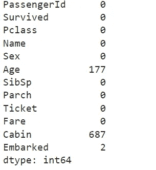
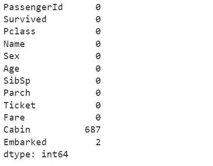
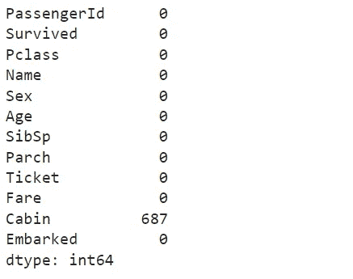
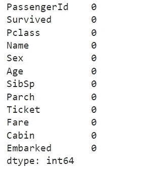

# Python 中的数据清理技术

> 原文：<https://medium.com/mlearning-ai/data-cleaning-in-python-2655bc42bb52?source=collection_archive---------6----------------------->


Photo by [Carlos Muza](https://unsplash.com/@kmuza) on [Unsplash](https://unsplash.com/?utm_source=unsplash&utm_medium=referral&utm_content=creditCopyText)

数据清理是数据管道中的一个重要部分，因为您产生的见解和结果取决于您拥有的数据。脏数据会导致错误的预测。大多数机器学习算法只有在你的数据被适当清理并适合建模时才起作用。

在本文中，我将处理泰坦尼克号数据集。我们将首先使用 pandas 函数研究数据集及其列。然后我们将应用清理技术来处理空值。

我希望这篇文章对你的学习或工作有用。

现在让我们开始吧！

# 导入库

```
**import** pandas **as** pd
```

# 加载数据

```
data **=** pd**.**read_csv('titanic-data.csv')
```

# 探索性数据分析

给我们数据集的前几行。

```
data**.**head()
```

`dtypes`返回数据帧中的数据类型。

```
data**.**dtypes
```

`columns`返回数据集中所有列的名称

```
data**.**columns
```

`info()` will 会告诉我们大量关于数据框的信息，如形状(行、列)、要素的数据类型以及内存使用情况。

```
data**.**info()
```

现在我们对数据集有了一些概念，我们可以继续挖掘列和它包含的数据

# 浏览各列

> *幸存与未幸存的乘客*

```
data['Survived']**.**value_counts()
```

`value_counts`返回包含唯一值计数的序列。结果将按降序排列，因此第一个元素是出现频率最高的元素。**默认排除 NA 值。**

```
print('Total number of passangers in the training data...', len(data))print('Number of passangers  who survived...', len(data[data['Survived'] **==** 1]))print("Number of passangers  who didn't survived...", len(data[data['Survived'] **==** 0]))
```

> 幸存的男女比例是多少？

```
print(data['Sex']**.**value_counts())print('% of male who survived', 100*****np**.**mean(data['Survived'][data['Sex']**==**'male']))
print('% of female who survived', 100*****np**.**mean(data['Survived'][data['Sex']**==**'female']))
```

> *按等级和年龄列的幸存乘客*

```
print(data['Pclass']**.**value_counts())print('% of passengers who survived in first class', 100*****np**.**mean(data['Survived'][data['Pclass'] **==** 1]))print('% of passengers who survived in second class', 100*****np**.**mean(data['Survived'][data['Pclass'] **==** 2]))print('% of passengers who survived in third class', 100*****np**.**mean(data['Survived'][data['Pclass'] **==** 3]))print(data[["Pclass", "Survived"]]**.**groupby(['Pclass'])**.**mean())
```

# 处理缺失值

```
df2 **=** data**.**copy() *#dataframe copy*

df2**.**isnull()**.**sum()
```

使用`copy`制作数据帧的副本，以便原始数据保持原样。

`isnull().sum()`将告诉我们每一列中空值的数量。



我们可以清楚地看到哪些列包含空值，所以我们将一个接一个地挑选它们，并更新那些列。

```
int(data['Age']**.**mean())
#using this we can replace null values with the mean of age column
```

要替换数值，使用`fillna`功能。您在键中定义您想要替换的值，并在值
`{column_name: replacement_for_NA}`中定义替代值

```
df2['Age'] **=** df2['Age']**.**fillna(np**.**mean(df2['Age']))df2**.**isnull()**.**sum().
#all null values of Age column replace with the mean of the column
```



我们现在将处理已装载的列，因为它只有 2 个空值，我们要么删除这些行，要么替换为列的*模式*，因为它是一个*对象*列。

```
#solution 1
emabark **=** df2['Embarked']**.**dropna()print(df2[df2['Embarked']**.**isnull()])df2['Embarked']**.**fillna(df2['Embarked']**.**mode()[0], inplace**=True**)
#inplace will do changes in dataframe directlyprint(df2**.**isnull()**.**sum())
```



现在在最后我们将处理客舱列

```
df2['Cabin']**.**value_counts()df2['Cabin']**.**mode()
```

当我们打印该列的*模式*时，它将显示 3 个值，我们可以选择任何值并用 *nan* 值替换。

```
df2['Cabin']**.**fillna(df2['Cabin']**.**mode()[0], inplace**=True**)
df2**.**isnull()**.**sum()
```



最后，我们清理了数据集，这些数据现在可以用于进一步的分析和处理。

你可以在这里找到我在这篇文章中使用的代码所在的笔记本。
我建议你下载那本笔记本，亲自体验一下，这样你就可以亲自动手写这篇文章了。

***这篇文章就到此为止，谢谢你的阅读，希望你能从中学到新的东西！***

# 资源

[](/bitgrit-data-science-publication/data-cleaning-with-python-f6bc3da64e45) [## 用 Python 清理数据

### 使用 Airbnb NY 数据集进行数据清理的指南

medium.com](/bitgrit-data-science-publication/data-cleaning-with-python-f6bc3da64e45) 

我们来连线:

*   [Linkedin](https://www.linkedin.com/in/uzair-adamjee-28768a102/)
*   [Instagram](https://www.instagram.com/uzairadamjee/)
*   [推特](https://twitter.com/UzairAdamjee)

[](/mlearning-ai/mlearning-ai-submission-suggestions-b51e2b130bfb) [## Mlearning.ai 提交建议

### 如何成为 Mlearning.ai 上的作家

medium.com](/mlearning-ai/mlearning-ai-submission-suggestions-b51e2b130bfb)