# 谷歌 Play 商店应用程序数据集上的数据清理

> 原文：<https://medium.com/mlearning-ai/data-cleaning-on-google-play-store-appsdataset-49f8b834814e?source=collection_archive---------6----------------------->

“垃圾进，垃圾出”这句话在数据科学界是众所周知的，它强调了数据清理的重要性。使用未清除的数据来训练模型可能会导致性能不佳和结果不准确。因此，让我们看看为什么数据清理是重要的，并查看一些代码。

## 为什么数据清理很重要？

数据清理是数据科学过程中最重要的步骤之一。但是为什么呢？

1.  它有助于确保数据是准确的、格式正确的、一致的，并且在进一步分析之前可以使用。
2.  如果数据包含错误或任何种类的异常，那么它会对分析结果或模型产生严重影响。这会导致不正确的结论。
3.  清理数据可以帮助我们解决上述问题，从而增加对模型或分析结果的信任。
4.  干净数据更容易处理，可以节省大量时间和资源。

现在，让我们在最著名的数据集“谷歌 Play 商店应用程序数据集”上检查数据清理的代码。你可以从 [Kaggle 下载数据集。](https://www.kaggle.com/datasets/lava18/google-play-store-apps)

## 步骤 1:问题陈述和数据收集

正如我在上一篇文章[二手车数据 EDA](/mlearning-ai/detailed-exploratory-data-analysis-eda-on-used-cars-data-1bacac746ff4)中提到的，定义问题陈述和关于数据的信息是一个很好的实践。

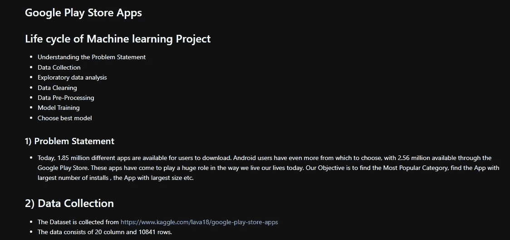

Problem Statement and Data Collection

## 步骤 2:导入所需的库并加载数据

为了执行任何类型的分析或数据清理或 EDA，我们需要一些库，我们需要加载数据集。一旦数据集被加载，我们可以使用 head()方法将其可视化。head()将显示数据集的前 5 行。类似地，tail()将显示底部的 5 行。

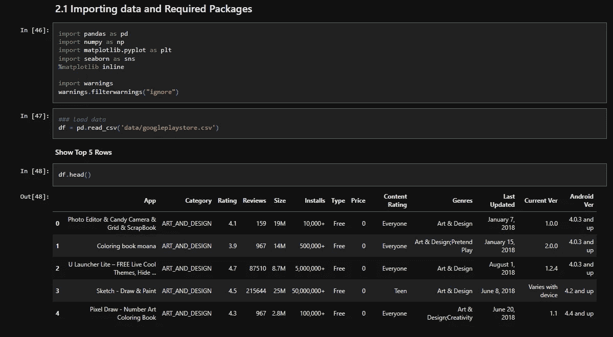

Importing Packages and Data

## 步骤 3:执行一些基本功能

通过执行一些基本功能，我们可以获得关于数据集的一些重要信息。

1.  **Shape:** 它将告诉我们数据集的形状，即数据集中的行数和列数。
2.  **Describe():** 该函数将给出数字特征或列的摘要。我们可以使用 include= "all "来获得所有列(数字和分类)的摘要。我们可以得到最小值、最大值、平均值、分位数等值。
3.  **Info():** info()将给出每一列中非空值的计数，并告诉我们每一列或特性的数据类型。

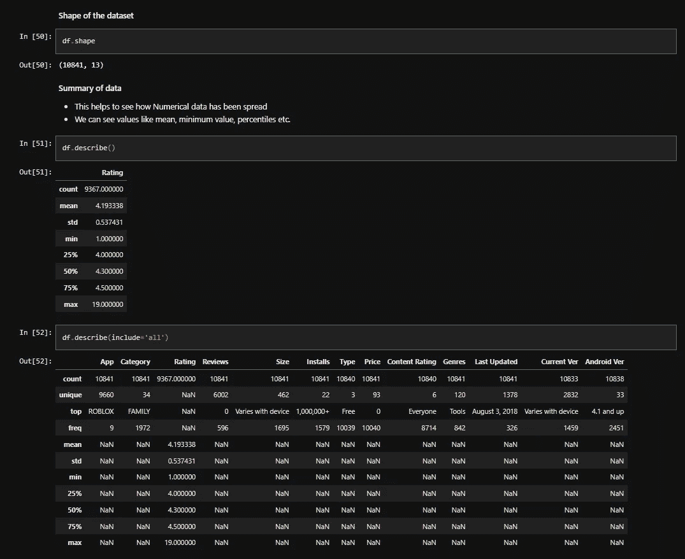

Shape and Describe

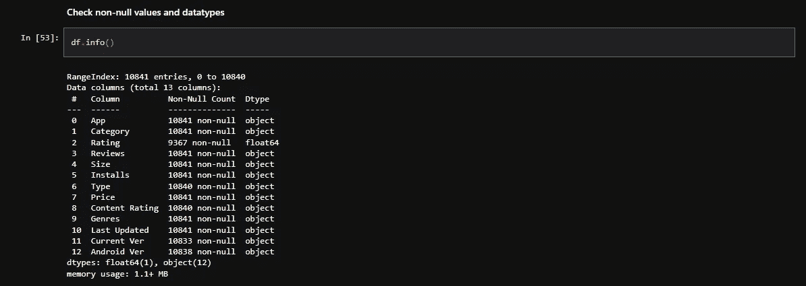

info

在每一节的末尾写下结论也很重要，这样我们可以在执行 EDA 或功能工程时节省时间。

1.  这里，我们有 12 个对象类型(分类)列，只有 1 个数字列，但是如果我们从 head()检查数据，我们可以注意到像 reviews、size、install 和 price 这样的列都有整数值。
2.  最后一次更新应该是日期时间功能。
3.  少数几列中有一些空值。
4.  因此，我们需要将这些列转换为适当的数据类型，并且我们可以在以后处理缺失值时处理缺失值。

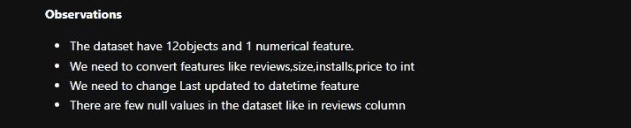

Section Conclusion

## 第四步:处理变量

现在，我们将开始逐个研究每一列，并检查是否需要清理任何数据。

**4.1 处理评论**
首先，检查评论列中有多少值是数字。

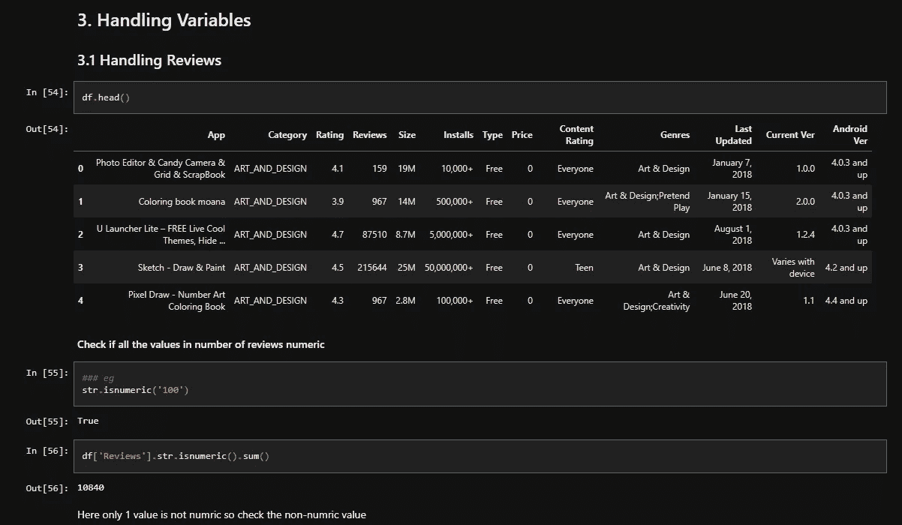

Reviews

从上图中我们可以看到，只有一个值不是数字。现在，我们将检查考核不是数字的那一行数据。

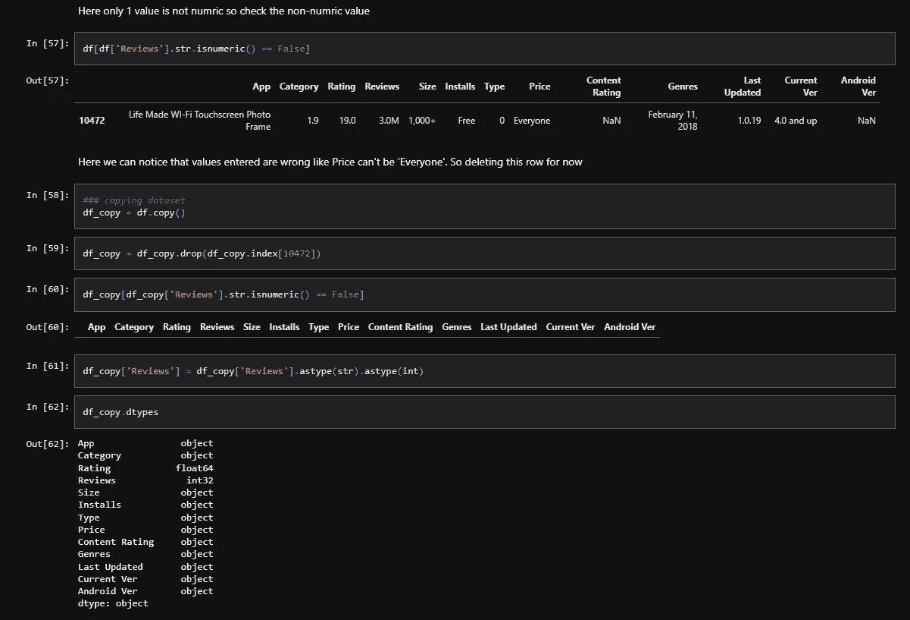

Reviews Column Cleaning

因此，只有一行 Reviews 值为“3.0M”。但进一步分析，我们可以看到，价格价值是“一切”。这不可能，这意味着该行的数据不正确。此外，因为只有一行这样的行，所以我们可以删除这一行。我们可以使用 drop()方法从数据集中删除该行，然后将数据类型更改为 integer。

**4.2 搬运尺寸**

1.  “大小”列中的值类似于“19M”、“201k”等。我们想要纯数值。
2.  此栏中有一个值“因设备而异”。我们需要用 Nan 值替换这个值。
3.  将“Size”列转换为浮点数据类型。

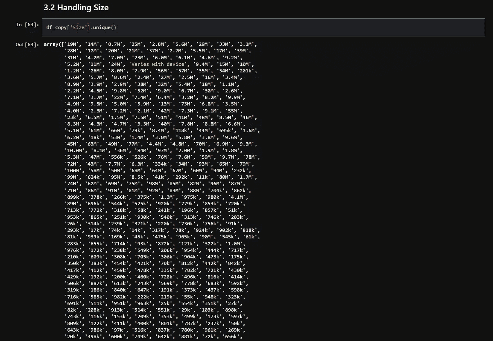

Unique Values

**替换不想要的文本**

1.  首先，我们将“M”替换为“000”。
2.  然后，用空字符串“”替换“k”。
3.  用 Nan 值替换“随设备变化”值。
4.  将列转换为浮点数据类型。

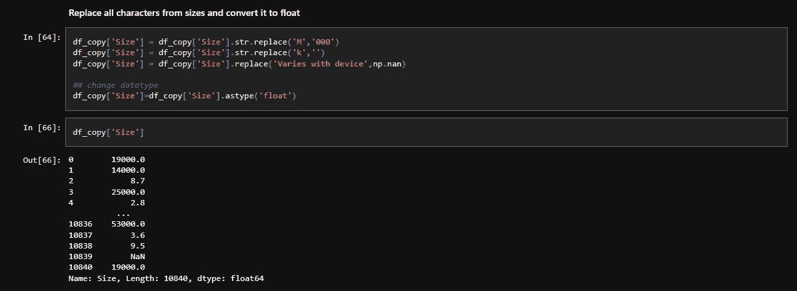

Replacing text

**将兆字节转换为千字节，然后将每个值转换为兆字节**

1.  上述步骤存在问题。例如，我们将 19M 转换为 19000，将 201K 转换为 201，但将 8.2M 转换为 8.2000。这意味着 8.2M 的值不会转换为 8200。
2.  为了解决这个问题，我们可以使用一个条件。如果“大小”列中的值小于 10，则将该值乘以 1000。这样，8.2000 将被 8200 取代。因此将每个值转换成千字节。
3.  完成后，将 Size 列的每个值除以 1000，将其转换为兆字节。

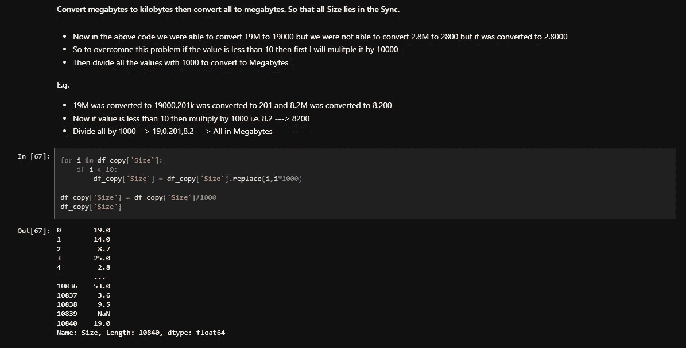

Convert to Megabytes

## 4.3 处理价格和安装

为了清理价格和安装列，我们需要从价格列中删除“$”，从安装列中删除“+”、“”。为此，我使用嵌套的 For 循环，并用空字符串替换“$”、“+”、“，”符号。最后，我们需要将价格和安装列的数据类型分别更改为 float 和 integer。

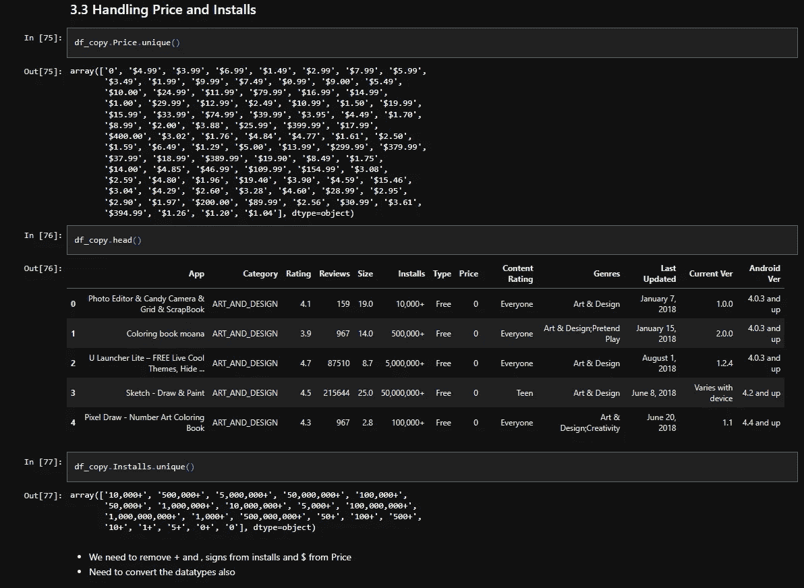

Price and Installs Column

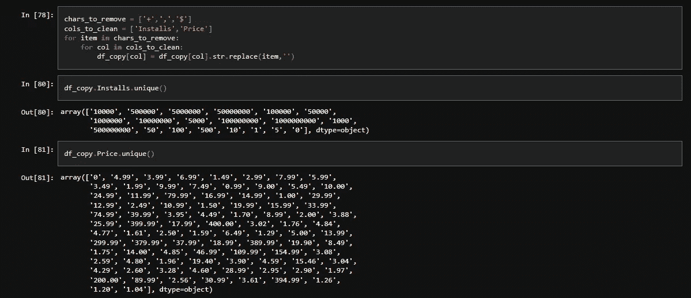

Remove $ + and ,

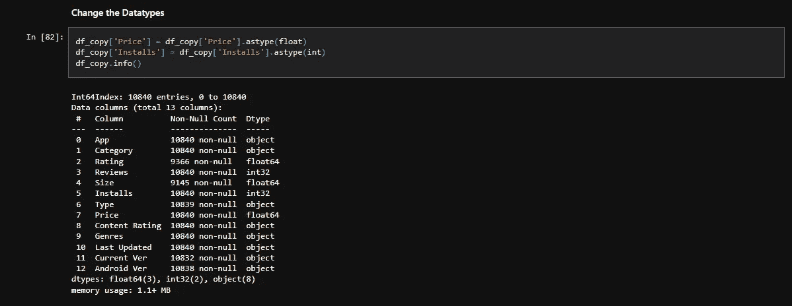

Change Datatypes

## 4.4 处理最后更新

我们只需要将 Last Update 列转换为 datetime 数据类型。然后，从该列创建另外三列日、月和年。最后，将数据保存到 CSV 文件中，以供 EDA 和进一步分析。

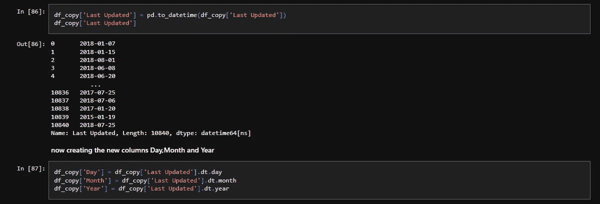

Convert to Datetime

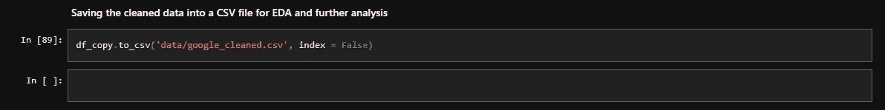

Saving Data

## 结论

数据清理是数据科学和数据分析过程中的一个关键步骤，有助于确保数据准确无误，并为进一步分析做好准备。通过识别和修复错误和不一致、删除重复项、规范化数据以及处理异常值，您可以帮助确保数据的高质量并为进一步分析做好准备。我们可以使用本文中显示的一些基本函数和方法来清理数据，然后可以使用它进行进一步的分析。

你可以在我的 [Github 上找到原始数据和代码。](https://github.com/devsachin0879/FullStackDataScience/blob/main/EDA_FE/GooglePlayStore/Data%20Cleaning%20GooglePlayStore.ipynb)

*感谢你阅读这篇文章！如果你有任何问题，请在下面留言。*

 [## Mlearning.ai 提交建议

### 如何成为 Mlearning.ai 上的作家

medium.com](/mlearning-ai/mlearning-ai-submission-suggestions-b51e2b130bfb)