# 使用 SQL Server 清理数据—演练

> 原文：<https://medium.com/mlearning-ai/data-cleaning-with-sql-server-walkthrough-e4521447e7ae?source=collection_archive---------3----------------------->

最好保持干净！

数据清理是数据分析师/科学家最重要的步骤之一，因为所有分析的结果/见解都取决于所用数据的质量。数据质量是对数据集可信度的一种衡量，因此可以从中获得真知灼见。如果我们得到原始数据并开始分析它，几乎可以肯定它会给我们不可靠的结果。

有许多清理数据的技术，其中大部分深入到:删除重复数据、转换错误的数据类型(例如，字符串、整数、浮点、日期时间)、修复字符串输入错误、处理缺失值等。

在这个项目中，将对从美国收集的数据集进行简单的数据清理，并关注纳什维尔的城市住宅。

如果想查看这里用到的所有查询，可以查看我的 [**GitHub。**](https://github.com/vitorxavierg/Portfolio_Projects/blob/4f8de1324745c549a849c95fa4d6c3f0a2f6f18b/SQL_DataCleaning)

我们正在经历的步骤是:

*   **探索数据集(1)**
*   **标准化日期格式(二)**
*   **删除缺失数据(3)**
*   **将列的内容分解成不同的列(4)**
*   **修复字符串错别字(5)**
*   **删除重复的行(6)**

**(1) —探索数据集**

所以，让我们开始吧！首先，让我们看一下数据集，并检查我们是否可以注意到数据中的任何不规则性:

上面的查询有以下结果(附注:为了更好的可视化，我分两次发布):

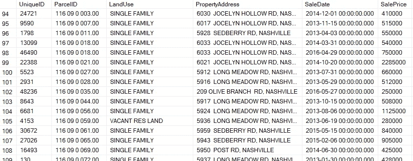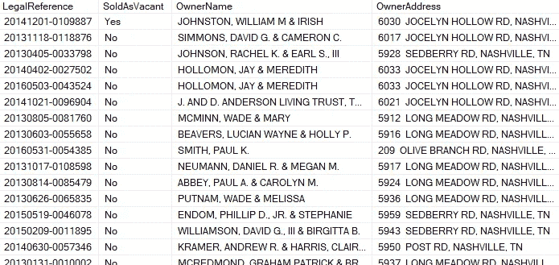

**(2) —标准化日期格式**

首先，可以看到在 ***销售日期*** 一栏中，日期后面有时间“00:00:00:000”。在这种情况下，时间并不重要，所以我们将把它去掉，只得到日期。

为此，让我们使用**转换**功能进行测试:

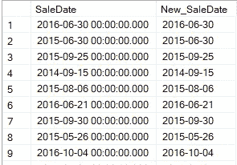

现在让我们在数据集中创建一个新列，并用 ***New_SaleDate*** 列日期值填充它:

已经创建并填充了 ***新销售日期*** 列:

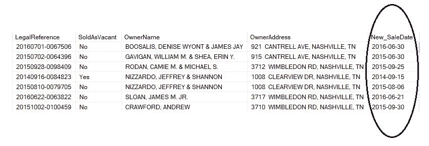

**(3) —删除缺失数据**

进一步研究数据集，可以发现有些行没有属性地址寄存器:

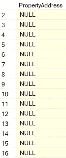

我们知道属性地址永远不会改变，因此我们几乎可以肯定地说，如果我们有另一个具有相同参考点的行，并且该行具有针对***property address***列的寄存器，则可以填充空值。我们用例子来看，这样更容易理解:

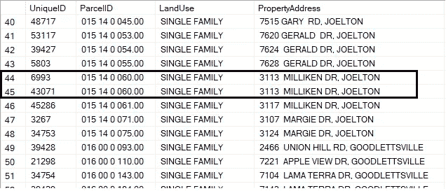

可见，在同一 ***ParcelID*** 注册的寄存器将始终具有相同的 ***PropertyAddress*** 。因此，在向相同的 ***ParcelID*** 注册的情况下，我们可以用具有相同 ***ParcelID*** 的其他寄存器来填充缺失的***property address***(只有当其他寄存器具有***property address***的值时，才能执行此操作)。

但是，为了做到这一点，有必要找到一种方法来区分具有相同***parceled***的行，以便应用 **SQL** 。为此，我们将筛选具有相同 ***ParcelID*** 但具有不同 ***UniqueID*** 的行:

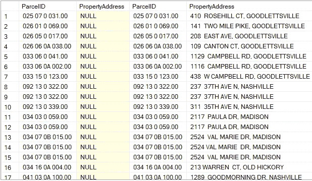

从上图可以看出，存在重复的***parcelets***对于***property address***列同时具有注册值和空值。现在，让我们使用 **ISNULL** 函数测试填充缺失值:

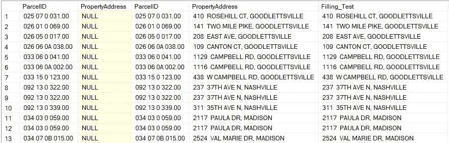

因此，我们创建了 ***Filling_Test*** 列来测试 null***property address***值基于 ***ParcelID*** 作为参考。在了解它的工作原理之后，现在让我们使用 **UPDATE** 来填充它:

现在，它已经被填充，让我们再次执行以下查询:

***property address***没有空值，确认更新成功:

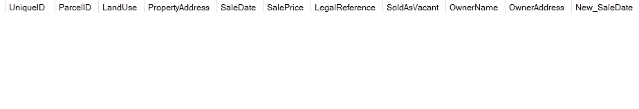

**(4) —将专栏内容拆分为不同的专栏**

让我们更仔细地看看***ownerraddress***一栏:

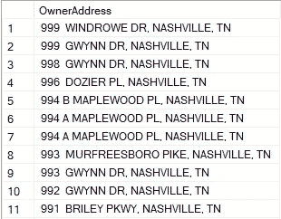

我们拥有所有人的地址、城市和州，用逗号分开。最好将这些属性分为不同的列，以便获得更好的数据质量和组织，从而可以从中获得更好的见解。在这种情况下，让我们使用 **PARSENAME** 函数:

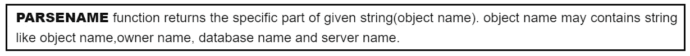

返回:

请注意，我们还在查询中使用了 **REPLACE** 函数，因为 **PARSENAME** 函数的标准分隔符是点，所以我们必须将所有的逗号(，)转换为点(。)，之后应用 **PARSENAME** 功能。

下一步是创建列***SplittedOwnerAddress***、***SplittedOwnerCity***和***SplittedOwnerState***，并填充它们:

现在我们可以看到表中的新列:

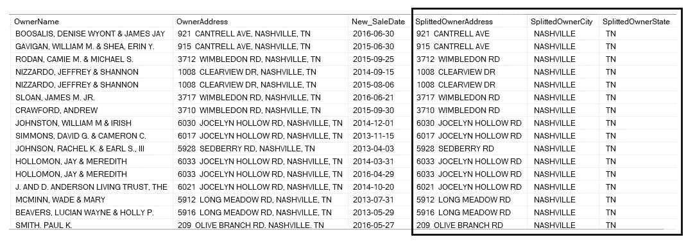

**(5) —修复字符串错别字**

在***soldas vacate***列中，我们可以看到如下结果:

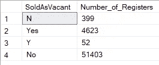

该列有四个不同的字符串，主寄存器分别为“是”和“否”，分别有 4623 条和 51403 条记录。字符串“Y”和“N”正在污染数据，因为它们复制了字符串“Yes”和“No”。

现在，让我们将' Y '和' N '字符串转换为' Yes '和' No '，这样我们就可以有一个标准化的列:

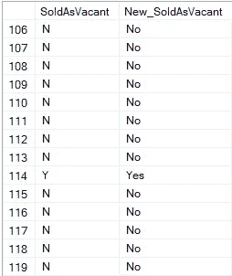

现在，是时候对**更新*****soldas vacate***列进行如下转换了:

更新后，让我们对同一列应用 **DISTINCT** 函数，看看它是否还有任何重复的字符串:

这就是结果:

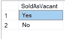

删除了“y”和“N ”,现在我们有了一个标准化的色谱柱，经过清洗，质量良好，可用于将来的分析。

**(6) —删除重复行**

最后一步是删除重复的行。由于删除数据库中的行不是一种标准做法，我们将使用**公共表表达式(CTE)** 和**窗口函数**删除重复的行。

让我们首先假设，对于这个数据集，每次我们有相同的 ***ParcelID、PropertyAddress、SaleDate、SalePrice 和 LegalReference*** 具有相同的值，它们肯定是重复的寄存器。

所以，第一步是应用**窗口函数**和**分区** **到**我们在上一段引用的列，并按我们知道没有任何重复的唯一列对它们进行排序: ***UniqueID*** 。结果如下:

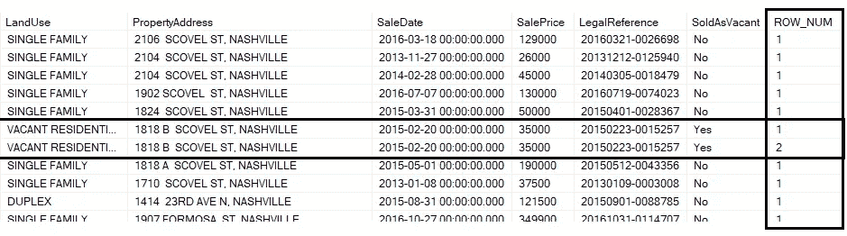

可以看出，在**窗口函数**中，如果参数划分的**相同，则开始统计重复记录的数量。**

创建了 ***ROW_NUM*** 列后，我们现在可以将**窗口函数**放入 **CTE** 中，之后只过滤具有***ROW _ NUM***>1 的寄存器。这样，我们保证所有重复的行将被考虑:

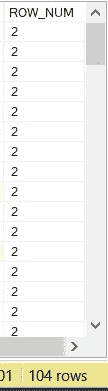

有 104 行有重复值。现在，让我们把它们从 **CTE** 中删除:

现在检查在 **CTE** 中是否有任何重复的行，我们使用相同的查询:

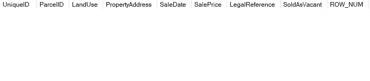

现在不再有重复的行，我们有了一个更干净的数据集。

仅此而已！！我们已经完成了数据清理演练…

在这个数据集中还有更多的清理工作要做，使用这些 SQL 工具可以更进一步，做更多的工作。

谢谢大家，希望你喜欢这个帖子。

如果你能对这个帖子发表评论，提出你的反馈，分享你的经验，我会非常满意的！

我们也在 [**Instagram**](https://www.instagram.com/vitorxavierg/) 或者 [**Linkedin**](https://www.linkedin.com/in/vitor-xavier-guilherme-6866a3204/) 上连线吧。

再见，下次见。

:)

 [## Mlearning.ai 提交建议

### 如何成为 Mlearning.ai 上的作家

medium.com](/mlearning-ai/mlearning-ai-submission-suggestions-b51e2b130bfb)