# 数据驱动的购车——回答 13 个问题以获得最佳结果

> 原文：<https://medium.com/mlearning-ai/data-driven-car-buying-answer-13-questions-for-best-results-52175517dcfd?source=collection_archive---------4----------------------->

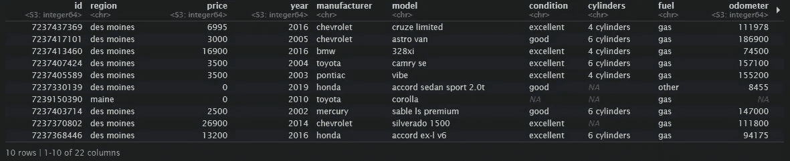

Craigslist Automobile Data

我在这里的目的是使用待售二手车的列表，并想出一种方法来回答一些关于待售汽车的常见问题。这个项目的灵感来自于我需要为前雇主做的工作和我今天早上读到的一篇文章。文章标题为“[买车时需要回答的 13 个问题](https://www.daveramsey.com/blog/questions-to-ask-when-buying-used-car)”

该过程的第一步是找到二手车的数据，看看数据集是否包含回答所提问题所需的相关信息。我从 craigslist 上找到了很多二手车的数据，这将是我回答相关问题的基础。下一步是将数据放入数据库。然后，我将添加查询效率的指数。我决定用 Postgres，因为它无处不在，提供了文本搜索工具，可以和 SQL 一起使用。最后，我会一个问题接一个问题，看看数据如何让问题得到解答。

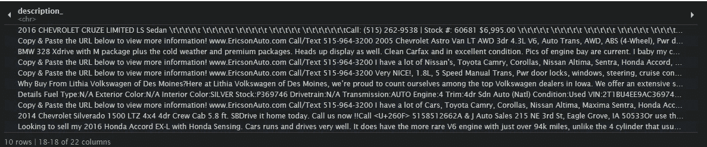

Description given by owner of cars

1.  ***他们为什么要卖车？这个问题一开始似乎很难回答，因为我不知道从何说起。然后，我开始研究汽车销售商分类广告中的描述，并能够确定为什么他们中的大多数人试图出售他们的汽车。答案比任何人想象的都简单。卖家大多只是单纯的经销商，卖车是他们的事。我可以说，大约 73%的卖家是作为经销商使用这个平台来获取他们汽车的信息的。我能够使用融资、库存、不良信贷等词汇。发现绝大多数卖家都是毒贩。假设经销商将讨论提供融资、接受信用不良的客户、库存水平等。对于剩余的 27%正在出售的汽车，需要进行更多的研究，以找出卖家为什么试图处理掉这辆车。***

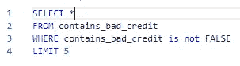

Sample query for “bad credit” indicating the seller is a dealer

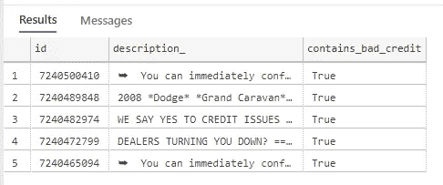

Results of “bad credit” query indicating that the seller is a dealer

***2。这辆车有多旧了？利用 craigslist 提供的数据，这个问题可能是最容易回答的问题。***

Car year of manufacture

***3。*** ***这辆车的行驶里程是多少？这个问题可能和关于车龄的问题一样简单。数据中给出了。***

Mileage on the odometer

**4。他们拥有这辆车多久了？** 这个问题从数据上来看确实无法回答。

***5。他们是照原样卖这辆车，还是它在保修期内？*** 回答这个问题的尝试相当有趣。没有太多的迹象表明，这是所提到的汽车销售的描述。保修一词在汽车描述中出现得更频繁。我的假设是，车主或卖家不会提及保修，除非汽车受到一个。大约 30%的卖家提到了保修，但是“原样”并没有出现在汽车的描述中，这意味着我们无法对此做出结论。这个问题的进一步答案需要直接向卖方提出。

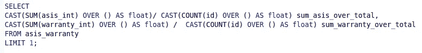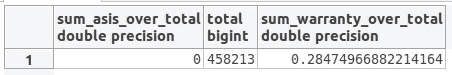

**⑥*。汽车外部有损坏吗？*** 清单中没有太多关于汽车的损坏信息。这个问题需要直接向卖家提出。只有大约 3%的广告提到了“损害”这个词。我们肯定需要问卖家的问题。

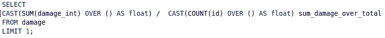

***7。汽车内部是什么样子的？*** 数据库中 38%的汽车都提到了内饰。这给了我们一个内部情况的线索。

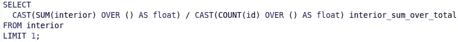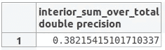

% Interiors

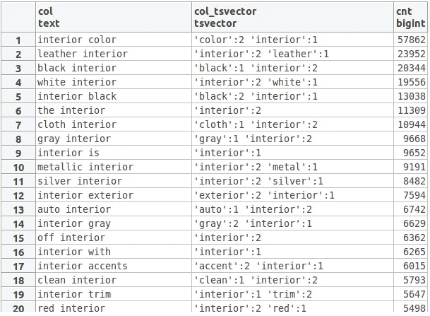

Example Interiors

***8。有什么机械问题吗？关于这部汽车的构造，有许多资料可以找到。这可以通过查找 mechanical 和与之相关的单词来确定。***

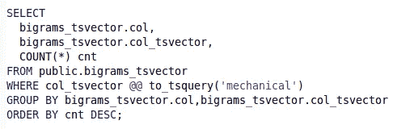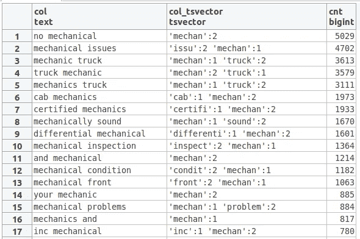

***9。这辆车出过事故吗？关于这辆车是否发生过任何事故，确实有很多信息需要弄清楚。我们需要进一步分析信息，对事故信息进行分类，但确实有很多信息可以回答这个问题。***

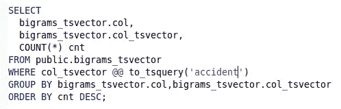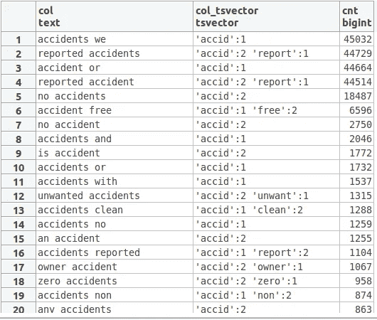

***10。有车辆历史报告吗？*** 美国最常见的车辆历史报告是 Carfax 报告。为了确定历史报告是否可用，我在文本中搜索单词作为报告可用的指示。结果显示，约有 1/3 的汽车拥有该报告。

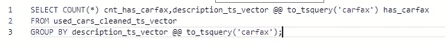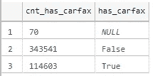

***11。我可以把车交给我的机械师进行独立检查吗？关于是否允许独立检查，有几个指标。这需要和卖方进一步讨论。***

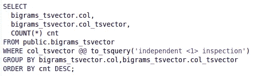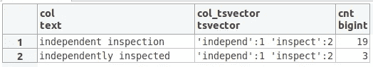

***12。他们拿到冠军了吗？*** 这个问题也可以用数据快速解答。很小一部分车没有所有权，所以我断定绝大多数卖家都有所有权。这很有道理，因为绝大多数卖家都是经销商。

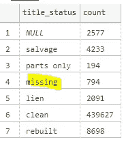

***13。这辆车会如何影响我的汽车保险费？*** 汽车数据包括品牌和型号，这大大有助于确定汽车保险费应该是多少。

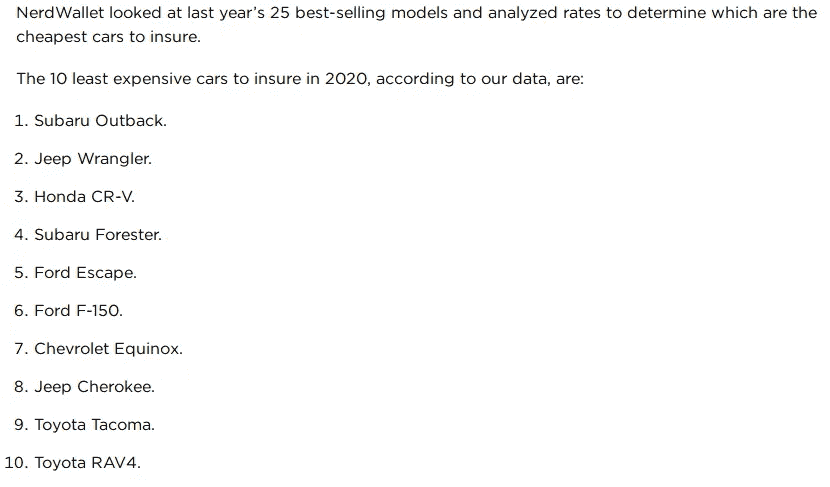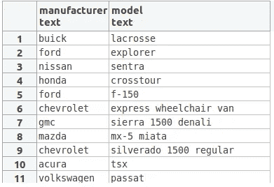 [## Mlearning.ai 提交建议

### 如何成为 Mlearning.ai 上的作家

medium.com](/mlearning-ai/mlearning-ai-submission-suggestions-b51e2b130bfb)