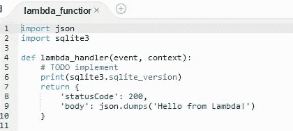
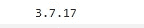
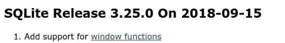
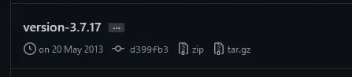
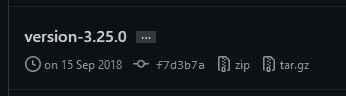
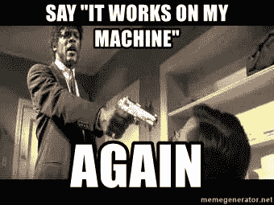

# 数据工程日常问题-1

> 原文：<https://medium.com/mlearning-ai/data-engineering-daily-problems-1-85ca36192478?source=collection_archive---------2----------------------->

## 提高你的隐性知识与这些双重定量的闹鬼使用自动气象站λ


Image by [Jackson Films](https://unsplash.com/@jackson_films) via [Unplash](https://unsplash.com/photos/FgEngMJ0ocY)

# 系列介绍

软件工程可能是互联网上信息最多的领域。有了这么多的信息，人们可能会认为任何有时间、纪律、能力和毅力的人都可以成为大师…这是真的，至少在理论上是这样的…

via Giphy

我来给大家介绍一下**显性**和**隐性** **知识的区别。**根据维基百科(简单点说):

*   **显性知识**是指可以很容易地表达、编码、存储和访问的知识。
*   **隐性知识**是难以表达或提取的知识，因此更难通过写下来或用语言表达的方式转移给别人。这包括个人智慧、经验、洞察力和直觉。

我不打算通过详细解释它们之间的差异来重新发明轮子，但是我相信正是这些知识类型之间的差异的存在使得对高级软件工程师档案的需求如此之大(当然这也可以应用于其他学科)。

> **在这种类型的档案中，有些东西不是仅仅通过培训/学习(显性知识)就能获得的，它还需要经验(隐性知识)。**

这就是为什么我要开始汇编我在作为一名数据工程师的日常工作中遇到的一系列问题，这些问题作为一个单独的解决方案可能没有价值(如果你没有直接遇到和我一样的问题)，但可以帮助开发该领域的隐含知识。

我的想法是在这一系列文章中汇编这些例子，以便在最好的情况下，它们可以帮助面临相同问题的人，在一般情况下，它们可以作为好奇心或帮助开发隐性知识。

# 问题 AWS Lambda 中的 SQLite

## **描述**

使用 AWS Lambda 来自动化从存储在 S3 的 SQLite DB 中读取和写入数据的过程。该进程在本地运行良好，但在 Lambda 上执行时失败，并显示以下错误消息:

```
[ERROR] OperationalError: near “(“: syntax error
Traceback (most recent call last):
 File “/var/task/lambda_function.py”, line 24, in lambda_handler
 calculations.main()
```

正如在前面的错误消息中可以看到的，在执行 SQL 查询时，这似乎是一个 Python 错误，但是它没有给出关于错误来源的更多信息。正在使用的查询示例:

```
SELECT Name, ROW_NUMBER () OVER ( PARTITION BY SURNAME ORDER BY Execution_Date DESC) AS ROW_NU, SUBSTR(Execution_Date,1,10) as Execution_Date_sub
FROM Persons
```

查询的“复杂性”在***ROW _ NUMBER***window 函数中，但在本地有效的查询在使用相同 Python 版本和相同库的 AWS Lambda 中无效…

嗯，那不是 100%正确。在回顾了 Lambda 提供的不同 Python 运行时之后，我发现所有的运行时都包含了预装的 AWS SDK(在我们的例子中是 [boto3](https://github.com/boto/boto3)

 [## 用 Python 构建 Lambda 函数

### 可以在 AWS Lambda 中运行 Python 代码。Lambda 为 Python 提供了运行你的代码来处理事件的运行时。你的…

docs.aws.amazon.com](https://docs.aws.amazon.com/lambda/latest/dg/lambda-python.html) 

由于我没有找到 Lambda 运行时中预安装的所有包的列表，所以我决定采取实际的方法:



AWS Lambda simple script to get the SQLite version of the runtime



Output of previous command

SQLite 版本，其中增加了对窗口函数的支持:



[https://www.sqlite.org/releaselog/3_25_0.html](https://www.sqlite.org/releaselog/3_25_0.html)

**3 . 7 . 17(AWS Lambda 中使用的 SQLite 版本)比 3.25.0(第一个兼容窗口功能的 SQLite 版本)更新？**因为我不确定，所以我在官方库[查看了不同的 SQLite 版本](https://github.com/sqlite/sqlite/tags):



SQLite version being used in AWS Lambda



First SQLite version compatible with window functions.

## 解决办法

由于 AWS Lambda Python 运行时内置了 SQLite 版本 3.7.17，我们无法安装同一个包的另一个版本。但是我们可以使用像 **pysqlite3** 这样的包装器

[](https://github.com/coleifer/pysqlite3) [## GitHub - coleifer/pysqlite3:来自 Python 3 的 SQLite3 DB-API 2.0 驱动程序，单独打包，带有…

### 这个库从 Python 3 中提取 SQLite 模块，并将其打包成一个可单独安装的模块。这可能是…

github.com](https://github.com/coleifer/pysqlite3) 

> 这个库从 Python 3 中提取 SQLite 模块，并将其打包成一个可单独安装的模块。linux 有一个二进制包(wheel ),它有一个完全独立的`pysqlite3`,与最新版本的 SQLite 静态链接。

这个包允许我们修改 SQLite 的导入，就好像我们正在导入一个完全不同的包(为了避免版本冲突),我们将其重命名为 sqlite3，这样就不必更改其余的代码:

```
import pysqlite3 as sqlite3
```

[](https://stackoverflow.com/questions/65280790/install-newer-version-of-sqlite3-on-aws-lambda) [## 在 AWS Lambda 上安装新版本的 sqlite3

### 感谢贡献一个堆栈溢出的答案！请务必回答问题。提供详细信息并分享…

stackoverflow.com](https://stackoverflow.com/questions/65280790/install-newer-version-of-sqlite3-on-aws-lambda) 

# 问题 2:从 AWS Lambda 中删除网站时的不同反应

再次出现生产(AWS Lambda)和本地环境之间不同结果的问题…



## 描述

用 Python 写的一个程序，对某个网站进行网络抓取(使用 BeautifulSoap ),在 JSON 中处理结果并上传到 S3:

```
req = urllib.request.Request(url=url_page, headers=header) 
page = urllib.request.urlopen(req) 
soup = BeautifulSoup(page, 'html.parser')
for div in soup.find_all("div", class_="SOME_CLASS"):
    #STORES IN JSON FORMAT AND UPLOADS TO S3
```

在本地，它工作得很成功。在 AWS Lambda 中，我们有以下错误:

```
[ERROR] AttributeError: ‘NoneType’ object has no attribute ‘find_all’
```

在深入查看日志后，我发现 SOUP 对象不是空的，即 LAMBDA 函数具有 web 可见性(因此它在尝试下载源代码时没有失败)，**一些不同的东西失败了**。

在将这个错误贴上官方[恶作剧的标签](https://en.wikipedia.org/wiki/Poltergeist)之前，我首先尝试了以下理性的方法:

*   改变了我的请求中使用的头，但是，由于相同的头在本地工作，它没有意义。**相同结果**。
*   试着运行 **CURL** ，就像我在系统自己的终端上运行它一样(看看这是 VM 的问题还是我的代码的问题):

```
import subprocess
def lambda_handler(event, context):
 CurlUrl=”curl -H ‘MY_HEADERS‘ -H ‘Connection : keep-alive ‘ [https://www.web.com](https://www.smartbets.com/football/celta-vigo-espanyol/)"
 status, output = subprocess.getstatusoutput(CurlUrl)
 print(output)
```

出现以下错误:

```
/bin/sh: curl: command not found
```

惊喜！ **CURL** 没有安装在 AWS Lambda 正在使用的 Linux 虚拟机中

*   [我尝试异步执行调用](https://www.twilio.com/blog/asynchronous-http-requests-in-python-with-aiohttp)，以防出现某种不允许我下载整个页面的隐式超时。**同样的结果**。
*   我下载了页面 HTML 并存储在 S3 (Lambda 存储只持续到函数终止)，这样我就可以在本地查看它。有一次下载，我数了一下字符数，我看到下载的版本有我本地版本总字符数的 1/3。

这最后一次尝试给了我所需要的线索…

## 解决办法

在我所在的国家还没有可用的 AWS Lambda 地区，所以我使用欧洲的另一个地区( **eu-west-3** )。似乎我试图抓取的网站在每个国家都有某种内容限制，所以我能够从我的本地执行中获得网站的完整内容，但当在 eu-west-3 AWS Lambda 中尝试相同的代码时，网页的内容有所不同(我在执行本地执行时获得的总字符数的 1/3)。

为了探究我的假设，**我将我的 AWS Lambda 区域从 eu-west-3 更改为 us-west-2** ，并且废弃过程如预期的那样工作(我能够获得与在我的本地环境中执行时相同的网页)。

# 结论

在这篇文章中，我们看到:

*   显性知识和隐性知识的区别。
*   这类文章的目的不仅仅是揭示一个非常具体的问题的解决方案，而是通过向读者展示具体的问题和解决问题的过程来帮助发展隐含的知识。
*   **问题 1** :如何更改 AWS Lambda Python 运行时预建的 SQLite 版本。
*   **问题二**:如何解决本地执行和 AWS Lambda 报废结果的差异。

```
“The success formula: solve your own problems and freely share the solutions.”
― [**Naval Ravikant**](https://twitter.com/naval/status/1444741381579177984)
```

[](/mlearning-ai/mlearning-ai-submission-suggestions-b51e2b130bfb) [## Mlearning.ai 提交建议

### 如何成为 Mlearning.ai 上的作家

medium.com](/mlearning-ai/mlearning-ai-submission-suggestions-b51e2b130bfb)