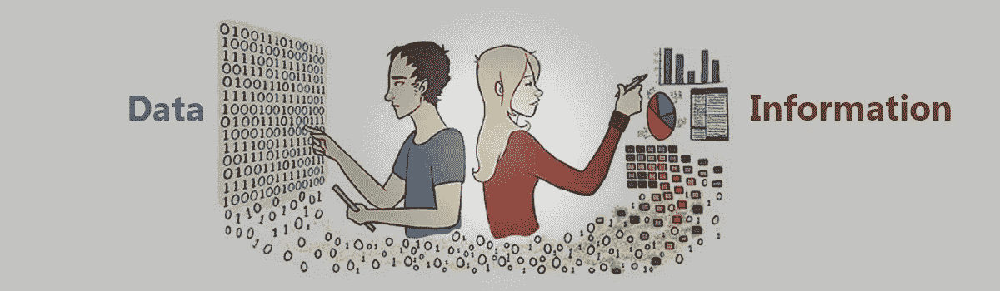
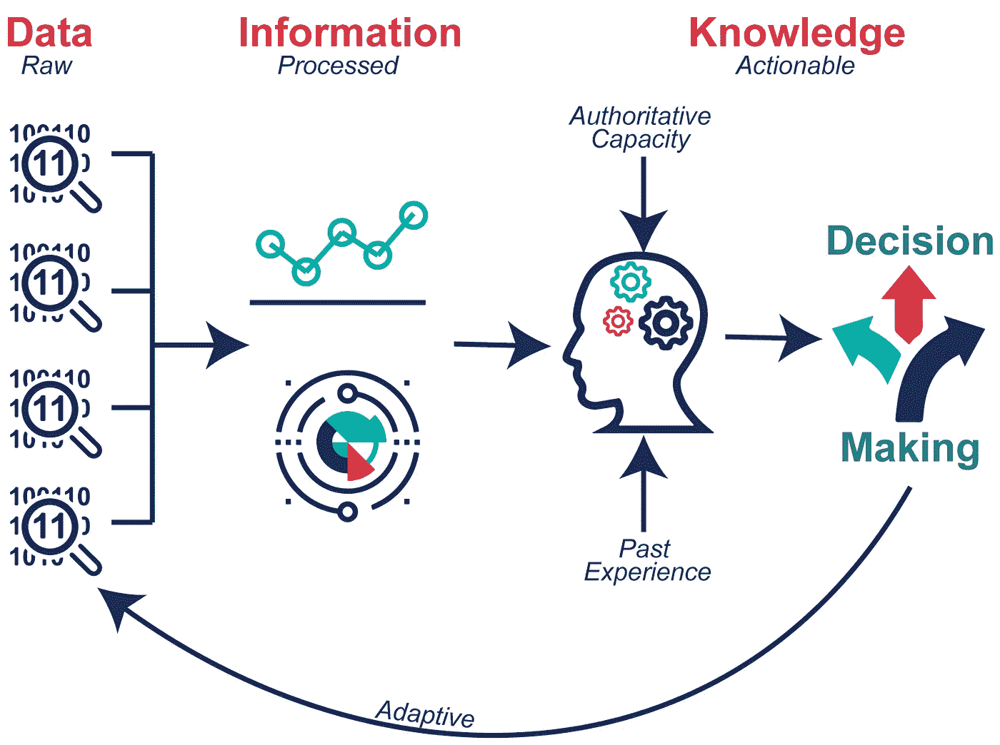

# “数据”是一个不好的词…所以让我们试试别的

> 原文：<https://medium.com/mlearning-ai/data-is-a-bad-word-so-lets-try-something-else-33c77e451c91?source=collection_archive---------8----------------------->

没错。“数据”是个不好的词。“分析”也是如此如果你想挑战自己，在你进一步阅读之前，试着写一个简洁的“数据”或“分析”的定义；你可能会觉得自己在试图触摸烟雾。

起初，我认为这篇文章应该作为“动词”的命题来写，即“数据”本来想问*各位*读者，“你们*数据*吗？”数据，数据，数据。我写道，“你每天说‘数据’这个词的次数相当于你尝试*数据的次数。”*

但是我已经变了。最近听了那么多“数据”的话，真想杀了它。这个词(出于战术目的)需要消失。今天我决定“分析”也是如此因此，让我们列出一个典型的问题清单，这可能会让我们对*为什么*我提议职业管理阶层应该取消这些术语有所了解:

1.  你真的和数据打交道吗？如果是的话，那么你所说的“处理数据”到底是什么意思呢
2.  你最近是否向客户或同事询问过他们的数据？如果是，那么你问的具体目的是什么？
3.  你最近是否告诉过与“数据”没有紧密联系的人数据*说了什么*？什么事？那么，在这种情况下:(1) *你指的是什么*数据，(2) *它是如何*收集的，(3) *它是一个有效的测量，(4) *用什么方法*来分析它，以及(5)你是否得出结论“数据”展示了任何一种有价值的故事？*

你明白我的意思吗？数据可以是任何东西。我在这一页上的话就是数据。呈现给你的代码是数据。进入你眼球的光子就是数据。你咖啡的味道就是数据。时钟告诉你数据。

为什么在这个世界上任何寻求实质性答案的人会使用一个如此荒谬含糊的词？为什么有自尊的专业人士会认为“数据”这个词足以描述一个可交付成果呢？

# 从数据怪才到管理者到利益相关者再到客户

就我个人而言，我认为成为数据科学领域专家的最糟糕和最好的地方是 T2、老何效应、T4 和 T5。二十年前，一个受欢迎的节目给每个美国人的印象是，法医团队有能力证明每一个可以通过英语概括的实质性主张的绝对准确性。如今，几乎每个商业领袖看着他们的数据分析师，就好像他们已经在他们的后口袋里有了数百万美元的 CSI Forensics lab。

在与管理层的每次会议中，很明显他们希望更加“数据驱动”这意味着他们需要某种度量，以便更好地为他们的决策提供信息。但是问题就在这里:*哪些*度量实际上适用于哪个决策？*什么样的分析*会产生决定性的行动信息？**如果**我们提供该信息， ***领导是否会因为该新信息而做出不同的决定*** ？

如果你的利益相关者不能识别会改变他们决策的信息，那么你的数据讨论就没有意义。如果你的客户没有感觉到他们*直观地*理解了你的分析的**结果**，他们将不会信任可交付成果…这意味着他们不会改变他们的决策…这意味着你只是做了一大堆工作却没有任何影响…这将意味着企业在浪费金钱。

# 尝试一个新词:信息学

在过去的一年里，我了解到医疗专业团体使用“信息学”这个词来描述他们的分析成果。他们领域的分析专家称自己为“信息专家”起初，我对这种语言有点怀疑。就像“科学”与政治科学或计算机科学等所有准非科学领域联系在一起一样，我开始怀疑人们是否开始在过于一般化的名词的性感但空洞的典故上添加“-ics”后缀。

但后来我开始思考被广泛接受的术语“分析学”，以及它有多可怕。想想吧。“分析”到底是什么意思？如果这意味着你懂数学，为什么我们不直接叫它“数学”如果这意味着你知道如何编程和做数学，那太好了！现在怎么办？你能为我做什么？“分析学”能为我做什么“数学”做不到的事？更重要的是，为什么数学家提供的数字对我有影响？

答案在这里:这是因为当你正确地向利益相关者 ***解释时，数学提供了新的或更好的 ***信息……****。****

嘣！现在你知道了…

数据不是目的。分析不是目的。数学不是目标。

目标是可以理解的、有用的信息。坦率地说，我猜想，如果它不可理解或不可用，它甚至不能被定义为“信息”……所以请原谅我的多余。

# 最后，关于“数据科学”或“分析”部门的建议

你是一个数学和编程呆子，正在解释在你的业务过程中获得的度量吗？如果是，没人关心你做了什么，怎么做的。他们关心你提供的新信息的价值。如果是可操作的，那就真的**是** *信息*。如果它不可操作，它也可能是扯淡。

你是想成为数据驱动的非数学利益相关者吗？如果是，那么你在寻找新的可信的信息，这比通常引导决策的本能和同伴压力更有用。所以你要依靠那个数据专家来提供对大量测量数据的信息性解读，这样你就可以更有策略地推进你的军队。

那么什么是信息学呢？这是从数据中提取信息的过程。

希望这个定义能告诉你为什么“数据”这个词不好。数据是混乱的一团，当它被收集时，相对来说是没有价值的。另一方面，信息是无价的。将数据转化为信息的人不应该被称为“分析师”或“数据科学家”，他们应该被称为“信息专家”在上下文中，当我们应用这个术语时，更容易理解涉众对这个角色的期望。

试一试…它可能会帮助数据极客更好地理解如何为您的业务提供更多价值。

 [## Mlearning.ai 提交建议

### 如何成为 Mlearning.ai 上的作家

medium.com](/mlearning-ai/mlearning-ai-submission-suggestions-b51e2b130bfb)